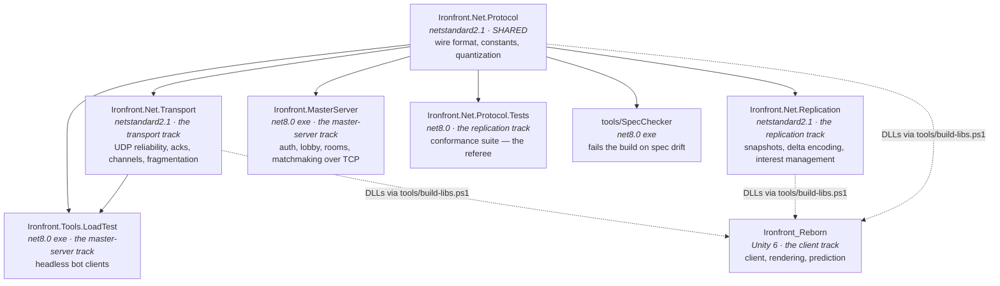

# Ironfront Reborn

[](https://github.com/Nghaiz/LTM/actions/workflows/ci.yml)

<!--
  No CodeQL badge on purpose: codeql.yml skips itself while this repository is private
  (code scanning there needs paid GitHub Advanced Security), so the badge would render as
  "no status" and read like something is broken. Add it back on the day the repository is
  made public and the job actually runs. See docs/branch-protection.md.
-->


A multiplayer FPS networking stack written from scratch on raw TCP and UDP sockets — no
Mirror, no Photon, no Netcode for GameObjects, no KCP, no gRPC. The netcode *is* the project;
using a framework would remove the thing being built.

One Unity 6 client, four .NET libraries, one wire protocol frozen in week 1 and enforced by a
build gate ever since.

---

## What is actually being built

| Layer | Written by hand here | The part the OS still does |
|---|---|---|
| Reliability, ordering, channels, fragmentation, congestion control | yes | — |
| Snapshot delta encoding, interest management, lag compensation | yes | — |
| Bit-level packing and quantization of the wire format | yes | — |
| Auth, lobby, room registry, matchmaking, chat framing over TCP | yes | — |
| TCP / UDP / IP / Ethernet | no | kernel, via `System.Net.Sockets` |

`System.Net.Sockets` is the operating system's front door to TCP and UDP; there is no way to
speak either protocol without it. BCL primitives (`Span<T>`, `ArrayPool<T>`,
`System.Threading.Channels`, `System.Security.Cryptography`) are data types, not frameworks,
and are allowed. The full policy, including the two things deliberately re-implemented so
they can be benchmarked against the standard library, is in
[`docs/code-conventions.md` § 3.4](docs/code-conventions.md).

---

## Repository layout



The three `netstandard2.1` libraries must **never** reference `UnityEngine`. They are built as
plain .NET assemblies and copied into `Ironfront_Reborn/Assets/Plugins` by
`tools/build-libs.ps1`, which is also what lets B, C and D work without ever opening the Unity
Editor.

---

## Quick start

Requires the **.NET 8 SDK** (`global.json` pins the feature band — a 9.x or 10.x SDK is
rejected on purpose) and **PowerShell 7+** for the scripts.

```bash
git clone git@github.com:Nghaiz/LTM.git
cd LTM

dotnet build Ironfront.sln -c Release
dotnet test  Ironfront.sln -c Release
```

### One-time: create your `.env`

Building and testing need nothing. **Running** the master server does: it refuses to start
without `IRONFRONT_SHARED_SECRET`, which signs the joinTickets the game server verifies.

```powershell
pwsh tools/new-env.ps1
```

That writes `.env` from the committed `.env.example` with a freshly generated key. `.env` is
gitignored and stays that way — a key in a git history is not a key — so **every clone does
this once**, and the file never travels with the repository.

The two processes must agree on the key, not the two people. Running your own master and game
server means any key will do; generate your own and send it nowhere. Only if you connect to a
master **somebody else** is running do you need theirs, and it goes out of band — a password
manager or a direct message, never a commit, a PR, an issue or a screenshot:

```powershell
pwsh tools/new-env.ps1 -Secret '<the key they sent you>'
```

Everything else in `.env.example` is already the default, so copying it changes no behaviour.
A blank value there is usually not a gap to fill — it means standalone, plaintext, disabled,
or inherited from the scene. The comment on each variable says which. The full list, with
what reads it, is generated from `Ironfront.Net.Configuration/EnvRegistry.cs`; see
[operations.md § 10](docs/operations.md).

Before every push, run the local mirror of CI — same four checks, under five minutes:

```powershell
pwsh tools/ci.ps1
```

| Command | What it does |
|---|---|
| `pwsh tools/new-env.ps1` | create the gitignored `.env` this checkout needs, with a fresh key |
| `pwsh tools/ci.ps1` | build + test + spec drift check + advisory format/commit-scope check |
| `pwsh tools/ci.ps1 -Integration` | the above, plus the 2-process integration test |
| `pwsh tools/build-libs.ps1` | build the libraries and copy the DLLs into `Assets/Plugins` for Unity |
| `pwsh tools/run-integration.ps1` | start the master server and a bot client, assert they talk |
| `pwsh tools/check-commit-scope.ps1` | check your commit subjects against the conventions |
| `dotnet run --project tools/SpecChecker` | check `ProtocolConstants.cs` against `protocol-spec.md` |

Unity: `UNITY_PATH` is set locally, so `tools/ci.ps1` step 4 runs a real batch-mode compile —
the only check that resolves types. `tools/UnitySyntaxCheck` parses but resolves nothing, so it
cannot catch a CS0246. Do not trust it alone before merging Unity-side code.

---

## The four subsystems

| Subsystem | Where | What it owns |
|---|---|---|
| Unity client | `Ironfront_Reborn/` | rendering, prediction, reconciliation, the shipping scene |
| Transport | `Ironfront.Net.Transport/` | UDP reliability, acks, channels, fragmentation |
| Replication | `Ironfront.Net.Replication/` | snapshots, delta encoding, interest, lag compensation |
| Master server | `Ironfront.MasterServer/` | auth, lobby, rooms, matchmaking over TCP |
| Wire protocol | `Ironfront.Net.Protocol/` | the one contract both sides must agree on |

The split is by subsystem, not by person — one owner, four codebases with different constraints.
The boundaries still matter because they are where the bugs live:

- **`Ironfront.Net.Replication/Serialization/` is transport's concern**, not replication's, even
  though it sits in replication's project. The bit-packing and the conformance suite that checks
  it are deliberately written against the spec rather than against each other — a test derived
  from the implementation only proves the code agrees with itself.
- **`Ironfront_Reborn/Assets/Scripts/Net/Shared/` is replication's**, not the client's, even
  though it sits inside the Unity project. `MovementSimulation.cs` in particular is the single source of truth for
  client-side prediction and server-side simulation; if the two ever diverge, every player
  rubber-bands.

The discipline that replaces the old per-person ownership table is
[`docs/code-conventions.md` § 7](docs/code-conventions.md): every changed line traces to the task
at hand, and adjacent cleanup goes in its own commit.

---

## The protocol is frozen

`plans/00-shared/protocol-spec.md` was frozen at the end of week 1. `tools/SpecChecker` runs in
CI on every push and fails the build if `ProtocolConstants.cs` drifts from the spec table, so
the two cannot silently disagree.

Changing the wire format after the freeze means: a
[protocol-change issue](.github/ISSUE_TEMPLATE/protocol-change.yml) → one PR carrying the spec
text, the constants, a conformance test and a `PROTOCOL_VERSION` bump together → rebuild the
vendored DLLs with `tools/build-libs.ps1`, because Unity reads those and not the source.

Changing a constant in your own code and telling people later is the single largest risk in
the project. It has an ID: R5.

---

## CI

| Workflow | Job | Blocking? | What it checks |
|---|---|---|---|
| `ci.yml` | `build-test` (ubuntu + windows) | **yes** | restore, build with warnings-as-errors, `dotnet test`, spec drift |
| `ci.yml` | `style` | no — advisory | `dotnet format`, commit-scope conventions, vulnerable NuGet packages |
| `ci.yml` | `unity-libs` | no | publishes the Unity plugin DLLs as a downloadable artifact |
| `codeql.yml` | `analyze` | **dormant** | Skips while the repository is private — code scanning there needs paid GitHub Advanced Security. Starts by itself if the repository is made public; see [`docs/branch-protection.md`](docs/branch-protection.md) |

The matrix is not decoration: this code indexes byte buffers, parses lengths taken off the
wire, and opens sockets. Path handling, line endings and dual-stack socket behaviour all
differ between Linux and Windows, and development happens on Windows while CI's default is
Linux. A single-OS pipeline would let half of those differences through.

Test results and coverage are uploaded as artifacts on every run, including failed ones —
click the run, scroll to **Artifacts**, download `test-results-<os>`.

Branch protection is a repository setting and cannot live in a file. What to switch on is
written down in [`docs/branch-protection.md`](docs/branch-protection.md).

---

## Documentation

| Document | What is in it |
|---|---|
| [`plans/plan.md`](plans/plan.md) | The one plan: where the project is, the M0–M4 criteria, the nine phases |
| [`plans/debt-ledger.md`](plans/debt-ledger.md) | Every row still open, parked or decided. The source of truth for what is owed |
| [`plans/phases/`](plans/phases/) | One file per phase, self-contained |
| [`plans/00-shared/protocol-spec.md`](plans/00-shared/protocol-spec.md) | The frozen wire format, byte by byte. Read at build time by `tools/SpecChecker` |
| [`docs/code-conventions.md`](docs/code-conventions.md) | Commit scopes, C# conventions, library policy, Definition of Done. **Read before your first commit.** |
| [`docs/architecture.md`](docs/architecture.md) | How the projects fit together, and why the shared library must not touch `UnityEngine` |
| [`docs/codebase-map.md`](docs/codebase-map.md) | What is where in the Unity project |
| [`docs/operations.md`](docs/operations.md) | How to run and deploy the system |

**The nine per-track plan directories were deleted on 2026-08-29** — 228 files down to 12. They
were executed; git keeps them (`git show 68acdd9:plans/…`), and a directory of finished
instructions reads to the next person as work outstanding.

---

## Definition of Done

A phase is done when all five hold — not four:

1. The code has been run and the output inspected
2. That area's tests are green, and the result was actually read
3. The full suite is green — nothing else broke
4. Unity compiles clean, and the log was read rather than the exit code trusted
5. It is merged into `develop`, and `develop` is still green

---

## License

[MIT](LICENSE).
