# Achievements

Eighty achievements worth 6,980 points, earned online and in practice. Open them from
**ACHIEVEMENTS** on the main menu or the Esc menu in a match; compare yours with any player
from **GLOBAL RANKING**.

## How they work

- **Online achievements are judged by the master server** from what the game server saw in
  each round. Unlocks arrive within seconds, as a banner at the top of the screen; only you see
  yours.
- **A round counts** for "finish" and "win" when you are in it at its end and played at least
  5 minutes of it. Achievements that ask for longer say how long.
- **Practice achievements are judged by your own game** in offline matches, kept on your
  computer and claimed for your account the next time you sign in.
- **Hidden achievements** show their name, a black silhouette and a hint. The rule appears
  once you earn it; this page shows the hint only.
- **Points**: Bronze 10, Silver 25, Gold 50, Platinum 100, Mythic 250.
- Badges come from `tools/ui/badges.py` (rendered by `tools/ui/make_icons.py`); this page is
  generated from the catalogue by `tools/ui/write_achievements_doc.py`. Do not edit it by hand.

| Metal | Achievements | Points each |
|---|---|---|
| Bronze | 13 | 10 |
| Silver | 16 | 25 |
| Gold | 21 | 50 |
| Platinum | 14 | 100 |
| Mythic | 16 | 250 |
| **All** | **80** | **6,980 in all** |

## Bronze

A few hours of play, and the funny disasters.

| # | Badge | Achievement | How to earn it | Kind |
|---|---|---|---|---|
| 1 |  | **ROLL CALL** `roll_call` | Finish an online round. You must play at least 5 minutes of it. | Online |
| 2 |  | **LIGHTS OUT** `lights_out` | Finish an online round in Night Mode. You must play at least 5 minutes of it. | Online, Night Mode |
| 3 | 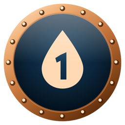 | **BAPTISM OF FIRE** `baptism_of_fire` | Get 100 kills in online rounds. | Online |
| 4 | 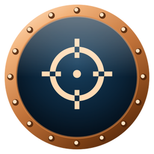 | **STEADY HAND** `steady_hand` | Get 50 headshot kills. | Online |
| 5 | 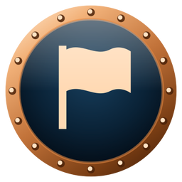 | **FLAG RUNNER** `flag_runner` | Capture 10 flags: stand in a flag's zone when it turns to your side. | Online |
| 6 |  | **TASTE OF VICTORY** `taste_of_victory` | Win 10 online rounds. Each must have at least 5 minutes of your play. | Online |
| 7 | 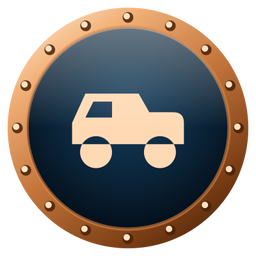 | **SPEED BUMP** `speed_bump` | Run over 10 enemies with a vehicle. | Online |
| 8 |  | **BY THE BOOK** `by_the_book` | Open every page of the How to play guide. | Practice |
| 9 |  | **CADET** `cadet` | Finish a practice round on each map: Dustbowl, Island and Forest Lake. Each must have at least 5 minutes of your play. | Practice |
| 10 |  | **TURNCOAT** `turncoat` | Win a practice round on the blue side and another on the red side. Each must have at least 5 minutes of your play. | Practice |
| 11 | 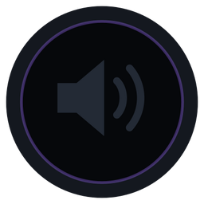 | **VICTORY LAP** `victory_lap` | *Some victories deserve a little noise.* | Online, Hidden |
| 12 | 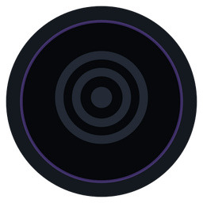 | **BULLET SPONGE** `bullet_sponge` | *Somebody has to soak up the bullets.* | Online, Hidden |
| 13 | 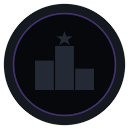 | **PARTICIPATION TROPHY** `participation_trophy` | *Everyone gets a medal. Yes, even you.* | Online, Hidden |

## Silver

Regular play with some skill behind it.

| # | Badge | Achievement | How to earn it | Kind |
|---|---|---|---|---|
| 14 | 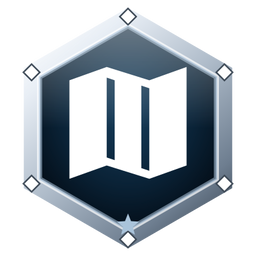 | **THREE FRONTS** `three_fronts` | Finish an online round on each map: Dustbowl, Island and Forest Lake. Each must have at least 5 minutes of your play. | Online |
| 15 | 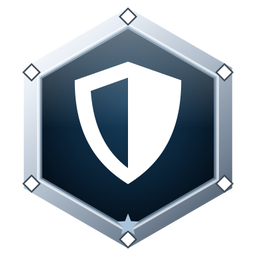 | **UNBROKEN** `unbroken` | Get 15 kills without dying. | Online |
| 16 |  | **PREDATOR** `predator` | Kill 100 human players. | Online |
| 17 | 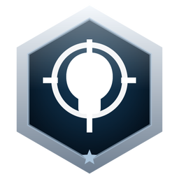 | **DEAD CENTRE** `dead_centre` | Get 500 headshot kills. | Online |
| 18 | 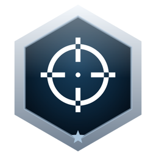 | **OVERWATCH** `overwatch` | Kill an enemy from 300 m or more. | Online |
| 19 | 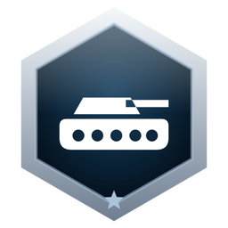 | **STEEL RAIN** `steel_rain` | Get 100 kills from a tank. | Online |
| 20 | 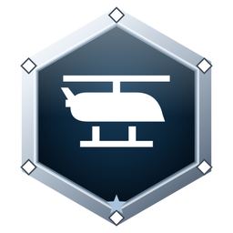 | **ROTORHEAD** `rotorhead` | Get 50 kills from a helicopter. | Online |
| 21 | 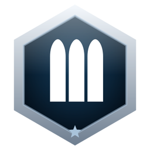 | **FORWARD SUPPLY** `forward_supply` | Refill or heal teammates 200 times with your AMMO BAG or MEDIPACK. | Online |
| 22 | 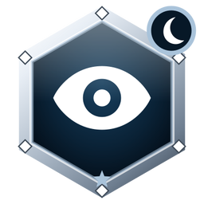 | **NIGHT SHIFT** `night_shift` | Get 250 kills in Night Mode. | Online, Night Mode |
| 23 | 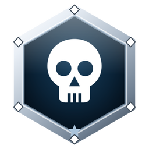 | **CANNON FODDER** `cannon_fodder` | Die 1,000 times in online rounds. | Online |
| 24 | 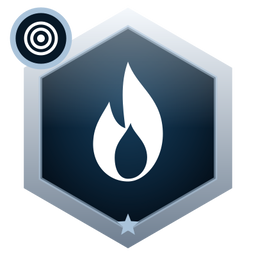 | **DUST DEVIL** `dust_devil` | Get 40 kills in one practice round on Dustbowl with at least 50 bots. | Practice |
| 25 | 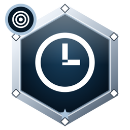 | **FIRST PAST THE POST** `first_past_the_post` | Win a practice round that uses the FIRST TO win rule, with at least 30 kills of your own and at least 5 minutes of your play. | Practice |
| 26 | 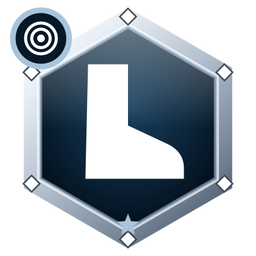 | **BOOTS ONLY** `boots_only` | Win a practice round with vehicles turned off and at least 50 bots, with the most kills of anyone in it, after at least 5 minutes of your play. | Practice |
| 27 | 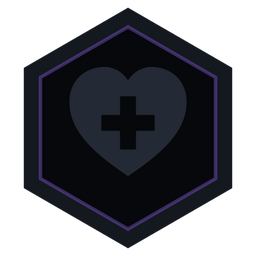 | **NINE LIVES** `nine_lives` | *Gravity tried. Gravity failed.* | Online, Hidden |
| 28 | 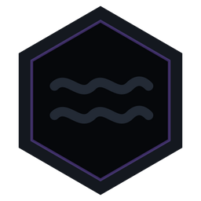 | **MAN OVERBOARD** `man_overboard` | *Not every road is made of dirt.* | Online, Hidden |
| 29 | 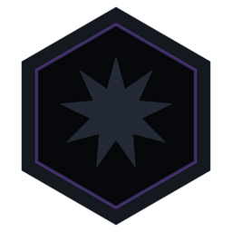 | **MUTUAL DESTRUCTION** `mutual_destruction` | *If you are going down, take company.* | Online, Hidden |

## Gold

Real skill, or real persistence.

| # | Badge | Achievement | How to earn it | Kind |
|---|---|---|---|---|
| 30 | 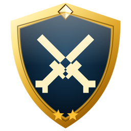 | **GRIM ARITHMETIC** `grim_arithmetic` | Get 10,000 kills in online rounds. | Online |
| 31 | 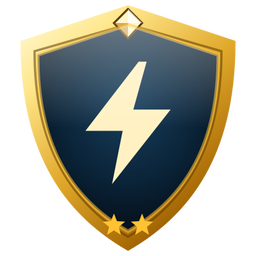 | **JUGGERNAUT** `juggernaut` | Get 30 kills without dying. | Online |
| 32 | 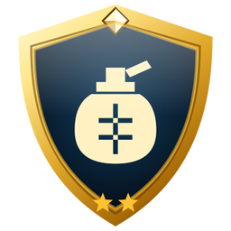 | **CROWD CONTROL** `crowd_control` | Kill 3 enemies with a single grenade. | Online |
| 33 | 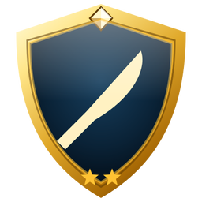 | **COLD STEEL** `cold_steel` | Get 25 melee kills. | Online |
| 34 | 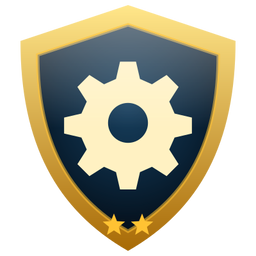 | **ARMOURER** `armourer` | Get a kill with each of the 12 weapons: RK-44, S-IND7, S-IND7 [SUP], 76 EAGLE, SL-DEFENDER, SIGNAL DMR, RECON LRR, FRAG, SPEARHEAD, BEU AW1, BIL SCALPEL and WRENCH. | Online |
| 35 | 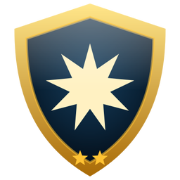 | **CAN OPENER** `can_opener` | Destroy 50 enemy vehicles. | Online |
| 36 | 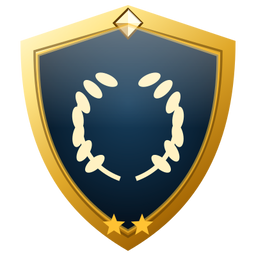 | **LONG CAMPAIGN** `long_campaign` | Win 100 online rounds. Each must have at least 5 minutes of your play. | Online |
| 37 | 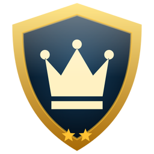 | **TOP BRASS** `top_brass` | Be the MVP of 10 rounds: win with the most points of anyone in the round, bots included, after at least 5 minutes of your play. | Online |
| 38 | 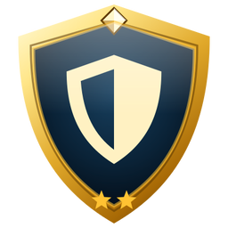 | **CLEAN SHEET** `clean_sheet` | Win an online round without dying once. You must play at least 15 minutes and get at least 10 kills. | Online |
| 39 | 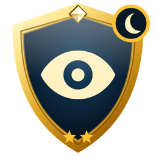 | **NAKED EYE** `naked_eye` | Win a Night Mode round without turning on night vision. You must play at least 15 minutes and get at least 10 kills. | Online, Night Mode |
| 40 | 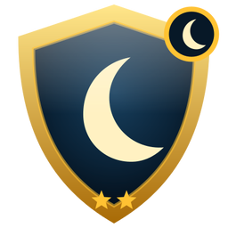 | **NIGHT TERROR** `night_terror` | Get 10 melee kills in one Night Mode round. | Online, Night Mode |
| 41 | 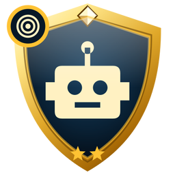 | **HELL WEEK** `hell_week` | Get 75 kills in one practice round with 100 bots. | Practice |
| 42 | 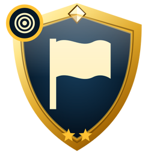 | **ISLAND HOPPER** `island_hopper` | In one practice round on Island, help capture every flag on the map: be in its zone when it turns to your side. | Practice |
| 43 | 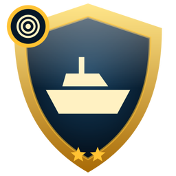 | **LAKE MONSTER** `lake_monster` | Get 10 kills from a boat in one practice round on Forest Lake. | Practice |
| 44 | 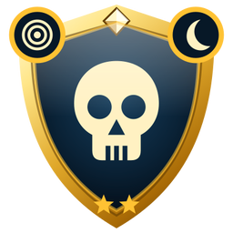 | **GRAVEYARD SHIFT** `graveyard_shift` | Win a Night Mode practice round with at least 50 bots without turning on night vision, after at least 5 minutes of your play. | Practice, Night Mode |
| 45 | 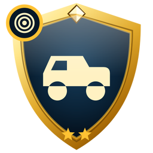 | **MOTOR POOL** `motor_pool` | In one practice round, get a kill from a jeep or quad bike, a tank, a helicopter and a boat. | Practice |
| 46 | 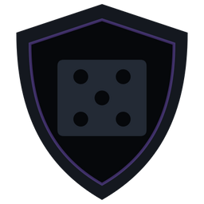 | **JACK OF ALL TRADES** `jack_of_all_trades` | *Why pick one tool when you carry four?* | Online, Hidden |
| 47 | 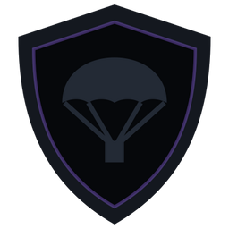 | **TOUCHDOWN** `touchdown` | *Not every landing happens on a pad.* | Online, Hidden |
| 48 | 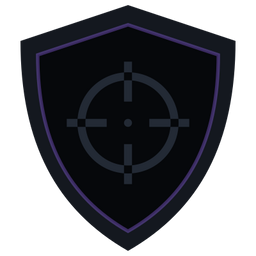 | **BUCKSHOT SNIPER** `buckshot_sniper` | *Nobody told the pellets about range.* | Online, Hidden |
| 49 | 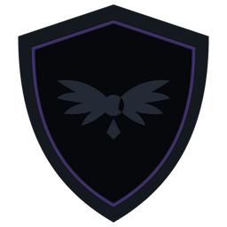 | **DOGFIGHT** `dogfight` | *The sky is not big enough for two.* | Online, Hidden |
| 50 | 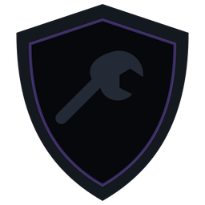 | **GOLD STANDARD** `gold_standard` | *Old soldiers still whisper about a wrench made of gold.* | Practice, Hidden |

## Platinum

The top of a skill, a role, or a rare situation.

| # | Badge | Achievement | How to earn it | Kind |
|---|---|---|---|---|
| 51 | 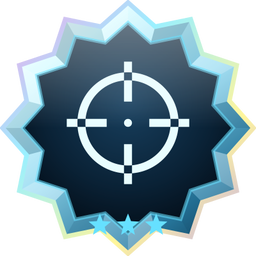 | **WINDREADER** `windreader` | Kill an enemy with a headshot from 500 m or more. | Online |
| 52 | 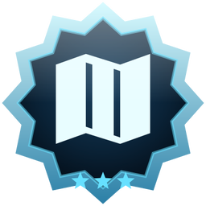 | **ALL FRONTS MASTERED** `all_fronts_mastered` | Win 50 online rounds on each of the 3 maps. Each must have at least 5 minutes of your play. | Online |
| 53 | 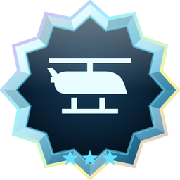 | **AIR DEFENSE** `air_defense` | On foot, shoot down 25 enemy helicopters: destroy them with their pilot aboard while they are 5 m or more above the ground. | Online |
| 54 | 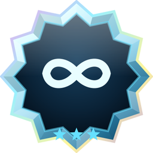 | **UNDEFEATED** `undefeated` | Win 10 online rounds in a row. Any round you play for 5 minutes or more and do not win resets the count. | Online |
| 55 | 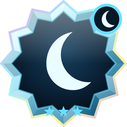 | **MOONLIGHT MARKSMAN** `moonlight_marksman` | Kill an enemy with a headshot from 150 m or more in Night Mode. | Online, Night Mode |
| 56 |  | **OUTNUMBERED** `outnumbered` | Win an online round as the only human player on your side against at least 3 human players. You must play at least 10 minutes. | Online |
| 57 | 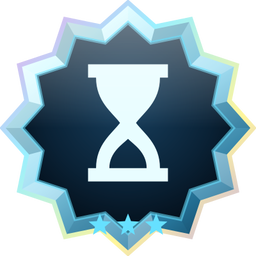 | **ON BORROWED TIME** `on_borrowed_time` | After an enemy brings you down to 5 health or less, get 10 more kills without healing and without dying. | Online |
| 58 |  | **PACIFIST** `pacifist` | Win an online round with 0 kills and 0 deaths while capturing more flags than anyone else in it, bots included. You must play at least 15 minutes. | Online |
| 59 | 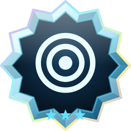 | **NEMESIS** `nemesis` | Kill the same human player 7 times in one round without them killing you once. | Online |
| 60 |  | **ABSOLUTE DOMINANCE** `absolute_dominance` | Finish an online round first of everyone in it, bots included, in kills, in flag captures and in accuracy (at least 50 shots), with nobody dying fewer times than you. You must play at least 5 minutes. | Online |
| 61 |  | **DRILL SERGEANT** `drill_sergeant` | Win a practice round alone, with no allied bots, against 20 or more enemy bots, after at least 5 minutes of your play. | Practice |
| 62 |  | **GRAND TOUR** `grand_tour` | Win practice rounds on all 3 maps under both win rules (LEAD BY 200 or more, FIRST TO 500 or more), and win a Night Mode practice round. | Practice |
| 63 |  | **IMPOSSIBLE ANGLE** `impossible_angle` | *Tanks were never meant to look up.* | Online, Hidden |
| 64 |  | **FROM THE GRAVE** `from_the_grave` | *Dying is only half of the plan.* | Online, Hidden |

## Mythic

The moments players talk about for years.

| # | Badge | Achievement | How to earn it | Kind |
|---|---|---|---|---|
| 65 |  | **CENTURION** `centurion` | Get 100 kills without dying. | Online |
| 66 |  | **RAMPAGE** `rampage` | Get 10 kills in a row, each one within 3 seconds of the last. | Online |
| 67 |  | **CURVATURE** `curvature` | Kill an enemy with a headshot from 900 m or more. | Online |
| 68 |  | **PERFECT TEN** `perfect_ten` | Get 10 headshot kills in a row without dying. A kill that is not a headshot resets the count. | Online |
| 69 |  | **DEAD EYE** `dead_eye` | Win an online round with at least 15 kills and 100% accuracy: fire at least 15 bullets, and every one hits an enemy. | Online |
| 70 |  | **UNTOUCHABLE** `untouchable` | Win an online round without taking any damage. You must play at least 15 minutes and get at least 15 kills. | Online |
| 71 |  | **BLADE ONLY** `blade_only` | Finish an online round with at least 25 kills, every one of them a melee kill. You must play at least 5 minutes. | Online |
| 72 |  | **TANK ACE** `tank_ace` | Get 50 kills in one tank without leaving it or it being destroyed. | Online |
| 73 |  | **SKY KING** `sky_king` | Get 30 kills in one helicopter flight without leaving your seat or the helicopter being destroyed. | Online |
| 74 |  | **MAP PAINTER** `map_painter` | In one round, help capture every flag on the map, never die, and win. You must play at least 5 minutes. | Online |
| 75 |  | **HAIL MARY** `hail_mary` | Win a round after the enemy came within 10 points of winning it. You must play at least 5 minutes. | Online |
| 76 |  | **CREATURE OF THE NIGHT** `creature_of_the_night` | Win a Night Mode round with at least 30 kills and 0 deaths, without turning on night vision. You must play at least 5 minutes. | Online, Night Mode |
| 77 |  | **IMMACULATE** `immaculate` | Get 100 kills without dying in a practice round with 100 bots. | Practice |
| 78 |  | **IRONCLAD** `ironclad` | Unlock all 79 other achievements. | Online |
| 79 |  | **MID-AIR** `mid_air` | *Pilots think they are safe up there.* | Online, Hidden |
| 80 |  | **COUNTER-SNIPER** `counter_sniper` | *Bring a pistol to a sniper fight.* | Online, Hidden |
