# Achievements

Fifty achievements, earned online and in practice (owner's list of 2026-10-09, item 4).
Open them from **ACHIEVEMENTS** on the main menu or in the Esc menu during a match;
the **GLOBAL RANKING** sits beside them.

## How they work

- **Online achievements are judged by the master server.** At the end of every online round
  the game server reports each player's numbers (kills, flags, the longest shot, the best
  multi-kill...) and the master adds them to the account's career. An achievement unlocks the
  moment its career number reaches the target, and a banner drops in at the top of the screen.
- **Practice achievements are seen by your own game.** No server watches an offline match, so
  the game records them on this computer, shows the banner at once, and claims them for your
  account the next time you sign in to multiplayer.
- **The list is sorted by how many players hold each one**, commonest first, like a store's
  global achievement list. The share is out of every player with a career; the rarer ones are
  marked RARE and ULTRA RARE.
- **Hidden achievements** show a sealed badge and "???" until earned. Their descriptions are
  below, folded away: open the Secret section only if you want the spoilers.
- **Badges** are generated from `tools/ui/badges.py` by `tools/ui/make_icons.py`; this page is
  generated from the catalogue by `tools/ui/write_achievements_doc.py`. Do not edit it by hand.

Metals, easiest to hardest: Bronze, Silver, Gold, Platinum.

| Family | Achievements |
|---|---|
| Multiplayer | 10 |
| Combat | 15 |
| Vehicles | 5 |
| Honor | 5 |
| Hard | 5 |
| Secret | 6 |
| Practice | 4 |
| **All** | **50** |

## Multiplayer

Playing online: matches, rounds won, time served, every map.

| Badge | Achievement | How to earn it | Metal | Tracked by |
|---|---|---|---|---|
| 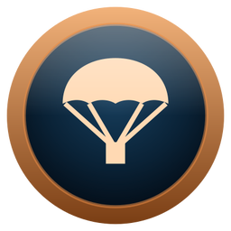 | **BOOTS ON THE GROUND** `boots_on_the_ground` | Play your first online match. | Bronze | matches, 1 |
| 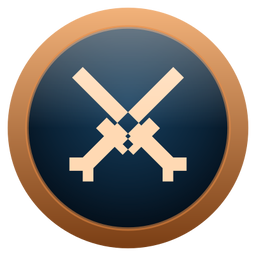 | **TOUR OF DUTY** `tour_of_duty` | Play 10 online matches. | Bronze | matches, 10 |
| 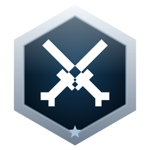 | **CAREER SOLDIER** `career_soldier` | Play 100 online matches. | Silver | matches, 100 |
| 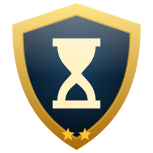 | **FOREVER WAR** `forever_war` | Spend 24 hours in online battles. | Gold | time played, 24 h |
| 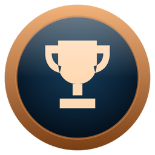 | **VICTORY** `victory` | Win an online round. | Bronze | wins, 1 |
| 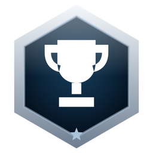 | **CHAMPION** `champion` | Win 25 online rounds. | Silver | wins, 25 |
| 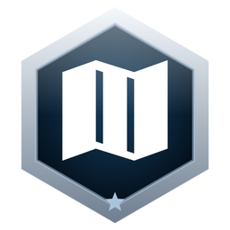 | **WORLD TRAVELER** `world_traveler` | Play an online match on every map. | Silver | maps played, 3 |
|  | **NIGHT OWL** `night_owl` | Play a Night Mode match. | Bronze | night matches, 1 |
| 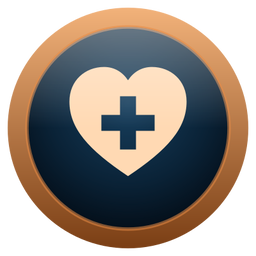 | **PATCHED UP** `patched_up` | Fall 100 times and keep coming back. | Bronze | deaths, 100 |
| 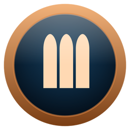 | **QUARTERMASTER** `quartermaster` | Score 1,000 points for your side. | Bronze | score, 1,000 |

## Combat

Kills and how they were made: multi-kills, streaks, headshots, long shots, blades and grenades.

| Badge | Achievement | How to earn it | Metal | Tracked by |
|---|---|---|---|---|
| 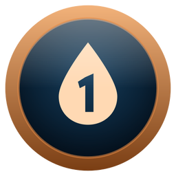 | **FIRST BLOOD** `first_blood` | Get your first kill online. | Bronze | kills, 1 |
| 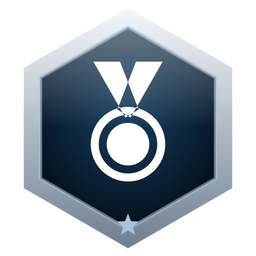 | **DECORATED** `decorated` | Get 100 kills online. | Silver | kills, 100 |
| 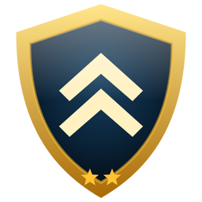 | **VETERAN** `veteran` | Get 1,000 kills online. | Gold | kills, 1,000 |
| 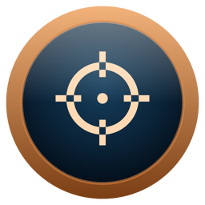 | **TWO FOR ONE** `two_for_one` | Kill two enemies within three seconds. | Bronze | best multi kill, 2 |
| 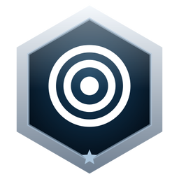 | **TRIPLE THREAT** `triple_threat` | Three kills, each within three seconds of the last. | Silver | best multi kill, 3 |
| 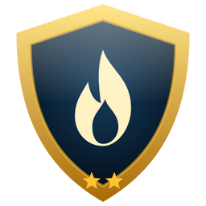 | **UNSTOPPABLE** `unstoppable` | Kill 10 enemies without dying. | Gold | best streak, 10 |
| 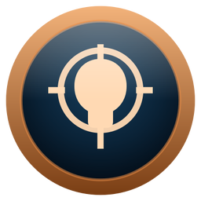 | **SHARPSHOOTER** `sharpshooter` | Land 50 headshot kills. | Bronze | headshots, 50 |
| 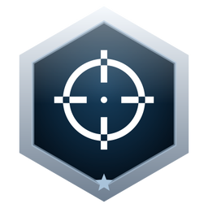 | **LONG SHOT** `long_shot` | Kill an enemy 150 metres away or more. | Silver | longest kill, 150 m |
| 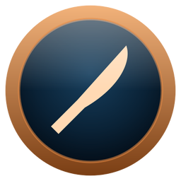 | **UP CLOSE** `up_close` | Kill an enemy with a blade or a wrench. | Bronze | melee kills, 1 |
| 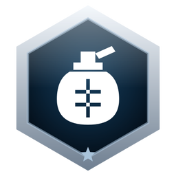 | **FRAG OUT** `frag_out` | Kill two enemies with a single grenade. | Silver | grenade double kills, 1 |
| 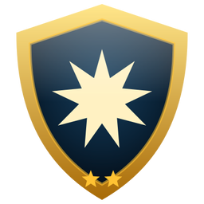 | **DEMOLITION EXPERT** `demolition_expert` | Get 100 kills with explosives. | Gold | explosive kills, 100 |
| 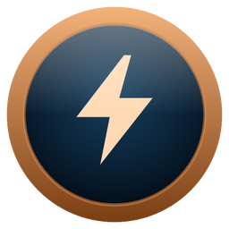 | **PAYBACK** `payback` | Kill the soldier who last killed you. | Bronze | revenge kills, 1 |
| 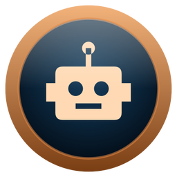 | **MAN VS MACHINE** `man_vs_machine` | Kill 100 bots online. | Bronze | bot kills, 100 |
|  | **PLAYER HUNTER** `player_hunter` | Kill 50 human players. | Silver | player kills, 50 |
| 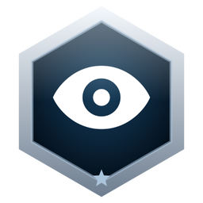 | **NIGHT STALKER** `night_stalker` | Get 100 kills in Night Mode. | Silver | night kills, 100 |

## Vehicles

Fighting from the jeeps, tanks, helicopters and boats, and against them.

| Badge | Achievement | How to earn it | Metal | Tracked by |
|---|---|---|---|---|
| 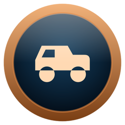 | **ROAD RAGE** `road_rage` | Run an enemy over. | Bronze | roadkills, 1 |
| 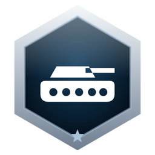 | **TANK BUSTER** `tank_buster` | Destroy an enemy tank with its crew inside. | Silver | tanks destroyed, 1 |
| 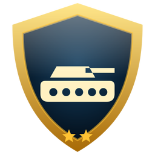 | **ARMORED FIST** `armored_fist` | Get 50 kills from a tank. | Gold | tank kills, 50 |
| 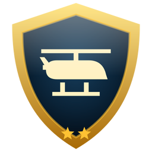 | **AIR SUPERIORITY** `air_superiority` | Get 25 kills from a helicopter. | Gold | helicopter kills, 25 |
| 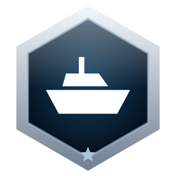 | **ANCHORS AWEIGH** `anchors_aweigh` | Get 10 kills from a boat. | Silver | boat kills, 10 |

## Honor

Playing for the side: flags taken, rounds carried, comebacks.

| Badge | Achievement | How to earn it | Metal | Tracked by |
|---|---|---|---|---|
| 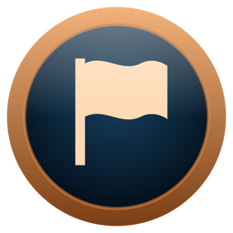 | **FLAG BEARER** `flag_bearer` | Help capture a flag. | Bronze | flags captured, 1 |
| 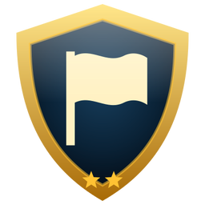 | **BLITZKRIEG** `blitzkrieg` | Help capture 50 flags. | Gold | flags captured, 50 |
| 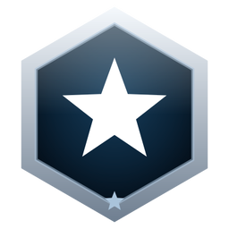 | **MOST VALUABLE** `mvp` | Win a round with the most points of anyone in it. | Silver | mvp rounds, 1 |
| 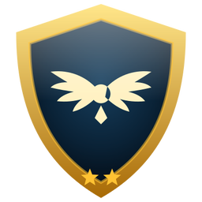 | **AGAINST ALL ODDS** `against_all_odds` | Win a round after your side trailed by 100 points. | Gold | comeback wins, 1 |
| 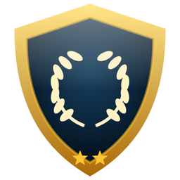 | **CONQUEROR** `conqueror` | Win 100 online rounds. | Gold | wins, 100 |

## Hard

The long grind and the rare feat. Most players never see these.

| Badge | Achievement | How to earn it | Metal | Tracked by |
|---|---|---|---|---|
| 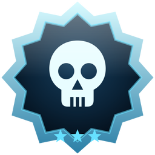 | **WAR MACHINE** `war_machine` | Get 10,000 kills online. | Platinum | kills, 10,000 |
| 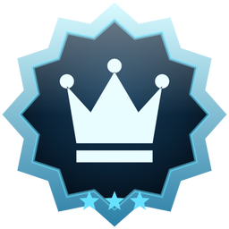 | **LEGENDS NEVER DIE** `legend_never_dies` | Kill 25 enemies without dying. | Platinum | best streak, 25 |
| 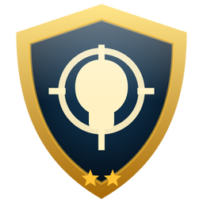 | **HEAD HUNTER** `head_hunter` | Land 500 headshot kills. | Gold | headshots, 500 |
| 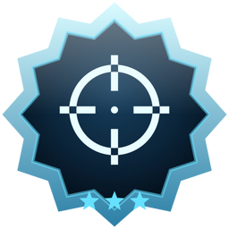 | **EAGLE EYE** `eagle_eye` | Kill an enemy with a headshot from 300 metres. | Platinum | longest headshot, 300 m |
| 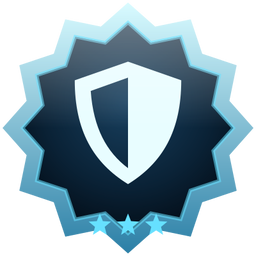 | **FLAWLESS** `flawless` | Finish a round with 15 kills and no deaths. | Platinum | flawless rounds, 1 |

## Secret

Hidden in the game until earned: the page shows a sealed badge and "???".

Spoilers: the hidden achievements

| Badge | Achievement | How to earn it | Metal | Tracked by |
|---|---|---|---|---|
| 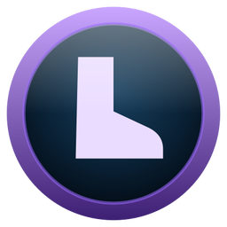 | **GRAVITY WINS** `gravity_wins` | Die from a fall. | Bronze | fall deaths, 1 |
| 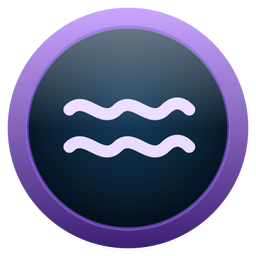 | **SLEEPING WITH THE FISHES** `sleeping_with_the_fishes` | Drown. | Bronze | drown deaths, 1 |
| 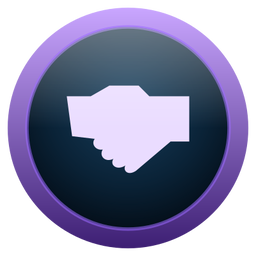 | **FRIENDLY FIRE** `friendly_fire` | Kill a teammate. It happens. | Bronze | team kills, 1 |
| 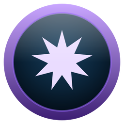 | **OWN GOAL** `own_goal` | Blow yourself up. | Bronze | own explosive deaths, 1 |
| 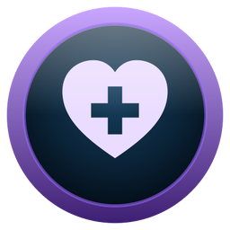 | **NOT TODAY** `not_today` | Get a kill within three seconds of deploying. | Silver | quick kills, 1 |
| 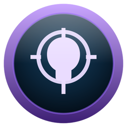 | **HAT TRICK** `hat_trick` | Three kills in a row, every one a headshot. | Gold | headshot run, 3 |

## Practice

Earned offline, against bots, and on the How to play guide. Claimed for your account the next time you sign in.

| Badge | Achievement | How to earn it | Metal | Tracked by |
|---|---|---|---|---|
| 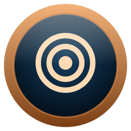 | **BASIC TRAINING** `basic_training` | Finish a practice match. | Bronze | Seen by your game |
| 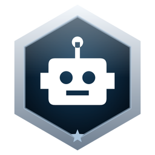 | **BOT BUSTER** `bot_buster` | Get 25 kills in one practice match. | Silver | Seen by your game |
| 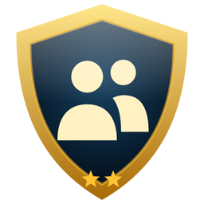 | **ONE-MAN ARMY** `one_man_army` | Win a practice match with 100 bots. | Gold | Seen by your game |
| 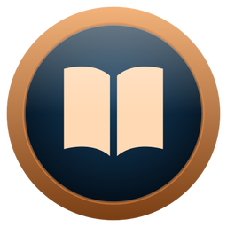 | **STUDENT OF WAR** `student_of_war` | Read every tab of How to play. | Bronze | Seen by your game |

## The hidden badge

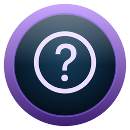 What every secret
achievement shows until it is earned.
