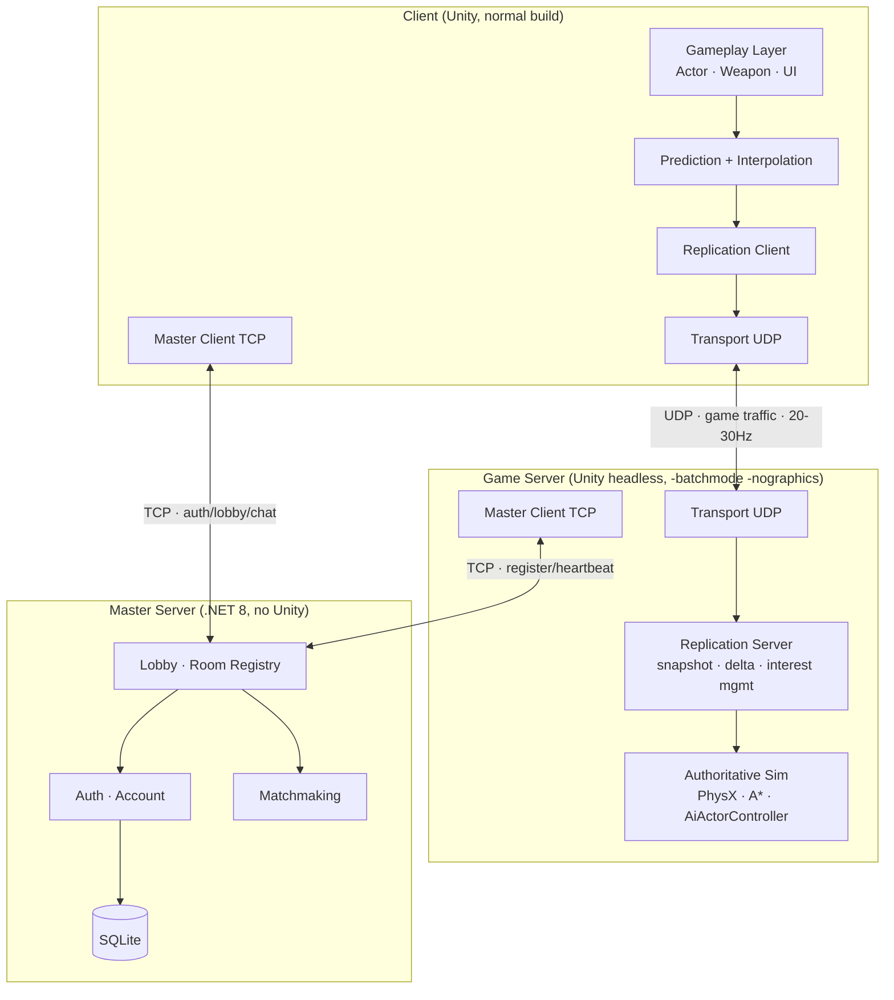
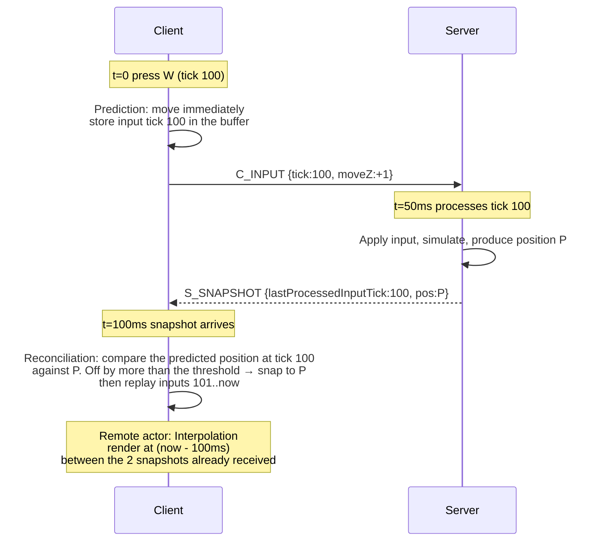
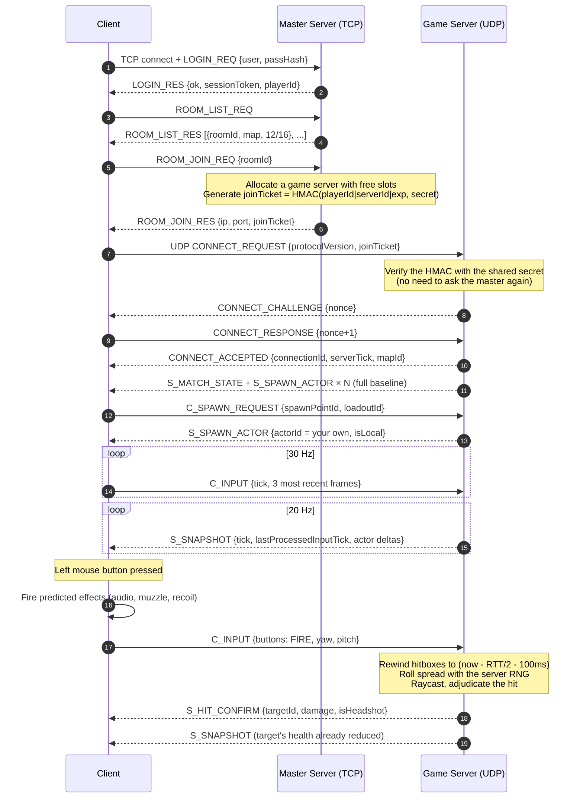

# System architecture — Ironfront Reborn

This document describes the target architecture. Byte-level details live in
[protocol-spec.md](../plans/00-shared/protocol-spec.md).

---

## 1. Overall diagram



---

## 2. Splitting responsibilities between TCP and UDP

This is the central architectural decision for a Network Programming course, and we must be able to
articulate it clearly at the defense.

| | TCP (Master Server) | UDP (Game Server) |
|---|---|---|
| **Used for** | Login, room list, create/join room, matchmaking, lobby chat, server heartbeat | All in-match traffic: input, snapshots, gameplay events |
| **Why** | Non-real-time data, packet loss unacceptable, irregular sizes, low frequency. TCP gives reliability + ordering for free | Real-time, high and steady frequency. Stale data is **worthless** — retransmitting a 200 ms-old snapshot is worse than dropping it |
| **Problem if swapped** | UDP for the lobby = reimplementing reliability that TCP already does well | **TCP head-of-line blocking**: one lost packet stalls every packet behind it until the retransmit lands → cascading stutter. Nagle + delayed ACK add another 40–200 ms |
| **Frequency** | A few packets per minute | 20–60 packets/second/direction |
| **Framing** | 4-byte length prefix | Natural datagrams, custom 16-byte header |

**No WebSocket**, as required: WebSocket runs over TCP and therefore inherits head-of-line blocking
in full, plus framing overhead and an HTTP handshake. It exists to punch through browser
firewalls/proxies — a constraint a desktop game client doesn't have.

---

## 3. Authority model

**Strictly server-authoritative.** The client decides nothing that affects gameplay.

| Concern | Who decides | What the client may do |
|---|---|---|
| Character position | Server | Predict, then reconcile |
| Hits / damage | Server | Show predicted effects, wait for `S_HIT_CONFIRM` |
| Health, death, respawn | Server | Display only |
| Bullet spread, recoil | Server | Show local recoil for feel; no effect on the real bullet |
| AI bots | Server | Interpolate only |
| Point capture, score | Server | Display only |
| Entering/exiting vehicle seats | Server | Send a request |
| Camera, UI, audio, corpse ragdolls | Client | Full control, never synced |

### 3.1. The three classic netcode techniques in use



1. **Client-side prediction** — the local player moves the instant a key is pressed, without
   waiting for the server.
2. **Server reconciliation** — when a snapshot arrives, the client compares its predicted position
   at that tick against the server's. If the gap exceeds the threshold, it corrects and replays
   every unacknowledged input.
3. **Entity interpolation** — remote actors are rendered 100 ms behind the latest snapshot,
   interpolating between the two snapshots already in hand. Trades 100 ms of display latency for
   smooth motion.
4. **Lag compensation** — the server "rewinds" hitboxes to the moment the client actually saw when
   it processes a shot. See [protocol-spec.md § 7](../plans/00-shared/protocol-spec.md#7-lag-compensation).

---

## 4. Timing loop

| Parameter | Value | Notes |
|---|---|---|
| Server sim tick | **30 Hz** (33.33 ms) | `Time.fixedDeltaTime = 1/30` on headless |
| Snapshot rate | **20 Hz** (50 ms) | Sent every 1.5 ticks |
| Client input send rate | **30 Hz** | Each packet carries the 3 most recent frames (redundancy against loss) |
| Client render | Uncapped | 60–144 fps |
| Interpolation buffer | **100 ms** | = 2 snapshot intervals, survives one consecutive lost packet |
| Lag compensation window | **200 ms** max | Anti-abuse: fake high ping to shoot into the past |
| Hitbox history | **1 second** (30 ticks) | Ring buffer on the server |
| Keep-alive | 1 packet/second when idle | |
| Disconnect timeout | 10 seconds with nothing received | |

**Why 30 Hz and not 60 Hz:** 48 actors with A* + AI + physics at 60 Hz would blow the CPU budget
(risk R6). 30 Hz is standard for many commercial FPS titles and is good enough once prediction is
in place.

---

## 5. Directory and assembly architecture

```
Ironfront_Reborn/                       ← Unity project (owned by A)
├── Assets/
│   ├── Scripts/Assembly-CSharp/        ← original gameplay (owned by A)
│   │   ├── Actor.cs, Weapon.cs, ...
│   │   └── Pathfinding/                ← A* — nobody touches this
│   └── Scripts/Net/                    ← net code inside Unity
│       ├── Client/                     ← owned by A
│       │   ├── NetworkActorController.cs
│       │   ├── ClientPrediction.cs
│       │   ├── EntityInterpolator.cs
│       │   └── NetClientBootstrap.cs
│       ├── Server/                     ← owned by C
│       │   ├── ServerTickLoop.cs
│       │   ├── ServerAuthority.cs
│       │   ├── HitboxHistory.cs
│       │   └── NetServerBootstrap.cs
│       └── Shared/                     ← owned by C, read by A
│           ├── NetContext.cs
│           ├── NetInputFrame.cs
│           └── ActorNetId.cs
│
Ironfront.Net.Protocol/                 ← .NET class library — SSOT for constants
│   └── ProtocolConstants.cs            ← NOBODY may redeclare these constants elsewhere
│
Ironfront.Net.Transport/                ← owned by B — pure C#, no Unity dependency
│   ├── UdpSocketPeer.cs
│   ├── Connection.cs
│   ├── ReliabilityLayer.cs
│   ├── ChannelSet.cs
│   ├── Fragmentation.cs
│   ├── CongestionControl.cs
│   └── Simulation/NetworkSimulator.cs
│
Ironfront.Net.Replication/              ← owned by C — pure C#
│   ├── BitWriter.cs / BitReader.cs
│   ├── SnapshotBuilder.cs
│   ├── DeltaEncoder.cs
│   ├── InterestManager.cs
│   └── Messages/
│
Ironfront.MasterServer/                 ← owned by D — .NET 8 console app
│   ├── Program.cs
│   ├── Net/TcpListenerHost.cs, MspFraming.cs
│   ├── Services/AuthService.cs, LobbyService.cs, MatchmakingService.cs
│   └── Data/ (SQLite, EF Core or Dapper)
│
Ironfront.Tools.LoadTest/               ← owned by D — simulated bot client
```

### 5.1. Why the libraries live outside Unity

`Ironfront.Net.Transport` and `Ironfront.Net.Replication` are pure .NET class libraries
(`netstandard2.1`), built with `dotnet build`, and **never reference `UnityEngine`**. Benefits:

1. Normal xUnit tests run without the Unity Test Runner (many times faster).
2. B and D never install or open Unity → avoids `.meta` and scene conflicts (the worst merge risk).
3. Reusable by the load-test tool and by the master server.
4. A clean boundary: if a file in Transport needs `using UnityEngine`, that's a sign of a design
   error.

Unity consumes them as DLLs placed in `Assets/Plugins/` (produced by the `tools/build-libs.ps1`
script, which runs automatically in CI).

---

## 6. End-to-end flow: from launching the game to firing a shot



---

## 7. Replication architecture: what gets synced

### 7.1. Object classification

| Class | Examples | Handling |
|---|---|---|
| **Replicated actor** | Players, bots | Has a u16 `actorId`, appears in snapshots, delta-encoded |
| **Server-only** | Hitbox history, AI blackboard, cover points | Never sent |
| **Client-only** | Camera, UI, decals, particles, corpse ragdolls, audio | Never sent |
| **One-shot event** | Death, explosion, gunshot, point capture | Reliable-ordered channel, not part of the snapshot |
| **Static** | Terrain, buildings, spawn points | Not synced, present in the scene on both sides |

### 7.2. Why events are separate from snapshots

A snapshot is **state**, sent unreliably — if a packet is lost, the next one makes up for it. An
event is a **one-shot occurrence** (an explosion, a death); lose it and it's gone for good, so it
must be sent reliably. Mixing the two on one channel is a common design error that leads either to
wasted bandwidth (sending state reliably) or to lost events.

### 7.3. Interest management

Don't send every actor to every client. With 48 actors, each client really only needs about 15–25.

| Zone | Condition | Update rate |
|---|---|---|
| Near | < 60 m, or currently in view | Every snapshot (20 Hz) |
| Mid | 60–150 m | 10 Hz |
| Far | 150–300 m | 4 Hz, position only (for the minimap) |
| Culled | > 300 m and not visible | Not sent |

Teammates are always at Mid or better (needed for the minimap and the command map).

**Estimated saving:** from ~15 KB/s down to ~7 KB/s per client.

---

## 8. The client/server boundary in Unity code

Because one codebase builds both the client and the server, every piece of code that only makes
sense on one side has to be guarded.

```csharp
// Ironfront_Reborn/Assets/Scripts/Net/Shared/NetContext.cs
public static class NetContext
{
    public static bool IsServer { get; private set; }
    public static bool IsClient => !IsServer;
    public static void InitServer() { IsServer = true; }
}
```

The convention:

```csharp
// In Actor.cs
private void Update()
{
    if (NetContext.IsServer)
    {
        // authoritative logic
    }
    else
    {
        UpdateVisuals();   // ragdoll, particles, audio
    }
}
```

For code that will definitely never run on the server (UI), use a compile-time guard so the server
build stays lean:

```csharp
#if !UNITY_SERVER
    IngameUi.Hit();
#endif
```

The `UNITY_SERVER` define is set in the headless build profile.

---

## 9. Security at a level appropriate to the scope

No advanced anti-cheat (cut from scope). But the following come **for free** once we're
server-authoritative, so they're mandatory:

| Prevents | How |
|---|---|
| Speed hacks | The server clamps maximum movement speed per tick. Anything over is discarded |
| Teleporting | The server never accepts a position from the client, only input |
| Rapid fire | The server tracks weapon cooldowns itself and ignores early fire intents |
| Infinite ammo | The server manages ammo itself |
| Shooting through walls | The server raycasts itself, with a line-of-sight check |
| Shooting beyond range | Lag compensation clamped to 200 ms |
| Impersonation | `connectionId` is bound to the `playerId` from the HMAC-signed joinTicket |
| Packet floods | Per-IP rate limiting at the transport layer; connections over the threshold are dropped |
| Junk packets / port scans | Check the 2-byte `protocolId` header; on mismatch, drop silently |

We do **not** encrypt the UDP payload (extra complexity, unnecessary at this scope). The TCP master
server should be wrapped in TLS once it moves to the VPS at M3, since it carries passwords.

---

## 10. Settled architectural decisions (not up for renegotiation)

| # | Decision | Reason | If you want to change it |
|---|---|---|---|
| AD-1 | Server-authoritative, no host/listen-server | Blocks R4 (singletons), keeps authority unambiguous | You'd have to fix 21 singletons |
| AD-2 | The server is headless Unity, not pure .NET | Reuses PhysX + A* + AI, saves 8–12 weeks | You'd have to port physics + pathfinding |
| AD-3 | No attempt at determinism, no lockstep | Blocks R3 (`Random` scattered across 27 files) | You'd have to re-seed every RNG |
| AD-4 | Ragdolls are local cosmetics, never synced | Blocks R2, saves ~1.7 MB/s | Infeasible on bandwidth |
| AD-5 | Transport and Replication are pure .NET libraries | Testable with xUnit, avoids Unity conflicts | You'd lose fast unit testing |
| AD-6 | Vehicles are outside the core scope | Estimated 4+ weeks, not enough time | You'd have to cut something else |
| AD-7 | Snapshots unreliable, events reliable-ordered | Matches the true nature of state vs. events | |
| AD-8 | No WebSocket | Project requirement + head-of-line blocking | |
