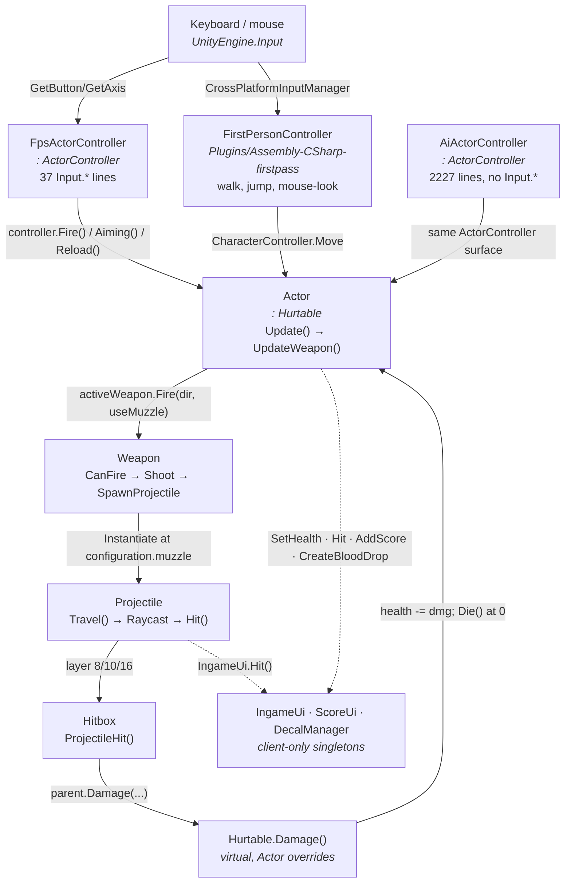

# Codebase map — the original single-player game

**Audience:** anyone about to edit `Ironfront_Reborn/Assets/Scripts/Assembly-CSharp/`.
**Closes** Dev A [phase-00 task 1](../plans/dev-a-unity-client/phases/phase-00-foundation.md#task-1--read-and-understand-the-codebase-2-days).
**Audited** 2026-08-15 against the repository at `3676c6e`. Every line number below was read, not
recalled; re-run the greps in § 7 if the files have moved since.

`Assembly-CSharp/` is 169 files. Nine of them decide what happens when you press the trigger. This
document is those nine, plus the two lists the netcode needs out of them: what state has to be
replicated, and where the game reaches for a singleton that a headless server does not have.

---

## 1. The shooting flow, end to end



### The same flow as a call chain, with line numbers

| # | Where | What happens |
|---|---|---|
| 1 | [`Actor.Update():433`](../Ironfront_Reborn/Assets/Scripts/Assembly-CSharp/Actor.cs#L433) | Per frame, if `activeWeapon != null` → `UpdateWeapon()` |
| 2 | [`Actor.UpdateWeapon():443`](../Ironfront_Reborn/Assets/Scripts/Assembly-CSharp/Actor.cs#L443) | `controller.Fire()` && not `fallenOver` && seat allows it |
| 3 | [`Actor.UpdateWeapon():446`](../Ironfront_Reborn/Assets/Scripts/Assembly-CSharp/Actor.cs#L446) | `activeWeapon.Fire(controller.FacingDirection(), controller.UseMuzzleDirection())` |
| 4 | [`Weapon.CanFire():306`](../Ironfront_Reborn/Assets/Scripts/Assembly-CSharp/Weapon.cs#L306) | unholstered · not reloading · has ammo · auto-or-not-held · not cooling down |
| 5 | [`Weapon.Shoot():321`](../Ironfront_Reborn/Assets/Scripts/Assembly-CSharp/Weapon.cs#L321) | `projectilesPerShot` × `SpawnProjectile`, then `ammo--`, `user.ApplyRecoil(...)` |
| 6 | [`Weapon.SpawnProjectile():388`](../Ironfront_Reborn/Assets/Scripts/Assembly-CSharp/Weapon.cs#L388) | `Quaternion.LookRotation(direction + Random.insideUnitSphere * configuration.spread)` |
| 7 | [`Projectile.Travel():92`](../Ironfront_Reborn/Assets/Scripts/Assembly-CSharp/Projectile.cs#L92) | Raycast forward `delta.magnitude * 2f`, mask `-2049` |
| 8 | [`Projectile.Hit():125`](../Ironfront_Reborn/Assets/Scripts/Assembly-CSharp/Projectile.cs#L125) | `Hitbox.IsHitboxLayer(layer)` → `component.ProjectileHit(this, point)` |
| 9 | [`Hitbox.ProjectileHit():22`](../Ironfront_Reborn/Assets/Scripts/Assembly-CSharp/Hitbox.cs#L22) | `parent.Damage(p.Damage() * multiplier, p.BalanceDamage(), piercing, …)` |
| 10 | [`Actor.Damage():761`](../Ironfront_Reborn/Assets/Scripts/Assembly-CSharp/Actor.cs#L761) | `health -=`, `balance -=`, blood decals, then knock-over / ragdoll / hurt |
| 11 | [`Actor.Die():691`](../Ironfront_Reborn/Assets/Scripts/Assembly-CSharp/Actor.cs#L691) | drop weapons, ragdoll, `ActorManager.SetDead`, `PathfindingManager.RegisterDeath`, `ScoreUi.AddScore` |

### Five facts worth knowing before you touch any of it

1. **Damage is randomised at three points**, all `UnityEngine.Random`: spread
   ([`Weapon.cs:390`](../Ironfront_Reborn/Assets/Scripts/Assembly-CSharp/Weapon.cs#L390)), recoil
   kick ([`Weapon.cs:348`](../Ironfront_Reborn/Assets/Scripts/Assembly-CSharp/Weapon.cs#L348)) and
   the hurt animation ([`Actor.cs:797`](../Ironfront_Reborn/Assets/Scripts/Assembly-CSharp/Actor.cs#L797)).
   A shot is not reproducible from its inputs, so client-side prediction of a hit is not possible
   without seeding — which is why
   [`ServerFireResolver`](../Ironfront.Net.Replication/Combat/ServerFireResolver.cs) exists on the
   server side rather than being predicted.
2. **`Hurtable` is the damage interface, and it is a class, not an interface.**
   [`Hurtable.cs`](../Ironfront_Reborn/Assets/Scripts/Assembly-CSharp/Hurtable.cs) is 11 lines: a
   `team` field and a `virtual Damage(...)` that returns `false`. `Actor` and `Vehicle` override it.
   Anything that can be shot derives from it.
3. **Hitboxes are identified by layer, not by component.**
   `Hitbox.IsHitboxLayer` accepts 8 (alive), 10 (ragdoll) and 16 (seated); `Actor.EnterSeat` moves
   its colliders to 16 and `ReactivateCollisionsWith` moves them back to 8 half a second after
   leaving. A hit-detection change that ignores the layer will start hitting players through
   vehicle armour.
4. **`Actor.Update` throttles itself.** `IsLowQuality()` returns true for AI actors that are
   off-screen or beyond `12000 / fov` metres, and those actors run `UpdateFacing`/`UpdateMovement`
   at 5 Hz instead of per frame ([`Actor.cs:402-421`](../Ironfront_Reborn/Assets/Scripts/Assembly-CSharp/Actor.cs#L402)).
   `Camera.main` is dereferenced unconditionally inside `IsLowQuality`, which is a headless
   landmine — see § 4.
5. **`AiActorController` consumes the same 30-method `ActorController` surface and reads no input at
   all.** Grepping `Input\.` over its 2227 lines returns zero hits. That is what makes an
   `IInputSource` seam viable: the abstract surface in
   [`ActorController.cs`](../Ironfront_Reborn/Assets/Scripts/Assembly-CSharp/ActorController.cs) is
   already the only thing `Actor` talks to, and a third subclass fed by the network needs no change
   to `Actor` whatsoever.

---

## 2. Actor state that needs replicating, versus what the snapshot carries

The right-hand column is
[`ActorSnapshotEntry`](../Ironfront.Net.Protocol/Messages/SnapshotMessage.cs#L42) and
[`ActorStateFlags`](../Ironfront.Net.Protocol/Enums/GameplayEnums.cs#L34) as they exist today.

| `Actor` state | Declared at | In the snapshot? | As |
|---|---|---|---|
| world position | `transform` / `ragdoll.Position()` | ✅ | `PosX/Y/Z` (i16, quantized) |
| facing yaw | `transform.eulerAngles.y` | ✅ | `Yaw` (u16) |
| aim pitch | camera, not on `Actor` | ✅ | `Pitch` (i8) |
| velocity | `controller.Velocity()` | ✅ | `VelX/Y/Z` (i8) |
| `health` | [`Actor.cs:72`](../Ironfront_Reborn/Assets/Scripts/Assembly-CSharp/Actor.cs#L72) | ✅ | `Health` (u8, 0–100) |
| `dead` | [`Actor.cs:78`](../Ironfront_Reborn/Assets/Scripts/Assembly-CSharp/Actor.cs#L78) | ✅ | `IsAlive` flag (inverted) |
| `fallenOver` / ragdoll | [`Actor.cs:81`](../Ironfront_Reborn/Assets/Scripts/Assembly-CSharp/Actor.cs#L81) | ✅ | `IsRagdoll` flag |
| crouching | `FpsActorController.crouching` | ✅ | `IsCrouching` flag |
| sprinting | `controller.IsSprinting()` | ✅ | `IsSprinting` flag |
| aiming | [`Actor.cs:120`](../Ironfront_Reborn/Assets/Scripts/Assembly-CSharp/Actor.cs#L120) | ✅ | `IsAiming` flag |
| `inWater` | [`Actor.cs:106`](../Ironfront_Reborn/Assets/Scripts/Assembly-CSharp/Actor.cs#L106) | ✅ | `IsInWater` flag |
| `seat` occupancy | [`Actor.cs:143`](../Ironfront_Reborn/Assets/Scripts/Assembly-CSharp/Actor.cs#L143) | ✅ | `IsSeated` flag + `SeatInfo` (stretch) |
| `team` | `Hurtable.team` | ✅ | `Team` (u8) |
| active weapon | [`Actor.cs:109`](../Ironfront_Reborn/Assets/Scripts/Assembly-CSharp/Actor.cs#L109) | ✅ | `WeaponId` (u8, via `WeaponManager.NetworkIdOf`) |
| `activeWeapon.ammo` | `Weapon.ammo` | ✅ | `AmmoInClip` (u8) |

### The gap list

Phase-00 asks for the table; the gap under it is the part that changes anyone's plan.

| Missing from the snapshot | Where it lives | Does it matter? |
|---|---|---|
| **`balance`** (the stagger meter, 100 → −100) | [`Actor.cs:75`](../Ironfront_Reborn/Assets/Scripts/Assembly-CSharp/Actor.cs#L75) | **Yes.** `balance < 0` is what triggers `KnockOver` ([`Actor.cs:791`](../Ironfront_Reborn/Assets/Scripts/Assembly-CSharp/Actor.cs#L791)). It regenerates at 10/s and is decremented by every hit, so a client that does not have it cannot predict a knock-down and will show a player standing who is on the floor on the server. It is not derivable from `health` — a stun grenade does 0 health and 200 balance. |
| **`spareAmmo[5]`** and the other four weapon slots | [`Actor.cs:112,116`](../Ironfront_Reborn/Assets/Scripts/Assembly-CSharp/Actor.cs#L112) | Own-player only. The HUD reads it via `Actor.UpdateAmmoUi`; other players never see it. A dedicated `S_LOADOUT`-style message or an own-player-only field, not a per-actor snapshot field. |
| **`prone`** | *does not exist in the game* | `ActorStateFlags.IsProne` is defined in the protocol and has no source. Either the protocol carries a bit nothing will ever set, or prone is a planned feature. Worth deciding rather than discovering. |
| **`hasAmmoBox` / `hasMedipack` / `needsResupply`** | [`Actor.cs:125-140`](../Ironfront_Reborn/Assets/Scripts/Assembly-CSharp/Actor.cs#L125) | AI-only inputs (`AiActorController` resupply behaviour) and server-side. No replication needed. |
| **`lqUpdatePhase` / `lqUpdate`** | [`Actor.cs:153-160`](../Ironfront_Reborn/Assets/Scripts/Assembly-CSharp/Actor.cs#L153) | Local rendering LOD. Deliberately not replicated; the server's equivalent is [`BotLodScheduler`](../Ironfront.Net.Replication/Server/BotLodScheduler.cs). |
| **animator parameters** (`movement x/y`, `lean`, `hurt x`, `falling`, `onBack`) | `Actor.UpdateMovement` / `UpdateFacing` / `UpdateRagdollStates` | Derived on the receiving client from position, velocity and the state flags. Replicating them would be replicating a derived field. |

**`balance` is the one real finding here.** Everything else in the list is either correctly absent
or own-player-only. Whoever owns the snapshot format should decide explicitly whether `balance`
joins it or whether knock-down becomes a server event instead — both are defensible, silently
shipping neither is not.

---

## 3. Where `Actor` reaches for a singleton

Phase-00 task 1 deliverable 3, and the direct input to
[assist step 03](../plans/assist-dev-a/step-03-singleton-guards.md).

| Line | Call | Present on a server? |
|---|---|---|
| [186](../Ironfront_Reborn/Assets/Scripts/Assembly-CSharp/Actor.cs#L186) | `ActorManager.Register(this)` | ✅ — but it calls `MinimapUi.AddActorBlip` internally (see below) |
| [225](../Ironfront_Reborn/Assets/Scripts/Assembly-CSharp/Actor.cs#L225) | `IngameUi.instance.Show()` | ❌ guarded by `if (!aiControlled)` |
| [226](../Ironfront_Reborn/Assets/Scripts/Assembly-CSharp/Actor.cs#L226) | `IngameUi.instance.SetHealth(...)` | ❌ guarded by `if (!aiControlled)` |
| [228](../Ironfront_Reborn/Assets/Scripts/Assembly-CSharp/Actor.cs#L228) | `ActorManager.SetAlive(this)` | ✅ |
| [235](../Ironfront_Reborn/Assets/Scripts/Assembly-CSharp/Actor.cs#L235) | `controller.GetLoadout()` → `LoadoutUi.instance.loadout` on the player path | ❌ **unguarded, via the controller** |
| [534](../Ironfront_Reborn/Assets/Scripts/Assembly-CSharp/Actor.cs#L534) | `IngameMenuUi.IsOpen()` | ❌ **unguarded** |
| [718](../Ironfront_Reborn/Assets/Scripts/Assembly-CSharp/Actor.cs#L718) | `IngameUi.instance.Hide()` | ❌ guarded by `if (!aiControlled)` |
| [720](../Ironfront_Reborn/Assets/Scripts/Assembly-CSharp/Actor.cs#L720) | `ActorManager.SetDead(this)` | ✅ |
| [721](../Ironfront_Reborn/Assets/Scripts/Assembly-CSharp/Actor.cs#L721) | `PathfindingManager.RegisterDeath(point)` | ✅ |
| [722](../Ironfront_Reborn/Assets/Scripts/Assembly-CSharp/Actor.cs#L722) | `ScoreUi.AddScore(...)` | ❌ **unguarded — runs on every death, including bot-vs-bot** |
| [781](../Ironfront_Reborn/Assets/Scripts/Assembly-CSharp/Actor.cs#L781) | `DecalManager.CreateBloodDrop(...)` | ❌ **unguarded — runs on every hit, in a loop of `ceil(damage/10)`** |
| [801,803](../Ironfront_Reborn/Assets/Scripts/Assembly-CSharp/Actor.cs#L801) | `IngameUi.instance.SetHealth` / `ShowVignette` | ❌ guarded by `if (!aiControlled)` |
| [830](../Ironfront_Reborn/Assets/Scripts/Assembly-CSharp/Actor.cs#L830) | `IngameUi.instance.SetWeapon(weapon)` | ❌ guarded by `if (!aiControlled)` |
| [1084](../Ironfront_Reborn/Assets/Scripts/Assembly-CSharp/Actor.cs#L1084) | `IngameUi.instance.SetAmmoText(...)` | ❌ reached only from guarded callers |
| [1089](../Ironfront_Reborn/Assets/Scripts/Assembly-CSharp/Actor.cs#L1089) | `IngameUi.instance.SetHealth(health)` | ❌ reached only from guarded callers |
| [1143](../Ironfront_Reborn/Assets/Scripts/Assembly-CSharp/Actor.cs#L1143) | `IngameUi.instance.Resupply()` | ❌ guarded by `if (!aiControlled)` |
| [1159](../Ironfront_Reborn/Assets/Scripts/Assembly-CSharp/Actor.cs#L1159) | `IngameUi.instance.Heal()` | ❌ guarded by `if (!aiControlled)` |
| [1172,1174](../Ironfront_Reborn/Assets/Scripts/Assembly-CSharp/Actor.cs#L1172) | `Camera.main` inside `IsLowQuality()` | ❌ **unguarded — reached from `Update` on every AI actor** |

### What this list is really saying

`Actor` already has an accidental server guard: **`if (!aiControlled)`**. Ten of its eighteen
singleton touches sit behind it, and on a dedicated server every actor is AI-controlled, so ten of
them are already safe by luck rather than design.

The five that are **not** behind it are the ones that will actually throw:

- `ScoreUi.AddScore` — fires on every death
- `DecalManager.CreateBloodDrop` — fires on every hit
- `MinimapUi.AddActorBlip`, reached from `ActorManager.Register` — fires once per actor at startup
- `IngameMenuUi.IsOpen()` — fires from `UpdateMovement`, every frame, for every actor
- `Camera.main` in `IsLowQuality()` — fires from `Update`, every frame, for every AI actor

Note the shape they share: **all five are static methods that dereference `instance` internally.**
`ScoreUi.AddScore`, `DecalManager.CreateBloodDrop`, `DecalManager.AddDecal`,
`MinimapUi.AddActorBlip` and `IngameUi.Hit` are all `public static void X(...) { instance.Y(); }`.
That is a single choke point per singleton, not forty call sites — which is the fact that decides
how [step 03](../plans/assist-dev-a/step-03-singleton-guards.md) should be written.

`Camera.main` is the odd one out and the one nobody would have predicted: it is not on the task-5
list of 21 singletons at all, and it will throw before any of them, because `Actor.Update` runs for
all 32 bots from the first frame.

---

## 4. Every `Input.*` site in `FpsActorController`, and its surrounding condition

Added by the assist track for
[step 02](../plans/assist-dev-a/step-02-input-source.md); gathering it while reading is nearly free
and it is the exact substitution list that step needs.

37 lines, 44 individual `Input.*` expressions — the anchored count; see the correction at the end of
this section. Read the middle column as "this read only matters when…".

| Line | Surrounding condition | Expression | Class |
|---|---|---|---|
| 130 | `!IngameMenuUi.IsOpen() && !IsSprinting() && sprintCannotFireAction.TrueDone()` | `(GetButton("Fire1") \|\| GetMouseButton(0)) && !LoadoutUi.IsOpen()` | gameplay |
| 139 | `!OptionsUi.GetOptions().toggleAim` | `(GetButton("Fire2") \|\| GetMouseButton(1)) && !LoadoutUi.IsOpen()` | gameplay |
| 144 | unconditional (`Reload()`) | `GetButton("Reload") && !LoadoutUi.IsOpen()` | gameplay |
| 164 | `Actor.FixedUpdate`, only while `WaterLevel.InWater` | `GetAxis("Vertical")`, `GetAxis("Horizontal")` in a `tpCamera` basis | gameplay |
| 188 | `CarInput()`, called only from a driver seat | `GetAxis("Horizontal")`, `GetAxis("Vertical")` | vehicle |
| 196–199 | `helicopterType == 2` only | `GetAxis("Helicopter Pitch"/"Yaw"/"Roll"/"Throttle")` | vehicle |
| 202 | every `HelicopterInput()` call | `GetAxis("Mouse X")`, `GetAxis("Mouse Y")` — a **per-frame delta**, not an absolute angle | vehicle |
| 213, 215 | `helicopterType == 0` / else | `GetAxis("Horizontal")`, `GetAxis("Vertical")` | vehicle |
| 378 | `!IsSprinting()` | `GetAxis("Lean")` | gameplay |
| 439 | `Update`, unconditional | `GetButtonDown("Fire2")` → flips `aimToggle` | gameplay (edge) |
| 468 | `Update`, unconditional | `GetButtonDown("Loadout")` | UI |
| 479 | `Update`, unconditional | `GetKeyDown(KeyCode.K)` → suicide | debug |
| 483 | `Update`, unconditional | `GetKeyDown(KeyCode.O)` → `ActorManager.debug` | debug |
| 487 | `!IngameMenuUi.IsOpen()` | `GetButtonDown("Slowmotion")` | debug |
| 504 | `Update`, unconditional | `GetButtonDown("Use")` → enter/leave seat | gameplay (edge) |
| 523–539 | `inputEnabled` | `GetKeyDown(Alpha1..Alpha5)` → `SwitchWeapon(0..4)` | gameplay (edge) |
| 543–571 | `inputEnabled` | `GetKeyDown(F1..F8)` → `SwitchSeat(0..7)` | vehicle (edge) |
| 575 | `inputEnabled && OptionsUi.GetOptions().toggleCrouch` | `GetButtonDown("Crouch")` → flips `crouchInput` | gameplay (edge) |
| 579, 583 | `inputEnabled` | `mouseScrollDelta.y` → `NextWeapon()` / `PreviousWeapon()` | gameplay (edge) |
| 675 | `!OptionsUi.GetOptions().toggleCrouch` | `GetButton("Crouch")` | gameplay |
| 715 | `!Crouch() && !Aiming() && !IsReloading() && !actor.IsSeated()` | `GetButton("Sprint")` | gameplay |

### Three things this table says that the phase-00 mapping table does not

1. **Walking, jumping and mouse-look are not in this file.** They are in
   [`FirstPersonController`](../Ironfront_Reborn/Assets/Plugins/Assembly-CSharp-firstpass/UnityStandardAssets/Characters/FirstPerson/FirstPersonController.cs),
   which reads `CrossPlatformInputManager.GetAxis("Horizontal"/"Vertical")` at
   [line 278](../Ironfront_Reborn/Assets/Plugins/Assembly-CSharp-firstpass/UnityStandardAssets/Characters/FirstPerson/FirstPersonController.cs#L278)
   and `GetButtonDown("Jump")` at
   [line 159](../Ironfront_Reborn/Assets/Plugins/Assembly-CSharp-firstpass/UnityStandardAssets/Characters/FirstPerson/FirstPersonController.cs#L159).
   An `IInputSource` covering only `FpsActorController` therefore covers aim, fire, reload, lean,
   crouch and sprint — **not locomotion**.

   That is less alarming than it sounds: the netcode does not drive locomotion through
   `FirstPersonController` at all. It replaces it, via
   [`MovementSimulation`](../Ironfront_Reborn/Assets/Scripts/Net/Shared/MovementSimulation.cs) →
   [`MovementCore`](../Ironfront.Net.Replication/Movement/MovementCore.cs), which is already ported
   and unit-tested. Locomotion input reaches the netcode through
   `MovementSimulation.FromUnityInput`, not through `FpsActorController`.

2. **There is a 38th gameplay `Input.*` read outside `Assembly-CSharp/`.**
   [`MovementSimulation.FromUnityInput`](../Ironfront_Reborn/Assets/Scripts/Net/Shared/MovementSimulation.cs#L70)
   reads `Horizontal`, `Vertical`, `Jump`, `Sprint` and `Crouch` directly. That file is Dev C's and
   marked "nobody else may edit" in
   [conventions.md § 7](../plans/00-shared/conventions.md), so it is named here rather than changed.
   It is the natural second consumer of `IInputSource` once the interface exists.

3. **Line 202 is a mouse delta, not an angle.** The phase-00 mapping table says to "move it into
   `LocalInputSource.Sample()`", where `Sample()` accumulates an absolute yaw and pitch. Those are
   different quantities and substituting one for the other silently changes helicopter handling. A
   look-*delta* channel is needed alongside the absolute yaw/pitch, or line 202 has to stay on
   `Input` — see step 02.

The other 43 `Input.*` lines, in 16 files (`SpectatorCamera` 9, `PathTypesDemo` 9,
`ObjectPlacer`/`GroupController`/`CommandRoomCamera` 4 each, `WeaponManager`/`ScoreUi` 2 each, and
nine files with one apiece), are spectator, level-editor tooling and menus.
[Phase-00 criterion 6](../plans/dev-a-unity-client/phases/phase-00-foundation.md#3-acceptance-criteria)
explicitly permits them to keep calling `Input` directly.

> **Count correction.** Both phase-00 ("59 `Input.*` call sites, ~40 in `FpsActorController`") and
> the assist-track README ("85 places", "`MainMenu.cs` 3") are off, because the grep behind them was
> unanchored: `victoryScoreInput.text` in
> [`MainMenu.cs:85`](../Ironfront_Reborn/Assets/Scripts/Assembly-CSharp/MainMenu.cs#L85) matches
> `Input\.` but is a `UnityEngine.UI.InputField`, not input. Anchored (`\bInput\.`), the real
> figures for `Assembly-CSharp/` are **80 lines / 94 expressions across 17 files**, of which
> `FpsActorController` is **37 lines / 44 expressions**. `MainMenu` has none. The shape of the
> conclusion is unchanged — one file is still the entire gameplay job — but a number in a plan that
> nobody can reproduce is a number that gets argued about later.

---

## 5. The eight files, one paragraph each

**[`ActorController.cs`](../Ironfront_Reborn/Assets/Scripts/Assembly-CSharp/ActorController.cs)** ·
72 lines. An abstract `MonoBehaviour` with one field (`actor`) and 30 abstract members. It is the
whole seam between "something decides" and "the actor does it": ten queries (`Fire`, `Aiming`,
`Crouch`, `Reload`, `IsSprinting`, `Lean`, `Velocity`, `OnGround`, `FacingDirection`,
`SwimInput`/`CarInput`/`BoatInput`/`HelicopterInput`) and thirteen commands (`Die`, `SpawnAt`,
`StartRagdoll`, `EndRagdoll`, `GettingUp`, `StartSeated`, `EndSeated`, `EnableInput`,
`DisableInput`, `ApplyRecoil`, `StartCrouch`, `EndCrouch`, `SwitchedToWeapon`, `ReceivedDamage`).
Read this file first and the other seven make sense.

**[`Actor.cs`](../Ironfront_Reborn/Assets/Scripts/Assembly-CSharp/Actor.cs)** · 1189 lines,
`: Hurtable`. The unit. Owns health, balance, the five weapon slots, seat state, ragdoll state and
the animator. `Update()` runs facing → movement → weapon; `FixedUpdate()` is buoyancy only.
`Damage()` at 761 is the single entry point for taking damage and `Die()` at 691 the single exit.
Everything it does to the world it does through `controller`, which is why the netcode can
substitute a controller and change nothing else.

**[`FpsActorController.cs`](../Ironfront_Reborn/Assets/Scripts/Assembly-CSharp/FpsActorController.cs)** ·
752 lines. The player's controller. Holds `static instance` and `static playerTeam`, both read from
eleven other files. Also owns both cameras, the FOV/aim/recoil pipeline via `fpParent`, the
crouch height change, the use-ray, and the loadout screen. § 4 above is its input surface.

**[`Weapon.cs`](../Ironfront_Reborn/Assets/Scripts/Assembly-CSharp/Weapon.cs)** · 564 lines.
`Fire()` → `CanFire()` → `Shoot()` → N × `SpawnProjectile()`. Configuration is a serialised nested
class (`spread`, `cooldown`, `auto`, `projectilesPerShot`, `kickback`, `randomKick`, `ammo`,
`spareAmmo`, `aimFov`, `muzzle`). `ToggleableItem` subclasses (ammo bag, medipack) reuse the slot
machinery without being weapons.

**[`ActorManager.cs`](../Ironfront_Reborn/Assets/Scripts/Assembly-CSharp/ActorManager.cs)** ·
368 lines. The actor registry and the spawn loop. `StartGame()` creates `team0Bots + team1Bots`
(16 + 16 by default) AI actors, then `InvokeRepeating("SpawnWave", 1f, spawnTime)` respawns anything
dead for more than 6 s. `Explode()` is the area-damage entry point, `RegisterProjectile` is the
"bots duck when shot at" hook. Note `Register` calls `MinimapUi.AddActorBlip` — a UI call on the
registration path of every actor.

**[`GameManager.cs`](../Ironfront_Reborn/Assets/Scripts/Assembly-CSharp/GameManager.cs)** ·
108 lines and the smallest important file. `DontDestroyOnLoad`, subscribes to `sceneLoaded`, and any
scene with `buildIndex > 1` counts as in-game. `StartGame()` instantiates the HUD prefab and the
player prefab at `(0, 1000, 0)`, then starts `ActorManager`, `CoverManager` and `DecalManager`.
Holding **S** during the one-second `OpenPlayerLoadout` invoke starts spectator mode instead.

**[`AiActorController.cs`](../Ironfront_Reborn/Assets/Scripts/Assembly-CSharp/AiActorController.cs)** ·
2227 lines — skim, as phase-00 says. What matters for the netcode is what it *consumes*:
`ActorManager.AliveActorsOnTeam`, `PathfindingManager`, `CoverManager`, `Squad`, and
`FpsActorController.instance.actor` / `.playerTeam` at five sites (464, 503, 646, 686, 2047) for
"is the human nearby" behaviour. Those five are the reason a headless server needs
`FpsActorController.instance` guarded rather than absent.

**[`Hitbox.cs`](../Ironfront_Reborn/Assets/Scripts/Assembly-CSharp/Hitbox.cs)** (31 lines) and
**[`Hurtable.cs`](../Ironfront_Reborn/Assets/Scripts/Assembly-CSharp/Hurtable.cs)** (11 lines). The
entire damage interface. `Hitbox` carries a `multiplier` (head/limb) and a `parent` back-pointer;
`Hurtable` carries `team` and a virtual `Damage(...)`. 42 lines decide everything about who can hurt
whom.

---

## 6. What is not in this document

- **Vehicles.** `Vehicle`, `Seat`, `Helicopter`, `TankTurret`, `MountedTurret` are named where they
  intersect the flow above and not explored. Phase-00 § 5 puts vehicle input outside the 14-week
  scope.
- **`Squad` and the AI decision tree.** Skimmed per the reading order.
- **Rendering, audio, `TimeOfDay`, `DecalManager` internals.** They matter for the headless build
  (§ 3) and nowhere else in this flow.

---

## 7. Reproducing every claim here

```bash
cd Ironfront_Reborn/Assets/Scripts/Assembly-CSharp

# § 4 — the input surface, per file. The \b matters: without it, InputField members
# in MainMenu.cs are counted as input reads.
grep -c "\bInput\." *.cs | grep -v ":0" | sort -t: -k2 -rn   # 80 lines, 17 files
grep -o "\bInput\.[A-Za-z]*" *.cs | wc -l                    # 94 expressions
grep -n  "\bInput\." FpsActorController.cs                   # 37 lines

# § 3 — every singleton touch, per singleton
for s in IngameUi IngameMenuUi LoadoutUi ScoreUi MinimapUi MinimapCamera OptionsUi \
         SceneryCamera DecalManager ReflectionProber DetailObjectQuality TimeOfDay \
         FpsActorController PlayerFpParent; do
  echo "### $s"; grep -n "\b$s\." *.cs | grep -v "^$s\.cs:"
done

# § 1 fact 5 — AiActorController reads no input
grep -c "Input\." AiActorController.cs   # 0

# the finding that started the assist track: the netcode is not wired into the game
grep -rl "NetContext\|NetMovementAgent\|MovementSimulation" *.cs | wc -l   # 0
```

---

## 8. Related

- [`plans/dev-a-unity-client/phases/phase-00-foundation.md`](../plans/dev-a-unity-client/phases/phase-00-foundation.md) — the task this closes
- [`plans/assist-dev-a/`](../plans/assist-dev-a/) — the assist track; steps 02 and 03 consume § 4 and § 3 respectively
- [`docs/movement-analysis.md`](movement-analysis.md) — the movement port, in the depth this document does not go into
- [`plans/00-shared/conventions.md`](../plans/00-shared/conventions.md) § 7 — who may edit what
