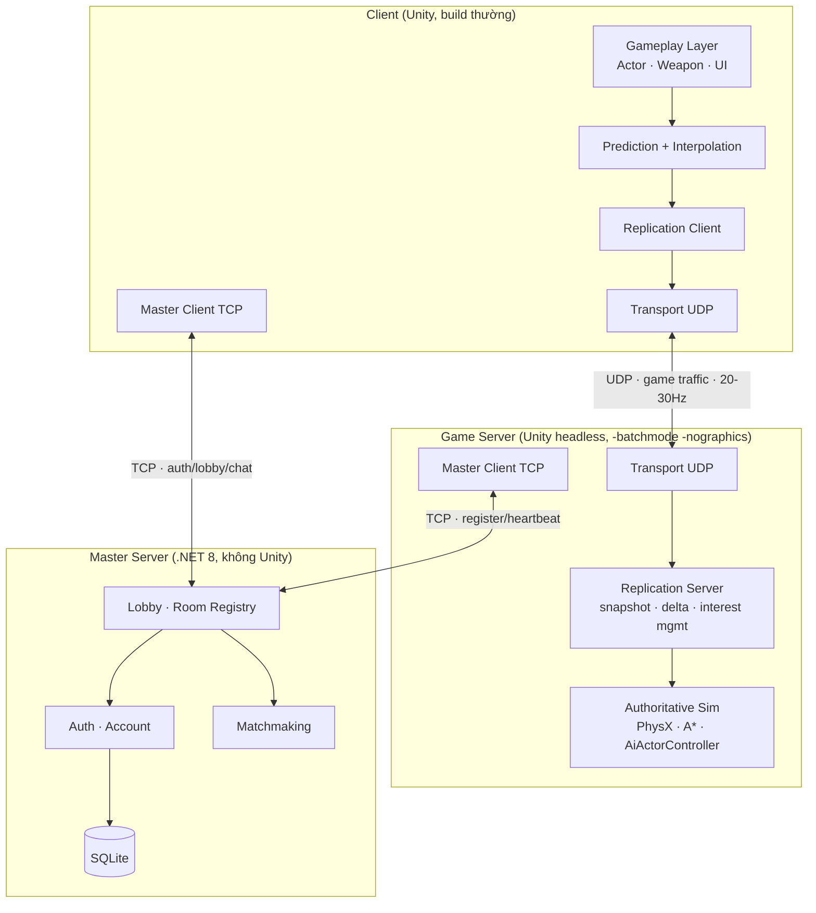
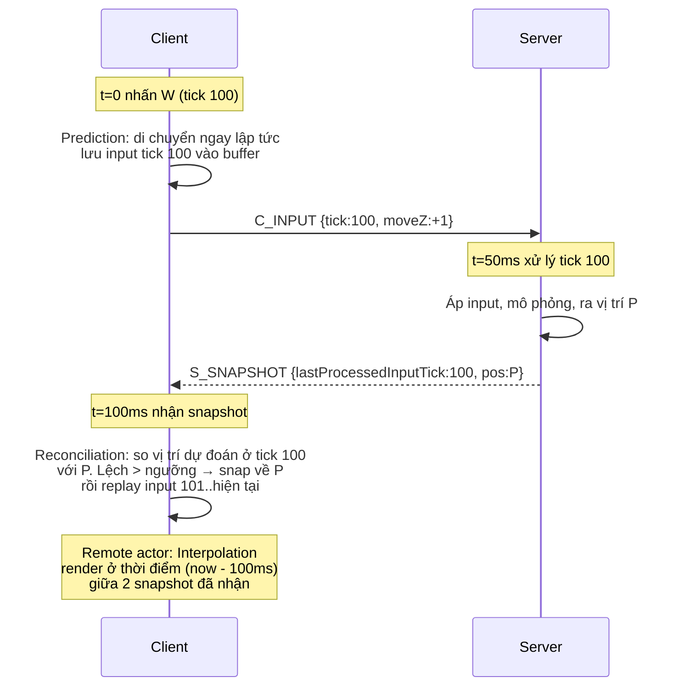
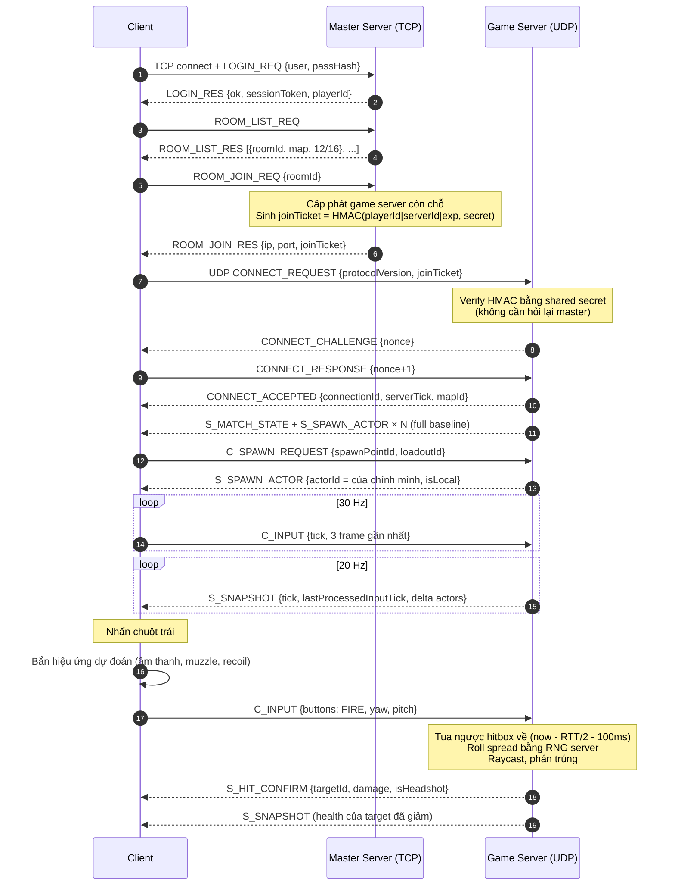

# Kiến trúc hệ thống — Ironfront Reborn

Tài liệu này mô tả kiến trúc mục tiêu. Chi tiết byte-level nằm ở [protocol-spec.md](protocol-spec.md).

---

## 1. Sơ đồ tổng thể



---

## 2. Phân vai TCP và UDP

Đây là quyết định kiến trúc trung tâm của môn Lập trình mạng, phải nói được rõ khi bảo vệ.

| | TCP (Master Server) | UDP (Game Server) |
|---|---|---|
| **Dùng cho** | Login, danh sách phòng, tạo/vào phòng, matchmaking, chat lobby, server heartbeat | Toàn bộ traffic trong trận: input, snapshot, event gameplay |
| **Vì sao** | Dữ liệu không real-time, mất gói không chấp nhận được, kích thước không đều, tần suất thấp. TCP cho sẵn tin cậy + thứ tự | Real-time, tần suất cao đều đặn. Dữ liệu **cũ là vô giá trị** — retransmit một snapshot 200ms trước còn tệ hơn là bỏ nó đi |
| **Vấn đề nếu dùng cái kia** | UDP cho lobby = phải tự viết lại tin cậy cho thứ TCP đã làm tốt | **TCP head-of-line blocking**: 1 gói mất chặn toàn bộ gói sau nó cho tới khi retransmit xong → giật hình dây chuyền. Nagle + delayed ACK cộng thêm 40–200ms |
| **Tần suất** | Vài gói/phút | 20–60 gói/giây/hướng |
| **Framing** | Length-prefixed 4 byte | Datagram tự nhiên, header 16 byte tự định nghĩa |

**Không dùng WebSocket** theo yêu cầu: WebSocket chạy trên TCP nên thừa hưởng nguyên head-of-line
blocking, cộng thêm overhead framing và handshake HTTP. Nó tồn tại để xuyên qua firewall/proxy của
trình duyệt — một ràng buộc mà game client desktop không có.

---

## 3. Mô hình authority

**Server-authoritative tuyệt đối.** Client không có quyền quyết định bất cứ điều gì ảnh hưởng
gameplay.

| Việc | Ai quyết | Client được làm gì |
|---|---|---|
| Vị trí nhân vật | Server | Dự đoán (predict) rồi đối chiếu (reconcile) |
| Trúng đạn / sát thương | Server | Hiện hiệu ứng dự đoán, chờ `S_HIT_CONFIRM` |
| Máu, chết, hồi sinh | Server | Chỉ hiển thị |
| Spread đạn, recoil | Server | Hiện recoil cục bộ cho cảm giác, không ảnh hưởng đạn thật |
| Bot AI | Server | Chỉ nội suy |
| Chiếm điểm, điểm số | Server | Chỉ hiển thị |
| Vào/ra ghế xe | Server | Gửi yêu cầu |
| Camera, UI, âm thanh, ragdoll xác chết | Client | Toàn quyền, không sync |

### 3.1. Ba kỹ thuật netcode kinh điển được dùng



1. **Client-side prediction** — local player di chuyển ngay khi nhấn phím, không chờ server.
2. **Server reconciliation** — khi snapshot về, client so sánh vị trí dự đoán tại tick đó với
   vị trí server. Lệch quá ngưỡng thì sửa lại rồi replay toàn bộ input chưa được xác nhận.
3. **Entity interpolation** — remote actor được render trễ 100ms so với snapshot mới nhất, nội
   suy giữa hai snapshot đã có. Đổi 100ms độ trễ hiển thị lấy chuyển động mượt.
4. **Lag compensation** — server "tua ngược" hitbox về thời điểm client thực sự nhìn thấy khi
   xử lý phát bắn. Xem [protocol-spec.md § 7](protocol-spec.md#7-lag-compensation).

---

## 4. Vòng lặp thời gian

| Thông số | Giá trị | Ghi chú |
|---|---|---|
| Server sim tick | **30 Hz** (33.33ms) | `Time.fixedDeltaTime = 1/30` trên headless |
| Snapshot rate | **20 Hz** (50ms) | Gửi mỗi 1.5 tick |
| Client input send rate | **30 Hz** | Mỗi gói chứa 3 frame gần nhất (redundancy chống mất gói) |
| Client render | Không giới hạn | 60–144 fps |
| Interpolation buffer | **100ms** | = 2 khoảng snapshot, chịu được mất 1 gói liên tiếp |
| Lag compensation window | **200ms** tối đa | Chống abuse: ping cao giả để bắn quá khứ |
| Hitbox history | **1 giây** (30 tick) | Ring buffer trên server |
| Keep-alive | 1 gói/giây khi không có traffic | |
| Timeout ngắt kết nối | 10 giây không nhận gì | |

**Vì sao 30Hz chứ không 60Hz:** 48 actor với A* + AI + physics ở 60Hz sẽ vượt ngân sách CPU
(rủi ro R6). 30Hz là tiêu chuẩn của nhiều FPS thương mại và đủ tốt khi có prediction.

---

## 5. Kiến trúc thư mục và assembly

```
Ironfront_Reborn/                       ← Unity project (A sở hữu)
├── Assets/
│   ├── Scripts/Assembly-CSharp/        ← gameplay gốc (A sở hữu)
│   │   ├── Actor.cs, Weapon.cs, ...
│   │   └── Pathfinding/                ← A* — không ai đụng
│   └── Scripts/Net/                    ← code net trong Unity
│       ├── Client/                     ← A sở hữu
│       │   ├── NetworkActorController.cs
│       │   ├── ClientPrediction.cs
│       │   ├── EntityInterpolator.cs
│       │   └── NetClientBootstrap.cs
│       ├── Server/                     ← C sở hữu
│       │   ├── ServerTickLoop.cs
│       │   ├── ServerAuthority.cs
│       │   ├── HitboxHistory.cs
│       │   └── NetServerBootstrap.cs
│       └── Shared/                     ← C sở hữu, A đọc
│           ├── NetContext.cs
│           ├── NetInputFrame.cs
│           └── ActorNetId.cs
│
Ironfront.Net.Protocol/                 ← .NET class library — SSOT hằng số
│   └── ProtocolConstants.cs            ← KHÔNG AI được viết lại hằng số ở nơi khác
│
Ironfront.Net.Transport/                ← B sở hữu — C# thuần, không phụ thuộc Unity
│   ├── UdpSocketPeer.cs
│   ├── Connection.cs
│   ├── ReliabilityLayer.cs
│   ├── ChannelSet.cs
│   ├── Fragmentation.cs
│   ├── CongestionControl.cs
│   └── Simulation/NetworkSimulator.cs
│
Ironfront.Net.Replication/              ← C sở hữu — C# thuần
│   ├── BitWriter.cs / BitReader.cs
│   ├── SnapshotBuilder.cs
│   ├── DeltaEncoder.cs
│   ├── InterestManager.cs
│   └── Messages/
│
Ironfront.MasterServer/                 ← D sở hữu — .NET 8 console app
│   ├── Program.cs
│   ├── Net/TcpListenerHost.cs, MspFraming.cs
│   ├── Services/AuthService.cs, LobbyService.cs, MatchmakingService.cs
│   └── Data/ (SQLite, EF Core hoặc Dapper)
│
Ironfront.Tools.LoadTest/               ← D sở hữu — bot client giả lập
```

### 5.1. Vì sao tách thư viện ra khỏi Unity

`Ironfront.Net.Transport` và `Ironfront.Net.Replication` là .NET class library thuần
(`netstandard2.1`), build bằng `dotnet build`, **không tham chiếu `UnityEngine`**. Lợi ích:

1. Chạy được xUnit test bình thường, không cần Unity Test Runner (nhanh hơn nhiều lần).
2. B và D không phải cài/mở Unity → tránh xung đột `.meta` và scene (rủi ro merge tệ nhất).
3. Dùng lại được cho công cụ load test và cho master server.
4. Ranh giới rõ ràng: nếu một file trong Transport cần `using UnityEngine`, đó là dấu hiệu
   thiết kế sai.

Unity tiêu thụ chúng qua DLL đặt trong `Assets/Plugins/` (build ra bằng script
`tools/build-libs.ps1`, chạy tự động trong CI).

---

## 6. Luồng đầu-cuối: từ mở game tới bắn được phát đạn



---

## 7. Kiến trúc replication: cái gì được sync

### 7.1. Phân loại đối tượng

| Loại | Ví dụ | Cách xử lý |
|---|---|---|
| **Replicated actor** | Người chơi, bot | Có `actorId` u16, có trong snapshot, delta encode |
| **Server-only** | Hitbox history, AI blackboard, cover points | Không bao giờ gửi |
| **Client-only** | Camera, UI, decal, particle, ragdoll xác, âm thanh | Không bao giờ gửi |
| **Event một lần** | Chết, nổ, bắn, chiếm điểm | Reliable-ordered channel, không nằm trong snapshot |
| **Static** | Terrain, nhà cửa, spawn point | Không sync, có sẵn trong scene ở cả hai bên |

### 7.2. Vì sao tách event khỏi snapshot

Snapshot là **trạng thái** (state), gửi unreliable — mất gói thì gói sau bù. Event là **sự kiện
một lần** (một tiếng nổ, một cái chết), mất là mất luôn, phải gửi reliable. Trộn hai loại vào
một kênh là lỗi thiết kế phổ biến dẫn tới hoặc lãng phí băng thông (gửi state reliable) hoặc
mất event.

### 7.3. Interest management

Không gửi mọi actor cho mọi client. Với 48 actor, mỗi client chỉ thực sự cần khoảng 15–25.

| Vùng | Điều kiện | Tần suất update |
|---|---|---|
| Near | < 60m hoặc đang trong tầm nhìn | Mỗi snapshot (20 Hz) |
| Mid | 60–150m | 10 Hz |
| Far | 150–300m | 4 Hz, chỉ vị trí (cho minimap) |
| Culled | > 300m và không nhìn thấy | Không gửi |

Đồng đội luôn ở ít nhất mức Mid (cần cho minimap và command map).

**Tiết kiệm ước tính:** từ ~15 KB/s xuống ~7 KB/s mỗi client.

---

## 8. Ranh giới client/server trong code Unity

Vì cùng một codebase build ra cả client lẫn server, mọi đoạn code chỉ có nghĩa ở một phía phải
được guard.

```csharp
// Ironfront_Reborn/Assets/Scripts/Net/Shared/NetContext.cs
public static class NetContext
{
    public static bool IsServer { get; private set; }
    public static bool IsClient => !IsServer;
    public static void InitServer() { IsServer = true; }
}
```

Quy ước:

```csharp
// Trong Actor.cs
private void Update()
{
    if (NetContext.IsServer)
    {
        // logic authoritative
    }
    else
    {
        UpdateVisuals();   // ragdoll, particle, audio
    }
}
```

Với code chắc chắn không bao giờ chạy trên server (UI), dùng compile-time guard để build server
nhẹ hơn:

```csharp
#if !UNITY_SERVER
    IngameUi.instance.ShowHitmarker();
#endif
```

Define `UNITY_SERVER` được set trong build profile headless.

---

## 9. Bảo mật ở mức phù hợp với scope

Không làm anti-cheat nâng cao (đã cắt scope). Nhưng những thứ sau là **miễn phí** vì đã có
server-authoritative, phải làm:

| Chống | Cách |
|---|---|
| Speed hack | Server kẹp tốc độ di chuyển tối đa mỗi tick. Vượt quá → bỏ qua phần thừa |
| Teleport | Server không bao giờ nhận vị trí từ client, chỉ nhận input |
| Rapid fire | Server tự đếm cooldown vũ khí, bỏ qua fire intent tới sớm |
| Đạn vô hạn | Server tự quản lý ammo |
| Bắn xuyên tường | Server tự raycast, có kiểm tra line-of-sight |
| Bắn quá tầm | Kẹp lag compensation ở 200ms |
| Giả mạo người khác | `connectionId` gắn với `playerId` từ joinTicket đã ký HMAC |
| Packet flood | Rate limit theo IP ở tầng transport, drop connection vượt ngưỡng |
| Gói rác / port scan | Kiểm tra `protocolId` 2 byte đầu, sai thì drop im lặng |

**Không** mã hóa payload UDP (thêm phức tạp, không cần cho scope này). Master server TCP nên
bọc TLS khi lên VPS ở M3 vì có truyền mật khẩu.

---

## 10. Quyết định kiến trúc đã chốt (không thương lượng lại)

| # | Quyết định | Lý do | Nếu muốn đổi |
|---|---|---|---|
| AD-1 | Server-authoritative, không host/listen-server | Chặn R4 (singleton), authority rõ ràng | Phải sửa 21 singleton |
| AD-2 | Server là Unity headless, không phải .NET thuần | Tái dùng PhysX + A* + AI, tiết kiệm 8–12 tuần | Phải port physics + pathfinding |
| AD-3 | Không cố deterministic, không lockstep | Chặn R3 (`Random` rải rác 27 file) | Phải seed lại toàn bộ RNG |
| AD-4 | Ragdoll là cosmetic cục bộ, không sync | Chặn R2, tiết kiệm ~1.7 MB/s | Bất khả thi về băng thông |
| AD-5 | Transport và Replication là .NET lib thuần | Test được bằng xUnit, tránh xung đột Unity | Mất khả năng unit test nhanh |
| AD-6 | Xe cộ ngoài scope core | Ước tính 4+ tuần, không đủ thời gian | Phải cắt thứ khác |
| AD-7 | Snapshot unreliable, event reliable-ordered | Đúng bản chất state vs event | |
| AD-8 | Không dùng WebSocket | Yêu cầu của dự án + head-of-line blocking | |
