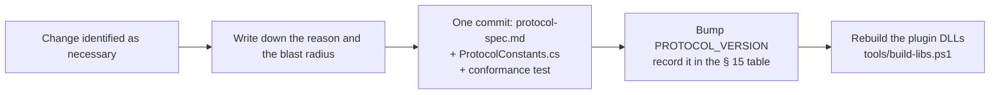

# Working conventions — Ironfront Reborn

Single-owner project. These are the rules that survive contact with your own memory.

---

## 1. Git

### 1.1. Branches

```
main            ← only merged from develop at each milestone. Always in a working state
develop         ← integration branch. Merged every Wednesday (integration day)
feat/a-input-abstraction
feat/b-reliability-layer
fix/c-delta-baseline-drift
```

Naming rule: `<type>/<person-letter>-<short-description>`.
Types: `feat` `fix` `refactor` `test` `docs` `chore`.

### 1.2. Commit messages

Conventional commits, with the scope being your ownership area:

```
feat(transport): add a 32-bit ack bitfield to the header
fix(replication): fix sequence comparison wrapping after 36 minutes
test(transport): add 12 tests for fragment reassembly
docs(protocol): freeze the position quantization constants
refactor(client): split input out of FpsActorController
```

Valid scopes: `client` `transport` `replication` `master` `protocol` `tools` `ci` `modules`.

`modules` is for changes to the solution's project layout itself — scaffolding or restructuring the
owned projects — which belongs to no single ownership area. Reach for your own scope first.

### 1.3. The survival rule for Unity

> **Only A opens the Unity Editor.** B, C and D use Rider/VS/VSCode and build with `dotnet build`.

Reason: Unity rewrites `.meta`, `.unity` (scene) and `.prefab` files every time the project is
opened, even if nothing changed. Two people opening it → conflicts in thousand-line YAML files that
are effectively unresolvable by hand.

Required in `.gitattributes`:
```
*.unity   merge=unityyamlmerge eol=lf
*.prefab  merge=unityyamlmerge eol=lf
*.asset   merge=unityyamlmerge eol=lf
```

If a scene must be touched alongside other work: **finish and commit the scene edit on its own,
and release it when you're done**.

### 1.4. Absolutely forbidden

- `git add .` or `git add -A` — always add specific paths
- `git push --force` to `develop` or `main`
- Committing `.env` files, secret strings, or `SHARED_SECRET`
- Committing the `Library/`, `Temp/`, `obj/`, `bin/` or `Logs/` directories

---

## 2. Protocol change process

`protocol-spec.md` was frozen at the end of week 1. It stays the source of truth: the wire format
is the one thing a running client and a running server have to agree on without being able to ask
each other.



**The three parts move together or not at all** — spec, constant, conformance test. Changing a
protocol constant in one place and fixing the other side "in a minute" is what produces a
version-skew bug that survives the session that caused it, and the symptom shows up as a client
that connects and then silently misreads every snapshot.

The DLL rebuild is part of the change, not follow-up work: Unity consumes
`Assets/Plugins/Ironfront.Net.*.dll`, so a protocol edit that is not rebuilt is not in the game.

---

## 3. C# code conventions

### 3.1. Naming

| Kind | Convention | Example |
|---|---|---|
| Class, struct, enum, method | PascalCase | `ReliabilityLayer`, `PackPos` |
| Interface | `I` + PascalCase | `ITransport`, `ISnapshotSink` |
| Private instance field | `_camelCase` | `_pendingAcks` |
| Private static field | PascalCase | `ReferenceHex` |
| Public field / property | PascalCase | `ConnectionId` |
| **Protocol constant** (in `ProtocolConstants.cs`) | SCREAMING_SNAKE | `MAX_PAYLOAD`, `PROTOCOL_VERSION` |
| Any other constant | PascalCase | `GspHeader.Size`, `MspFrame.LengthPrefixSize` |
| Local variable, parameter | camelCase | `serverTick` |

#### Why constants have two conventions

This row used to read "Constant → SCREAMING_SNAKE" for every constant. The code has never
done that, and it was right not to: `GspHeader.Size`, `MspFrame.LengthPrefixSize`,
`PayloadFrame.HeaderSize`, `ClientInputMessage.MaxFrames` and 34 others are PascalCase, which
is the .NET norm for ordinary structural constants.

Splitting the row makes the casing carry information instead of being a formality:

> **SCREAMING_SNAKE means "this value is part of the wire contract".** It lives in
> `ProtocolConstants.cs`, it appears in the `protocol-spec.md` table, and changing it needs a
> a `PROTOCOL_VERSION` bump and a conformance test in the same commit (section 2).

That distinction is already enforced, and not by a style rule: `tools/SpecChecker` looks each
spec-listed constant up on the compiled type **by name**, so renaming `PROTOCOL_VERSION` to
`ProtocolVersion` fails the build on the next push.

`.editorconfig` encodes this table. The naming rules there are `suggestion`/`warning` and
`EnforceCodeStyleInBuild` is off by design — with `TreatWarningsAsErrors=true`, a style rule
that produces a warning becomes a hard build error, and a build that fails on a misnamed local
variable is a build people learn to work around.

### 3.2. Rules specific to network code

**No allocation inside hot loops.** Each tick runs 30 times per second; allocating there causes GC
spikes, which show up as regular stuttering in-game.

```csharp
// WRONG — allocates every tick
byte[] buffer = new byte[1200];
socket.Receive(buffer);

// RIGHT — reuse a pool
private readonly BufferPool _pool = new BufferPool(capacity: 256, size: 1200);
var buffer = _pool.Rent();
try   { socket.Receive(buffer); }
finally { _pool.Return(buffer); }
```

**No LINQ in the hot path.** `.Where().Select().ToList()` allocates at least 3 objects. Use a plain
`for` loop.

**Don't use exceptions for normal control flow.** Corrupt packets are routine, not exceptional.
Return `bool TryParse(...)` instead of throwing.

```csharp
// WRONG
public static Packet Parse(byte[] data) {
    if (data.Length < 16) throw new InvalidPacketException();
}

// RIGHT
public static bool TryParse(ReadOnlySpan<byte> data, out Packet packet) {
    packet = default;
    if (data.Length < GSP_HEADER_SIZE) return false;
    // ...
    return true;
}
```

**Use `Span<byte>` / `ReadOnlySpan<byte>`** rather than `byte[]` for buffer reads/writes — it avoids
redundant copies.

### 3.3. Logging

Three levels, toggleable at runtime:

```csharp
NetLog.Error("...");   // always on. A real error that needs handling
NetLog.Warn("...");    // on by default. Abnormal but self-recovering
NetLog.Debug("...");   // off by default. Per-packet detail
```

**No direct `Debug.Log` in the hot path** — even when disabled, formatting the string still costs.
Use a guard:
```csharp
if (NetLog.DebugEnabled) NetLog.Debug($"recv seq={seq} ack={ack}");
```

---

## 3.4. Library policy — what's allowed and what isn't

There are two distinct categories here. Conflating them is the most common misunderstanding about
"raw TCP/UDP".

### Absolutely forbidden — netcode frameworks

Mirror · Photon · Netcode-for-GameObjects · LiteNetLib · ENet · KCP · SignalR · gRPC ·
WebSocket · HTTP/REST.

Using any of them wipes out the entire point of the capstone. This is a hard line with no
exceptions.

### Allowed — primitives from the .NET standard library

`Span<T>` · `ReadOnlySpan<T>` · `Memory<T>` · `stackalloc` · `ArrayPool<T>` ·
`System.Threading.Channels` · `MemoryMarshal` · `System.Security.Cryptography` ·
`BenchmarkDotNet` (dev tooling).

These are **data types and APIs in the BCL**, not frameworks — using them doesn't violate "raw
TCP/UDP", any more than using `List<T>` counts as "using a framework".

### `System.Net.Sockets` — mandatory, and correct

The socket API **is** the OS's interface to TCP/UDP. There is no way to speak TCP or UDP without
going through it:

```
Our application        ← reliability · channels · snapshots · framing · lobby
─────────────────────
Socket API             ← System.Net.Sockets = the front door. Unavoidable
─────────────────────
TCP / UDP · IP         ← handled by the OS (kernel)
Ethernet / WiFi        ← handled by the OS
```

"Not using sockets" would mean writing a network driver and implementing IP + TCP yourself — an
entirely different project, and one that needs root privileges.

### The "write it yourself first, compare afterwards" rule

Two places where the standard library already solves the problem, but **we still write it ourselves
because that's exactly the lesson**:

| We write | Standard library equivalent | Who |
|---|---|---|
| `BufferPool` | `ArrayPool<T>` | B |
| `MspFrameReader` (framing over a byte stream) | `System.IO.Pipelines` | D |

**How to handle it:** write it yourself → benchmark against the standard library → **write a
comparison section in the report**. That's far stronger than simply using the library, and it
answers the challenge question that will definitely come up: *"why not just use the built-in X?"*

### A warning about premature optimization

At the scale of 16 players + 32 bots, the bottleneck is **not the socket layer** — it's Unity
physics + AI on the server (risks R6/C3). The correct order is: **make it correct → measure → only
optimize where the benchmark points.**

## 4. Testing

| Kind | Written by | Run with | Requirement |
|---|---|---|---|
| .NET library unit tests | B, C, D | `dotnet test` (xUnit) | Mandatory for all protocol logic |
| Conformance tests | Written against the spec, not the implementation | `dotnet test` | The referee when the two sides disagree |
| 2-process integration | Client + server in one run | `tools/run-integration.ps1` | Run before any milestone merge |
| Unity Play Mode tests | A | Unity Test Runner | Client-only logic |
| Load tests | D | `Ironfront.Tools.LoadTest` | From M3 onward |

**Mandatory gate before merging into `develop`:** every existing test must be green. No merging with
red tests, no "I'll fix it later".

---

## 5. CI (GitHub Actions, or run by hand via script)

`tools/ci.ps1` must do the following in under 5 minutes:

1. `dotnet build` all 4 .NET projects → 0 warnings-as-errors
2. `dotnet test` across the board → 0 failures
3. Verify `ProtocolConstants.cs` matches the table in `protocol-spec.md` (a simple comparison script)
4. Unity batch-mode compile check (only when Unity is available on the CI machine)

---

## 6. Reports

After every phase, write a file following `reports/_TEMPLATE.md` into that subsystem's
`reports/` directory. Naming: `YYYY-MM-DD-phase-NN-<slug>.md`.

Reports are not a showcase. They exist so that:

1. A subsystem's current state can be read without re-deriving it from the code
2. Technical decisions keep their reasons attached (nobody remembers three months later)
3. What was **tried and failed** is recorded — more valuable than what worked

**Honesty is mandatory.** A red test is written down as red, with the output. A skipped step names
what was skipped and why. A report that reads better than the code is a report that will mislead
the person who trusts it — and on a single-owner project, that person is you in six weeks.

---

## 7. Scope discipline

There is one owner, so there are no ownership boundaries to negotiate — but the reason the old
boundary table existed still applies: **a change that reaches outside what the task needs is a
change nobody reviewed.** The discipline that replaces the table:

- Every changed line traces to the task at hand. Adjacent cleanup goes in its own commit.
- `Ironfront.Net.Protocol/**` still moves under section 2's process. The wire format is the one
  place where "I'll fix the other side in a minute" produces a version-skew bug that outlives the
  session that caused it.
- `MovementSimulation.cs` is still the shared source of truth for client and server. Changing it
  changes both, whether or not both were tested.
- Generated artifacts (`Assets/Plugins/*.dll`) are never hand-edited — rerun `tools/build-libs.ps1`.

---

## 8. Definition of Done

A phase is done when **all five** hold:

1. The code has actually been run and the output was inspected — not "it probably runs"
2. That area's tests are green; `dotnet test` was run and the result was read
3. The full suite is green — the change did not break an unrelated area
4. Unity compiles clean: `tools/ci.ps1` step 4, or a direct batch-mode compile with `UNITY_PATH`
   set. Zero `error CS`, and the log was actually read rather than the exit code trusted
5. It is merged into `develop`, and the report is written into the subsystem's `reports/`

Miss one and the phase is not done, however much code was written.

**On CI:** GitHub Actions is currently blocked repo-wide by a billing limit — every job fails in
3–5 seconds without starting. Until that is lifted, criteria 2–4 are satisfied locally, and a PR
merged over red checks is expected rather than a shortcut. Say so in the PR body so the record
does not read as "the tests were ignored".
