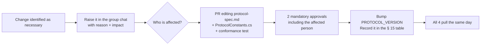

# Working conventions — Ironfront Reborn

Applies to all 4 people. Read before your first commit.

---

## 1. Git

### 1.1. Branches

```
main            ← only merged from develop at each milestone. Always in a working state
develop         ← integration branch. Merged every Wednesday (integration day)
feat/a-input-abstraction
feat/b-reliability-layer
fix/c-delta-baseline-drift
```

Naming rule: `<type>/<person-letter>-<short-description>`.
Types: `feat` `fix` `refactor` `test` `docs` `chore`.

### 1.2. Commit messages

Conventional commits, with the scope being your ownership area:

```
feat(transport): add a 32-bit ack bitfield to the header
fix(replication): fix sequence comparison wrapping after 36 minutes
test(transport): add 12 tests for fragment reassembly
docs(protocol): freeze the position quantization constants
refactor(client): split input out of FpsActorController
```

Valid scopes: `client` `transport` `replication` `master` `protocol` `tools` `ci`.

### 1.3. The survival rule for Unity

> **Only A opens the Unity Editor.** B, C and D use Rider/VS/VSCode and build with `dotnet build`.

Reason: Unity rewrites `.meta`, `.unity` (scene) and `.prefab` files every time the project is
opened, even if nothing changed. Two people opening it → conflicts in thousand-line YAML files that
are effectively unresolvable by hand.

Required in `.gitattributes`:
```
*.unity   merge=unityyamlmerge eol=lf
*.prefab  merge=unityyamlmerge eol=lf
*.asset   merge=unityyamlmerge eol=lf
```

If two people absolutely must touch a scene: **announce it in the group chat first, lock the file,
and release it when you're done**.

### 1.4. Absolutely forbidden

- `git add .` or `git add -A` — always add specific paths
- `git push --force` to `develop` or `main`
- Committing `.env` files, secret strings, or `SHARED_SECRET`
- Committing the `Library/`, `Temp/`, `obj/`, `bin/` or `Logs/` directories

---

## 2. Protocol change process

`protocol-spec.md` is frozen at the end of week 1. After that:



**Never** change a protocol constant directly in your own code and "tell people later". That is the
number-one cause of risk R5.

---

## 3. C# code conventions

### 3.1. Naming

| Kind | Convention | Example |
|---|---|---|
| Class, struct, enum, method | PascalCase | `ReliabilityLayer`, `PackPos` |
| Interface | `I` + PascalCase | `ITransport`, `ISnapshotSink` |
| Private instance field | `_camelCase` | `_pendingAcks` |
| Private static field | PascalCase | `ReferenceHex` |
| Public field / property | PascalCase | `ConnectionId` |
| **Protocol constant** (in `ProtocolConstants.cs`) | SCREAMING_SNAKE | `MAX_PAYLOAD`, `PROTOCOL_VERSION` |
| Any other constant | PascalCase | `GspHeader.Size`, `MspFrame.LengthPrefixSize` |
| Local variable, parameter | camelCase | `serverTick` |

#### Why constants have two conventions

This row used to read "Constant → SCREAMING_SNAKE" for every constant. The code has never
done that, and it was right not to: `GspHeader.Size`, `MspFrame.LengthPrefixSize`,
`PayloadFrame.HeaderSize`, `ClientInputMessage.MaxFrames` and 34 others are PascalCase, which
is the .NET norm for ordinary structural constants.

Splitting the row makes the casing carry information instead of being a formality:

> **SCREAMING_SNAKE means "this value is part of the wire contract".** It lives in
> `ProtocolConstants.cs`, it appears in the `protocol-spec.md` table, and changing it needs a
> PR with 2 approvals and a `PROTOCOL_VERSION` bump (section 2).

That distinction is already enforced, and not by a style rule: `tools/SpecChecker` looks each
spec-listed constant up on the compiled type **by name**, so renaming `PROTOCOL_VERSION` to
`ProtocolVersion` fails the build on the next push.

`.editorconfig` encodes this table. The naming rules there are `suggestion`/`warning` and
`EnforceCodeStyleInBuild` is off by design — with `TreatWarningsAsErrors=true`, a style rule
that produces a warning becomes a hard build error, and a build that fails on a misnamed local
variable is a build people learn to work around.

### 3.2. Rules specific to network code

**No allocation inside hot loops.** Each tick runs 30 times per second; allocating there causes GC
spikes, which show up as regular stuttering in-game.

```csharp
// WRONG — allocates every tick
byte[] buffer = new byte[1200];
socket.Receive(buffer);

// RIGHT — reuse a pool
private readonly BufferPool _pool = new BufferPool(capacity: 256, size: 1200);
var buffer = _pool.Rent();
try   { socket.Receive(buffer); }
finally { _pool.Return(buffer); }
```

**No LINQ in the hot path.** `.Where().Select().ToList()` allocates at least 3 objects. Use a plain
`for` loop.

**Don't use exceptions for normal control flow.** Corrupt packets are routine, not exceptional.
Return `bool TryParse(...)` instead of throwing.

```csharp
// WRONG
public static Packet Parse(byte[] data) {
    if (data.Length < 16) throw new InvalidPacketException();
}

// RIGHT
public static bool TryParse(ReadOnlySpan<byte> data, out Packet packet) {
    packet = default;
    if (data.Length < GSP_HEADER_SIZE) return false;
    // ...
    return true;
}
```

**Use `Span<byte>` / `ReadOnlySpan<byte>`** rather than `byte[]` for buffer reads/writes — it avoids
redundant copies.

### 3.3. Logging

Three levels, toggleable at runtime:

```csharp
NetLog.Error("...");   // always on. A real error that needs handling
NetLog.Warn("...");    // on by default. Abnormal but self-recovering
NetLog.Debug("...");   // off by default. Per-packet detail
```

**No direct `Debug.Log` in the hot path** — even when disabled, formatting the string still costs.
Use a guard:
```csharp
if (NetLog.DebugEnabled) NetLog.Debug($"recv seq={seq} ack={ack}");
```

---

## 3.4. Library policy — what's allowed and what isn't

There are two distinct categories here. Conflating them is the most common misunderstanding about
"raw TCP/UDP".

### Absolutely forbidden — netcode frameworks

Mirror · Photon · Netcode-for-GameObjects · LiteNetLib · ENet · KCP · SignalR · gRPC ·
WebSocket · HTTP/REST.

Using any of them wipes out the entire point of the capstone. This is a hard line with no
exceptions.

### Allowed — primitives from the .NET standard library

`Span<T>` · `ReadOnlySpan<T>` · `Memory<T>` · `stackalloc` · `ArrayPool<T>` ·
`System.Threading.Channels` · `MemoryMarshal` · `System.Security.Cryptography` ·
`BenchmarkDotNet` (dev tooling).

These are **data types and APIs in the BCL**, not frameworks — using them doesn't violate "raw
TCP/UDP", any more than using `List<T>` counts as "using a framework".

### `System.Net.Sockets` — mandatory, and correct

The socket API **is** the OS's interface to TCP/UDP. There is no way to speak TCP or UDP without
going through it:

```
Our application        ← reliability · channels · snapshots · framing · lobby
─────────────────────
Socket API             ← System.Net.Sockets = the front door. Unavoidable
─────────────────────
TCP / UDP · IP         ← handled by the OS (kernel)
Ethernet / WiFi        ← handled by the OS
```

"Not using sockets" would mean writing a network driver and implementing IP + TCP yourself — an
entirely different project, and one that needs root privileges.

### The "write it yourself first, compare afterwards" rule

Two places where the standard library already solves the problem, but **we still write it ourselves
because that's exactly the lesson**:

| We write | Standard library equivalent | Who |
|---|---|---|
| `BufferPool` | `ArrayPool<T>` | B |
| `MspFrameReader` (framing over a byte stream) | `System.IO.Pipelines` | D |

**How to handle it:** write it yourself → benchmark against the standard library → **write a
comparison section in the report**. That's far stronger than simply using the library, and it
answers the challenge question that will definitely come up: *"why not just use the built-in X?"*

### A warning about premature optimization

At the scale of 16 players + 32 bots, the bottleneck is **not the socket layer** — it's Unity
physics + AI on the server (risks R6/C3). The correct order is: **make it correct → measure → only
optimize where the benchmark points.**

## 4. Testing

| Kind | Written by | Run with | Requirement |
|---|---|---|---|
| .NET library unit tests | B, C, D | `dotnet test` (xUnit) | Mandatory for all protocol logic |
| Conformance tests | Written by C, run by all 4 | `dotnet test` | The referee when there's a dispute |
| 2-process integration | All 4 | `tools/run-integration.ps1` script | Run every integration day |
| Unity Play Mode tests | A | Unity Test Runner | Client-only logic |
| Load tests | D | `Ironfront.Tools.LoadTest` | From M3 onward |

**Mandatory gate before merging into `develop`:** every existing test must be green. No merging with
red tests, no "I'll fix it later".

---

## 5. CI (GitHub Actions, or run by hand via script)

`tools/ci.ps1` must do the following in under 5 minutes:

1. `dotnet build` all 4 .NET projects → 0 warnings-as-errors
2. `dotnet test` across the board → 0 failures
3. Verify `ProtocolConstants.cs` matches the table in `protocol-spec.md` (a simple comparison script)
4. Unity batch-mode compile check (only when Unity is available on the CI machine)

---

## 6. Reports — write into your own `reports/`

After **every phase**, the owner writes a file following `reports/_TEMPLATE.md`.
Naming: `YYYY-MM-DD-phase-NN-<slug>.md`.

Reports are not for showcasing achievements. Their purpose is:
1. So others can read where your area currently stands
2. To record technical decisions and their reasons (nobody remembers 3 months later)
3. To record what was tried and **failed** — more valuable than what succeeded

**Honesty is mandatory:** if a test is red, write that it's red, with the output. If you skipped
something, say exactly what you skipped and why. A rose-tinted report hurts the whole team during
integration week.

---

## 7. File ownership boundaries

| Area | Owner | Who else may read | Who else may edit |
|---|---|---|---|
| `Ironfront_Reborn/Assets/**` | A | Everyone | Nobody |
| `Ironfront_Reborn/Assets/Scripts/Net/Server/**` | C | Everyone | A (only with C's consent) |
| `Ironfront_Reborn/Assets/Scripts/Net/Shared/**` | **C** | Everyone | Nobody |
| `Ironfront_Reborn/Assets/Scripts/Net/Shared/MovementSimulation.cs` | **C** | Everyone | **Nobody** — this file is the shared source of truth for client and server |
| `Ironfront.Net.Transport/**` | B | Everyone | Nobody |
| `Ironfront.Net.Replication/**` | C | Everyone | Nobody |
| `Ironfront.Net.Replication/Serialization/**` (`BitWriter`, `BitReader`) | **B** | Everyone | Nobody |
| `Ironfront.Net.Protocol.Tests/Conformance/**` | **C** | Everyone | Nobody — C is the referee, B is the implementer |
| `Ironfront.MasterServer/**` | D | Everyone | Nobody |
| `Ironfront.Net.Protocol/**` | **Shared** | Everyone | PR + 2 approvals |
| `tools/run-integration.ps1` + integration scenarios | **C** | Everyone | PR |
| `plans/00-shared/**` | **Shared** | Everyone | PR + 2 approvals |
| `plans/dev-X-*/**` | Person X | Everyone | Nobody |
| `tools/**` (the rest: CI, build scripts) | D | Everyone | PR |

### Separating the implementer from the verifier

The most important seam in the project: **B writes the serializer, C writes the tests that verify
it.**

| | Who does it | Files |
|---|---|---|
| Implementing bit-packing | **B** | `Ironfront.Net.Replication/Serialization/` |
| Conformance tests with hard-coded hex | **C** | `Ironfront.Net.Protocol.Tests/Conformance/` |

Reason: if the same person writes and tests it, the tests only prove the code is consistent with
itself, not that it matches the spec. Splitting them makes C's conformance tests a **genuine
referee** when there's a dispute about the format. This is also why C may not edit B's files and
vice versa.

> **Two corrections made at the week-1 protocol freeze.**
>
> **`Quantize` moved out of B's `Serialization/` folder into `Ironfront.Net.Protocol`.** This table
> previously listed it under B alongside `BitWriter`/`BitReader`, which contradicted
> [protocol-spec.md § 4.4](protocol-spec.md#44-quantization--mandatory-shared-constants) — the spec
> declares the quantization constants shared and forbids re-hardcoding them anywhere else. Two
> owners for one SSOT is exactly the drift the freeze exists to prevent, so the spec wins:
> `Quantize` is shared (PR + 2 approvals), `BitWriter`/`BitReader` remain B's alone.
>
> **The conformance suite lives in `Ironfront.Net.Protocol.Tests/Conformance/`,** not
> `Ironfront.Net.Replication.Tests/`. It verifies the shared protocol library, which exists and is
> frozen, whereas `Ironfront.Net.Replication` is still a skeleton. Ownership is unchanged — the
> suite is **C's**, and the implementer/verifier split matters far more than the folder it sits in.

**If you need a change in someone else's file:** open an issue or message them, describe what you
need, let them make it. Don't edit it yourself and mention it afterwards. The only exception: fixing
a typo in a comment.

---

## 8. Bus factor — who backs up whom

| Area | Primary | Backup | How the backup stays current |
|---|---|---|---|
| Unity client | A | C | C reviews client PRs weekly |
| Transport | B | C | B and C cross-review every PR |
| **Replication (the highest-risk role)** | C | **A** | **A spends 1 slack week in W7–10 reading C's code.** Rationale below |
| Master server | D | B | B reviews master PRs every 2 weeks |

If someone is away for more than a week, the backup takes over. That's why reports and code comments
have to be good enough for someone else to follow.

### Why C's backup changed from B to A

C is the highest-risk role (47/70 difficulty, 3 dependencies, blocks A). If C is away, the project
stalls.

| | Dev B as backup | **Dev A as backup** |
|---|---|---|
| Has slack? | No — B is fully booked at 13.0 pw | **Yes — 2.5 weeks in W7–10** |
| Knows Unity? | No, and isn't allowed to open the Editor | **Yes, owns the entire Unity project** |
| Understands `Actor.cs`? | No | **Yes, read it closely in phase-00** |
| Understands `MovementSimulation`? | No | **Yes, A calls it every frame** |
| Understands the byte level? | Very well | Well enough |

A wins on 4 of 5 axes. What A concretely does in that week: read `Net/Server/**`, get the server
tick loop running solo, and understand the snapshot flow end to end. No new code.

---

## 9. Definition of Done

A phase is only marked done when **all 5** hold:

1. The code runs, has actually been run, and the output was inspected (not "it probably runs")
2. That part's tests are green — `dotnet test` was actually run and the result was read
3. It doesn't break anyone else's tests — the full suite was run
4. It's merged into `develop` and `develop` is still green
5. The report has been written into `reports/`

Miss any one of them and the phase isn't done, however much code has been written.
