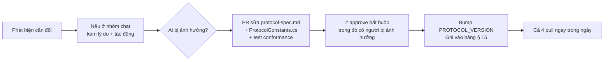

# Quy ước làm việc — Ironfront Reborn

Áp dụng cho cả 4 người. Đọc trước commit đầu tiên.

---

## 1. Git

### 1.1. Nhánh

```
main            ← chỉ merge từ develop ở mỗi milestone. Luôn chạy được
develop         ← nhánh tích hợp. Merge vào mỗi thứ 4 (integration day)
feat/a-input-abstraction
feat/b-reliability-layer
fix/c-delta-baseline-drift
```

Quy tắc đặt tên: `<loại>/<chữ cái người>-<mô tả-ngắn>`.
Loại: `feat` `fix` `refactor` `test` `docs` `chore`.

### 1.2. Commit message

Conventional commits, scope là vùng sở hữu:

```
feat(transport): thêm ack bitfield 32 bit vào header
fix(replication): sửa so sánh sequence bị wrap sau 36 phút
test(transport): thêm 12 test cho reassembly fragment
docs(protocol): chốt hằng số quantization vị trí
refactor(client): tách input khỏi FpsActorController
```

Scope hợp lệ: `client` `transport` `replication` `master` `protocol` `tools` `ci`.

### 1.3. Quy tắc sống còn với Unity

> **Chỉ A được mở Unity Editor.** B, C, D dùng Rider/VS/VSCode, build bằng `dotnet build`.

Lý do: Unity ghi lại file `.meta`, `.unity` (scene), `.prefab` mỗi khi mở project, kể cả khi
không sửa gì. Hai người cùng mở → conflict trên file YAML hàng nghìn dòng, gần như không giải
được bằng tay.

Bắt buộc trong `.gitattributes`:
```
*.unity   merge=unityyamlmerge eol=lf
*.prefab  merge=unityyamlmerge eol=lf
*.asset   merge=unityyamlmerge eol=lf
```

Nếu buộc phải có 2 người đụng scene: **báo trước trong nhóm chat, khóa file, làm xong thì mở**.

### 1.4. Cấm tuyệt đối

- `git add .` hoặc `git add -A` — luôn add từng đường dẫn cụ thể
- `git push --force` lên `develop` hoặc `main`
- Commit file `.env`, chuỗi secret, `SHARED_SECRET`
- Commit thư mục `Library/`, `Temp/`, `obj/`, `bin/`, `Logs/`

---

## 2. Quy trình đổi protocol

`protocol-spec.md` bị đóng băng cuối tuần 1. Sau đó:



**Không bao giờ** sửa hằng số protocol trực tiếp trong code của mình rồi "báo sau". Đây là
nguyên nhân số 1 của rủi ro R5.

---

## 3. Quy ước code C#

### 3.1. Đặt tên

| Loại | Quy ước | Ví dụ |
|---|---|---|
| Class, struct, enum, method | PascalCase | `ReliabilityLayer`, `PackPos` |
| Interface | `I` + PascalCase | `ITransport`, `ISnapshotSink` |
| Field private | `_camelCase` | `_pendingAcks` |
| Field public / property | PascalCase | `ConnectionId` |
| Hằng số | SCREAMING_SNAKE | `MAX_PAYLOAD` |
| Biến local, tham số | camelCase | `serverTick` |

### 3.2. Quy tắc riêng cho code mạng

**Không cấp phát bộ nhớ trong vòng lặp nóng.** Mỗi tick chạy 30 lần/giây; cấp phát ở đó sẽ
gây GC spike, biểu hiện là game giật đều đặn.

```csharp
// SAI — cấp phát mỗi tick
byte[] buffer = new byte[1200];
socket.Receive(buffer);

// ĐÚNG — pool tái sử dụng
private readonly BufferPool _pool = new BufferPool(capacity: 256, size: 1200);
var buffer = _pool.Rent();
try   { socket.Receive(buffer); }
finally { _pool.Return(buffer); }
```

**Không dùng LINQ trong hot path.** `.Where().Select().ToList()` cấp phát ít nhất 3 object.
Dùng vòng `for` thường.

**Không dùng exception cho luồng bình thường.** Packet hỏng là chuyện thường xuyên, không phải
ngoại lệ. Trả `bool TryParse(...)` thay vì `throw`.

```csharp
// SAI
public static Packet Parse(byte[] data) {
    if (data.Length < 16) throw new InvalidPacketException();
}

// ĐÚNG
public static bool TryParse(ReadOnlySpan<byte> data, out Packet packet) {
    packet = default;
    if (data.Length < GSP_HEADER_SIZE) return false;
    // ...
    return true;
}
```

**Dùng `Span<byte>` / `ReadOnlySpan<byte>`** thay vì `byte[]` cho việc đọc/ghi buffer — tránh
copy thừa.

### 3.3. Logging

Ba mức, có thể bật/tắt runtime:

```csharp
NetLog.Error("...");   // luôn bật. Lỗi thật, cần xử lý
NetLog.Warn("...");    // bật mặc định. Bất thường nhưng tự phục hồi được
NetLog.Debug("...");   // tắt mặc định. Chi tiết từng packet
```

**Cấm `Debug.Log` trực tiếp trong hot path** — kể cả khi tắt, việc format chuỗi vẫn tốn.
Dùng guard:
```csharp
if (NetLog.DebugEnabled) NetLog.Debug($"recv seq={seq} ack={ack}");
```

---

## 3.4. Chính sách thư viện — cái gì được dùng, cái gì không

Phân biệt hai loại. Nhầm lẫn giữa chúng là hiểu nhầm phổ biến nhất về "TCP/UDP thuần".

### Cấm tuyệt đối — framework netcode

Mirror · Photon · Netcode-for-GameObjects · LiteNetLib · ENet · KCP · SignalR · gRPC ·
WebSocket · HTTP/REST.

Dùng chúng xóa sổ toàn bộ giá trị đồ án. Đây là ranh giới cứng, không có ngoại lệ.

### Được dùng — primitive trong thư viện chuẩn .NET

`Span<T>` · `ReadOnlySpan<T>` · `Memory<T>` · `stackalloc` · `ArrayPool<T>` ·
`System.Threading.Channels` · `MemoryMarshal` · `System.Security.Cryptography` ·
`BenchmarkDotNet` (công cụ dev).

Chúng là **kiểu dữ liệu và API trong BCL**, không phải framework — dùng chúng không vi phạm
"TCP/UDP thuần", giống như dùng `List<T>` không phải là "dùng framework".

### `System.Net.Sockets` — bắt buộc, và đúng

Socket API **chính là** giao diện của OS tới TCP/UDP. Không có cách nào nói chuyện TCP hay UDP
mà không qua nó:

```
Ứng dụng của nhóm      ← reliability · channel · snapshot · framing · lobby
─────────────────────
Socket API             ← System.Net.Sockets = cửa vào. Không né được
─────────────────────
TCP / UDP · IP         ← OS (kernel) làm
Ethernet / WiFi        ← OS làm
```

"Không dùng socket" nghĩa là tự viết driver mạng và tự cài đặt IP + TCP — một đồ án khác hoàn
toàn, cần quyền root.

### Quy tắc "tự viết trước, so sánh sau"

Hai chỗ có thư viện chuẩn giải sẵn bài toán, nhưng **nhóm vẫn tự viết vì đó chính là bài học**:

| Nhóm tự viết | Thư viện chuẩn giải sẵn | Ai |
|---|---|---|
| `BufferPool` | `ArrayPool<T>` | B |
| `MspFrameReader` (framing trên byte stream) | `System.IO.Pipelines` | D |

**Cách xử lý:** tự viết trước → benchmark đối chiếu với thư viện chuẩn → **viết một mục so sánh
trong báo cáo**. Mạnh hơn hẳn việc chỉ dùng thư viện, và trả lời được câu hỏi phản biện chắc
chắn sẽ có: *"sao không dùng X có sẵn?"*

### Cảnh báo về tối ưu sớm

Ở quy mô 16 người + 32 bot, nút thắt **không nằm ở tầng socket** — nó nằm ở Unity physics + AI
trên server (rủi ro R6/C3). Thứ tự đúng: **làm đúng → đo → chỉ tối ưu chỗ benchmark chỉ ra.**

## 4. Test

| Loại | Ai viết | Chạy bằng | Yêu cầu |
|---|---|---|---|
| Unit test thư viện .NET | B, C, D | `dotnet test` (xUnit) | Bắt buộc cho mọi logic protocol |
| Conformance test | C viết, cả 4 chạy | `dotnet test` | Trọng tài khi tranh cãi |
| Integration 2-process | Cả 4 | Script `tools/run-integration.ps1` | Chạy mỗi integration day |
| Unity Play Mode test | A | Unity Test Runner | Chỉ cho logic client thuần |
| Load test | D | `Ironfront.Tools.LoadTest` | Từ M3 |

**Ngưỡng bắt buộc trước khi merge vào `develop`:** mọi test đang có phải xanh. Không merge với
test đỏ, không "sửa sau".

---

## 5. CI (GitHub Actions hoặc chạy tay bằng script)

`tools/ci.ps1` phải làm được, chạy dưới 5 phút:

1. `dotnet build` cả 4 project .NET → 0 warning-as-error
2. `dotnet test` toàn bộ → 0 fail
3. Kiểm tra `ProtocolConstants.cs` khớp với bảng trong `protocol-spec.md` (script so sánh đơn giản)
4. Unity batch-mode compile check (chỉ khi có Unity trên máy CI)

---

## 6. Report — viết vào `reports/` của mình

Sau **mỗi phase**, người phụ trách viết một file theo `reports/_TEMPLATE.md`.
Đặt tên: `YYYY-MM-DD-phase-NN-<slug>.md`.

Report không phải để báo cáo thành tích. Mục đích là:
1. Người khác đọc được để biết vùng của bạn đang ở đâu
2. Ghi lại quyết định kỹ thuật và lý do (3 tháng sau không ai nhớ)
3. Ghi lại thứ đã thử và **thất bại** — quý hơn thứ thành công

**Bắt buộc trung thực:** nếu test đỏ, ghi là đỏ, kèm output. Nếu bỏ qua một mục, ghi rõ bỏ qua
mục nào và vì sao. Report tô hồng làm hỏng cả nhóm ở tuần tích hợp.

---

## 7. Ranh giới sở hữu file

| Vùng | Chủ | Ai khác được đọc | Ai khác được sửa |
|---|---|---|---|
| `Ironfront_Reborn/Assets/**` | A | Tất cả | Không ai |
| `Ironfront_Reborn/Assets/Scripts/Net/Server/**` | C | Tất cả | A (chỉ khi C đồng ý) |
| `Ironfront_Reborn/Assets/Scripts/Net/Shared/**` | **C** | Tất cả | Không ai |
| `Ironfront_Reborn/Assets/Scripts/Net/Shared/MovementSimulation.cs` | **C** | Tất cả | **Không ai** — file này là sự thật chung của client và server |
| `Ironfront.Net.Transport/**` | B | Tất cả | Không ai |
| `Ironfront.Net.Replication/**` | C | Tất cả | Không ai |
| `Ironfront.Net.Replication/Serialization/**` (`BitWriter`, `BitReader`, `Quantize`) | **B** | Tất cả | Không ai |
| `Ironfront.Net.Replication.Tests/Conformance/**` | **C** | Tất cả | Không ai — C là trọng tài, B là người cài đặt |
| `Ironfront.MasterServer/**` | D | Tất cả | Không ai |
| `Ironfront.Net.Protocol/**` | **Chung** | Tất cả | PR + 2 approve |
| `tools/run-integration.ps1` + kịch bản integration | **C** | Tất cả | PR |
| `plans/00-shared/**` | **Chung** | Tất cả | PR + 2 approve |
| `plans/dev-X-*/**` | Người X | Tất cả | Không ai |
| `tools/**` (còn lại: CI, build script) | D | Tất cả | PR |

### Tách người cài đặt và người kiểm định

Cặp seam quan trọng nhất trong dự án: **B viết serializer, C viết test kiểm định nó.**

| | Ai làm | File |
|---|---|---|
| Cài đặt bit-packing + quantization | **B** | `Ironfront.Net.Replication/Serialization/` |
| Test conformance với hex cứng | **C** | `Ironfront.Net.Replication.Tests/Conformance/` |

Lý do: nếu cùng một người vừa viết vừa test, test chỉ chứng minh code nhất quán với chính nó,
không chứng minh nó khớp spec. Tách ra thì test conformance của C trở thành **trọng tài thật**
khi có tranh cãi về format. Đây cũng là lý do C không được sửa file của B và ngược lại.

**Nếu bạn cần sửa file của người khác:** mở issue/nhắn tin, mô tả cái cần, để họ sửa. Không tự
sửa rồi báo sau. Ngoại lệ duy nhất: sửa lỗi chính tả trong comment.

---

## 8. Bus factor — ai backup ai

| Vùng | Chính | Backup | Cách duy trì backup |
|---|---|---|---|
| Unity client | A | C | C review PR client hàng tuần |
| Transport | B | C | B và C review chéo mọi PR |
| **Replication (vai rủi ro nhất)** | C | **A** | **A dành 1 tuần slack ở W7–10 đọc code của C.** Xem lý do bên dưới |
| Master server | D | B | B review PR master 2 tuần/lần |

Nếu một người vắng >1 tuần, backup tiếp quản. Đây là lý do report và comment code phải đủ để
người khác đọc hiểu.

### Vì sao backup của C đổi từ B sang A

C là vai rủi ro cao nhất (47/70 điểm khó, 3 phụ thuộc, chặn A). Nếu C vắng, dự án đứng.

| | Dev B làm backup | **Dev A làm backup** |
|---|---|---|
| Còn slack không? | Không — B đầy 13.0 pw | **Có — 2.5 tuần ở W7–10** |
| Biết Unity? | Không, và không được mở Editor | **Có, sở hữu toàn bộ Unity project** |
| Hiểu `Actor.cs`? | Không | **Có, đã đọc kỹ ở phase-00** |
| Hiểu `MovementSimulation`? | Không | **Có, A là người gọi nó mỗi frame** |
| Hiểu byte-level? | Rất rõ | Vừa đủ |

A thắng ở 4/5 trục. Việc cụ thể của A trong 1 tuần đó: đọc `Net/Server/**`, chạy được server
tick loop một mình, hiểu luồng snapshot từ đầu tới cuối. Không viết code mới.

---

## 9. Định nghĩa "xong" (Definition of Done)

Một phase chỉ được đánh dấu xong khi **đủ cả 5**:

1. Code chạy được, đã chạy thật và xem output (không phải "chắc là chạy")
2. Test của phần đó xanh, đã chạy `dotnet test` và nhìn kết quả
3. Không phá test của người khác — đã chạy toàn bộ suite
4. Đã merge vào `develop` và `develop` vẫn xanh
5. Report đã viết vào `reports/`

Thiếu bất kỳ mục nào thì phase chưa xong, dù code đã viết hết.
