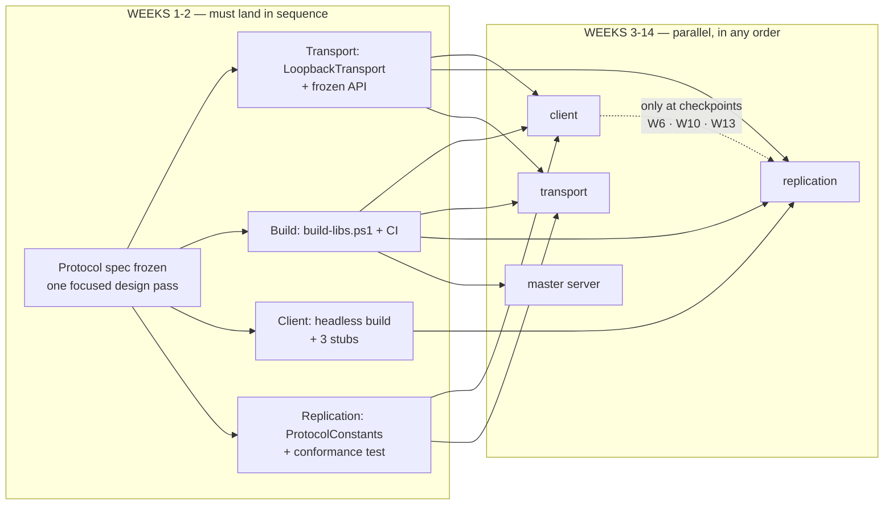

# Dependency map — what blocks what, and how far parallel work can go

This answers one question: **can the four subsystems be built out of order, or does one gate the
next?**

**Answer: weeks 1–2 must land in sequence. Weeks 3–14 are almost fully parallel**, with 3
integration checkpoints.

---

## 1. Dependency graph

---

## 2. Four sync points — all in weeks 1–2

| # | What waits on what | Deadline | Effort to clear it | Status |
|---|---|---|---|---|
| 1 | **Everything waits on the protocol spec** | End of week 1 | One focused design pass | ✅ **Cleared** — [protocol-spec.md](protocol-spec.md) is at v1.0.0 FROZEN, all 8 open questions recorded in [§ 15.1](protocol-spec.md#151-questions-settled-at-the-freeze) |
| 2 | Client, transport, replication wait on **the build script**: `build-libs.ps1` + CI | End of week 2 | ~1 day | ✅ **Cleared** — both scripts plus `.github/workflows/ci.yml`, green on Ubuntu in 57 s |
| 3 | Client, replication wait on **transport**: `LoopbackTransport` + frozen API | End of week 2 | ~1.5 days | ✅ **Cleared** — `ITransport` / `ITransportServer` are frozen and shipped with `LoopbackTransport`, `BufferPool` and `NetworkSimulator`. Written ahead of transport's phase-00, so client and replication were never blocked; the real UDP work is unchanged and in progress |
| 4 | Replication waits on **the client**: a working headless build | End of week 2 | ~1 day | ⏳ Open. **The only remaining item that needs the Unity Editor**, so it cannot be pulled forward from any other subsystem |

After week 2, every subsystem has enough stubs/loopback to build independently through the end of the project.

> **Two of the four sync points cleared ahead of schedule** (week 1, PR #2 and #3), and both were on
> the critical path: the protocol freeze that everything downstream waits on, and the CI that
> client, transport and replication wait on. `Ironfront.Net.Protocol` shipped with them, so
> transport and replication are already coding against real constants, a real 16-byte header codec
> and a real MSP framer rather than against stubs.
>
> Sync 4 is now the one that matters. It is the single remaining M0 item gated on the Unity Editor,
> and [§ 6](#6-if-a-subsystem-is-late--who-is-affected) below is the fallback if it slips.

---

## 3. After the restructure: what depends on what

| Subsystem | Blocked by (after week 2) | Blocks | Must open Unity |
|---|---|---|---|
| **Client** — Unity Client | **Nothing** (3 stubs) | Replication (headless build, week 2) | Yes |
| **Transport** | **Nothing** | Client, replication (transport, week 2) | No |
| **Replication** (this plan) | Client (headless build, week 2) Transport (transport, week 2) | Client (snapshot reader, week 2) | Yes |
| **Master server** | **Nothing** | Client, transport, replication (CI + build script, week 2) | No |

**Important correction:** the client is **not blocked by the backend**. The opposite is true — the
Unity project is the **integration bottleneck**, because it is the sole entry point players use.
That's why the client's phase-00 states explicitly: *"Prioritize opening up APIs for
transport/replication over finishing client-only features."*

---

## 4. Blockers removed by the restructure

| Old blocker | Week | How it was handled |
|---|---|---|
| Replication waiting on the client to extract `MovementSimulation` out of `Actor.cs` | **Week 7** | **Scoped entirely into replication.** This was the worst blocker in the old plan — mid-project, and on exactly the hardest piece |
| Transport carrying 1.5 weeks of unpredictable "integration support" | 6–13 | Ownership of the integration harness moved into replication's scope |
| Replication waiting on transport to test the serializer | 3–4 | Gone — transport writes the serializer, replication writes the conformance test. The two directions are independent |

---

## 5. Building in parallel — the conditions

Yes, under three conditions:

1. **Freeze interfaces early** — each subsystem is coded against the others' *interfaces*, not
   their *implementations*. Already covered in each subsystem's plan.
2. **CI is the referee** — push and you immediately know whether a change broke another
   subsystem's build, without having to check by hand.
3. **Three checkpoints where all four subsystems must integrate**:

| Checkpoint | Week | Duration | Content |
|---|---|---|---|
| Protocol pass | 1 | One focused session | Freeze `protocol-spec.md` |
| **M1** | 6 | Half a day | Real integration: 2 clients see each other |
| **M2** | 10 | Half a day | Integration: shooting, lag compensation |
| **M3** | 13 | Half a day | Integration: full match, 16 players |

Outside those 4 sessions, build in whatever order makes sense.

---

## 6. If a subsystem is late — who is affected

| What is late | Who is affected | Fallback |
|---|---|---|
| **Client** — late on the headless build | Replication can't test the tick loop | Use Unity Editor Play Mode instead of the headless build. Slower, but it works |
| **Transport** — late on transport | Client and replication can't integrate | Both continue with stubs/loopback. Only milestone M1 slips, not individual progress |
| **Replication** — late on snapshots | Client has no real data | Client uses `FakeSnapshotReader`, generating data from the spec |
| **Master server** — late on the master server | Client can't build the lobby UI | Client uses `FakeMasterClient`; the game server runs standalone and the client enters the IP manually |
| **Master server** — late on CI/build script | **Everything else is blocked** | This is why it has a week-2 deadline and is the master server's highest priority |
