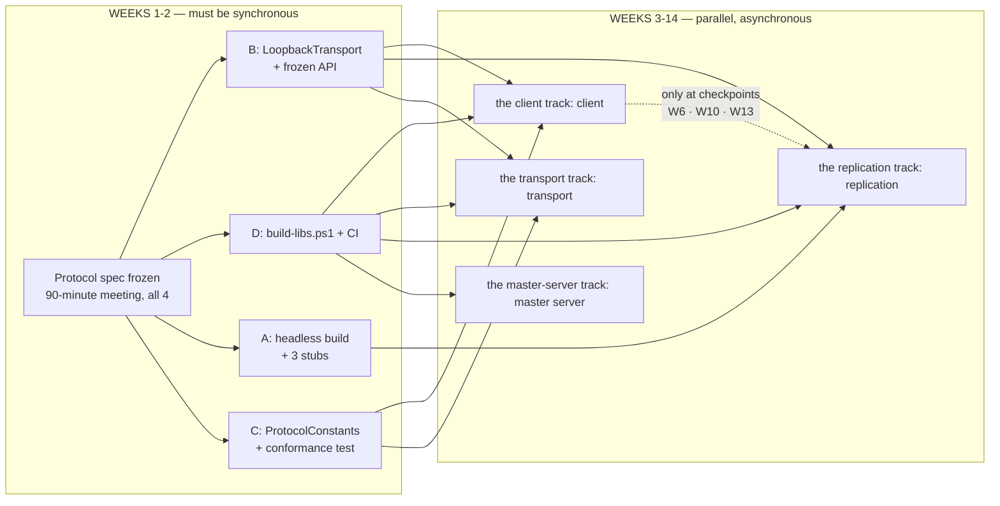

# Dependency map — who blocks whom, and how far parallel work can go

This answers one question: **can the 4 people work in parallel, asynchronously?**

**Answer: weeks 1–2 must be synchronous. Weeks 3–14 are almost fully parallel**, with 3
integration checkpoints.

---

## 1. Dependency graph

---

## 2. Four sync points — all in weeks 1–2

| # | Who waits on whom | Deadline | Effort for the person being waited on | Status |
|---|---|---|---|---|
| 1 | **All 4 wait on the protocol spec** | End of week 1 | 90-minute meeting | ✅ **Cleared** — [protocol-spec.md](protocol-spec.md) is at v1.0.0 FROZEN, all 8 open questions recorded in [§ 15.1](protocol-spec.md#151-questions-settled-at-the-freeze) |
| 2 | A, B, C wait on **D**: `build-libs.ps1` + CI | End of week 2 | ~1 day | ✅ **Cleared** — both scripts plus `.github/workflows/ci.yml`, green on Ubuntu in 57 s |
| 3 | A, C wait on **B**: `LoopbackTransport` + frozen API | End of week 2 | ~1.5 days | ✅ **Cleared** — `ITransport` / `ITransportServer` are frozen and shipped with `LoopbackTransport`, `BufferPool` and `NetworkSimulator`. Written ahead of B's phase-00 so A and C were never blocked; B's real UDP work is unchanged and in progress |
| 4 | C waits on **A**: a working headless build | End of week 2 | ~1 day | ⏳ Open. **The only remaining item that needs the Unity Editor**, so it cannot be pulled forward by anyone else |

After week 2, everyone has enough stubs/loopback to run independently through the end of the project.

> **Two of the four sync points cleared ahead of schedule** (week 1, PR #2 and #3), and both were on
> the critical path: the protocol freeze that all four people wait on, and D's CI that A, B and C
> wait on. `Ironfront.Net.Protocol` shipped with them, so B and C are already coding against real
> constants, a real 16-byte header codec and a real MSP framer rather than against stubs.
>
> Sync 4 is now the one that matters. It is the single remaining M0 item gated on the Unity Editor,
> and [§ 6](#6-if-someone-is-late--who-is-affected) below is the fallback if it slips.

---

## 3. After the restructure: who depends on whom

| Role | Blocked by (after week 2) | Blocks | Must open Unity |
|---|---|---|---|
| **The client track** — Unity Client | **Nobody** (3 stubs) | the replication track (headless build, week 2) | Yes |
| **The transport track** — Transport | **Nobody** | A, C (transport, week 2) | No |
| **The replication track** — Replication (you) | A (headless build, week 2) B (transport, week 2) | the client track (snapshot reader, week 2) | Yes |
| **The master-server track** — Master server | **Nobody** | All 3 (CI + build script, week 2) | No |

**Important correction:** the client track is **not blocked by the backend**. The opposite is true — A is the
**integration bottleneck**, because A is the sole owner of the Unity project. That's why A's
phase-00 states explicitly: *"Prioritize opening up APIs for B/C over finishing your own features."*

---

## 4. Blockers removed by the restructure

| Old blocker | Week | How it was handled |
|---|---|---|
| C waiting on A to extract `MovementSimulation` out of `Actor.cs` | **Week 7** | **Moved entirely to C.** This was the worst blocker in the old plan — mid-project, and on exactly the hardest piece |
| B carrying 1.5 weeks of unpredictable "integration support" | 6–13 | Ownership of the integration harness moved to C |
| C waiting on B to test the serializer | 3–4 | Gone — B writes the serializer, C writes the conformance test. The two directions are independent |

---

## 5. Working asynchronously in time — the conditions

Yes, under three conditions:

1. **Freeze interfaces early** — everyone codes against other people's *interfaces*, not their
   *implementations*. Already covered in each person's plan.
2. **CI is the referee** — push and you immediately know whether you broke someone else's build,
   without having to ask.
3. **Three checkpoints where all 4 must be present**:

| Checkpoint | Week | Duration | Content |
|---|---|---|---|
| Protocol meeting | 1 | 90 minutes | Freeze `protocol-spec.md` |
| **M1** | 6 | Half a day | Real integration: 2 clients see each other |
| **M2** | 10 | Half a day | Integration: shooting, lag compensation |
| **M3** | 13 | Half a day | Integration: full match, 16 players |

Outside those 4 sessions, work whenever you like.

---

## 6. If someone is late — who is affected

| Who is late | Who is affected | Fallback |
|---|---|---|
| **The client track** late on the headless build | C can't test the tick loop | C uses Unity Editor Play Mode instead of the headless build. Slower, but it works |
| **The transport track** late on transport | A and C can't integrate | Both continue with stubs/loopback. Only milestone M1 slips, not individual progress |
| **The replication track** late on snapshots | A has no real data | A uses `FakeSnapshotReader`, generating data from the spec |
| **The master-server track** late on the master server | A can't build the lobby UI | A uses `FakeMasterClient`; the game server runs standalone and the client enters the IP manually |
| **The master-server track** late on CI/build script | **All 3 others are blocked** | This is why it has a week-2 deadline and is D's highest priority |
