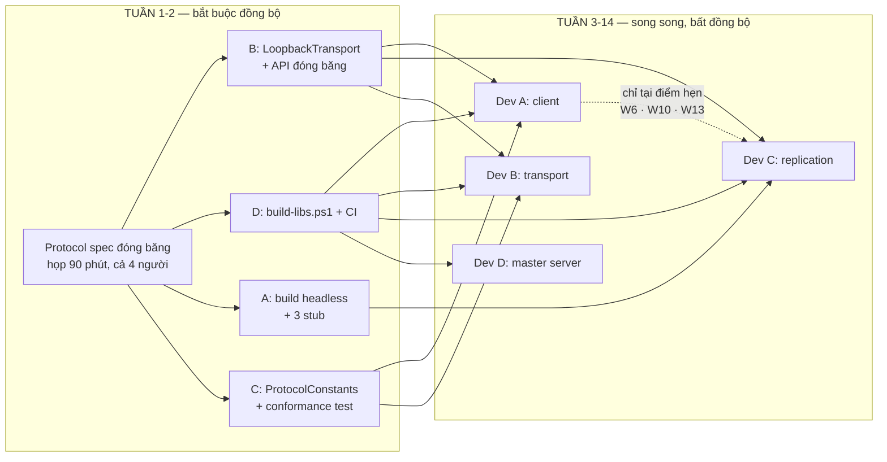

# Bản đồ phụ thuộc — ai chặn ai, làm song song tới đâu

Trả lời một câu hỏi: **4 người có làm song song, bất đồng bộ được không?**

**Đáp án: Tuần 1–2 bắt buộc đồng bộ. Tuần 3–14 song song gần như hoàn toàn**, với 3 điểm hẹn
tích hợp.

---

## 1. Đồ thị phụ thuộc

---

## 2. Bốn điểm đồng bộ — tất cả nằm ở tuần 1–2

| # | Ai chờ ai | Deadline | Công sức của người bị chờ | Nếu trễ |
|---|---|---|---|---|
| 1 | **Cả 4 chờ protocol spec** | Hết tuần 1 | Họp 90 phút | Đồng bộ **có chủ đích**. Không né được, và không nên né |
| 2 | A, B, C chờ **D**: `build-libs.ps1` + CI | Hết tuần 2 | ~1 ngày | D phải ưu tiên trên mọi thứ khác |
| 3 | A, C chờ **B**: `LoopbackTransport` + API đóng băng | Hết tuần 2 | ~1.5 ngày | API đóng băng chỉ nửa ngày; loopback in-memory ~1 ngày |
| 4 | C chờ **A**: build headless chạy được | Hết tuần 2 | ~1 ngày | C không test được server tick loop nếu thiếu |

Sau tuần 2, mỗi người có đủ stub/loopback để chạy độc lập tới cuối dự án.

---

## 3. Sau tái cấu trúc: ai phụ thuộc ai

| Vai | Bị chặn bởi (sau tuần 2) | Chặn lại ai | Phải mở Unity |
|---|---|---|---|
| **Dev A** — Unity Client | **Không ai** (3 stub) | Dev C (headless build, tuần 2) | Có |
| **Dev B** — Transport | **Không ai** | A, C (transport, tuần 2) | Không |
| **Dev C** — Replication (bạn) | A (headless build, tuần 2) B (transport, tuần 2) | Dev A (snapshot reader, tuần 2) | Có |
| **Dev D** — Master server | **Không ai** | Cả 3 (CI + build script, tuần 2) | Không |

**Điểm quan trọng cần đính chính:** Dev A **không bị backend chặn**. Ngược lại, A là **nút thắt
tích hợp** vì A sở hữu duy nhất Unity project. Đó là lý do phase-00 của A ghi rõ: *"Ưu tiên mở
API cho B/C sớm hơn là hoàn thiện tính năng của mình."*

---

## 4. Blocker đã bị xóa bởi tái cấu trúc

| Blocker cũ | Tuần | Đã xử lý thế nào |
|---|---|---|
| C chờ A trích `MovementSimulation` khỏi `Actor.cs` | **Tuần 7** | **Chuyển hẳn cho C.** Đây là blocker tệ nhất trong kế hoạch cũ — nằm giữa dự án, ở đúng mảnh khó nhất |
| B gánh "hỗ trợ tích hợp" 1.5 tuần không dự đoán được | 6–13 | Chuyển quyền sở hữu integration harness cho C |
| C phải chờ B để test serializer | 3–4 | Không còn — B viết serializer, C viết test conformance. Hai chiều độc lập |

---

## 5. Làm bất đồng bộ về thời gian — điều kiện

Được, với ba điều kiện:

1. **Giao diện đóng băng sớm** — mỗi người code theo *interface* của người khác, không theo
   *implementation*. Đã có trong kế hoạch mỗi người.
2. **CI là trọng tài** — push lên là biết ngay có phá của ai không, không cần hỏi nhau.
3. **Ba điểm hẹn bắt buộc có mặt đủ 4 người**:

| Điểm hẹn | Tuần | Thời lượng | Nội dung |
|---|---|---|---|
| Họp protocol | 1 | 90 phút | Đóng băng `protocol-spec.md` |
| **M1** | 6 | Nửa ngày | Tích hợp thật: 2 client thấy nhau |
| **M2** | 10 | Nửa ngày | Tích hợp: bắn nhau, lag compensation |
| **M3** | 13 | Nửa ngày | Tích hợp: trận đấu đủ, 16 người |

Ngoài 4 buổi đó, làm lúc nào cũng được.

---

## 6. Nếu một người trễ — ai bị ảnh hưởng

| Người trễ | Ai bị ảnh hưởng | Đường lui |
|---|---|---|
| **Dev A** trễ headless build | C không test được tick loop | C dùng Unity Editor Play Mode thay vì build headless. Chậm hơn nhưng chạy được |
| **Dev B** trễ transport | A và C không tích hợp được | Cả hai tiếp tục với stub/loopback. Chỉ trễ mốc M1, không trễ tiến độ cá nhân |
| **Dev C** trễ snapshot | A không có dữ liệu thật | A dùng `FakeSnapshotReader` tự sinh dữ liệu theo spec |
| **Dev D** trễ master server | A không làm được UI lobby | A dùng `FakeMasterClient`; game server chạy chế độ standalone, client nhập IP thủ công |
| **Dev D** trễ CI/build script | **Cả 3 người bị chặn** | Đây là lý do nó có deadline tuần 2 và ưu tiên cao nhất của D |
