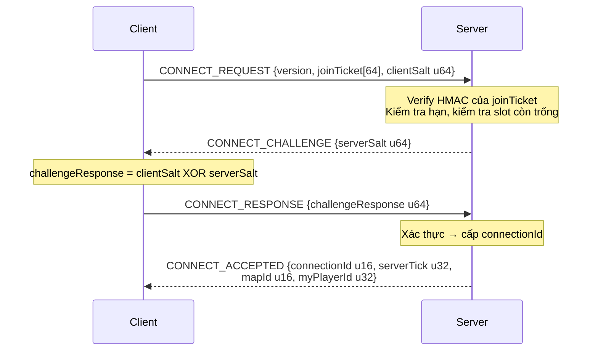
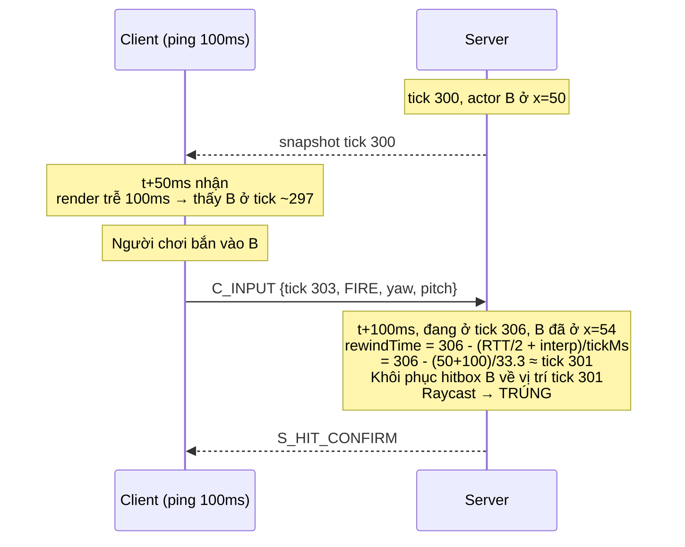
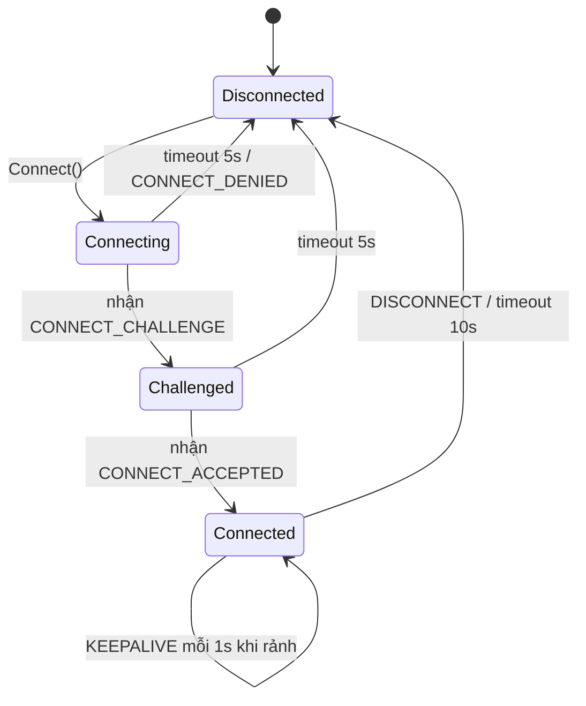

# Protocol Specification — Ironfront Reborn

**Version: 1.0.0-draft** · Trạng thái: **PHẢI ĐÓNG BĂNG CUỐI TUẦN 1**

> Đây là contract chung của cả 4 người. Mọi offset, mọi enum value, mọi hằng số quantization ghi
> trong tài liệu này là **bắt buộc**. Không ai được tự diễn giải khác. Xem
> [conventions.md](conventions.md) về quy trình đổi protocol.
>
> **Nguồn duy nhất của hằng số trong code:** `Ironfront.Net.Protocol/ProtocolConstants.cs`.
> Cấm hardcode lại bất kỳ số nào trong tài liệu này ở nơi khác.

---

## 0. Quy ước chung

- **Byte order: Little-endian** cho toàn bộ GSP (UDP) và MSP (TCP). Lý do: x86/ARM đều
  little-endian, tránh một lần swap thừa. `BitConverter` mặc định trên .NET đã là little-endian,
  nhưng **phải viết code không phụ thuộc `BitConverter.IsLittleEndian`** (dùng shift thủ công).
- Kiểu dữ liệu: `u8 u16 u32 u64 i8 i16 i32 f32` — số bit như tên gọi.
- `[n]` = mảng n phần tử. `{...}` = struct lồng.
- Mọi trường "reserved" phải ghi 0 khi gửi và bỏ qua khi nhận (để dành cho version sau).

---

# PHẦN A — GSP: Game Server Protocol (UDP)

## 1. Hằng số toàn cục

```csharp
// Ironfront.Net.Protocol/ProtocolConstants.cs
public static class ProtocolConstants
{
    public const ushort PROTOCOL_ID       = 0x4946;  // 'IF' — lọc gói rác
    public const byte   PROTOCOL_VERSION  = 1;

    public const int    MTU_SAFE          = 1200;    // an toàn qua mọi router
    public const int    GSP_HEADER_SIZE   = 16;
    public const int    MAX_PAYLOAD       = MTU_SAFE - GSP_HEADER_SIZE;  // 1184

    public const int    SIM_TICK_RATE     = 30;      // Hz
    public const int    SNAPSHOT_RATE     = 20;      // Hz
    public const int    INPUT_SEND_RATE   = 30;      // Hz
    public const int    INPUT_REDUNDANCY  = 3;       // số frame gửi lặp mỗi gói

    public const int    KEEPALIVE_MS      = 1000;
    public const int    TIMEOUT_MS        = 10000;
    public const int    ACK_BITFIELD_BITS = 32;

    public const int    MAX_FRAGMENTS     = 64;      // → payload logic tối đa ~75 KB
    public const int    FRAGMENT_TIMEOUT_MS = 2000;

    public const int    INTERP_BUFFER_MS  = 100;
    public const int    MAX_REWIND_MS     = 200;
    public const int    HITBOX_HISTORY_MS = 1000;

    public const int    MAX_PLAYERS       = 16;
    public const int    MAX_BOTS          = 32;
    public const int    MAX_ACTORS        = 64;      // = MAX_PLAYERS + MAX_BOTS + dự phòng
}
```

---

## 2. Header GSP (16 byte, mọi datagram)

```
Offset  Size  Type   Field           Mô tả
------  ----  -----  --------------  --------------------------------------------------
  0      2    u16    protocolId      Luôn = 0x4946. Sai → drop im lặng, không trả lời
  2      1    u8     packetType      Xem § 3
  3      1    u8     flags           Bitfield, xem § 2.1
  4      2    u16    sequence        Số thứ tự gói của người GỬI, tăng dần, wrap 65535→0
  6      2    u16    ack             Sequence lớn nhất người gửi đã NHẬN từ đối phương
  8      4    u32    ackBitfield     32 gói trước `ack`. bit i = 1 ⇔ đã nhận (ack - 1 - i)
 12      2    u16    connectionId    Server cấp khi CONNECT_ACCEPTED. 0 khi chưa kết nối
 14      2    u16    payloadLength   Số byte payload sau header. ≤ 1184
------  ----
 16           payload[payloadLength]
```

### 2.1. `flags` bitfield

| Bit | Tên | Ý nghĩa |
|---|---|---|
| 0 | `RELIABLE` | Gói này cần được ack, retransmit nếu mất |
| 1 | `FRAGMENTED` | Payload là một mảnh, xem § 6 |
| 2 | `ORDERED` | Phải giao theo đúng thứ tự trong channel |
| 3 | `COMPRESSED` | Payload đã nén (không dùng ở v1, để dành) |
| 4–7 | reserved | Phải = 0 |

### 2.2. Cơ chế ack — ví dụ cụ thể

Giả sử A đã nhận từ B các sequence: 98, 99, 101, 103 (mất 100 và 102).
Khi A gửi gói tiếp theo, A ghi:

```
ack         = 103
ackBitfield = bit0 → seq 102 = 0 (mất)
              bit1 → seq 101 = 1
              bit2 → seq 100 = 0 (mất)
              bit3 → seq  99 = 1
              bit4 → seq  98 = 1
              → 0b...00011010 = 0x1A
```

B nhận được, biết ngay 100 và 102 chưa tới. Vì mỗi gói mang 33 thông tin ack (1 + 32), một ack
chỉ mất khi 33 gói liên tiếp cùng mất — thực tế coi như không xảy ra. **Đây là lý do không cần
gói ACK riêng.**

### 2.3. So sánh sequence có wrap-around

`sequence` là u16, wrap sau 65535. Ở 30 gói/giây, wrap mỗi ~36 phút. Không được so sánh bằng
`>` thông thường.

```csharp
// Ironfront.Net.Protocol/SequenceMath.cs — SSOT, cả 4 người dùng chung
public static bool IsNewer(ushort a, ushort b)
{
    const ushort HALF = 32768;
    return (a > b && a - b <= HALF) || (b > a && b - a > HALF);
}

public static int Distance(ushort a, ushort b) => (short)(a - b);
```

> **Cạm bẫy đã biết:** viết `if (seq > lastSeq)` sẽ chạy đúng 36 phút rồi vỡ. Đây là loại bug
> chỉ hiện ra khi test dài. Bắt buộc có unit test cho `IsNewer` với các cặp quanh biên
> (65535, 0), (65530, 5), (0, 65535).

---

## 3. `packetType`

| Value | Tên | Hướng | Reliable | Mô tả |
|---|---|---|---|---|
| `0x01` | `CONNECT_REQUEST` | C→S | Có (retry) | Xin kết nối, mang joinTicket |
| `0x02` | `CONNECT_CHALLENGE` | S→C | Có (retry) | Server gửi nonce |
| `0x03` | `CONNECT_RESPONSE` | C→S | Có (retry) | Client trả lời challenge |
| `0x04` | `CONNECT_ACCEPTED` | S→C | Có (retry) | Cấp connectionId |
| `0x05` | `CONNECT_DENIED` | S→C | Không | Kèm mã lý do |
| `0x06` | `DISCONNECT` | Cả hai | Không (gửi 3 lần) | Ngắt chủ động |
| `0x07` | `KEEPALIVE` | Cả hai | Không | Giữ kết nối, đo RTT |
| `0x10` | `PAYLOAD` | Cả hai | Tùy flags | Chứa message, xem § 4 |
| `0x11` | `FRAGMENT` | Cả hai | Có | Một mảnh của payload lớn |

### 3.1. Handshake



**Vì sao có challenge:** chống IP spoofing amplification. Kẻ tấn công giả IP nạn nhân gửi
CONNECT_REQUEST sẽ không nhận được `serverSalt` nên không hoàn tất được handshake, server không
cấp phát tài nguyên.

Retry: CONNECT_REQUEST gửi lại mỗi 250ms, tối đa 20 lần (5 giây) rồi báo lỗi.

### 3.2. `CONNECT_DENIED` — mã lý do (u8)

| Code | Ý nghĩa |
|---|---|
| 1 | Server đầy |
| 2 | Sai protocol version |
| 3 | joinTicket không hợp lệ hoặc hết hạn |
| 4 | Bị cấm (ban) |
| 5 | Đang tắt server |
| 6 | Đã kết nối rồi (trùng playerId) |

---

## 4. Payload: khung message

Một `PAYLOAD` datagram chứa **1 hoặc nhiều** message, gộp lại (batching) để giảm overhead header.

```
u8   channelId          Xem § 5
u16  messageCount
lặp messageCount lần:
    u8   msgType        Xem § 4.1
    u16  msgLength      Số byte của body
    u8[] body
```

### 4.1. `msgType`

**Client → Server (0x20–0x3F)**

| Value | Tên | Channel | Mô tả |
|---|---|---|---|
| `0x20` | `C_INPUT` | 3 (unreliable-seq) | Input frame, xem § 4.2 |
| `0x22` | `C_LOADOUT_SELECT` | 2 (reliable-ord) | Chọn vũ khí trước khi spawn |
| `0x23` | `C_SPAWN_REQUEST` | 2 | Xin hồi sinh tại spawn point |
| `0x24` | `C_CHAT` | 2 | Chat trong trận |
| `0x25` | `C_PING` | 0 (unreliable) | Đo RTT, kèm timestamp client |
| `0x26` | `C_SEAT_REQUEST` | 2 | Vào/ra ghế xe (stretch goal) |
| `0x27` | `C_ACK_BASELINE` | 2 | Xác nhận đã nhận snapshot tick N (cho delta) |

**Server → Client (0x40–0x5F)**

| Value | Tên | Channel | Mô tả |
|---|---|---|---|
| `0x40` | `S_SNAPSHOT` | 1 (unreliable-seq) | Trạng thái thế giới, xem § 4.3 |
| `0x41` | `S_SPAWN_ACTOR` | 2 | Actor mới xuất hiện |
| `0x42` | `S_DESPAWN_ACTOR` | 2 | Actor biến mất |
| `0x43` | `S_HIT_CONFIRM` | 2 | Xác nhận bắn trúng (cho hitmarker) |
| `0x44` | `S_DEATH` | 2 | Ai đó chết, kèm lực để bật ragdoll cục bộ |
| `0x45` | `S_MATCH_STATE` | 2 | Điểm, thời gian, trạng thái trận |
| `0x46` | `S_CAPTURE_POINT` | 2 | Thay đổi trạng thái điểm chiếm |
| `0x47` | `S_CHAT` | 2 | Chat broadcast |
| `0x48` | `S_PONG` | 0 | Trả lời ping, echo timestamp client |
| `0x49` | `S_WEAPON_FIRE` | 1 | Actor khác vừa bắn (cho hiệu ứng, âm thanh) |
| `0x4A` | `S_EXPLOSION` | 2 | Nổ tại vị trí, cho hiệu ứng + rung màn hình |
| `0x4B` | `S_PLAYER_LIST` | 2 | Danh sách người chơi + điểm (cho scoreboard) |

### 4.2. `C_INPUT` (0x20) — chi tiết byte

```
u32  startTick            Tick của frame ĐẦU TIÊN trong gói
u8   frameCount           1..8, thường = 3 (INPUT_REDUNDANCY)
lặp frameCount lần:
    i8   moveX            -127..127  →  -1.0 .. 1.0  (chia 127)
    i8   moveZ            như trên
    u16  yaw              0..65535   →  0 .. 360°    (× 360/65536)
    i16  pitch            -16384..16384 → -90 .. 90° (× 90/16384)
    u16  buttons          Bitfield, xem dưới
```

Kích thước: `4 + 1 + 3 × 8 = 29 byte` với frameCount = 3.
Ở 30 Hz: `29 × 30 = 870 B/s` upstream. Không đáng kể.

**`buttons` bitfield (u16)**

| Bit | Nút | Bit | Nút |
|---|---|---|---|
| 0 | Fire | 8 | LeanLeft |
| 1 | Aim (ADS) | 9 | LeanRight |
| 2 | Reload | 10 | Use / Interact |
| 3 | Jump | 11 | SwitchWeapon0 |
| 4 | Crouch | 12 | SwitchWeapon1 |
| 5 | Sprint | 13 | SwitchWeapon2 |
| 6 | Prone | 14 | SwitchWeapon3 |
| 7 | ThrowGrenade | 15 | reserved |

**Vì sao gửi lặp 3 frame:** input là dữ liệu quan trọng nhưng gửi unreliable. Nếu mất 1 gói mà
không có redundancy, server thiếu hẳn 1 tick input → nhân vật khựng. Với redundancy 3, phải mất
3 gói liên tiếp mới hụt. Chi phí chỉ 16 byte thừa mỗi gói. Đây rẻ hơn nhiều so với gửi reliable
(vì reliable sẽ retransmit input đã lỗi thời).

**Xử lý phía server:** giữ `lastProcessedInputTick` cho mỗi connection. Bỏ qua mọi frame có
`tick <= lastProcessedInputTick` (đã xử lý rồi, đây là bản lặp).

### 4.3. `S_SNAPSHOT` (0x40) — chi tiết byte

```
u32  serverTick                Tick server tạo snapshot này
u32  lastProcessedInputTick    Input tick cuối server đã áp cho CHÍNH client này (reconciliation)
u32  baselineTick              0 = full snapshot; khác 0 = delta so với snapshot tick này
u8   actorCount
lặp actorCount lần:
    u16  actorId
    u8   changeMask            Bitfield, xem dưới
    [bit0] position    i16 × 3   Quantize, xem § 4.4
    [bit1] rotation    u16 yaw + i8 pitch
    [bit2] velocity    i8 × 3    Quantize -64..64 m/s
    [bit3] stateFlags  u8        Xem dưới
    [bit4] health      u8        0..100
    [bit5] weapon      u8 weaponId + u8 ammoInClip
    [bit6] team        u8        Chỉ gửi khi đổi (hiếm)
    [bit7] seatInfo    u16 vehicleId + u8 seatIndex  (stretch goal)
```

**`changeMask`**: bit i = 1 ⇔ trường i có trong gói này. Trong full snapshot, mọi bit cần thiết
= 1. Trong delta snapshot, chỉ bit của trường thực sự đổi so với `baselineTick`.

**`stateFlags` (u8)**

| Bit | Ý nghĩa |
|---|---|
| 0 | IsAlive |
| 1 | IsCrouching |
| 2 | IsProne |
| 3 | IsSprinting |
| 4 | IsAiming |
| 5 | IsInWater |
| 6 | IsRagdoll (đã chết, client tự bật ragdoll) |
| 7 | IsSeated |

**Ước lượng kích thước**

| Trường hợp | Bytes/actor |
|---|---|
| Full (mọi trường) | 2 + 1 + 6 + 3 + 3 + 1 + 1 + 2 + 1 = **20** |
| Delta điển hình (chỉ pos + rot) | 2 + 1 + 6 + 3 = **12** |
| Delta actor đứng yên | 2 + 1 = **3** |

Với 48 actor, trung bình ~12 B: `48 × 12 = 576 B/snapshot`.
Cộng header GSP + framing: ~600 B × 20 Hz = **~12 KB/s** downstream.
Sau interest management (chỉ ~20 actor thực gửi): **~5–7 KB/s**. Đạt mục tiêu.

### 4.4. Quantization — hằng số bắt buộc dùng chung

> **Đây là nơi dễ sai nhất và hậu quả tệ nhất.** Nếu client dùng `POS_RANGE = 2048` mà server
> dùng `4096`, nhân vật sẽ ở sai vị trí gấp đôi. Bug này rất khó nhìn ra vì không có lỗi runtime.

```csharp
public static class Quantize
{
    // ===== VỊ TRÍ =====
    // Map hiện tại nằm gọn trong hộp ±2048m. i16 có 65536 mức.
    public const float POS_MIN  = -2048f;
    public const float POS_MAX  =  2048f;
    public const float POS_RANGE = POS_MAX - POS_MIN;        // 4096
    // Độ phân giải = 4096 / 65536 = 0.0625 m = 6.25 cm. Đủ tốt cho FPS.

    public static short PackPos(float v)
    {
        float t = Mathf.Clamp((v - POS_MIN) / POS_RANGE, 0f, 1f);
        return (short)(t * 65535f - 32768f);
    }
    public static float UnpackPos(short q)
        => ((q + 32768f) / 65535f) * POS_RANGE + POS_MIN;

    // ===== GÓC =====
    public const float YAW_SCALE   = 65536f / 360f;    // u16
    public const float PITCH_SCALE = 16384f / 90f;     // i16, dùng ±16384
    // Độ phân giải yaw = 360/65536 = 0.0055° — thừa chính xác cho ngắm bắn
    // Độ phân giải pitch = 90/16384 = 0.0055°

    // ===== VẬN TỐC =====
    public const float VEL_MAX = 64f;                  // m/s, đủ cho mọi thứ trừ máy bay
    public const float VEL_SCALE = 127f / VEL_MAX;     // i8
    // Độ phân giải = 64/127 = 0.5 m/s — chỉ dùng cho extrapolation, đủ

    // ===== MÁU =====
    // health u8 trực tiếp 0..100, không cần scale
}
```

**Kiểm chứng bắt buộc (test conformance):**
```
PackPos(0f)      → 0        UnpackPos(0)      ≈ 0f      (sai số < 0.07m)
PackPos(100f)    → 1600     UnpackPos(1600)   ≈ 100f
PackPos(-2048f)  → -32768   UnpackPos(-32768) = -2048f
PackPos(2048f)   → 32767    UnpackPos(32767)  ≈ 2048f
```

### 4.5. `S_HIT_CONFIRM` (0x43)

```
u16  targetActorId
u16  damage            × 10 (fixed point, 1 thập phân)
u8   hitboxType        0=body 1=head 2=limb
u8   flags             bit0 = killed, bit1 = headshot
```

### 4.6. `S_DEATH` (0x44)

```
u16  victimActorId
u16  killerActorId     0xFFFF nếu chết do môi trường
u8   causeOfDeath      0=bullet 1=explosion 2=fall 3=drown 4=vehicle
i16  forceX, forceY, forceZ    Quantize vận tốc, để client bật ragdoll đúng hướng
u8   hitboxHit
```

Client nhận gói này thì: bật ragdoll **cục bộ**, phát âm thanh, cập nhật killfeed. Xác chết
không đồng bộ giữa các client — chấp nhận theo AD-4.

### 4.7. `S_WEAPON_FIRE` (0x49)

```
u16  shooterActorId
u8   weaponId
i16  dirX, dirY, dirZ   Hướng bắn quantize (cho tracer)
```

Gửi unreliable-sequenced: mất một tiếng súng không sao. Dùng cho muzzle flash, âm thanh 3D,
tracer của người khác.

---

## 5. Channel

Reliability không phải thứ áp cho toàn kết nối, mà theo từng channel. Bốn channel ở v1:

| ID | Loại | Dùng cho | Hành vi khi mất gói |
|---|---|---|---|
| 0 | Unreliable-unsequenced | Ping/pong | Bỏ qua |
| 1 | Unreliable-sequenced | `S_SNAPSHOT`, `S_WEAPON_FIRE` | Bỏ qua. **Gói tới trễ hơn gói đã nhận thì DROP** (dữ liệu cũ vô giá trị) |
| 2 | Reliable-ordered | Mọi event gameplay, chat, spawn/despawn | Retransmit tới khi được ack. Giao đúng thứ tự, buffer gói tới sớm |
| 3 | Unreliable-sequenced | `C_INPUT` | Như channel 1, nhưng có redundancy ở tầng ứng dụng |

**Vì sao tách channel 1 và 3:** cả hai cùng loại nhưng khác hướng và khác nhịp. Tách ra để
sequence counter độc lập, tránh việc mất snapshot làm drop nhầm input.

**Cạm bẫy channel 2 (reliable-ordered):** nếu message N bị mất, các message N+1, N+2 đã tới phải
nằm chờ trong buffer. Đây chính là head-of-line blocking — nhưng ta cố tình chấp nhận nó **chỉ
cho event**, nơi thứ tự thực sự quan trọng (không thể xử lý "chết" trước "spawn"). Snapshot nằm
ở channel khác nên không bị ảnh hưởng. **Đây là lợi thế cốt lõi của UDP so với TCP**: TCP bắt
mọi thứ chung một dòng.

---

## 6. Fragmentation

Message lớn hơn `MAX_PAYLOAD` (1184 byte) phải cắt mảnh. Chủ yếu xảy ra với full snapshot đầu
tiên khi vào trận (64 actor × 20 B ≈ 1280 B) và `S_PLAYER_LIST`.

Header phụ (đặt ngay sau header GSP khi `flags.FRAGMENTED = 1`):

```
u16  fragmentGroupId      Id nhóm mảnh, tăng dần
u8   fragmentIndex        0-based
u8   fragmentCount        Tổng số mảnh, ≤ 64
```

Quy tắc:
- Mọi mảnh dùng chung `fragmentGroupId`.
- Mảnh phải gửi **reliable** (nếu mất 1 mảnh thì cả nhóm vô dụng).
- Bên nhận giữ buffer theo `fragmentGroupId`, ghép khi đủ `fragmentCount`.
- Quá `FRAGMENT_TIMEOUT_MS` (2000ms) chưa đủ → hủy nhóm, giải phóng bộ nhớ.
- **Giới hạn chống DoS:** tối đa 8 nhóm đang chờ ghép mỗi connection. Vượt → drop nhóm cũ nhất.

> **Cạm bẫy:** không được để kẻ tấn công gửi `fragmentCount = 64` rồi chỉ gửi 1 mảnh, lặp lại
> hàng nghìn lần → cạn RAM server. Giới hạn 8 nhóm + timeout là bắt buộc, không phải tùy chọn.

---

## 7. Lag compensation

### 7.1. Nguyên lý

Client với ping 100ms nhìn thấy thế giới ở trạng thái **150ms trước** (50ms đường truyền +
100ms interpolation buffer). Khi họ bắn vào đầu một người, tại thời điểm server nhận được gói,
người đó đã chạy đi chỗ khác. Nếu server raycast ở vị trí hiện tại thì client ping cao gần như
không bao giờ bắn trúng.

**Giải pháp:** server tua ngược hitbox về đúng thời điểm client nhìn thấy.



### 7.2. Công thức

```csharp
// Ironfront_Reborn/Assets/Scripts/Net/Server/HitboxHistory.cs
int rewindTicks = Mathf.Clamp(
    Mathf.RoundToInt((conn.SmoothedRttMs * 0.5f + ProtocolConstants.INTERP_BUFFER_MS)
                     / (1000f / ProtocolConstants.SIM_TICK_RATE)),
    0,
    ProtocolConstants.MAX_REWIND_MS * ProtocolConstants.SIM_TICK_RATE / 1000);   // = 6 tick

int targetTick = currentServerTick - rewindTicks;
```

`MAX_REWIND_MS = 200` là **giới hạn chống lạm dụng**: kẻ gian có thể cố tình làm ping cao để
"bắn vào quá khứ" xa. 200ms là mức mà mọi FPS thương mại dùng.

### 7.3. Ring buffer lịch sử hitbox

```csharp
public struct HitboxSnapshot
{
    public int      Tick;
    public Vector3  Position;
    public Quaternion Rotation;
    public Bounds[] Hitboxes;    // body, head, limbs — lấy từ Hitbox.cs có sẵn
}

// 30 tick = 1 giây lịch sử, mỗi actor
private readonly HitboxSnapshot[] _history = new HitboxSnapshot[30];
```

**Tối ưu bắt buộc (rủi ro R6):** chỉ lưu lịch sử cho actor **có thể bị bắn** — tức đang ở trong
vùng Near/Mid của ít nhất một người chơi thật. Bot ở góc bản đồ không cần lịch sử.

### 7.4. Hệ quả chấp nhận được

Người chơi ping thấp sẽ đôi khi thấy "tôi đã nấp sau tường rồi mà vẫn ăn đạn". Đó là vì kẻ bắn
ping cao đã bắn khi bạn còn lộ. Đây là đánh đổi cố hữu, mọi FPS đều có, không phải bug.

---

## 8. Congestion control

Đơn giản hóa cho scope này: **điều chỉnh snapshot rate theo RTT**.

```csharp
// Ironfront.Net.Transport/CongestionControl.cs
// Hai chế độ: GOOD và BAD
// GOOD: gửi 20 snapshot/s
// BAD:  gửi 10 snapshot/s, giảm chi tiết (bỏ velocity, tăng ngưỡng cull)

if (mode == Mode.Good && smoothedRtt > 250f)
{
    mode = Mode.Bad;
    badModeTimer = 10f;          // ở BAD tối thiểu 10 giây
}
else if (mode == Mode.Bad && smoothedRtt < 200f && badModeTimer <= 0f)
{
    mode = Mode.Good;
}
// Hysteresis 250/200ms để tránh dao động qua lại liên tục
```

Đo RTT bằng EWMA (exponentially weighted moving average):
```csharp
smoothedRtt = smoothedRtt * 0.9f + newSample * 0.1f;
```

---

## 9. Máy trạng thái kết nối



---

# PHẦN B — MSP: Master Server Protocol (TCP)

## 10. Framing

TCP là byte stream, không có ranh giới message. Bắt buộc tự framing:

```
u32  length        Số byte SAU trường này (msgType + body). Big-endian (chuẩn network)
u16  msgType
u8[] body          JSON UTF-8
```

> **Cạm bẫy TCP kinh điển:** một lần `Receive()` có thể trả về nửa message, hoặc 3 message
> dính nhau. **Bắt buộc** dùng buffer tích lũy, chỉ parse khi đã đủ `length` byte. Đây là lỗi
> số 1 của người mới viết TCP.
>
> Giới hạn `length ≤ 64 KB`, vượt → đóng kết nối (chống memory exhaustion).

Body dùng JSON cho MSP (khác GSP dùng binary) vì: tần suất thấp nên overhead không đáng kể,
dễ debug bằng Wireshark/log, dễ mở rộng thêm trường mà không vỡ tương thích.

## 11. Bảng message MSP

**Client ↔ Master**

| Value | Tên | Hướng | Body |
|---|---|---|---|
| `0x0001` | `LOGIN_REQ` | C→M | `{username, passwordHash, clientVersion}` |
| `0x0002` | `LOGIN_RES` | M→C | `{ok, errorCode, sessionToken, playerId, displayName}` |
| `0x0003` | `REGISTER_REQ` | C→M | `{username, passwordHash, displayName}` |
| `0x0004` | `REGISTER_RES` | M→C | `{ok, errorCode}` |
| `0x0010` | `ROOM_LIST_REQ` | C→M | `{}` |
| `0x0011` | `ROOM_LIST_RES` | M→C | `{rooms:[{roomId, name, mapId, players, maxPlayers, state}]}` |
| `0x0012` | `ROOM_CREATE_REQ` | C→M | `{name, mapId, maxPlayers, botCount, isPrivate, password}` |
| `0x0013` | `ROOM_CREATE_RES` | M→C | `{ok, roomId, errorCode}` |
| `0x0014` | `ROOM_JOIN_REQ` | C→M | `{roomId, password}` |
| `0x0015` | `ROOM_JOIN_RES` | M→C | `{ok, gameServerIp, gameServerPort, joinTicket, errorCode}` |
| `0x0016` | `ROOM_LEAVE_REQ` | C→M | `{}` |
| `0x0017` | `ROOM_STATE_PUSH` | M→C | `{roomId, members:[{playerId, name, team, ready}], state}` |
| `0x0018` | `ROOM_READY_REQ` | C→M | `{ready}` |
| `0x0020` | `CHAT_SEND` | C→M | `{channel, text}` |
| `0x0021` | `CHAT_PUSH` | M→C | `{channel, fromPlayerId, fromName, text, timestamp}` |
| `0x0030` | `MATCHMAKE_REQ` | C→M | `{preferredMapId}` |
| `0x0031` | `MATCHMAKE_RES` | M→C | `{ok, roomId, estimatedWaitSec}` |
| `0x0032` | `MATCHMAKE_CANCEL` | C→M | `{}` |
| `0x00F0` | `HEARTBEAT` | C→M | `{}` — mỗi 15s |
| `0x00F1` | `ERROR_PUSH` | M→C | `{code, message}` |

**Game Server ↔ Master**

| Value | Tên | Hướng | Body |
|---|---|---|---|
| `0x0100` | `GS_REGISTER` | G→M | `{serverSecret, publicIp, udpPort, maxPlayers, mapIds:[]}` |
| `0x0101` | `GS_REGISTER_RES` | M→G | `{ok, serverId}` |
| `0x0102` | `GS_HEARTBEAT` | G→M | `{serverId, currentPlayers, cpuPercent, avgTickMs, state}` — mỗi 5s |
| `0x0103` | `GS_MATCH_STARTED` | G→M | `{serverId, roomId}` |
| `0x0104` | `GS_MATCH_ENDED` | G→M | `{serverId, roomId, results:[{playerId, kills, deaths, score}]}` |
| `0x0105` | `GS_PLAYER_JOINED` | G→M | `{serverId, playerId}` |
| `0x0106` | `GS_PLAYER_LEFT` | G→M | `{serverId, playerId}` |

## 12. joinTicket — cầu nối TCP và UDP

Đây là điểm giao giữa hai protocol, và là chỗ dễ thiết kế sai nhất.

**Vấn đề:** client kết nối UDP tới game server. Game server làm sao biết client này thật sự đã
đăng nhập, và là ai?

**Phương án đã chọn — HMAC ticket, không cần round-trip:**

```
joinTicket (64 byte):
  u32  playerId
  u16  serverId
  u16  roomId
  u64  expiresAtUnixMs        (hạn 60 giây kể từ khi cấp)
  u8[16] displayNameUtf8      (cắt/pad về 16 byte)
  u8[32] hmac                 = HMAC-SHA256(payload 32 byte đầu, SHARED_SECRET)[0..32]
```

- Master server cấp ticket khi trả `ROOM_JOIN_RES`.
- Client gửi nguyên ticket trong `CONNECT_REQUEST`.
- Game server **tự verify HMAC** bằng `SHARED_SECRET` (cùng chuỗi bí mật cấu hình ở cả hai) và
  kiểm tra `expiresAtUnixMs > now`. Không cần hỏi lại master → không thêm độ trễ, không phụ
  thuộc master còn sống.

**`SHARED_SECRET` để ở đâu:** biến môi trường `IRONFRONT_SHARED_SECRET`, không commit vào git.
File `.env.example` ghi tên biến, không ghi giá trị.

**Vì sao không dùng sessionToken trực tiếp:** sessionToken là bí mật dài hạn của phiên đăng
nhập; gửi nó qua UDP không mã hóa tới game server (có thể do bên thứ ba vận hành) là rò rỉ.
Ticket có hạn 60 giây và chỉ dùng được cho đúng 1 server.

---

## 13. Bảng mã lỗi chung

| Code | Ý nghĩa |
|---|---|
| 0 | OK |
| 1000 | Sai username hoặc mật khẩu |
| 1001 | Username đã tồn tại |
| 1002 | Username không hợp lệ (độ dài 3–16, chỉ a-z0-9_) |
| 1003 | Phiên hết hạn, đăng nhập lại |
| 1004 | Sai client version |
| 2000 | Phòng không tồn tại |
| 2001 | Phòng đã đầy |
| 2002 | Sai mật khẩu phòng |
| 2003 | Trận đã bắt đầu |
| 2004 | Đang ở trong phòng khác |
| 3000 | Không có game server nào rảnh |
| 3001 | Game server không phản hồi |
| 9000 | Lỗi nội bộ server |
| 9001 | Bị rate limit, thử lại sau |

---

## 14. Danh sách kiểm tra conformance

Bộ test này (phase-01 của C) là **trọng tài** khi hai người tranh cãi về protocol.

- [ ] Header GSP đúng 16 byte, `protocolId` ở offset 0 = `0x4946`
- [ ] `IsNewer(0, 65535)` = true; `IsNewer(65535, 0)` = false
- [ ] `IsNewer(5, 65530)` = true (đã wrap)
- [ ] Round-trip `PackPos`/`UnpackPos` sai số < 0.07m trên toàn dải ±2048
- [ ] Round-trip yaw sai số < 0.01°
- [ ] Parse packet mẫu hex cứng → ra đúng struct (một test cho mỗi packetType)
- [ ] Serialize struct → ra đúng byte array hex cứng (test ngược lại)
- [ ] `C_INPUT` với frameCount = 3 đúng 29 byte
- [ ] Full snapshot 64 actor được fragment đúng, ghép lại khớp bit-by-bit
- [ ] Delta snapshot với `changeMask` = 0b00000011 chỉ chứa pos + rot
- [ ] MSP framing: gửi 3 message dính nhau trong 1 TCP segment → parse ra 3 message
- [ ] MSP framing: gửi 1 message cắt làm 5 lần `Send()` → parse ra 1 message
- [ ] MSP `length` > 64 KB → đóng kết nối
- [ ] joinTicket sai HMAC → `CONNECT_DENIED` code 3
- [ ] joinTicket hết hạn → `CONNECT_DENIED` code 3

---

## 15. Nhật ký thay đổi protocol

| Version | Ngày | Người | Thay đổi | PR |
|---|---|---|---|---|
| 1.0.0-draft | Tuần 1 | Cả nhóm | Bản đầu | — |

> Mọi thay đổi sau khi đóng băng phải: bump `PROTOCOL_VERSION`, thêm dòng vào bảng này, PR có
> 2 approve. Client và server khác `PROTOCOL_VERSION` → `CONNECT_DENIED` code 2.
