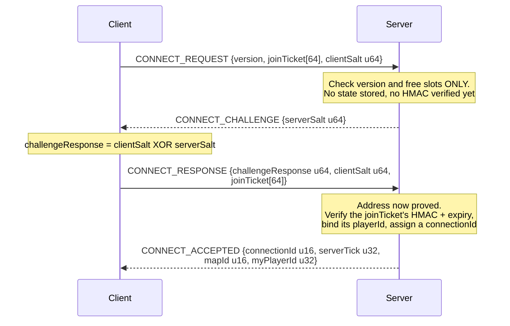
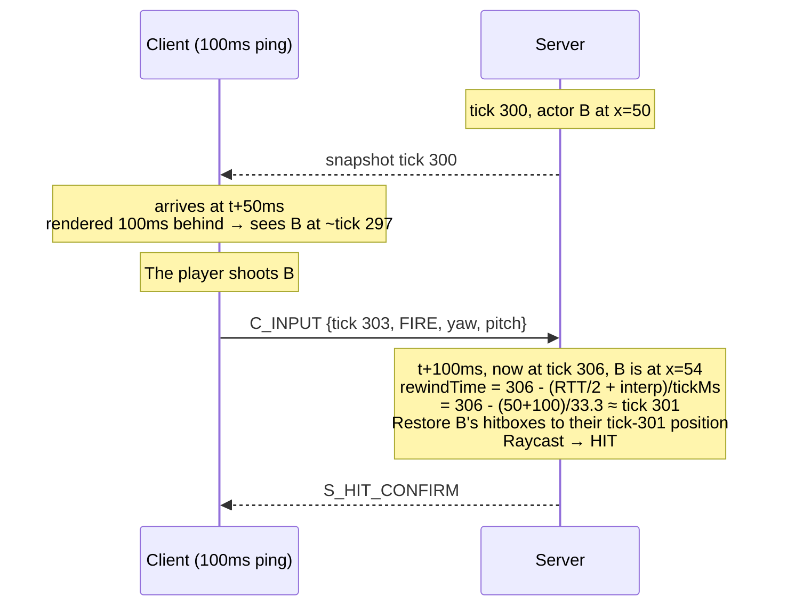
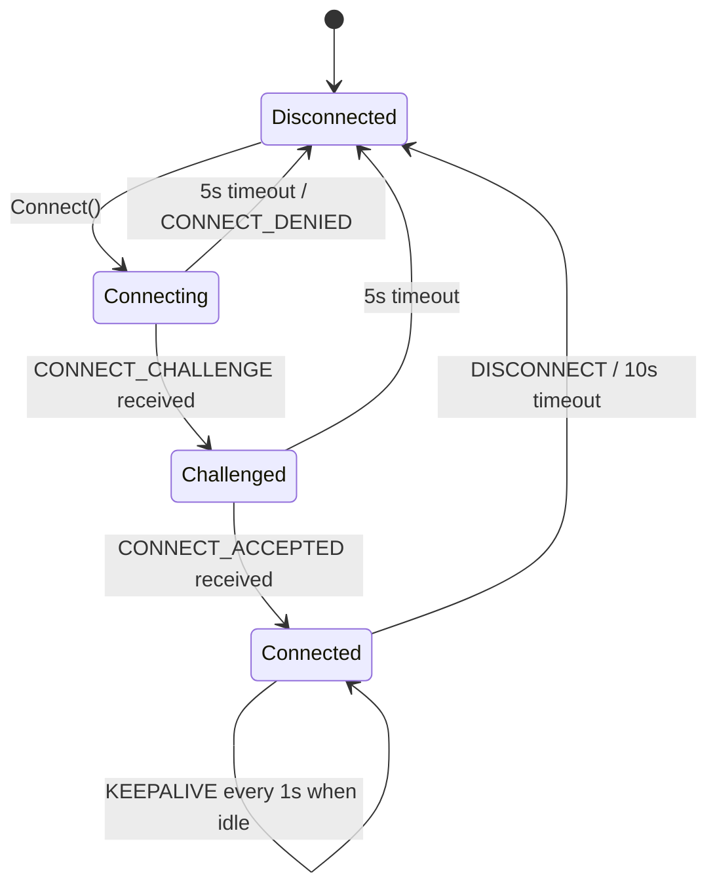

# Protocol Specification — Ironfront Reborn

**Version: 3.0.0** · Status: **FROZEN** (end of week 1) · Wire `PROTOCOL_VERSION = 3`

> This is the contract every side of the wire is written against. Every offset, every enum value
> and every quantization constant in this document is **mandatory**. Client and server may not
> interpret them differently.
>
> The header above had said `1.0.0` / `PROTOCOL_VERSION = 1` for the whole of v2's life, because
> `tools/SpecChecker` parses the fenced constants block in § 1 and never reads this line. That is
> why § 15's wire gate calls out condition 4 separately — the header is prose, and prose is the
> half no machine checks.
> See [conventions.md](conventions.md) for the protocol change process.
>
> **The single source of these constants in code:** `Ironfront.Net.Protocol/ProtocolConstants.cs`.
> Re-hardcoding any number from this document anywhere else is forbidden.
>
> **Frozen means:** every change from here on clears the wire gate in
> [§ 15](#15-protocol-changelog-and-freeze-record), adds a row to that section's changelog, and
> bumps `PROTOCOL_VERSION` **if the bytes on
> the wire change**. A correction that leaves the wire format untouched (a fixed typo, a clarified
> ambiguity) still needs the PR and the changelog row, but does **not** bump `PROTOCOL_VERSION` —
> bumping it would reject every client for a documentation edit.
>
> The freeze is enforced mechanically, not on trust: `tools/SpecChecker` parses § 1 and § 4.4 out of
> this document on every CI run and fails the build if `ProtocolConstants.cs` disagrees.

---

## 0. General conventions

- **Byte order: little-endian** across all of GSP (UDP) and MSP (TCP). Reason: x86 and ARM are both
  little-endian, so this avoids a redundant swap. `BitConverter` already defaults to little-endian
  on .NET, but **the code must not depend on `BitConverter.IsLittleEndian`** (use manual shifts).
- Data types: `u8 u16 u32 u64 i8 i16 i32 f32` — bit widths as named.
- `[n]` = an array of n elements. `{...}` = a nested struct.
- Every "reserved" field must be written as 0 and ignored on receive (kept for future versions).

---

# PART A — GSP: Game Server Protocol (UDP)

## 1. Global constants

```csharp
// Ironfront.Net.Protocol/ProtocolConstants.cs
public static class ProtocolConstants
{
    public const ushort PROTOCOL_ID       = 0x4946;  // 'IF' — filters out junk packets
    public const byte   PROTOCOL_VERSION  = 3;

    public const int    MTU_SAFE          = 1200;    // safe through any router
    public const int    GSP_HEADER_SIZE   = 16;
    public const int    MAX_PAYLOAD       = MTU_SAFE - GSP_HEADER_SIZE;  // 1184
    public const int    CHANNEL_ENVELOPE_SIZE = 3;                       // § 5.1
    public const int    MAX_CHANNEL_PAYLOAD = MAX_PAYLOAD - CHANNEL_ENVELOPE_SIZE;  // 1181

    public const int    SIM_TICK_RATE     = 30;      // Hz
    public const int    SNAPSHOT_RATE     = 20;      // Hz
    public const int    INPUT_SEND_RATE   = 30;      // Hz
    public const int    INPUT_REDUNDANCY  = 3;       // frames repeated per packet

    public const int    KEEPALIVE_MS      = 1000;
    public const int    TIMEOUT_MS        = 10000;
    public const int    ACK_BITFIELD_BITS = 32;

    public const int    MAX_FRAGMENTS     = 64;      // → max logical payload ~75 KB
    public const int    FRAGMENT_TIMEOUT_MS = 2000;

    public const int    INTERP_BUFFER_MS  = 100;
    public const int    MAX_REWIND_MS     = 200;
    public const int    HITBOX_HISTORY_MS = 1000;

    public const int    MAX_PLAYERS       = 16;
    public const int    MAX_BOTS          = 32;
    public const int    MAX_ACTORS        = 64;      // = MAX_PLAYERS + MAX_BOTS + headroom

    public const int    MAX_VEHICLES      = 16;     // separate u16 id space, see § 4.10
    public const int    VEHICLE_ID_QUARANTINE_TICKS = 150;   // 5 s, same rule as actorId
}
```

---

## 2. GSP header (16 bytes, every datagram)

```
Offset  Size  Type   Field           Description
------  ----  -----  --------------  --------------------------------------------------
  0      2    u16    protocolId      Always 0x4946. Mismatch → drop silently, no reply
  2      1    u8     packetType      See § 3
  3      1    u8     flags           Bitfield, see § 2.1
  4      2    u16    sequence        The SENDER's packet sequence number, incrementing, wraps 65535→0
  6      2    u16    ack             Highest sequence the sender has RECEIVED from the peer
  8      4    u32    ackBitfield     The 32 packets before `ack`. bit i = 1 ⇔ received (ack - 1 - i)
 12      2    u16    connectionId    Assigned by the server at CONNECT_ACCEPTED. 0 before connecting
 14      2    u16    payloadLength   Payload bytes following the header. ≤ 1184
------  ----
 16           payload[payloadLength]
```

### 2.1. The `flags` bitfield

| Bit | Name | Meaning |
|---|---|---|
| 0 | `RELIABLE` | This packet must be acked, and retransmitted if lost |
| 1 | `FRAGMENTED` | The payload is one fragment, see § 6 |
| 2 | `ORDERED` | Must be delivered in order within its channel |
| 3 | `COMPRESSED` | Payload is compressed (unused in v1, reserved) |
| 4–7 | reserved | Must be 0 |

### 2.2. The ack mechanism — a concrete example

Suppose A has received sequences 98, 99, 101, 103 from B (100 and 102 were lost).
When A sends its next packet, A writes:

```
ack         = 103
ackBitfield = bit0 → seq 102 = 0 (lost)
              bit1 → seq 101 = 1
              bit2 → seq 100 = 0 (lost)
              bit3 → seq  99 = 1
              bit4 → seq  98 = 1
              → 0b...00011010 = 0x1A
```

B receives it and immediately knows 100 and 102 never arrived. Because every packet carries 33
pieces of ack information (1 + 32), an ack is only lost if 33 consecutive packets are lost — in
practice, never. **This is why no separate ACK packet is needed.**

### 2.3. Sequence comparison with wrap-around

`sequence` is a u16 and wraps after 65535. At 30 packets/second, that's every ~36 minutes. It must
not be compared with a plain `>`.

```csharp
// Ironfront.Net.Protocol/SequenceMath.cs — SSOT, shared by all 4
public static bool IsNewer(ushort a, ushort b)
{
    const ushort HALF = 32768;
    return (a > b && a - b <= HALF) || (b > a && b - a > HALF);
}

public static int Distance(ushort a, ushort b) => (short)(a - b);
```

> **Known trap:** writing `if (seq > lastSeq)` works perfectly for 36 minutes and then breaks. This
> is the kind of bug that only surfaces in long-running tests. Unit tests for `IsNewer` around the
> boundary pairs — (65535, 0), (65530, 5), (0, 65535) — are mandatory.

---

## 3. `packetType`

| Value | Name | Direction | Reliable | Description |
|---|---|---|---|---|
| `0x01` | `CONNECT_REQUEST` | C→S | Yes (retry) | Requests a connection, carries the joinTicket |
| `0x02` | `CONNECT_CHALLENGE` | S→C | Yes (retry) | The server sends a nonce |
| `0x03` | `CONNECT_RESPONSE` | C→S | Yes (retry) | The client answers the challenge |
| `0x04` | `CONNECT_ACCEPTED` | S→C | Yes (retry) | Assigns a connectionId |
| `0x05` | `CONNECT_DENIED` | S→C | No | Carries a reason code |
| `0x06` | `DISCONNECT` | Both | No (sent 3×) | Deliberate disconnect |
| `0x07` | `KEEPALIVE` | Both | No | Keeps the connection alive, measures RTT |
| `0x10` | `PAYLOAD` | Both | Per flags | Carries messages, see § 4 |
| `0x11` | `FRAGMENT` | Both | Yes | One fragment of a large payload |

### 3.1. Handshake



**Why there's a challenge:** to prevent IP-spoofing amplification. An attacker spoofing a victim's
IP in a CONNECT_REQUEST never receives the `serverSalt`, so they can't complete the handshake and
**the server allocates no resources**.

**How the server keeps that promise (v2).** The obvious implementation — remember a pending
challenge per source address — breaks it: the address is still just a claim at that point, so a
flood of forged sources fills the table, and whatever eviction policy protects it then starts
throwing out legitimate clients mid-handshake. The server therefore stores nothing and derives the
salt instead:

```
serverSalt = HMAC-SHA256(serverKey, address ‖ port ‖ clientSalt ‖ epoch)[0..8]
```

`serverKey` is per-process and never leaves it; `epoch` is a 30-second bucket, and the previous
bucket is accepted too so a handshake straddling a boundary still completes. To recompute the salt
on CONNECT_RESPONSE the server needs the client's salt back, which is why **CONNECT_RESPONSE echoes
`clientSalt` and repeats the `joinTicket`** — the server has no memory of either. A spoofed
CONNECT_REQUEST now costs one HMAC and one datagram sent to the forged address.

**The ticket is verified at CONNECT_RESPONSE, not CONNECT_REQUEST.** Before the challenge completes
the source address is unproved, so any work done for it is work an attacker can direct at will.
The ticket's `playerId` is bound to the `connectionId` at that point (architecture.md § 9,
impersonation); a second handshake presenting a `playerId` that is already connected is denied with
`ALREADY_CONNECTED` rather than replacing the existing connection, so a captured ticket cannot
evict its rightful owner.

Retry: CONNECT_REQUEST is resent every 250 ms, up to 20 times (5 seconds), then reports an error.

### 3.2. `CONNECT_DENIED` — reason codes (u8)

| Code | Meaning |
|---|---|
| 1 | Server full |
| 2 | Protocol version mismatch |
| 3 | joinTicket invalid or expired |
| 4 | Banned |
| 5 | Server shutting down |
| 6 | Already connected (duplicate playerId) |

---

## 4. Payload: the message frame

A `PAYLOAD` datagram carries **one or more** messages, batched together to reduce header overhead.

> **This frame does not start at byte 16.** A `PAYLOAD` datagram is three layers: the 16-byte GSP
> header, then the 3-byte **channel envelope** (§ 5.1), then the frame below. Anything decoding
> from `GSP_HEADER_SIZE` reads the envelope's `channelSequence` where it expects `messageCount`.
> The budget for this frame is `MAX_CHANNEL_PAYLOAD` = **1181 bytes**, not `MAX_PAYLOAD`.

```
u8   channelId          See § 5
u16  messageCount
repeat messageCount times:
    u8   msgType        See § 4.1
    u16  msgLength      Body size in bytes
    u8[] body
```

### 4.1. `msgType`

**Client → Server (0x20–0x3F)**

| Value | Name | Channel | Description |
|---|---|---|---|
| `0x20` | `C_INPUT` | 3 (unreliable-seq) | Input frames, see § 4.2 |
| `0x21` | `C_VEHICLE_INPUT` | 3 (unreliable-seq) | Vehicle axes + turret aim while seated, see § 4.10 |
| `0x22` | `C_LOADOUT_SELECT` | 2 (reliable-ord) | Weapon selection before spawning |
| `0x23` | `C_SPAWN_REQUEST` | 2 | Requests a respawn at a spawn point |
| `0x24` | `C_CHAT` | 2 | In-match chat |
| `0x25` | `C_PING` | 0 (unreliable) | RTT measurement, carries a client timestamp |
| `0x26` | `C_SEAT_REQUEST` | 2 | Enter/exit a vehicle seat, see § 4.10 |
| `0x27` | `C_ACK_BASELINE` | 2 | Confirms snapshot tick N was received (for delta) |

**Server → Client (0x40–0x5F)**

| Value | Name | Channel | Description |
|---|---|---|---|
| `0x40` | `S_SNAPSHOT` | 1 (unreliable-seq) | World state, see § 4.3 |
| `0x41` | `S_SPAWN_ACTOR` | 2 | A new actor appeared |
| `0x42` | `S_DESPAWN_ACTOR` | 2 | An actor disappeared |
| `0x43` | `S_HIT_CONFIRM` | 2 | Hit confirmation (for the hitmarker) |
| `0x44` | `S_DEATH` | 2 | Someone died, with a force vector for the local ragdoll |
| `0x45` | `S_MATCH_STATE` | 2 | Score, time, match state |
| `0x46` | `S_CAPTURE_POINT` | 2 | A capture point changed state |
| `0x47` | `S_CHAT` | 2 | Chat broadcast |
| `0x48` | `S_PONG` | 0 | Ping reply, echoes the client timestamp |
| `0x49` | `S_WEAPON_FIRE` | 1 | Another actor just fired (for effects and audio) |
| `0x4A` | `S_EXPLOSION` | 2 | An explosion at a position, for effects + screen shake |
| `0x4B` | `S_PLAYER_LIST` | 2 | actorId → display-name table, see § 4.11 |
| `0x4C` | `S_VEHICLE_SNAPSHOT` | 1 (unreliable-seq) | Vehicle entity stream, see § 4.10 |
| `0x4D` | `S_VEHICLE_SPAWN` | 2 | A vehicle appeared |
| `0x4E` | `S_VEHICLE_DESPAWN` | 2 | A vehicle left the world |
| `0x4F` | `S_PROJECTILE_SPAWN` | 2 | A projectile was launched, with its flight parameters |
| `0x50` | `S_SEAT_CHANGE` | 2 | Authoritative seat enter/leave, including a rejection |

### 4.2. `C_INPUT` (0x20) — byte layout

```
u32  startTick            Tick of the FIRST frame in the packet
u8   frameCount           1..8, usually 3 (INPUT_REDUNDANCY)
repeat frameCount times:
    i8   moveX            -127..127  →  -1.0 .. 1.0  (divide by 127)
    i8   moveZ            as above
    u16  yaw              0..65535   →  0 .. 360°    (× 360/65536)
    i16  pitch            -16384..16384 → -90 .. 90° (× 90/16384)
    u16  buttons          Bitfield, see below
```

Size: `4 + 1 + 3 × 8 = 29 bytes` at frameCount = 3.
At 30 Hz: `29 × 30 = 870 B/s` upstream. Negligible.

**The `buttons` bitfield (u16)**

| Bit | Button | Bit | Button |
|---|---|---|---|
| 0 | Fire | 8 | LeanLeft |
| 1 | Aim (ADS) | 9 | LeanRight |
| 2 | Reload | 10 | Use / Interact |
| 3 | Jump | 11 | SwitchWeapon0 |
| 4 | Crouch | 12 | SwitchWeapon1 |
| 5 | Sprint | 13 | SwitchWeapon2 |
| 6 | Prone | 14 | SwitchWeapon3 |
| 7 | ThrowGrenade | 15 | reserved |

**Why we repeat 3 frames:** input is critical data but is sent unreliably. Without redundancy, one
lost packet costs the server an entire tick of input → the character stalls. With a redundancy of 3,
three consecutive packets must be lost before anything is missed. The cost is only 16 extra bytes
per packet. That's far cheaper than sending reliably (which would retransmit already-stale input).

**Server-side handling:** keep `lastProcessedInputTick` per connection. Discard any frame with
`tick <= lastProcessedInputTick` (already processed — it's a duplicate copy).

### 4.3. `S_SNAPSHOT` (0x40) — byte layout

```
u32  serverTick                Tick at which the server built this snapshot
u32  lastProcessedInputTick    Last input tick the server applied for THIS client (reconciliation)
u32  baselineTick              0 = full snapshot; non-zero = delta against that snapshot tick
u8   actorCount
repeat actorCount times:
    u16  actorId
    u8   changeMask            Bitfield, see below
    [bit0] position    i16 × 3   Quantized, see § 4.4
    [bit1] rotation    u16 yaw + i8 pitch
    [bit2] velocity    i8 × 3    Quantized -64..64 m/s
    [bit3] stateFlags  u8        See below
    [bit4] health      u8        0..100
    [bit5] weapon      u8 weaponId + u8 ammoInClip
    [bit6] team        u8        Only sent on change (rare)
    [bit7] seatInfo    u16 vehicleId + u8 seatIndex   (vehicleId 0 = not seated)
```

**`changeMask`**: bit i = 1 ⇔ field i is present in this packet. In a full snapshot, every needed
bit is 1. In a delta snapshot, only the bits for fields that actually changed since `baselineTick`.

### 4.3.1. `actorId` — allocation and lifetime

Settled at the freeze; these three rules are the contract, not suggestions.

| Rule | Decision | Why |
|---|---|---|
| **Do bots and players share one id space?** | **Yes.** One `u16` space, 0…`MAX_ACTORS - 1`, allocated by the server with no player/bot partition | The client renders both through the same `NetworkActorController` and never needs to care which is which. A split space would mean two allocators, two lookup tables, and a bug class where a bot id is read as a player id |
| **Is an id reused as soon as an actor dies?** | **No — quarantine for 5 seconds** (150 ticks) before an id returns to the pool | Snapshots and events for the dead actor are still in flight for up to one interpolation buffer plus retransmits. Reusing the id immediately makes the client apply a dead actor's tail packets to the new one: a freshly spawned player briefly teleports to where the corpse was, or takes damage attributed to the wrong actor. 5 s is far beyond `TIMEOUT_MS`-scale in-flight time |
| **Is `MAX_ACTORS = 64` enough?** | **Yes.** 16 players + 32 bots = 48 concurrent, with 16 spare | The spare 16 absorbs the quarantine window above: at worst every one of 48 actors dies at once and their ids are still cooling while replacements spawn. 64 also keeps `actorCount` inside its `u8` and the full snapshot inside 2 fragments |

**Is an 8-bit `changeMask` enough?** **No longer — all 8 bits are used and populated as of
v3.0.0.** Bit 7 (`seatInfo`) was described here as a spare through the whole of v1 and v2 because
nothing set it; v3 finished it (both producers now populate it, see § 4.10). A ninth actor field
therefore needs the `changeMask` widened to `u16`, which is a wire-format change: § 15's wire gate
and a `PROTOCOL_VERSION` bump. The vehicle entry's mask is already a `u16` with 8 bits spare
precisely so that the same wall is not hit twice.

**`seatInfo` and the sentinel.** `vehicleId` is allocated from 1 and **0 means "not seated"**. The
field is only sent on change, and leaving a vehicle *is* a change — a sentinel is the only way to
express it. Vehicle ids live in their own `u16` space, capped at `MAX_VEHICLES` and quarantined for
the same 150 ticks (§ 4.10); they never collide with an `actorId`.

**`stateFlags` (u8)**

| Bit | Meaning |
|---|---|
| 0 | IsAlive |
| 1 | IsCrouching |
| 2 | IsProne |
| 3 | IsSprinting |
| 4 | IsAiming |
| 5 | IsInWater |
| 6 | IsRagdoll (dead; the client enables its own ragdoll) |
| 7 | IsSeated |

**Size estimate**

| Case | Bytes/actor |
|---|---|
| Full, actor on foot (bits 0–6) | 2 + 1 + 6 + 3 + 3 + 1 + 1 + 2 + 1 = **20** |
| Full, actor seated (bits 0–7) | 20 + 3 = **23** |
| Typical delta (pos + rot only) | 2 + 1 + 6 + 3 = **12** |
| Delta for a stationary actor | 2 + 1 = **3** |

**23 is the number interest management projects against**, not 20: any actor may be seated, and a
budget projection that is optimistic overruns the datagram and discards the whole snapshot. The
admitted-actor ceiling is therefore `(1178 − 13) / 23 = 50`, down from 58 at v2. The 48-actor case
the game ships still never sheds; the margin above it is gone. See § 4.10 § co-residency for what
the vehicle stream takes off the top.

With 48 actors averaging ~12 B: `48 × 12 = 576 B/snapshot`.
Plus the GSP header and framing: ~600 B × 20 Hz = **~12 KB/s** downstream.
After interest management (only ~20 actors actually sent): **~5–7 KB/s**. Target met.

### 4.4. Quantization — mandatory shared constants

> **This is the easiest place to get wrong and the worst place to get it wrong.** If the client uses
> `POS_RANGE = 2048` while the server uses `4096`, characters end up at double the wrong position.
> The bug is very hard to spot because there's no runtime error.

```csharp
public static class Quantize
{
    // ===== POSITION =====
    // The current map fits inside a ±2048 m box. An i16 has 65536 levels.
    public const float POS_MIN  = -2048f;
    public const float POS_MAX  =  2048f;
    public const float POS_RANGE = POS_MAX - POS_MIN;        // 4096
    // Resolution = 4096 / 65536 = 0.0625 m = 6.25 cm. Good enough for an FPS.

    public static short PackPos(float v)
    {
        float t = Mathf.Clamp((v - POS_MIN) / POS_RANGE, 0f, 1f);
        return (short)(t * 65535f - 32768f);
    }
    public static float UnpackPos(short q)
        => ((q + 32768f) / 65535f) * POS_RANGE + POS_MIN;

    // ===== ANGLES =====
    public const float YAW_SCALE   = 65536f / 360f;    // u16
    public const float PITCH_SCALE = 16384f / 90f;     // i16, using ±16384
    // Yaw resolution = 360/65536 = 0.0055° — more than precise enough for aiming
    // Pitch resolution = 90/16384 = 0.0055°

    // ===== VELOCITY =====
    public const float VEL_MAX = 64f;                  // m/s, enough for everything but aircraft
    public const float VEL_SCALE = 127f / VEL_MAX;     // i8
    // Resolution = 64/127 = 0.5 m/s — only used for extrapolation, which is fine

    // ===== ANGULAR VELOCITY — added v3.0.0 for vehicles (§ 4.10, mask bit 3) =====
    // rad/s, NOT sharing VEL_SCALE: at 64 rad/s (10 rev/s) every rotation a vehicle
    // actually performs would quantize to the bottom two or three codes.
    public const float ANGVEL_MAX = 8f;                // ~1.3 rev/s
    public const float ANGVEL_SCALE = 127f / ANGVEL_MAX;  // i8
    // Resolution = 8/127 = 0.063 rad/s. Saturates rather than wraps: a wrapped cast turns
    // a violent spin into a slow counter-rotation on every client.

    // ===== ROTATION (full, smallest-three) — added v3.0.0 for vehicles =====
    // A unit quaternion's largest component is at least 0.5, so the other three are each
    // inside ±1/√2. Sending only those three at 10 bits apiece, plus a 2-bit index of the
    // one that was dropped, is a full rotation in 32 bits.
    public const float QUAT_MIN    = -0.70710678f;     // -1/√2
    public const float QUAT_RANGE  =  1.41421356f;     //  2/√2
    public const int   QUAT_LEVELS = 1023;             // 10 bits, endpoints exact
    // Step = 1.41421356 / 1023 = 1.38e-3. Worst-case angular error is 0.271° — see below;
    // it is NOT the step size, because the reconstructed component amplifies it.

    // ===== HEALTH =====
    // health is a u8 directly in 0..100, no scaling needed
}
```

**`PackQuat` / `UnpackQuat` — the three properties that fail silently.** The actor entry's
`u16 yaw + i8 pitch` cannot express roll, and vehicles roll, so the vehicle entry carries a full
quaternion. Bit layout, high bits first: `[31:30]` index of the largest-magnitude component
(0=x, 1=y, 2=z, 3=w); `[29:20]`, `[19:10]`, `[9:0]` the remaining three **in source order**, each an
unsigned quantization of `QUAT_MIN … −QUAT_MIN`. The dropped component is rebuilt as
`sqrt(1 − a² − b² − c²)`.

| Property | What goes wrong without it |
|---|---|
| **Sign canonicalization** — the largest component is forced positive before packing | `q` and `−q` are the same rotation, so the reconstructed sign is always `+`. Half of all rotations decode **mirrored**, as perfectly valid unit quaternions |
| **Clamp the radical at 0** before `sqrt` | Round-off (and any hostile input, `0xFFFFFFFF` being the obvious one) pushes it negative; `sqrt` returns `NaN`, and a `NaN` quaternion reaches a transform as an object that vanishes rather than as an exception |
| **Renormalize on unpack** | 10-bit quantization leaves the length off unit by ~0.1%. One frame tolerates it; interpolated blending across three does not |

A round-trip-only test passes with the sign bug present, which is why § 14 lists each separately.

**The angular budget is 0.3°, and the step size is not where it comes from.** Each transmitted
component is off by at most half a step (6.912e-4). The dropped component is reconstructed as
`m = sqrt(1 − a² − b² − c²)`, so its error is `δm = −(a·δa + b·δb + c·δc) / m` and **grows as `m`
shrinks**. `m` is smallest at the four-way tie `(0.5, 0.5, 0.5, 0.5)`, where it is exactly 0.5 and
the three transmitted components are simultaneously at their largest:

```
|δm|  ≤ 3 × 0.5 × 6.912e-4 / 0.5           = 2.074e-3
|δq|  ≈ sqrt(3 × (6.912e-4)² + (2.074e-3)²) = 2.394e-3
angle ≈ 2 × |δq| = 4.79e-3 rad              = 0.274°
```

| Search | Worst error found |
|---|---|
| Uniform sweep, 2 × 10⁶ rotations | 0.243° |
| Dense grid over the three transmitted components | 0.241° |
| **Deliberate search of the four-way tie** | **0.271°**, at `(0.5004, 0.5014, 0.4991, 0.4991)` |
| A 10⁴-sample random sweep | ~0.19° — reads as a pass |

The last row is the point: this budget was written as 0.2° from the step size alone, and a
10⁴-sample test agreed with it. The conformance test therefore **searches the tie corner** rather
than sampling and hoping. Meeting 0.2° would need 12-bit components (5 bytes), which moves the
pinned 30-byte vehicle entry — not worth 0.07° nobody can see.

**Mandatory verification (conformance test):**
```
PackPos(0f)      → 0        UnpackPos(0)      ≈ 0f      (error < 0.07 m)
PackPos(100f)    → 1599     UnpackPos(1599)   ≈ 100f    (see the note below)
PackPos(-2048f)  → -32768   UnpackPos(-32768) = -2048f
PackPos(2048f)   → 32767    UnpackPos(32767)  ≈ 2048f
```

> **Corrected at the freeze — this row previously read `1600`.** The formula above yields **1599**:
>
> ```
> t                = (100 - (-2048)) / 4096 = 0.5244140625
> t * 65535        = 34367.4755859375
> minus 32768      = 1599.4755859375
> (short) truncate = 1599
> ```
>
> 1600 would require multiplying by 65536 instead of 65535 — which then makes `PackPos(2048f)`
> produce 32768, an i16 overflow contradicting the `→ 32767` row directly below it. The formula is
> correct and the worked example was wrong. Both values sit inside the 0.07 m budget that
> [§ 14](#14-conformance-checklist) actually requires (`UnpackPos(1599)` = 99.97 m,
> `UnpackPos(1600)` = 100.03 m), so no shipped behavior changes and `PROTOCOL_VERSION` stays at 1.

**The ±2048 m range is verified, not assumed.** Measured directly from the scene files (no Editor
required — `m_SerializationMode: 2` makes them YAML):

| Scene | `LevelBounds` box | Playable extent | Worst \|coord\| |
|---|---|---|---|
| Dustbowl | centre (-70.8, 207.6, -88.6), size 1700 × 700 × 1600 | X -920.8…779.2 · Z -888.6…711.4 | **920.8 m** |
| Island | none present (`IsInside` returns true everywhere) | all 5 capture points within 263 m | **589.7 m** |

`LevelBounds` is `new Bounds(transform.position, transform.localScale)`
([`LevelBounds.cs:21`](../../Ironfront_Reborn/Assets/Scripts/Assembly-CSharp/LevelBounds.cs#L21)),
and `LevelBounds.IsInside()` is what keeps actors inside it. Dustbowl does contain ~1,900 transforms
beyond 2048 m, but those are backdrop terrain and skybox geometry outside the play box — no actor
can reach them, so they never enter a snapshot. **±2048 m leaves 2.2× headroom over the largest
playable area.** Re-run this check if a new map is added; if one ever exceeds the box, the options
are raising `POS_RANGE` (losing precision) or moving position to 24 bits (+3 B per actor).

### 4.5. `S_HIT_CONFIRM` (0x43)

```
u16  targetActorId
u16  damage            × 10 (fixed point, 1 decimal place)
u8   hitboxType        0=body 1=head 2=limb
u8   flags             bit0 = killed, bit1 = headshot
```

### 4.6. `S_DEATH` (0x44)

```
u16  victimActorId
u16  killerActorId     0xFFFF if killed by the environment
u8   causeOfDeath      0=bullet 1=explosion 2=fall 3=drown 4=vehicle
i16  forceX, forceY, forceZ    Quantized velocity, so the client's ragdoll flies the right way
u8   hitboxHit
```

On receiving this the client: enables the ragdoll **locally**, plays audio, updates the killfeed.
Corpses are not synchronized between clients — accepted per AD-4.

### 4.7. `S_WEAPON_FIRE` (0x49)

```
u16  shooterActorId
u8   weaponId
i16  dirX, dirY, dirZ   Quantized fire direction (for tracers)
```

Sent unreliable-sequenced: losing one gunshot is harmless. Used for muzzle flashes, 3D audio and
other players' tracers.

### 4.8. `weaponId` — the value space

`weaponId` is a `u8` in three places (§ 4.3 snapshot weapon field, `S_SPAWN`, § 4.7
`S_WEAPON_FIRE`) and was frozen without any section saying what a value means. The mapping lived
only in serialized fields inside `Ironfront_Reborn/Assets/Resources/_Managers.prefab` — a Unity
YAML asset the server cannot open, being a netstandard library with no Unity reference. This
section is that mapping.

```csharp
// Ironfront.Net.Protocol/WeaponIds.cs
public static class WeaponIds
{
    public const byte NONE              = 0;              // no weapon, or one this build does not know

    public const byte RK44              = 1;
    public const byte SIND7             = 2;
    public const byte SIND7_SUPPRESSED  = 3;
    public const byte EAGLE_76          = 4;
    public const byte BEU_AW1           = 5;
    public const byte SL_DEFENDER       = 6;
    public const byte FRAG              = 7;
    public const byte SPEARHEAD         = 8;
    public const byte BINOCS            = 9;
    public const byte AMMO_BAG          = 10;
    public const byte MEDIPACK          = 11;
    public const byte BIL_SCALPEL       = 12;
    public const byte SIGNAL_DMR        = 13;
    public const byte NV_GOGGLES        = 14;
    public const byte RECON_LRR         = 15;
    public const byte WRENCH            = 16;
    public const byte SUPER_WRENCH      = 17;

    public const byte MAX_ASSIGNED      = 17;     // the next new weapon takes 18
}
```

| Id | Registry name | Id | Registry name |
|---|---|---|---|
| 0 | *(none / unknown)* | 9 | BINOCS |
| 1 | RK-44 | 10 | AMMO BAG |
| 2 | S-IND7 | 11 | MEDIPACK |
| 3 | S-IND7 [SUP] | 12 | BIL SCALPEL |
| 4 | 76 EAGLE | 13 | SIGNAL DMR |
| 5 | BEU AW1 | 14 | N.V. GOGGLES |
| 6 | SL-DEFENDER | 15 | RECON LRR |
| 7 | FRAG | 16 | WRENCH |
| 8 | SPEARHEAD | 17 | SUPER WRENCH |

**Ids are permanent and append-only.** Reassigning one breaks no build and no test — it makes a
server that says "shot with 4" and a client that draws weapon 4 disagree about which gun that is,
at runtime, for every player. A new weapon takes the next free id; a retired weapon's id retires
with it and is never recycled. Adding an id is **not** a wire change and does not bump
`PROTOCOL_VERSION`: an older client receiving an id past its `MAX_ASSIGNED` reads it as `NONE`,
draws no weapon, and keeps the snapshot.

**0 is reserved and never assigned.** It is what a receiver reads for an actor holding nothing,
and it is what a sender emits for a registry entry whose id is missing or duplicated — so a
misconfigured weapon transmits "unknown" rather than impersonating whichever weapon legitimately
owns that number.

Three copies of this mapping exist: this section, `WeaponIds.cs`, and the `NetworkId` fields in
`_Managers.prefab`. `tools/SpecChecker` compares all three on every CI run, because the failure
mode of drift here is silent on both sides.

---

### 4.9. `vehicleType` — the value space

`vehicleType` is a `u8` in `S_VEHICLE_SPAWN` (§ 4.10) and the client instantiates a prefab from it.
This section is that mapping, written **with** the field rather than four phases after it —
§ 15's 2.0.1 row records what happens otherwise.

```csharp
// Ironfront.Net.Protocol/VehicleIds.cs
public static class VehicleIds
{
    public const byte NONE       = 0;      // no vehicle, or one this build does not know

    public const byte JEEP       = 1;
    public const byte QUADBIKE   = 2;
    public const byte RHIB       = 3;
    public const byte HELICOPTER = 4;
    public const byte TANK       = 5;

    public const byte MAX_ASSIGNED = 5;    // the next new vehicle takes 6
}
```

| Id | Prefab | `VehicleKind` (§ 4.10) |
|---|---|---|
| 0 | *(none / unknown)* | — |
| 1 | `jeep` | `Car` |
| 2 | `quadbike` | `Car` |
| 3 | `rhib` | `Boat` |
| 4 | `helicopter` | `Helicopter` |
| 5 | `tank` | `Tank` |

**This is not `VehicleKind`.** The kind is the four-way physics family a decoder needs in order to
read a snapshot entry's subtype tail; the id here is which prefab to instantiate. Two tank models
would share a kind and never share an id — which is exactly why `S_VEHICLE_SPAWN` carries both, and
why adding a second tank is not a wire change.

**Ids are permanent and append-only**, on the same terms as § 4.8: reassigning one breaks no build
and no test, it makes the two sides disagree about which vehicle type 4 is, at runtime, for
everyone. **0 is reserved and never assigned** — a receiver that reads it instantiates nothing, and
a sender emits it for a prefab whose id is missing or duplicated, so a misconfigured vehicle
transmits "unknown" rather than impersonating whichever vehicle legitimately owns that number.
Adding an id is **not** a wire change and does not bump `PROTOCOL_VERSION`.

Three copies exist: this section, `VehicleIds.cs`, and the serialized `networkId` on each vehicle
prefab. `tools/SpecChecker` compares all three every CI run, anchored on the `m_Script` GUID of a
`Vehicle` subclass rather than on field order — and it reports a prefab that carries a `Vehicle`
script with **no** `networkId` as a failure, because unauthored is the state every one of them was
in before v3.

---

### 4.10. The vehicle stream

Added in v3.0.0. A vehicle is not expressible as an actor entry: `changeMask` had all 8 bits spent
(§ 4.3.1), quantized actor velocity saturates at `VEL_MAX` = 64 m/s, and the actor rotation field is
yaw + pitch with no roll.

#### `S_VEHICLE_SNAPSHOT` (0x4C) — byte layout

```
u32  serverTick                Tick at which the server built this snapshot
u32  baselineTick              0 = full snapshot; non-zero = delta against that snapshot tick
u8   vehicleCount
repeat vehicleCount times:
    u16  vehicleId
    u16  changeMask            Bitfield, see below
    [bit0] position        i16 × 3   Quantized, see § 4.4
    [bit1] rotation        u32       Smallest-three quaternion, see § 4.4
    [bit2] linearVelocity  i16 × 3   Quantized at VEL_SCALE (PackVel16)
    [bit3] angularVelocity i8  × 3
    [bit4] health          u8        0..100 (Quantize.HEALTH_MAX), scaled by maxHealth
    [bit5] flags           u8        See below
    [bit6] turret          u16 yaw + i8 pitch
    [bit7] subtype         u8 × 2    Fixed 2-byte tail, read per VehicleKind
```

**There is no `lastProcessedInputTick`.** The actor header carries one because the actor path
replays unacked inputs through reconciliation. Driver prediction is error-corrected simulation, not
input replay — the client never re-runs a vehicle tick, so it has nothing to reconcile against, and
the field would be 4 B at 20 Hz that nobody reads.

**`changeMask` is a `u16` with 8 bits spare, deliberately.** `SnapshotField` spent all 8 of its bits
before the first vehicle existed, so a ninth actor field needs the mask itself widened; a ninth
*vehicle* field takes a spare bit in a mask that is already the right width.

**Cheaper is not free.** Adding a vehicle field is still a wire change and still bumps
`PROTOCOL_VERSION`. An old decoder reaching an unknown mask bit does not know the new field's
width, so it cannot skip it, and every later field — and every later entry in the datagram —
misaligns behind it. The spare bits buy a smaller diff, not backward compatibility. The one thing
an old decoder genuinely survives is an unknown `VehicleKind`, because the subtype tail is a fixed
2 bytes whatever the kind is.

**`health` runs 0..100, NOT 0..255.** It shares `Quantize.HEALTH_MAX` with the actor entry
(section 4.3.1), so one decoder constant serves both streams. A client dividing by 255
renders every vehicle at 39% health and nothing anywhere goes red — the value is in range,
the bar just lies.

**`flags` (u8)**

| Bit | Meaning |
|---|---|
| 0 | Dead |
| 1 | Burning |
| 2 | InWater |
| 3 | Airborne |
| 4–7 | reserved |

**Size**

| Case | Bytes/vehicle |
|---|---|
| Full (every field) | 2 + 2 + 6 + 4 + 6 + 3 + 1 + 1 + 3 + 2 = **30** |
| Delta for a stationary vehicle | 2 + 2 = **4** |

#### The subtype tail

Two bytes for **every** vehicle type, discriminated by the `VehicleKind` the client learned from
`S_VEHICLE_SPAWN`.

| `VehicleKind` | `subtypeA` | `subtypeB` |
|---|---|---|
| `Car` = 0 | `steerAngle`, i8, degrees | `surfaceFriction`, u8, 0..255 → 0..1 |
| `Tank` = 1 | `steerAngle`, i8, degrees | `currentMuzzle`, u8 index |
| `Helicopter` = 2 | `rotorSpeed` low byte | `rotorSpeed` high byte (u16 → 0..1 normalized) |
| `Boat` = 3 | `steerAngle`, i8, degrees | `surfaceFriction`, u8 |
| unknown | opaque — 2 bytes, skipped | opaque |

**Fixed width is the whole point.** A variable-width tail would make the stream unparseable by any
decoder that missed the spawn: one lost type mapping and every *subsequent* entry in the datagram
misaligns. Fixed width means an unknown kind costs 2 skipped bytes and nothing else — the same
property that makes `changeMask` safe.

#### `vehicleId` — allocation and lifetime

| Rule | Decision | Why |
|---|---|---|
| **Does it share the `actorId` space?** | **No.** A separate `u16` space, allocated **from 1** | A vehicle is not an actor and never occupies an actorId. `MAX_ACTORS` and `SnapshotHeader.actorCount` are untouched by this section |
| **What does 0 mean?** | **"No vehicle."** Never assigned | `seatInfo` (§ 4.3.1) must be able to say *left the vehicle*, and it is sent only on change. A sentinel is the only way to express that in a `u16` field |
| **Is an id reused as soon as a vehicle dies?** | **No — quarantine for 5 seconds** (`VEHICLE_ID_QUARANTINE_TICKS` = 150) | The same reason as § 4.3.1: snapshots and events naming a destroyed vehicle are in flight for up to one interpolation buffer plus retransmits, so reissuing immediately applies a wreck's tail packets to its replacement |
| **Is `MAX_VEHICLES = 16` enough?** | **Yes**, and the cap is load-bearing | It bounds the vehicle body at `16 × 30 + 9 = 489 B`, which is what lets the elastic actor body be sized against what the bounded one consumed. It also leaves the quarantine window room while a spawner replaces a wreck |

#### Co-residency with `S_SNAPSHOT`

Both messages go in the **same channel-1 payload batch**, the vehicle snapshot written **first**;
the actor snapshot gets the remainder of the datagram budget.

**The remainder is less one extra message header.** A batch carries two messages where the
snapshot budget constant accounts for one, so the actor body gets
`MaxSnapshotBodySize - MessageHeaderSize - vehicleBodyLength` = `1178 - 3 - 489` = **686 B**
at a full vehicle body, not 689. Derived actor capacity is unchanged at 29
(`floor((686 - 13) / 23)`), so the earlier figure was benign — but it was 3 bytes
optimistic, and a reader sizing a buffer from it would be over by exactly the header the
second message needs.

| | Actors only | With a worst-case vehicle body |
|---|---|---|
| Snapshot body budget | 1178 | 1178 − 489 = **689** |
| less `SnapshotHeader` (13) | 1165 | 676 |
| ÷ 23 B/actor (§ 4.3.1) | **50** | **29** |

The vehicle body is bounded; the actor body is elastic and already sheds. Sizing the elastic one
against what the bounded one actually consumed is exact — reserving a fixed slice instead would
need unused-reserve-return logic for no gain, and splitting them into two datagrams would cost a
second 16-byte GSP header at 20 Hz (~320 B/s) to solve a problem neither stream has.

#### The event messages

| Message | Opcode | Ch | Layout | Size |
|---|---|---|---|---|
| `C_VEHICLE_INPUT` | 0x21 | 3 | `u32 tick` + `u16 vehicleId` + `i8 throttle` + `i8 steer` + `i8 pitchAxis` + `i8 auxAxis` + `u16 turretYaw` + `i16 turretPitch` + `u16 buttons` | **16** |
| `C_SEAT_REQUEST` | 0x26 | 2 | `u16 vehicleId` + `u8 seatIndex` + `u8 action` | **4** |
| `S_VEHICLE_SPAWN` | 0x4D | 2 | `u16 vehicleId` + `u8 kind` + `u8 networkTypeId` + `i16 posX/Y/Z` + `u32 rotation` + `u8 seatCount` + `u8 flags` | **16** |
| `S_VEHICLE_DESPAWN` | 0x4E | 2 | `u16 vehicleId` + `u8 reason` | **3** |
| `S_PROJECTILE_SPAWN` | 0x4F | 2 | `u16 ownerActorId` + `u8 kind` + `i16 originX/Y/Z` + `i16 velX/Y/Z` + `u32 spawnTick` | **19** |
| `S_SEAT_CHANGE` | 0x50 | 2 | `u16 actorId` + `u16 vehicleId` + `u8 seatIndex` + `u8 result` | **6** |

**Enums.** `SeatAction`: `Enter` = 0, `Leave` = 1. `SeatChangeResult`: `Entered` = 0, `Left` = 1,
`RejectedOccupied` = 2, `RejectedVehicleDead` = 3, `RejectedAlreadySeated` = 4, `RejectedTooFar` = 5,
`RejectedNoSuchSeat` = 6, `RejectedLockedOut` = 7. `VehicleDespawnReason`: `Destroyed` = 0,
`WorldReset` = 1.
`ProjectileKind`: `Shell` = 0, `Rocket` = 1, `GuidedMissile` = 2, `Grenade` = 3, `Supply` = 4.

The load-bearing notes, none of them colour:

- **`C_VEHICLE_INPUT` carries no frame redundancy**, unlike `C_INPUT`. `C_INPUT` repeats 3 frames
  because a lost frame costs a tick of movement *and* a button edge. Vehicle axes are continuous and
  level-triggered — a lost throttle frame is corrected by the next one 33 ms later. The one
  genuinely edge-triggered vehicle action, leaving a seat, travels on `C_SEAT_REQUEST`, which is
  reliable.
- **`vehicleId` in `C_VEHICLE_INPUT` is not redundant**, even though the server knows which seat the
  sender occupies. It lets the server discard input addressed at a vehicle the client has already
  left — precisely the window a same-frame leave-then-enter opens.
- **`RejectedLockedOut` = 7 was appended in V4, and appending it is not a wire change.**
  `S_SEAT_CHANGE` stays 6 bytes and `result` stays a `u8`, so nothing behind it misaligns — unlike
  a new `changeMask` bit, whose width an old decoder cannot know and therefore cannot skip.
  `PROTOCOL_VERSION` is unchanged. It exists because it is the only refusal whose remedy is *ask
  again shortly*: `Actor.CanEnterSeat()` is `!IsSeated() && cannotEnterVehicleAction.TrueDone()`,
  two conditions behind one predicate, so `RejectedAlreadySeated` would be a lie whenever the actor
  is standing on the ground and `RejectedTooFar` would be a distance code reporting a timer.
- **`turretPitch` is an `i16` in the input and an `i8` in the snapshot entry.** Input is what the
  player asked for and deserves full `PackPitch` precision; the snapshot is what the world looks
  like. `C_INPUT` already carries the same asymmetry against the actor rotation field.
- **`S_VEHICLE_SPAWN` carries both `kind` and `networkTypeId`** — see § 4.9.
- **`S_PROJECTILE_SPAWN` carries no projectile id.** Clients simulate flight from the parameters and
  the server owns the hit; detonation replicates as `S_EXPLOSION` (0x4A), which carries its own
  position. Nothing needs to correlate the two.
- **`S_EXPLOSION` is unchanged by v3.** Its 10-byte layout has been correct since v1 and needs a
  caller and a subscriber, not new bytes.

---

### 4.11. `S_PLAYER_LIST` (0x4B) — byte layout

Declared at the freeze with no implementation anywhere, which is why a killfeed line knew an actor
id had died and had nothing to render. Sent on join and on change — names do not move.

```
u8   playerCount
repeat playerCount times:
    u8   actorId
    u8   nameLength           ≤ 16 bytes
    utf8 name                 nameLength bytes, not NUL-terminated
```

**`actorId` is a `u8` here** and a `u16` everywhere else. Safe because actorIds are allocated from
`0 … MAX_ACTORS − 1` (§ 4.3.1) and `MAX_ACTORS` is 64 — and pinned by a conformance test rather than
by this sentence, because raising `MAX_ACTORS` past 256 would truncate ids silently and the symptom
would be a scoreboard naming the wrong player.

**Names only, no scores**, despite what the § 4.1 row used to promise. Score and match time already
travel in `S_MATCH_STATE` (0x45); a second copy here would be a second source of truth for the
number that changes most often. Worst case is `1 + 64 × 18 = 1153 B`, inside one un-fragmented
channel-2 payload.

An over-long name is **refused, not truncated**: cutting UTF-8 at a fixed byte count splits
multi-byte code points and renders as replacement characters. The caller clips at a character
boundary, where it still knows what the characters are.

---

## 5. Channels

Reliability isn't applied to the whole connection but per channel. Four channels in v1:

| ID | Type | Used for | Behavior on loss |
|---|---|---|---|
| 0 | Unreliable-unsequenced | Ping/pong | Ignored |
| 1 | Unreliable-sequenced | `S_SNAPSHOT`, `S_WEAPON_FIRE` | Ignored. **A packet arriving older than one already received is DROPPED** (stale data is worthless) |
| 2 | Reliable-ordered | All gameplay events, chat, spawn/despawn | Retransmitted until acked. Delivered in order, with early arrivals buffered |
| 3 | Unreliable-sequenced | `C_INPUT` | Like channel 1, but with application-level redundancy |

**Why channels 1 and 3 are separate:** they're the same type but flow in different directions at
different rates. Separating them keeps the sequence counters independent, so a lost snapshot never
causes an input to be wrongly dropped.

**The channel-2 trap (reliable-ordered):** if message N is lost, messages N+1 and N+2 that already
arrived have to sit in the buffer. That is head-of-line blocking — but we accept it deliberately
**for events only**, where ordering genuinely matters (you can't process a "death" before a
"spawn"). Snapshots live on a different channel and are unaffected. **This is the core advantage of
UDP over TCP**: TCP forces everything into one stream.

### 5.1. The channel envelope (3 bytes, every `PAYLOAD` datagram)

Between the GSP header and the § 4 message frame sits a small transport-owned header:

```
u8   channelId          0..3, see the table above
u16  channelSequence    per-channel, little-endian
```

So a complete `PAYLOAD` datagram is:

```
[ GSP header, 16 B ][ channel envelope, 3 B ][ message frame, § 4 ]
```

**`channelSequence` is not the GSP `sequence`.** The GSP sequence counts every datagram on the
connection — keep-alives, acks, packets for other channels — so it advances at a rate that has
nothing to do with any one channel. Sequenced channels (1 and 3) decide staleness on
`channelSequence`, so a lost snapshot can never make an input look old. Compare it with the
wrap-safe helper in § 2.3, never with `>`.

**Why `channelId` appears here as well as in § 4.** It reads as duplication and it is not. A
fragmented message frame is not a parseable object until every fragment has arrived (§ 6), but the
channel is exactly what the transport must know *first* — it selects the reliability and ordering
rules, and therefore whether an arriving fragment should be buffered, acked, or dropped as stale.
Reading the channel out of the application frame would mean the transport could only route packets
it had already finished reassembling, which is circular. The cost is one byte per datagram, 0.08%
of `MTU_SAFE`.

**Ownership:** the envelope is written and read by the transport (the transport track). Nothing above the
transport ever sees it — `ITransportServer.Send` takes a channel id and a payload, and the frame in
§ 4 is what the payload contains.

---

## 6. Fragmentation

Messages larger than `MAX_PAYLOAD` (1184 bytes) must be split. This mainly happens with the first
full snapshot on joining a match (64 actors × 20 B ≈ 1280 B) and with `S_PLAYER_LIST`.

The extra header (placed immediately after the GSP header when `flags.FRAGMENTED = 1`):

```
u16  fragmentGroupId      Fragment group id, incrementing
u8   fragmentIndex        0-based
u8   fragmentCount        Total fragments, ≤ 64
```

Rules:
- Every fragment shares the same `fragmentGroupId`.
- Fragments must be sent **reliably** (lose one and the whole group is useless).
- The receiver buffers by `fragmentGroupId` and reassembles once `fragmentCount` is complete.
- If it isn't complete within `FRAGMENT_TIMEOUT_MS` (2000 ms) → discard the group, free the memory.
- **Anti-DoS limit:** at most 8 groups awaiting reassembly per connection. Over that → drop the
  oldest group.

> **Trap:** an attacker must not be able to send `fragmentCount = 64` and then only one fragment,
> repeated thousands of times → exhausting server RAM. The 8-group limit plus the timeout is
> mandatory, not optional.

---

## 7. Lag compensation

### 7.1. The principle

A client with 100 ms ping sees the world as it was **150 ms ago** (50 ms of transit + 100 ms of
interpolation buffer). When they shoot someone in the head, by the time the server receives the
packet that person has already moved. If the server raycast at the current position, a high-ping
client would almost never land a shot.

**The fix:** the server rewinds hitboxes to the exact moment the client was seeing.



### 7.2. The formula

```csharp
// Ironfront_Reborn/Assets/Scripts/Net/Server/HitboxHistory.cs
int rewindTicks = Mathf.Clamp(
    Mathf.RoundToInt((conn.SmoothedRttMs * 0.5f + ProtocolConstants.INTERP_BUFFER_MS)
                     / (1000f / ProtocolConstants.SIM_TICK_RATE)),
    0,
    ProtocolConstants.MAX_REWIND_MS * ProtocolConstants.SIM_TICK_RATE / 1000);   // = 6 ticks

int targetTick = currentServerTick - rewindTicks;
```

`MAX_REWIND_MS = 200` is the **anti-abuse limit**: a cheater could deliberately inflate their ping
to "shoot further into the past". 200 ms is the figure every commercial FPS uses.

### 7.3. The hitbox history ring buffer

```csharp
public struct HitboxSnapshot
{
    public int      Tick;
    public Vector3  Position;
    public Quaternion Rotation;
    public Bounds[] Hitboxes;    // body, head, limbs — taken from the existing Hitbox.cs
}

// 30 ticks = 1 second of history, per actor
private readonly HitboxSnapshot[] _history = new HitboxSnapshot[30];
```

**Mandatory optimization (risk R6):** only keep history for actors that **could actually be shot** —
i.e. currently in the Near/Mid zone of at least one real player. A bot in the corner of the map
needs no history.

### 7.4. The accepted consequence

Low-ping players will sometimes feel "I was already behind the wall and still got shot". That's
because the high-ping shooter fired while you were still exposed. It's an inherent trade-off present
in every FPS, not a bug.

---

## 8. Congestion control

Simplified for this scope: **adjust the snapshot rate based on RTT**.

```csharp
// Ironfront.Net.Transport/CongestionControl.cs
// Two modes: GOOD and BAD
// GOOD: send 20 snapshots/s
// BAD:  send 10 snapshots/s, reduce detail (drop velocity, tighten the cull threshold)

if (mode == Mode.Good && smoothedRtt > 250f)
{
    mode = Mode.Bad;
    badModeTimer = 10f;          // stay in BAD for at least 10 seconds
}
else if (mode == Mode.Bad && smoothedRtt < 200f && badModeTimer <= 0f)
{
    mode = Mode.Good;
}
// 250/200ms hysteresis so it doesn't oscillate back and forth
```

RTT is measured with an EWMA (exponentially weighted moving average):
```csharp
smoothedRtt = smoothedRtt * 0.9f + newSample * 0.1f;
```

---

## 9. Connection state machine



---

# PART B — MSP: Master Server Protocol (TCP)

## 10. Framing

TCP is a byte stream with no message boundaries. We must frame it ourselves:

```
u32  length        Byte count AFTER this field (msgType + body). BIG-endian (network standard)
u16  msgType       LITTLE-endian (the § 0 default). See the mixed-endian note below
u8[] body          UTF-8 JSON
```

> **Settled at the freeze — MSP frames are deliberately mixed-endian.** § 0 makes little-endian the
> default for all of GSP and MSP; this section overrides it for the `length` prefix only, because a
> length prefix on a TCP stream is conventionally network byte order. `msgType` was not called out
> either way, which left it genuinely ambiguous. **It is little-endian**, following the § 0 default.
>
> This is worth stating explicitly because of how it fails otherwise: if the client and the master
> server disagree about `msgType`'s byte order, the `length` prefix still parses perfectly and
> framing looks healthy, while every message routes to the wrong handler — `LOGIN_REQ` (`0x0001`)
> arrives as `0x0100` (`GS_REGISTER`). There is no framing error to point at, so it presents as
> "the server ignores my login" rather than as a byte-order bug.
>
> A 13-byte reference frame — `LOGIN_REQ` with body `{"u":1}` — is pinned in the conformance suite:
>
> ```
> 00 00 00 09   length = 9 (u16 msgType + 7 body bytes), big-endian
> 01 00         msgType = 0x0001 LOGIN_REQ, little-endian
> 7B 22 75 22 3A 31 7D    {"u":1}
> ```

> **The classic TCP trap:** a single `Receive()` can return half a message, or 3 messages stuck
> together. An accumulating buffer is **mandatory**, parsing only once `length` bytes are available.
> This is the number-one mistake made by people new to TCP.
>
> Limit `length` to ≤ 64 KB; anything larger → close the connection (memory-exhaustion defense).

MSP bodies use JSON (unlike GSP, which is binary) because: the frequency is low so the overhead
doesn't matter, it's easy to debug in Wireshark/logs, and fields can be added later without breaking
compatibility.

## 11. MSP message table

**Client ↔ Master**

| Value | Name | Direction | Body |
|---|---|---|---|
| `0x0001` | `LOGIN_REQ` | C→M | `{username, passwordHash, clientVersion}` |
| `0x0002` | `LOGIN_RES` | M→C | `{ok, errorCode, sessionToken, playerId, displayName}` |
| `0x0003` | `REGISTER_REQ` | C→M | `{username, passwordHash, displayName}` |
| `0x0004` | `REGISTER_RES` | M→C | `{ok, errorCode}` |
| `0x0010` | `ROOM_LIST_REQ` | C→M | `{}` |
| `0x0011` | `ROOM_LIST_RES` | M→C | `{rooms:[{roomId, name, mapId, players, maxPlayers, state}]}` |
| `0x0012` | `ROOM_CREATE_REQ` | C→M | `{name, mapId, maxPlayers, botCount, isPrivate, password}` |
| `0x0013` | `ROOM_CREATE_RES` | M→C | `{ok, roomId, errorCode}` |
| `0x0014` | `ROOM_JOIN_REQ` | C→M | `{roomId, password}` |
| `0x0015` | `ROOM_JOIN_RES` | M→C | `{ok, gameServerIp, gameServerPort, joinTicket, errorCode}` |
| `0x0016` | `ROOM_LEAVE_REQ` | C→M | `{}` |
| `0x0017` | `ROOM_STATE_PUSH` | M→C | `{roomId, members:[{playerId, name, team, ready}], state}` |
| `0x0018` | `ROOM_READY_REQ` | C→M | `{ready}` |
| `0x0020` | `CHAT_SEND` | C→M | `{channel, text}` |
| `0x0021` | `CHAT_PUSH` | M→C | `{channel, fromPlayerId, fromName, text, timestamp}` |
| `0x0030` | `MATCHMAKE_REQ` | C→M | `{preferredMapId}` |
| `0x0031` | `MATCHMAKE_RES` | M→C | `{ok, roomId, estimatedWaitSec}` |
| `0x0032` | `MATCHMAKE_CANCEL` | C→M | `{}` |
| `0x00F0` | `HEARTBEAT` | C→M | `{}` — every 15s |
| `0x00F1` | `ERROR_PUSH` | M→C | `{code, message}` |

**Game Server ↔ Master**

| Value | Name | Direction | Body |
|---|---|---|---|
| `0x0100` | `GS_REGISTER` | G→M | `{serverSecret, publicIp, udpPort, maxPlayers, mapIds:[]}` |
| `0x0101` | `GS_REGISTER_RES` | M→G | `{ok, serverId}` |
| `0x0102` | `GS_HEARTBEAT` | G→M | `{serverId, currentPlayers, cpuPercent, avgTickMs, state}` — every 5s |
| `0x0103` | `GS_MATCH_STARTED` | G→M | `{serverId, roomId}` |
| `0x0104` | `GS_MATCH_ENDED` | G→M | `{serverId, roomId, results:[{playerId, kills, deaths, score}]}` |
| `0x0105` | `GS_PLAYER_JOINED` | G→M | `{serverId, playerId}` |
| `0x0106` | `GS_PLAYER_LEFT` | G→M | `{serverId, playerId}` |

## 12. joinTicket — the bridge between TCP and UDP

This is where the two protocols meet, and the easiest place to design badly.

**The problem:** the client connects to the game server over UDP. How does the game server know this
client really logged in, and who they are?

**Chosen approach — an HMAC ticket, no round-trip needed:**

```
joinTicket (64 bytes):
  u32  playerId
  u16  serverId
  u16  roomId
  u64  expiresAtUnixMs        (valid for 60 seconds from issue)
  u8[16] displayNameUtf8      (truncated/padded to 16 bytes)
  u8[32] hmac                 = HMAC-SHA256(the first 32 payload bytes, SHARED_SECRET)[0..32]
```

- The master server issues the ticket when it replies with `ROOM_JOIN_RES`.
- The client passes the ticket through verbatim in `CONNECT_REQUEST`.
- The game server **verifies the HMAC itself** with `SHARED_SECRET` (the same secret configured on
  both sides) and checks `expiresAtUnixMs > now`. No need to call back to the master → no added
  latency, and no dependency on the master still being alive.

**Where `SHARED_SECRET` lives:** in the `IRONFRONT_SHARED_SECRET` environment variable, never
committed to git. `.env.example` lists the variable name but no value.

**Why not just use the sessionToken:** the sessionToken is a long-lived login secret; sending it
unencrypted over UDP to a game server (potentially operated by a third party) is a leak. The ticket
expires after 60 seconds and only works for one specific server.

---

## 13. Shared error codes

| Code | Meaning |
|---|---|
| 0 | OK |
| 1000 | Wrong username or password |
| 1001 | Username already exists |
| 1002 | Invalid username (length 3–16, only a-z0-9_) |
| 1003 | Session expired, log in again |
| 1004 | Wrong client version |
| 2000 | Room doesn't exist |
| 2001 | Room is full |
| 2002 | Wrong room password |
| 2003 | Match already started |
| 2004 | Already in another room |
| 3000 | No game server available |
| 3001 | Game server not responding |
| 9000 | Internal server error |
| 9001 | Rate limited, try again later |

---

## 14. Conformance checklist

This test suite is the **referee** whenever two people disagree about the protocol.

**Status: all 21 items implemented and green** — 247 tests in `Ironfront.Net.Protocol.Tests/Conformance/`,
run by `dotnet test` and by CI on every push.

- [x] The GSP header is exactly 16 bytes, with `protocolId` at offset 0 = `0x4946`
- [x] `IsNewer(0, 65535)` = true; `IsNewer(65535, 0)` = false
- [x] `IsNewer(5, 65530)` = true (wrapped)
- [x] `PackPos`/`UnpackPos` round-trip error < 0.07 m across the full ±2048 range
- [x] Yaw round-trip error < 0.01°
- [x] Parsing a hard-coded hex sample packet → yields the correct struct (one test per packetType)
- [x] Serializing a struct → yields the correct hard-coded hex byte array (the reverse test)
- [x] `C_INPUT` with frameCount = 3 is exactly 29 bytes
- [x] A full 64-actor snapshot fragments correctly and reassembles bit-for-bit
- [x] A delta snapshot with `changeMask` = 0b00000011 contains only pos + rot
- [x] MSP framing: 3 messages glued into 1 TCP segment → parses into 3 messages
- [x] MSP framing: 1 message split across 5 `Send()` calls → parses into 1 message
- [x] MSP `length` > 64 KB → connection closed
- [x] joinTicket with a bad HMAC → `CONNECT_DENIED` code 3
- [x] Expired joinTicket → `CONNECT_DENIED` code 3

Added at v3.0.0:

- [x] `PackQuat`/`UnpackQuat` round-trip error < 0.3° across all four largest-component branches,
      **including a deliberate search of the four-way tie** where the reconstructed component's
      error is worst (§ 4.4) — a random sweep alone reports ~0.19° and proves nothing
- [x] `PackQuat(q)` == `PackQuat(-q)`, unpacked length within 1e-3 of unit, and **no `NaN` for any
      32-bit input** — the three properties a round-trip-only test cannot see (§ 4.4)
- [x] A full vehicle entry is exactly 30 bytes, field by field against § 4.10, and a stationary
      one is 4
- [x] A seated actor entry is exactly 23 bytes, and `SnapshotField.Full` is `0xFF`
- [x] 16 full vehicle entries plus the header is 489 B and leaves 689 B of the snapshot budget
      for actors, inside one un-fragmented datagram
- [x] A mixed vehicle snapshot — one 30-byte full entry followed by one 4-byte stationary entry —
      parses both, which a body of uniform entries would not prove

> **Every expected hex string in the suite was written out from the byte tables in this document by
> hand, not captured from the implementation's own output.** That distinction is the entire value of
> the suite: a test that records what the code currently does proves only that the code agrees with
> itself. These strings are what make it a referee.
>
> The suite also pins the enum numbering — `packetType`, client and server `msgType`, MSP `msgType`,
> error codes, `buttons` bits, `stateFlags` bits and `changeMask` bits. A renumbering that the other
> three people do not pick up routes every message to the wrong handler with nothing to point at.
>
> **Owner:** written by the replication track (the verifier), against a serializer implemented by the transport track. Keep that
> split whatever happens to the file locations — see
> [conventions.md § 7](conventions.md#7-file-ownership-boundaries).

---

## 15. Protocol changelog and freeze record

| Version | Date | Author | Change | Wire change? | PR |
|---|---|---|---|---|---|
| 1.0.0-draft | Week 1 | Whole team | Initial version | — | — |
| **1.0.0** | Week 1 | the replication track (chair) | **Freeze.** Corrected the `PackPos(100f)` worked example (1600 → 1599); pinned MSP `msgType` to little-endian; recorded the `actorId` allocation and 5-second quarantine rules; verified `POS_RANGE` against `LevelBounds` | **No** — `PROTOCOL_VERSION` stays 1 | #3 |
| **2.0.0** | Week 2 | the transport track + the replication track | **Documented the channel envelope (new § 5.1)**, which the transport had been writing since the UDP layer landed but which no section described — so a decoder written from the spec read `channelSequence` as `messageCount`. Added `CHANNEL_ENVELOPE_SIZE` and `MAX_CHANNEL_PAYLOAD`. **Widened `CONNECT_RESPONSE` 8 → 80 bytes** (echoed `clientSalt` + repeated `joinTicket`) so the server can answer a handshake without storing per-address state — see § 3.1 | **Yes** | (this PR) |

| **2.0.1** | Week 2 | the client track + the master-server track | **Documented the `weaponId` value space (new § 4.8)**, which was a `u8` in three messages from the freeze onward with no section saying what any value meant — the mapping existed only inside `_Managers.prefab`, which the server cannot read. Added `WeaponIds`; SpecChecker now gates spec ↔ code ↔ prefab | **No** — no byte changed | #34 |

| **3.0.0** | Week 3 | the replication track | **The vehicle wire.** Six new opcodes (0x21, 0x4C–0x50) and 0x26 promoted from reserved; new `VehicleSnapshotEntry` with its own `u16` change mask (new § 4.10); smallest-three quaternion packing in `Quantize` (§ 4.4); `SnapshotField.SeatInfo` finished on the actor entry, moving the full seated entry 20 → 23 B and the admitted-actor ceiling 58 → 50; new `VehicleIds` value space (new § 4.9), SpecChecker now gates spec ↔ code ↔ vehicle prefab; `S_PLAYER_LIST` (0x4B) given the struct, writer and router case it was declared without (new § 4.11) | **Yes** | (this PR) |

> Every change after the freeze must add a row to this table and clear the gate below.
> **Bump `PROTOCOL_VERSION` only when the bytes on the wire change** — a client and server with
> different `PROTOCOL_VERSION` get `CONNECT_DENIED` code 2, so bumping it for a documentation fix
> would lock out every client for nothing. Record the answer in the "Wire change?" column either way.

#### The wire gate

This used to read "a PR with 2 approvals". Since [`899e75d`](../../) the project has one owner, so
that gate could not be cleared by anybody — which makes it worse than no gate: a phase whose
acceptance criteria cite it can never honestly pass, and the habit that forms is to wave it through.
A gate nobody can satisfy teaches people to ignore gates.

Replaced with conditions a machine checks, which is what the approvals were a proxy for anyway:

| # | Condition | Checked by |
|---|---|---|
| 1 | `tools/SpecChecker` green — every constant in this document matches the code | `dotnet run --project tools/SpecChecker` |
| 2 | Each new or changed opcode has a **hex-sample conformance test** pinning its exact bytes | `dotnet test`, and the sample is in the test, not the doc |
| 3 | A changelog row above, with the "Wire change?" column filled in | review of this file's diff |
| 4 | If the bytes changed, `PROTOCOL_VERSION` bumped in **both** the fenced block in § 1 **and** the header line at the top of this file | condition 1 covers the fenced block only — the header is prose, so check it by eye |

Condition 4 is spelled out because the header and the fenced block had already drifted: the header
said `PROTOCOL_VERSION = 1` for the whole of v2's life while the code and the fenced block said 2.
`SpecChecker` parses only the fenced block and so reported green throughout.

### 15.1. Questions settled at the freeze

Each row was an open checkbox in the replication track's phase-00 Task 1. Recorded here so nobody re-argues them.

| Question | Decision | Recorded in |
|---|---|---|
| Little-endian for GSP — does everyone read it the same way? | Yes, and the code must **not** depend on `BitConverter.IsLittleEndian`. Enforced by explicit shifts in `Endian.cs` and by hex-sample tests | [§ 0](#0-general-conventions) |
| Do `POS_MIN`/`POS_MAX` = ±2048 cover the map? | **Yes, 2.2× headroom.** Measured from the scene files: worst playable extent is 920.8 m on Dustbowl | [§ 4.4](#44-quantization--mandatory-shared-constants) |
| Is `MAX_ACTORS = 64` enough? | Yes — 48 concurrent, 16 spare to absorb the id quarantine | [§ 4.3.1](#431-actorid--allocation-and-lifetime) |
| Do bots share the `actorId` space with players? | **Yes**, one space, no partition | [§ 4.3.1](#431-actorid--allocation-and-lifetime) |
| Is an `actorId` reused immediately when an actor dies? | **No — 5-second quarantine** | [§ 4.3.1](#431-actorid--allocation-and-lifetime) |
| Is an 8-bit `changeMask` enough for the future? | Yes for v1 — 7 used, 1 spare. **Reopened and answered at v3.0.0: all 8 are now used and populated**, so a ninth actor field is a wire change. The vehicle mask is a `u16` from the start for exactly this reason | [§ 4.3.1](#431-actorid--allocation-and-lifetime), [§ 4.10](#410-the-vehicle-stream) |
| MSP `msgType` byte order (raised during implementation, not on the original list) | **Little-endian**, per the § 0 default | [§ 10](#10-framing) |
| The `Serialization/` ownership boundary between the transport track and the replication track | `Quantize` is shared protocol and lives in `Ironfront.Net.Protocol`; `BitWriter`/`BitReader` stay the transport track's in `Ironfront.Net.Replication/Serialization/` | [conventions.md § 7](conventions.md#7-file-ownership-boundaries) |
