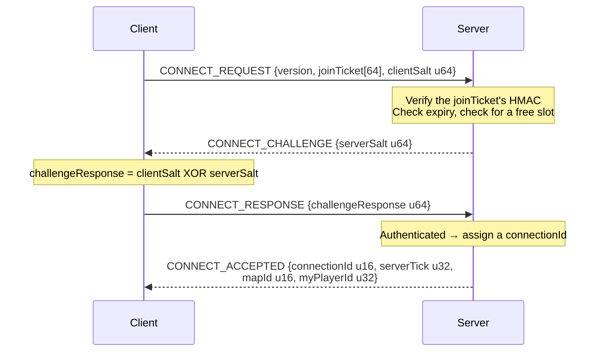
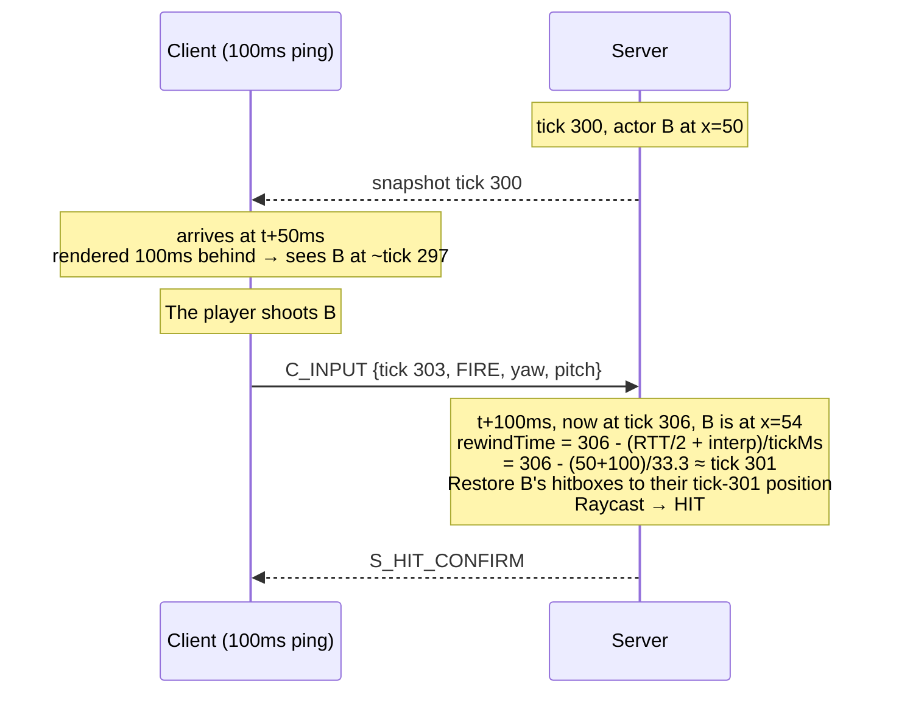
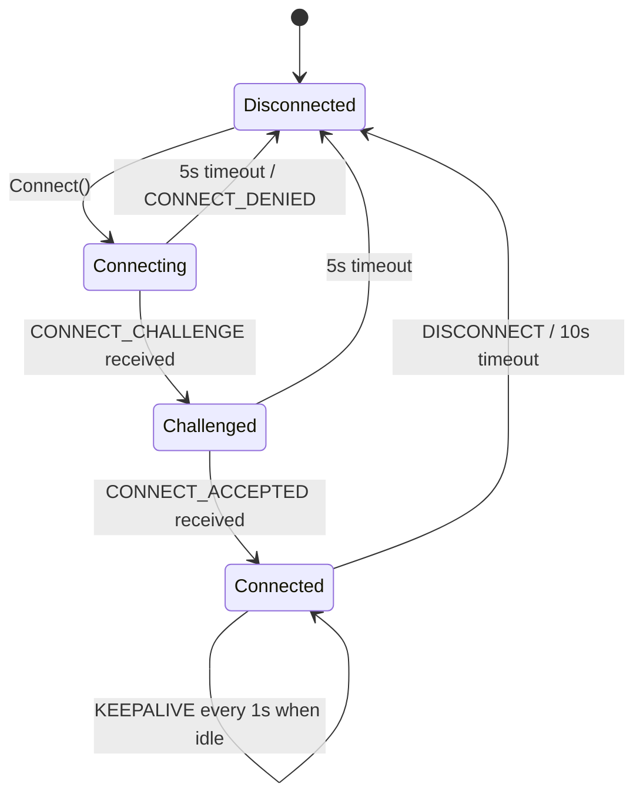

# Protocol Specification — Ironfront Reborn

**Version: 1.0.0-draft** · Status: **MUST BE FROZEN BY THE END OF WEEK 1**

> This is the shared contract for all 4 people. Every offset, every enum value and every
> quantization constant in this document is **mandatory**. Nobody may interpret them differently.
> See [conventions.md](conventions.md) for the protocol change process.
>
> **The single source of these constants in code:** `Ironfront.Net.Protocol/ProtocolConstants.cs`.
> Re-hardcoding any number from this document anywhere else is forbidden.

---

## 0. General conventions

- **Byte order: little-endian** across all of GSP (UDP) and MSP (TCP). Reason: x86 and ARM are both
  little-endian, so this avoids a redundant swap. `BitConverter` already defaults to little-endian
  on .NET, but **the code must not depend on `BitConverter.IsLittleEndian`** (use manual shifts).
- Data types: `u8 u16 u32 u64 i8 i16 i32 f32` — bit widths as named.
- `[n]` = an array of n elements. `{...}` = a nested struct.
- Every "reserved" field must be written as 0 and ignored on receive (kept for future versions).

---

# PART A — GSP: Game Server Protocol (UDP)

## 1. Global constants

```csharp
// Ironfront.Net.Protocol/ProtocolConstants.cs
public static class ProtocolConstants
{
    public const ushort PROTOCOL_ID       = 0x4946;  // 'IF' — filters out junk packets
    public const byte   PROTOCOL_VERSION  = 1;

    public const int    MTU_SAFE          = 1200;    // safe through any router
    public const int    GSP_HEADER_SIZE   = 16;
    public const int    MAX_PAYLOAD       = MTU_SAFE - GSP_HEADER_SIZE;  // 1184

    public const int    SIM_TICK_RATE     = 30;      // Hz
    public const int    SNAPSHOT_RATE     = 20;      // Hz
    public const int    INPUT_SEND_RATE   = 30;      // Hz
    public const int    INPUT_REDUNDANCY  = 3;       // frames repeated per packet

    public const int    KEEPALIVE_MS      = 1000;
    public const int    TIMEOUT_MS        = 10000;
    public const int    ACK_BITFIELD_BITS = 32;

    public const int    MAX_FRAGMENTS     = 64;      // → max logical payload ~75 KB
    public const int    FRAGMENT_TIMEOUT_MS = 2000;

    public const int    INTERP_BUFFER_MS  = 100;
    public const int    MAX_REWIND_MS     = 200;
    public const int    HITBOX_HISTORY_MS = 1000;

    public const int    MAX_PLAYERS       = 16;
    public const int    MAX_BOTS          = 32;
    public const int    MAX_ACTORS        = 64;      // = MAX_PLAYERS + MAX_BOTS + headroom
}
```

---

## 2. GSP header (16 bytes, every datagram)

```
Offset  Size  Type   Field           Description
------  ----  -----  --------------  --------------------------------------------------
  0      2    u16    protocolId      Always 0x4946. Mismatch → drop silently, no reply
  2      1    u8     packetType      See § 3
  3      1    u8     flags           Bitfield, see § 2.1
  4      2    u16    sequence        The SENDER's packet sequence number, incrementing, wraps 65535→0
  6      2    u16    ack             Highest sequence the sender has RECEIVED from the peer
  8      4    u32    ackBitfield     The 32 packets before `ack`. bit i = 1 ⇔ received (ack - 1 - i)
 12      2    u16    connectionId    Assigned by the server at CONNECT_ACCEPTED. 0 before connecting
 14      2    u16    payloadLength   Payload bytes following the header. ≤ 1184
------  ----
 16           payload[payloadLength]
```

### 2.1. The `flags` bitfield

| Bit | Name | Meaning |
|---|---|---|
| 0 | `RELIABLE` | This packet must be acked, and retransmitted if lost |
| 1 | `FRAGMENTED` | The payload is one fragment, see § 6 |
| 2 | `ORDERED` | Must be delivered in order within its channel |
| 3 | `COMPRESSED` | Payload is compressed (unused in v1, reserved) |
| 4–7 | reserved | Must be 0 |

### 2.2. The ack mechanism — a concrete example

Suppose A has received sequences 98, 99, 101, 103 from B (100 and 102 were lost).
When A sends its next packet, A writes:

```
ack         = 103
ackBitfield = bit0 → seq 102 = 0 (lost)
              bit1 → seq 101 = 1
              bit2 → seq 100 = 0 (lost)
              bit3 → seq  99 = 1
              bit4 → seq  98 = 1
              → 0b...00011010 = 0x1A
```

B receives it and immediately knows 100 and 102 never arrived. Because every packet carries 33
pieces of ack information (1 + 32), an ack is only lost if 33 consecutive packets are lost — in
practice, never. **This is why no separate ACK packet is needed.**

### 2.3. Sequence comparison with wrap-around

`sequence` is a u16 and wraps after 65535. At 30 packets/second, that's every ~36 minutes. It must
not be compared with a plain `>`.

```csharp
// Ironfront.Net.Protocol/SequenceMath.cs — SSOT, shared by all 4
public static bool IsNewer(ushort a, ushort b)
{
    const ushort HALF = 32768;
    return (a > b && a - b <= HALF) || (b > a && b - a > HALF);
}

public static int Distance(ushort a, ushort b) => (short)(a - b);
```

> **Known trap:** writing `if (seq > lastSeq)` works perfectly for 36 minutes and then breaks. This
> is the kind of bug that only surfaces in long-running tests. Unit tests for `IsNewer` around the
> boundary pairs — (65535, 0), (65530, 5), (0, 65535) — are mandatory.

---

## 3. `packetType`

| Value | Name | Direction | Reliable | Description |
|---|---|---|---|---|
| `0x01` | `CONNECT_REQUEST` | C→S | Yes (retry) | Requests a connection, carries the joinTicket |
| `0x02` | `CONNECT_CHALLENGE` | S→C | Yes (retry) | The server sends a nonce |
| `0x03` | `CONNECT_RESPONSE` | C→S | Yes (retry) | The client answers the challenge |
| `0x04` | `CONNECT_ACCEPTED` | S→C | Yes (retry) | Assigns a connectionId |
| `0x05` | `CONNECT_DENIED` | S→C | No | Carries a reason code |
| `0x06` | `DISCONNECT` | Both | No (sent 3×) | Deliberate disconnect |
| `0x07` | `KEEPALIVE` | Both | No | Keeps the connection alive, measures RTT |
| `0x10` | `PAYLOAD` | Both | Per flags | Carries messages, see § 4 |
| `0x11` | `FRAGMENT` | Both | Yes | One fragment of a large payload |

### 3.1. Handshake



**Why there's a challenge:** to prevent IP-spoofing amplification. An attacker spoofing a victim's
IP in a CONNECT_REQUEST never receives the `serverSalt`, so they can't complete the handshake and
the server allocates no resources.

Retry: CONNECT_REQUEST is resent every 250 ms, up to 20 times (5 seconds), then reports an error.

### 3.2. `CONNECT_DENIED` — reason codes (u8)

| Code | Meaning |
|---|---|
| 1 | Server full |
| 2 | Protocol version mismatch |
| 3 | joinTicket invalid or expired |
| 4 | Banned |
| 5 | Server shutting down |
| 6 | Already connected (duplicate playerId) |

---

## 4. Payload: the message frame

A `PAYLOAD` datagram carries **one or more** messages, batched together to reduce header overhead.

```
u8   channelId          See § 5
u16  messageCount
repeat messageCount times:
    u8   msgType        See § 4.1
    u16  msgLength      Body size in bytes
    u8[] body
```

### 4.1. `msgType`

**Client → Server (0x20–0x3F)**

| Value | Name | Channel | Description |
|---|---|---|---|
| `0x20` | `C_INPUT` | 3 (unreliable-seq) | Input frames, see § 4.2 |
| `0x22` | `C_LOADOUT_SELECT` | 2 (reliable-ord) | Weapon selection before spawning |
| `0x23` | `C_SPAWN_REQUEST` | 2 | Requests a respawn at a spawn point |
| `0x24` | `C_CHAT` | 2 | In-match chat |
| `0x25` | `C_PING` | 0 (unreliable) | RTT measurement, carries a client timestamp |
| `0x26` | `C_SEAT_REQUEST` | 2 | Enter/exit a vehicle seat (stretch goal) |
| `0x27` | `C_ACK_BASELINE` | 2 | Confirms snapshot tick N was received (for delta) |

**Server → Client (0x40–0x5F)**

| Value | Name | Channel | Description |
|---|---|---|---|
| `0x40` | `S_SNAPSHOT` | 1 (unreliable-seq) | World state, see § 4.3 |
| `0x41` | `S_SPAWN_ACTOR` | 2 | A new actor appeared |
| `0x42` | `S_DESPAWN_ACTOR` | 2 | An actor disappeared |
| `0x43` | `S_HIT_CONFIRM` | 2 | Hit confirmation (for the hitmarker) |
| `0x44` | `S_DEATH` | 2 | Someone died, with a force vector for the local ragdoll |
| `0x45` | `S_MATCH_STATE` | 2 | Score, time, match state |
| `0x46` | `S_CAPTURE_POINT` | 2 | A capture point changed state |
| `0x47` | `S_CHAT` | 2 | Chat broadcast |
| `0x48` | `S_PONG` | 0 | Ping reply, echoes the client timestamp |
| `0x49` | `S_WEAPON_FIRE` | 1 | Another actor just fired (for effects and audio) |
| `0x4A` | `S_EXPLOSION` | 2 | An explosion at a position, for effects + screen shake |
| `0x4B` | `S_PLAYER_LIST` | 2 | Player list + scores (for the scoreboard) |

### 4.2. `C_INPUT` (0x20) — byte layout

```
u32  startTick            Tick of the FIRST frame in the packet
u8   frameCount           1..8, usually 3 (INPUT_REDUNDANCY)
repeat frameCount times:
    i8   moveX            -127..127  →  -1.0 .. 1.0  (divide by 127)
    i8   moveZ            as above
    u16  yaw              0..65535   →  0 .. 360°    (× 360/65536)
    i16  pitch            -16384..16384 → -90 .. 90° (× 90/16384)
    u16  buttons          Bitfield, see below
```

Size: `4 + 1 + 3 × 8 = 29 bytes` at frameCount = 3.
At 30 Hz: `29 × 30 = 870 B/s` upstream. Negligible.

**The `buttons` bitfield (u16)**

| Bit | Button | Bit | Button |
|---|---|---|---|
| 0 | Fire | 8 | LeanLeft |
| 1 | Aim (ADS) | 9 | LeanRight |
| 2 | Reload | 10 | Use / Interact |
| 3 | Jump | 11 | SwitchWeapon0 |
| 4 | Crouch | 12 | SwitchWeapon1 |
| 5 | Sprint | 13 | SwitchWeapon2 |
| 6 | Prone | 14 | SwitchWeapon3 |
| 7 | ThrowGrenade | 15 | reserved |

**Why we repeat 3 frames:** input is critical data but is sent unreliably. Without redundancy, one
lost packet costs the server an entire tick of input → the character stalls. With a redundancy of 3,
three consecutive packets must be lost before anything is missed. The cost is only 16 extra bytes
per packet. That's far cheaper than sending reliably (which would retransmit already-stale input).

**Server-side handling:** keep `lastProcessedInputTick` per connection. Discard any frame with
`tick <= lastProcessedInputTick` (already processed — it's a duplicate copy).

### 4.3. `S_SNAPSHOT` (0x40) — byte layout

```
u32  serverTick                Tick at which the server built this snapshot
u32  lastProcessedInputTick    Last input tick the server applied for THIS client (reconciliation)
u32  baselineTick              0 = full snapshot; non-zero = delta against that snapshot tick
u8   actorCount
repeat actorCount times:
    u16  actorId
    u8   changeMask            Bitfield, see below
    [bit0] position    i16 × 3   Quantized, see § 4.4
    [bit1] rotation    u16 yaw + i8 pitch
    [bit2] velocity    i8 × 3    Quantized -64..64 m/s
    [bit3] stateFlags  u8        See below
    [bit4] health      u8        0..100
    [bit5] weapon      u8 weaponId + u8 ammoInClip
    [bit6] team        u8        Only sent on change (rare)
    [bit7] seatInfo    u16 vehicleId + u8 seatIndex  (stretch goal)
```

**`changeMask`**: bit i = 1 ⇔ field i is present in this packet. In a full snapshot, every needed
bit is 1. In a delta snapshot, only the bits for fields that actually changed since `baselineTick`.

**`stateFlags` (u8)**

| Bit | Meaning |
|---|---|
| 0 | IsAlive |
| 1 | IsCrouching |
| 2 | IsProne |
| 3 | IsSprinting |
| 4 | IsAiming |
| 5 | IsInWater |
| 6 | IsRagdoll (dead; the client enables its own ragdoll) |
| 7 | IsSeated |

**Size estimate**

| Case | Bytes/actor |
|---|---|
| Full (every field) | 2 + 1 + 6 + 3 + 3 + 1 + 1 + 2 + 1 = **20** |
| Typical delta (pos + rot only) | 2 + 1 + 6 + 3 = **12** |
| Delta for a stationary actor | 2 + 1 = **3** |

With 48 actors averaging ~12 B: `48 × 12 = 576 B/snapshot`.
Plus the GSP header and framing: ~600 B × 20 Hz = **~12 KB/s** downstream.
After interest management (only ~20 actors actually sent): **~5–7 KB/s**. Target met.

### 4.4. Quantization — mandatory shared constants

> **This is the easiest place to get wrong and the worst place to get it wrong.** If the client uses
> `POS_RANGE = 2048` while the server uses `4096`, characters end up at double the wrong position.
> The bug is very hard to spot because there's no runtime error.

```csharp
public static class Quantize
{
    // ===== POSITION =====
    // The current map fits inside a ±2048 m box. An i16 has 65536 levels.
    public const float POS_MIN  = -2048f;
    public const float POS_MAX  =  2048f;
    public const float POS_RANGE = POS_MAX - POS_MIN;        // 4096
    // Resolution = 4096 / 65536 = 0.0625 m = 6.25 cm. Good enough for an FPS.

    public static short PackPos(float v)
    {
        float t = Mathf.Clamp((v - POS_MIN) / POS_RANGE, 0f, 1f);
        return (short)(t * 65535f - 32768f);
    }
    public static float UnpackPos(short q)
        => ((q + 32768f) / 65535f) * POS_RANGE + POS_MIN;

    // ===== ANGLES =====
    public const float YAW_SCALE   = 65536f / 360f;    // u16
    public const float PITCH_SCALE = 16384f / 90f;     // i16, using ±16384
    // Yaw resolution = 360/65536 = 0.0055° — more than precise enough for aiming
    // Pitch resolution = 90/16384 = 0.0055°

    // ===== VELOCITY =====
    public const float VEL_MAX = 64f;                  // m/s, enough for everything but aircraft
    public const float VEL_SCALE = 127f / VEL_MAX;     // i8
    // Resolution = 64/127 = 0.5 m/s — only used for extrapolation, which is fine

    // ===== HEALTH =====
    // health is a u8 directly in 0..100, no scaling needed
}
```

**Mandatory verification (conformance test):**
```
PackPos(0f)      → 0        UnpackPos(0)      ≈ 0f      (error < 0.07 m)
PackPos(100f)    → 1600     UnpackPos(1600)   ≈ 100f
PackPos(-2048f)  → -32768   UnpackPos(-32768) = -2048f
PackPos(2048f)   → 32767    UnpackPos(32767)  ≈ 2048f
```

### 4.5. `S_HIT_CONFIRM` (0x43)

```
u16  targetActorId
u16  damage            × 10 (fixed point, 1 decimal place)
u8   hitboxType        0=body 1=head 2=limb
u8   flags             bit0 = killed, bit1 = headshot
```

### 4.6. `S_DEATH` (0x44)

```
u16  victimActorId
u16  killerActorId     0xFFFF if killed by the environment
u8   causeOfDeath      0=bullet 1=explosion 2=fall 3=drown 4=vehicle
i16  forceX, forceY, forceZ    Quantized velocity, so the client's ragdoll flies the right way
u8   hitboxHit
```

On receiving this the client: enables the ragdoll **locally**, plays audio, updates the killfeed.
Corpses are not synchronized between clients — accepted per AD-4.

### 4.7. `S_WEAPON_FIRE` (0x49)

```
u16  shooterActorId
u8   weaponId
i16  dirX, dirY, dirZ   Quantized fire direction (for tracers)
```

Sent unreliable-sequenced: losing one gunshot is harmless. Used for muzzle flashes, 3D audio and
other players' tracers.

---

## 5. Channels

Reliability isn't applied to the whole connection but per channel. Four channels in v1:

| ID | Type | Used for | Behavior on loss |
|---|---|---|---|
| 0 | Unreliable-unsequenced | Ping/pong | Ignored |
| 1 | Unreliable-sequenced | `S_SNAPSHOT`, `S_WEAPON_FIRE` | Ignored. **A packet arriving older than one already received is DROPPED** (stale data is worthless) |
| 2 | Reliable-ordered | All gameplay events, chat, spawn/despawn | Retransmitted until acked. Delivered in order, with early arrivals buffered |
| 3 | Unreliable-sequenced | `C_INPUT` | Like channel 1, but with application-level redundancy |

**Why channels 1 and 3 are separate:** they're the same type but flow in different directions at
different rates. Separating them keeps the sequence counters independent, so a lost snapshot never
causes an input to be wrongly dropped.

**The channel-2 trap (reliable-ordered):** if message N is lost, messages N+1 and N+2 that already
arrived have to sit in the buffer. That is head-of-line blocking — but we accept it deliberately
**for events only**, where ordering genuinely matters (you can't process a "death" before a
"spawn"). Snapshots live on a different channel and are unaffected. **This is the core advantage of
UDP over TCP**: TCP forces everything into one stream.

---

## 6. Fragmentation

Messages larger than `MAX_PAYLOAD` (1184 bytes) must be split. This mainly happens with the first
full snapshot on joining a match (64 actors × 20 B ≈ 1280 B) and with `S_PLAYER_LIST`.

The extra header (placed immediately after the GSP header when `flags.FRAGMENTED = 1`):

```
u16  fragmentGroupId      Fragment group id, incrementing
u8   fragmentIndex        0-based
u8   fragmentCount        Total fragments, ≤ 64
```

Rules:
- Every fragment shares the same `fragmentGroupId`.
- Fragments must be sent **reliably** (lose one and the whole group is useless).
- The receiver buffers by `fragmentGroupId` and reassembles once `fragmentCount` is complete.
- If it isn't complete within `FRAGMENT_TIMEOUT_MS` (2000 ms) → discard the group, free the memory.
- **Anti-DoS limit:** at most 8 groups awaiting reassembly per connection. Over that → drop the
  oldest group.

> **Trap:** an attacker must not be able to send `fragmentCount = 64` and then only one fragment,
> repeated thousands of times → exhausting server RAM. The 8-group limit plus the timeout is
> mandatory, not optional.

---

## 7. Lag compensation

### 7.1. The principle

A client with 100 ms ping sees the world as it was **150 ms ago** (50 ms of transit + 100 ms of
interpolation buffer). When they shoot someone in the head, by the time the server receives the
packet that person has already moved. If the server raycast at the current position, a high-ping
client would almost never land a shot.

**The fix:** the server rewinds hitboxes to the exact moment the client was seeing.



### 7.2. The formula

```csharp
// Ironfront_Reborn/Assets/Scripts/Net/Server/HitboxHistory.cs
int rewindTicks = Mathf.Clamp(
    Mathf.RoundToInt((conn.SmoothedRttMs * 0.5f + ProtocolConstants.INTERP_BUFFER_MS)
                     / (1000f / ProtocolConstants.SIM_TICK_RATE)),
    0,
    ProtocolConstants.MAX_REWIND_MS * ProtocolConstants.SIM_TICK_RATE / 1000);   // = 6 ticks

int targetTick = currentServerTick - rewindTicks;
```

`MAX_REWIND_MS = 200` is the **anti-abuse limit**: a cheater could deliberately inflate their ping
to "shoot further into the past". 200 ms is the figure every commercial FPS uses.

### 7.3. The hitbox history ring buffer

```csharp
public struct HitboxSnapshot
{
    public int      Tick;
    public Vector3  Position;
    public Quaternion Rotation;
    public Bounds[] Hitboxes;    // body, head, limbs — taken from the existing Hitbox.cs
}

// 30 ticks = 1 second of history, per actor
private readonly HitboxSnapshot[] _history = new HitboxSnapshot[30];
```

**Mandatory optimization (risk R6):** only keep history for actors that **could actually be shot** —
i.e. currently in the Near/Mid zone of at least one real player. A bot in the corner of the map
needs no history.

### 7.4. The accepted consequence

Low-ping players will sometimes feel "I was already behind the wall and still got shot". That's
because the high-ping shooter fired while you were still exposed. It's an inherent trade-off present
in every FPS, not a bug.

---

## 8. Congestion control

Simplified for this scope: **adjust the snapshot rate based on RTT**.

```csharp
// Ironfront.Net.Transport/CongestionControl.cs
// Two modes: GOOD and BAD
// GOOD: send 20 snapshots/s
// BAD:  send 10 snapshots/s, reduce detail (drop velocity, tighten the cull threshold)

if (mode == Mode.Good && smoothedRtt > 250f)
{
    mode = Mode.Bad;
    badModeTimer = 10f;          // stay in BAD for at least 10 seconds
}
else if (mode == Mode.Bad && smoothedRtt < 200f && badModeTimer <= 0f)
{
    mode = Mode.Good;
}
// 250/200ms hysteresis so it doesn't oscillate back and forth
```

RTT is measured with an EWMA (exponentially weighted moving average):
```csharp
smoothedRtt = smoothedRtt * 0.9f + newSample * 0.1f;
```

---

## 9. Connection state machine



---

# PART B — MSP: Master Server Protocol (TCP)

## 10. Framing

TCP is a byte stream with no message boundaries. We must frame it ourselves:

```
u32  length        Byte count AFTER this field (msgType + body). Big-endian (network standard)
u16  msgType
u8[] body          UTF-8 JSON
```

> **The classic TCP trap:** a single `Receive()` can return half a message, or 3 messages stuck
> together. An accumulating buffer is **mandatory**, parsing only once `length` bytes are available.
> This is the number-one mistake made by people new to TCP.
>
> Limit `length` to ≤ 64 KB; anything larger → close the connection (memory-exhaustion defense).

MSP bodies use JSON (unlike GSP, which is binary) because: the frequency is low so the overhead
doesn't matter, it's easy to debug in Wireshark/logs, and fields can be added later without breaking
compatibility.

## 11. MSP message table

**Client ↔ Master**

| Value | Name | Direction | Body |
|---|---|---|---|
| `0x0001` | `LOGIN_REQ` | C→M | `{username, passwordHash, clientVersion}` |
| `0x0002` | `LOGIN_RES` | M→C | `{ok, errorCode, sessionToken, playerId, displayName}` |
| `0x0003` | `REGISTER_REQ` | C→M | `{username, passwordHash, displayName}` |
| `0x0004` | `REGISTER_RES` | M→C | `{ok, errorCode}` |
| `0x0010` | `ROOM_LIST_REQ` | C→M | `{}` |
| `0x0011` | `ROOM_LIST_RES` | M→C | `{rooms:[{roomId, name, mapId, players, maxPlayers, state}]}` |
| `0x0012` | `ROOM_CREATE_REQ` | C→M | `{name, mapId, maxPlayers, botCount, isPrivate, password}` |
| `0x0013` | `ROOM_CREATE_RES` | M→C | `{ok, roomId, errorCode}` |
| `0x0014` | `ROOM_JOIN_REQ` | C→M | `{roomId, password}` |
| `0x0015` | `ROOM_JOIN_RES` | M→C | `{ok, gameServerIp, gameServerPort, joinTicket, errorCode}` |
| `0x0016` | `ROOM_LEAVE_REQ` | C→M | `{}` |
| `0x0017` | `ROOM_STATE_PUSH` | M→C | `{roomId, members:[{playerId, name, team, ready}], state}` |
| `0x0018` | `ROOM_READY_REQ` | C→M | `{ready}` |
| `0x0020` | `CHAT_SEND` | C→M | `{channel, text}` |
| `0x0021` | `CHAT_PUSH` | M→C | `{channel, fromPlayerId, fromName, text, timestamp}` |
| `0x0030` | `MATCHMAKE_REQ` | C→M | `{preferredMapId}` |
| `0x0031` | `MATCHMAKE_RES` | M→C | `{ok, roomId, estimatedWaitSec}` |
| `0x0032` | `MATCHMAKE_CANCEL` | C→M | `{}` |
| `0x00F0` | `HEARTBEAT` | C→M | `{}` — every 15s |
| `0x00F1` | `ERROR_PUSH` | M→C | `{code, message}` |

**Game Server ↔ Master**

| Value | Name | Direction | Body |
|---|---|---|---|
| `0x0100` | `GS_REGISTER` | G→M | `{serverSecret, publicIp, udpPort, maxPlayers, mapIds:[]}` |
| `0x0101` | `GS_REGISTER_RES` | M→G | `{ok, serverId}` |
| `0x0102` | `GS_HEARTBEAT` | G→M | `{serverId, currentPlayers, cpuPercent, avgTickMs, state}` — every 5s |
| `0x0103` | `GS_MATCH_STARTED` | G→M | `{serverId, roomId}` |
| `0x0104` | `GS_MATCH_ENDED` | G→M | `{serverId, roomId, results:[{playerId, kills, deaths, score}]}` |
| `0x0105` | `GS_PLAYER_JOINED` | G→M | `{serverId, playerId}` |
| `0x0106` | `GS_PLAYER_LEFT` | G→M | `{serverId, playerId}` |

## 12. joinTicket — the bridge between TCP and UDP

This is where the two protocols meet, and the easiest place to design badly.

**The problem:** the client connects to the game server over UDP. How does the game server know this
client really logged in, and who they are?

**Chosen approach — an HMAC ticket, no round-trip needed:**

```
joinTicket (64 bytes):
  u32  playerId
  u16  serverId
  u16  roomId
  u64  expiresAtUnixMs        (valid for 60 seconds from issue)
  u8[16] displayNameUtf8      (truncated/padded to 16 bytes)
  u8[32] hmac                 = HMAC-SHA256(the first 32 payload bytes, SHARED_SECRET)[0..32]
```

- The master server issues the ticket when it replies with `ROOM_JOIN_RES`.
- The client passes the ticket through verbatim in `CONNECT_REQUEST`.
- The game server **verifies the HMAC itself** with `SHARED_SECRET` (the same secret configured on
  both sides) and checks `expiresAtUnixMs > now`. No need to call back to the master → no added
  latency, and no dependency on the master still being alive.

**Where `SHARED_SECRET` lives:** in the `IRONFRONT_SHARED_SECRET` environment variable, never
committed to git. `.env.example` lists the variable name but no value.

**Why not just use the sessionToken:** the sessionToken is a long-lived login secret; sending it
unencrypted over UDP to a game server (potentially operated by a third party) is a leak. The ticket
expires after 60 seconds and only works for one specific server.

---

## 13. Shared error codes

| Code | Meaning |
|---|---|
| 0 | OK |
| 1000 | Wrong username or password |
| 1001 | Username already exists |
| 1002 | Invalid username (length 3–16, only a-z0-9_) |
| 1003 | Session expired, log in again |
| 1004 | Wrong client version |
| 2000 | Room doesn't exist |
| 2001 | Room is full |
| 2002 | Wrong room password |
| 2003 | Match already started |
| 2004 | Already in another room |
| 3000 | No game server available |
| 3001 | Game server not responding |
| 9000 | Internal server error |
| 9001 | Rate limited, try again later |

---

## 14. Conformance checklist

This test suite (C's phase-01) is the **referee** whenever two people disagree about the protocol.

- [ ] The GSP header is exactly 16 bytes, with `protocolId` at offset 0 = `0x4946`
- [ ] `IsNewer(0, 65535)` = true; `IsNewer(65535, 0)` = false
- [ ] `IsNewer(5, 65530)` = true (wrapped)
- [ ] `PackPos`/`UnpackPos` round-trip error < 0.07 m across the full ±2048 range
- [ ] Yaw round-trip error < 0.01°
- [ ] Parsing a hard-coded hex sample packet → yields the correct struct (one test per packetType)
- [ ] Serializing a struct → yields the correct hard-coded hex byte array (the reverse test)
- [ ] `C_INPUT` with frameCount = 3 is exactly 29 bytes
- [ ] A full 64-actor snapshot fragments correctly and reassembles bit-for-bit
- [ ] A delta snapshot with `changeMask` = 0b00000011 contains only pos + rot
- [ ] MSP framing: 3 messages glued into 1 TCP segment → parses into 3 messages
- [ ] MSP framing: 1 message split across 5 `Send()` calls → parses into 1 message
- [ ] MSP `length` > 64 KB → connection closed
- [ ] joinTicket with a bad HMAC → `CONNECT_DENIED` code 3
- [ ] Expired joinTicket → `CONNECT_DENIED` code 3

---

## 15. Protocol changelog

| Version | Date | Author | Change | PR |
|---|---|---|---|---|
| 1.0.0-draft | Week 1 | Whole team | Initial version | — |

> Every change after the freeze must: bump `PROTOCOL_VERSION`, add a row to this table, and land via
> a PR with 2 approvals. A client and server with different `PROTOCOL_VERSION` → `CONNECT_DENIED`
> code 2.
