# Dev A — Phase 01: Connection and remote players

**Weeks 3–6** · Milestone **M1 (the make-or-break milestone)** · Estimate **3.0 person-weeks**

> Goal in one sentence: **two clients see each other moving smoothly over our own UDP stack**, at
> 100 ms RTT and 5% packet loss.

This is the most important milestone in the project. If it isn't met by the end of week 6, trigger
the contingency in
[`feasibility-study.md § 6`](../../00-shared/feasibility-study.md#6-contingency-plan).

---

## 1. Objectives

| # | Objective |
|---|---|
| 1 | `NetworkActorController` — the third subclass of `ActorController` |
| 2 | Entity interpolation — remote actors move smoothly even though snapshots arrive at 20 Hz |
| 3 | Client bootstrap: connect, receive snapshots, spawn/despawn actors |
| 4 | Send `C_INPUT` to the server at 30 Hz with a redundancy of 3 |
| 5 | Replace the stubs with B's and C's real transport and replication |

**Not in this phase:** prediction, reconciliation, shooting, dying. Just moving and seeing each
other. Don't take on more.

---

## 2. Detailed tasks

### Task 1 — `NetworkActorController` (3 days)

The third subclass. It **makes no decisions of its own**; it just reads back what the interpolator
gives it.

```csharp
// Assets/Scripts/Net/Client/NetworkActorController.cs
public sealed class NetworkActorController : ActorController
{
    private readonly NetInputSource _input = new();
    private EntityInterpolator      _interp;

    public ushort ActorId  { get; private set; }
    public bool   IsLocal  { get; private set; }

    public void Initialize(ushort actorId, bool isLocal, EntityInterpolator interp)
    {
        ActorId = actorId; IsLocal = isLocal; _interp = interp;
    }

    /// <summary>Called every frame BEFORE Actor.Update(). Script Execution Order = -100.</summary>
    public void PullFromNetwork()
    {
        var s = _interp.Sample(Time.time);       // the interpolated state
        _input.SetFrame(new NetInputFrame {
            Yaw = s.Yaw, Pitch = s.Pitch,
            MoveX = s.Velocity.x, MoveZ = s.Velocity.z,
            Buttons = s.Buttons
        });

        // Remote actor: set the transform directly, do NOT let physics drive it
        transform.position = s.Position;
        actor.SetFacing(s.Yaw, s.Pitch);
    }

    public override Vector3 FacingDirection()
        => Quaternion.Euler(_input.Pitch, _input.Yaw, 0f) * Vector3.forward;
    public override Vector3 Velocity()   => _interp.CurrentVelocity;
    public override bool    Fire()       => _input.Fire;
    public override bool    Aiming()     => _input.Aiming;
    public override bool    Crouch()     => _input.Crouch;
    public override bool    Reload()     => _input.Reload;
    public override bool    IsSprinting()=> _input.Sprint;
    public override float   Lean()       => _input.Lean;
    public override bool    OnGround()   => (_interp.StateFlags & StateFlag.OnGround) != 0;

    // Remote actors NEVER run ragdolls — decision AD-4
    public override void StartRagdoll() { /* deliberately empty */ }
    public override void GettingUp()    { }
    public override void EndRagdoll()   { }

    // Disable everything that only makes sense for the local player
    public override SpawnPoint SelectedSpawnPoint() => null;
    public override Transform  WeaponParent()       => actor.defaultWeaponParent;
    public override void       DisableInput()       { }
    public override void       EnableInput()        { }
    public override Vector2    CarInput()           => Vector2.zero;
    public override Vector4    HelicopterInput()    => Vector4.zero;
}
```

**Trap 1 — execution order.** `NetworkActorController.PullFromNetwork()` must run **before**
`Actor.Update()`. Set Script Execution Order to `-100` for `NetworkActorController`. In the wrong
order, the actor uses the previous frame's data, adding a hard-to-spot 1-frame delay.

**Trap 2 — physics fighting over the transform.** `Actor` has a `hipRigidbody`. If you set
`transform.position` while the Rigidbody still has `isKinematic = false`, PhysX overwrites it on the
next `FixedUpdate` → the character jitters constantly. Mandatory:

```csharp
// When initializing a remote actor
foreach (var rb in actor.GetComponentsInChildren<Rigidbody>())
{
    rb.isKinematic       = true;
    rb.detectCollisions  = false;   // remote actors need no collisions, the server handles that
}
actor.ragdoll.enabled = false;
actor.animator.enabled = true;      // animation-driven
```

### Task 2 — `EntityInterpolator` (4 days)

The heart of "looking smooth". Snapshots arrive at 20 Hz (one every 50 ms) but rendering runs at
60–144 fps.

**The principle:** render remote actors at `now - INTERP_BUFFER_MS` (100 ms in the past),
interpolating between the two snapshots already received. Trade 100 ms of display latency for
continuous motion.

```mermaid
gantt
    dateFormat X
    axisFormat %L
    title Interpolation timeline (100ms buffer)
    section Snapshots received
    S1 (t=0)      :milestone, 0, 0
    S2 (t=50)     :milestone, 50, 0
    S3 (t=100)    :milestone, 100, 0
    S4 (t=150)    :milestone, 150, 0
    section Render
    Rendering at t=50  :active, 50, 1
```



At real time `t=150ms` we've received S1..S4, but render at `150 - 100 = 50ms`, i.e. exactly S2. At
`t=170` we interpolate between S2 (50 ms) and S3 (100 ms) with a factor of `(70-50)/(100-50) = 0.4`.

```csharp
// Assets/Scripts/Net/Client/EntityInterpolator.cs
public sealed class EntityInterpolator
{
    private struct Sample
    {
        public float    RecvTime;      // Time.time on arrival
        public uint     ServerTick;
        public Vector3  Position;
        public float    Yaw, Pitch;
        public Vector3  Velocity;
        public byte     StateFlags;
        public ushort   Buttons;
    }

    // A 16-sample ring buffer = 800ms of history at 20Hz, plenty for a 100ms buffer
    private readonly Sample[] _buf = new Sample[16];
    private int _count, _head;

    public Vector3 CurrentVelocity { get; private set; }
    public byte    StateFlags      { get; private set; }

    public void Push(in ActorState state, uint serverTick)
    {
        _head = (_head + 1) % _buf.Length;
        _buf[_head] = new Sample {
            RecvTime = Time.time, ServerTick = serverTick,
            Position = state.Position, Yaw = state.Yaw, Pitch = state.Pitch,
            Velocity = state.Velocity, StateFlags = state.StateFlags
        };
        if (_count < _buf.Length) _count++;
    }

    public InterpolatedState Sample(float now)
    {
        float renderTime = now - ProtocolConstants.INTERP_BUFFER_MS / 1000f;

        // Find the pair of samples bracketing renderTime
        if (!TryFindBracket(renderTime, out var older, out var newer))
            return Extrapolate(renderTime);          // not enough data → extrapolate

        float span = newer.RecvTime - older.RecvTime;
        float t    = span > 0.0001f ? (renderTime - older.RecvTime) / span : 0f;
        t = Mathf.Clamp01(t);

        CurrentVelocity = Vector3.Lerp(older.Velocity, newer.Velocity, t);
        StateFlags      = newer.StateFlags;          // flags are NOT interpolated, take the newest

        return new InterpolatedState {
            Position = Vector3.Lerp(older.Position, newer.Position, t),
            Yaw      = Mathf.LerpAngle(older.Yaw,  newer.Yaw,  t),   // LerpAngle, not Lerp!
            Pitch    = Mathf.Lerp(older.Pitch, newer.Pitch, t),
            Velocity = CurrentVelocity,
            StateFlags = StateFlags
        };
    }

    /// <summary>When packets are lost and no sample exists after renderTime.</summary>
    private InterpolatedState Extrapolate(float renderTime)
    {
        ref var last = ref _buf[_head];
        float dt = Mathf.Min(renderTime - last.RecvTime, 0.25f);  // extrapolate at most 250ms
        return new InterpolatedState {
            Position = last.Position + last.Velocity * dt,
            Yaw = last.Yaw, Pitch = last.Pitch,
            Velocity = last.Velocity, StateFlags = last.StateFlags
        };
    }
}
```

**Trap 3 — `Mathf.Lerp` on angles.** Interpolating yaw from 359° to 1° with `Lerp` spins 358° the
long way round. `Mathf.LerpAngle` is mandatory. This is a classic bug, and it presents as characters
occasionally whipping through a full rotation.

**Trap 4 — interpolating `StateFlags`.** Never interpolate discrete values (crouching/standing,
alive/dead). Take the value from the newer sample.

**Trap 5 — extrapolating too far.** If the connection drops for 5 seconds, extrapolation launches
the character off into infinity. Clamp it at 250 ms.

### Task 3 — `NetClientBootstrap` (3 days)

The client-side entry point that wires everything together.

```csharp
// Assets/Scripts/Net/Client/NetClientBootstrap.cs
public sealed class NetClientBootstrap : MonoBehaviour
{
    [SerializeField] private GameObject remoteActorPrefab;
    [SerializeField] private GameObject localActorPrefab;

    private ITransportClient _transport;
    private ISnapshotReader  _reader;
    private readonly Dictionary<ushort, NetworkActorController> _actors = new();
    private readonly Dictionary<ushort, EntityInterpolator>     _interps = new();
    private ushort _localActorId = 0xFFFF;

    private void Awake()
    {
        NetContext.SetRole(NetContext.Role.Client);
#if IRONFRONT_STUB
        _transport = new FakeTransportClient();
#else
        _transport = new UdpTransportClient();        // from B
#endif
        _reader = new SnapshotReader();               // from C
        _transport.OnMessage    += HandleMessage;
        _transport.OnConnected  += HandleConnected;
        _transport.OnDisconnected += HandleDisconnected;
    }

    private void Update()
    {
        _transport.Poll();                            // service the socket, raise events
        foreach (var a in _actors.Values) a.PullFromNetwork();
    }

    private void FixedUpdate() => SendInput();        // 30Hz when fixedDeltaTime = 1/30

    private void HandleMessage(ReadOnlyMemory<byte> data)
    {
        var span = data.Span;
        byte msgType = span[0];
        switch (msgType)
        {
            case MsgType.S_SNAPSHOT:     HandleSnapshot(span);   break;
            case MsgType.S_SPAWN_ACTOR:  HandleSpawn(span);      break;
            case MsgType.S_DESPAWN_ACTOR:HandleDespawn(span);    break;
            // other types in later phases
        }
    }

    private void HandleSnapshot(ReadOnlySpan<byte> span)
    {
        if (!_reader.TryReadSnapshot(span, out var snap)) { NetLog.Warn("corrupt snapshot"); return; }
        foreach (ref readonly var st in snap.Actors.AsSpan())
        {
            if (_interps.TryGetValue(st.ActorId, out var interp))
                interp.Push(in st, snap.ServerTick);
            // unknown actor → wait for S_SPAWN_ACTOR, don't create it here
        }
    }
}
```

**Trap 6 — snapshots arriving before spawns.** Snapshots travel on an unreliable channel while
spawns travel on a reliable-ordered one, so a snapshot can arrive first. Don't create actors from
snapshots — skip unknown actors and wait for `S_SPAWN_ACTOR`.

### Task 4 — Send input at 30 Hz with redundancy (2 days)

```csharp
private readonly NetInputFrame[] _inputHistory = new NetInputFrame[64];  // ring buffer
private uint _clientTick;

private void SendInput()
{
    _localInput.Sample(OptionsUi.GetOptions().mouseSensitivity);

    var frame = new NetInputFrame {
        Tick = _clientTick,
        MoveX = _localInput.MoveX, MoveZ = _localInput.MoveZ,
        Yaw = _localInput.Yaw, Pitch = _localInput.Pitch,
        Lean = _localInput.Lean, Buttons = _localInput.Buttons
    };
    _inputHistory[_clientTick % 64] = frame;      // kept for reconciliation in phase 02

    // Send the 3 most recent frames (INPUT_REDUNDANCY)
    Span<byte> buf = stackalloc byte[64];
    int len = InputSerializer.Write(buf, _inputHistory, _clientTick,
                                    ProtocolConstants.INPUT_REDUNDANCY);
    _transport.Send(channelId: 3, buf[..len], reliable: false);

    _clientTick++;
}
```

`stackalloc` avoids a heap allocation every tick (per the convention in
[`conventions.md § 3.2`](../../00-shared/conventions.md)).

### Task 5 — Real integration with B and C (3 days)

Swap `FakeTransportClient` → `UdpTransportClient` and `FakeSnapshotReader` → `SnapshotReader`.

**Integrate in steps; don't swap everything at once:**
1. Switch to the real transport, keep fake snapshots → confirm the UDP connection works
2. Switch to real snapshots, run 1 client + 1 server → confirm parsing is correct
3. Run 2 clients → milestone M1

Commit each step separately. If step 3 breaks, you know for certain the fault isn't in steps 1 or 2.

---

## 3. Acceptance criteria (M1)

| # | Criterion | How to verify |
|---|---|---|
| 1 | 2 clients connect to 1 server and see each other | A 30-second video with the 2 game windows side by side |
| 2 | Motion is smooth on LAN (0 ms, 0% loss) | Eyeball it — no stutter |
| 3 | **Motion is still smooth at 100 ms RTT + 5% loss** | Enable B's `NetworkSimulator`. 30-second video |
| 4 | Survives 30% packet loss (ugly, but not broken) | Characters may stutter, but must not teleport or vanish |
| 5 | Yaw interpolates correctly across the 0°/360° boundary | Test: spin in place 10 times, no reverse whipping |
| 6 | When a client disconnects, its actor is cleanly despawned | Kill 1 client; the other sees the actor disappear within 10 s |
| 7 | No heap allocation inside `Update()` | Unity Profiler, `GC Alloc` column for `NetClientBootstrap.Update` = 0 B |
| 8 | 48 fake actors at once still holds ≥ 60 FPS | Spawn 48 bots on the server, measure client FPS |
| 9 | Single-player still runs | Play for 5 minutes |

---

## 4. Risks in this phase

| Risk | Sign | Handling |
|---|---|---|
| Remote actors jitter from Rigidbody/transform contention | The character vibrates constantly, or sinks into the ground | `isKinematic = true` on every child rigidbody. See trap 2 |
| Yaw spins the long way round | The character occasionally whips around | Use `Mathf.LerpAngle`, not `Mathf.Lerp` |
| Actors "ice-skate" | Feet don't match the motion | The animator needs a correct `Velocity()`. Check that `CurrentVelocity` is being updated |
| B falls behind and there's no transport | End of week 4 and `ITransportClient` still doesn't work | Continue on stubs, don't wait. Raise it at the weekly sync |
| C falls behind and there's no snapshot reader | Same | Use `FakeSnapshotReader` with a format you parse yourself from protocol-spec |
| Integration breaks in week 6 and M1 slips | | Trigger the contingency: drop interpolation and render the newest snapshot directly (stuttery but functional) |

---

## 5. Measurements that must go into the report

| Metric | Conditions | Value |
|---|---|---|
| Client FPS | 2 actors, LAN | |
| Client FPS | 48 actors, LAN | |
| GC alloc / frame | 48 actors | |
| `HandleSnapshot` duration | 48 actors | |
| Perceived latency (press W → see movement) | 100 ms RTT | |

> That last metric will be **bad** in this phase (equal to the full RTT) because there's no
> prediction yet. That's expected — record it so you can compare after phase 02.

---

## 6. Handoff

- Confirm with C: the `S_SNAPSHOT` format parses correctly and has conformance tests
- Confirm with B: the transport survives 30% loss without dropping the connection
- Send C the list of snapshot fields you actually use — if there are fields you don't use, C drops
  them to save bandwidth
