# Dev A — Phase 01: Kết nối và remote player

**Tuần 3–6** · Mốc **M1 (mốc sinh tử)** · Ước lượng **3.0 người-tuần**

> Mục tiêu một câu: **hai client thấy nhau di chuyển mượt qua UDP tự viết**, ở 100ms RTT và
> 5% packet loss.

Đây là mốc quan trọng nhất của cả dự án. Nếu hết tuần 6 chưa đạt, kích hoạt contingency ở
[`feasibility-study.md § 6`](../../00-shared/feasibility-study.md#6-phương-án-dự-phòng-contingency).

---

## 1. Mục tiêu

| # | Mục tiêu |
|---|---|
| 1 | `NetworkActorController` — lớp con thứ ba của `ActorController` |
| 2 | Entity interpolation — remote actor chuyển động mượt dù snapshot chỉ 20Hz |
| 3 | Client bootstrap: kết nối, nhận snapshot, spawn/despawn actor |
| 4 | Gửi `C_INPUT` lên server ở 30Hz với redundancy 3 |
| 5 | Thay stub bằng transport + replication thật của B và C |

**Chưa làm ở phase này:** prediction, reconciliation, bắn nhau, chết. Chỉ di chuyển và nhìn thấy
nhau. Đừng ôm thêm.

---

## 2. Task chi tiết

### Task 1 — `NetworkActorController` (3 ngày)

Lớp con thứ ba. Nó **không tự nghĩ**, chỉ đọc lại thứ interpolator đưa cho.

```csharp
// Assets/Scripts/Net/Client/NetworkActorController.cs
public sealed class NetworkActorController : ActorController
{
    private readonly NetInputSource _input = new();
    private EntityInterpolator      _interp;

    public ushort ActorId  { get; private set; }
    public bool   IsLocal  { get; private set; }

    public void Initialize(ushort actorId, bool isLocal, EntityInterpolator interp)
    {
        ActorId = actorId; IsLocal = isLocal; _interp = interp;
    }

    /// <summary>Gọi mỗi frame TRƯỚC Actor.Update(). Script Execution Order = -100.</summary>
    public void PullFromNetwork()
    {
        var s = _interp.Sample(Time.time);       // trạng thái đã nội suy
        _input.SetFrame(new NetInputFrame {
            Yaw = s.Yaw, Pitch = s.Pitch,
            MoveX = s.Velocity.x, MoveZ = s.Velocity.z,
            Buttons = s.Buttons
        });

        // Remote actor: đặt thẳng transform, KHÔNG để physics tự chạy
        transform.position = s.Position;
        actor.SetFacing(s.Yaw, s.Pitch);
    }

    public override Vector3 FacingDirection()
        => Quaternion.Euler(_input.Pitch, _input.Yaw, 0f) * Vector3.forward;
    public override Vector3 Velocity()   => _interp.CurrentVelocity;
    public override bool    Fire()       => _input.Fire;
    public override bool    Aiming()     => _input.Aiming;
    public override bool    Crouch()     => _input.Crouch;
    public override bool    Reload()     => _input.Reload;
    public override bool    IsSprinting()=> _input.Sprint;
    public override float   Lean()       => _input.Lean;
    public override bool    OnGround()   => (_interp.StateFlags & StateFlag.OnGround) != 0;

    // Remote actor KHÔNG BAO GIỜ chạy ragdoll — quyết định AD-4
    public override void StartRagdoll() { /* cố ý bỏ trống */ }
    public override void GettingUp()    { }
    public override void EndRagdoll()   { }

    // Vô hiệu hóa mọi thứ chỉ có nghĩa với local player
    public override SpawnPoint SelectedSpawnPoint() => null;
    public override Transform  WeaponParent()       => actor.defaultWeaponParent;
    public override void       DisableInput()       { }
    public override void       EnableInput()        { }
    public override Vector2    CarInput()           => Vector2.zero;
    public override Vector4    HelicopterInput()    => Vector4.zero;
}
```

**Cạm bẫy 1 — thứ tự thực thi.** `NetworkActorController.PullFromNetwork()` phải chạy **trước**
`Actor.Update()`. Đặt Script Execution Order = `-100` cho `NetworkActorController`.
Nếu ngược thứ tự, actor sẽ dùng dữ liệu của frame trước, gây trễ 1 frame khó nhìn ra.

**Cạm bẫy 2 — physics tranh chấp transform.** `Actor` có `hipRigidbody`. Nếu bạn set
`transform.position` mà Rigidbody vẫn `isKinematic = false`, PhysX sẽ ghi đè ở `FixedUpdate`
tiếp theo → nhân vật giật liên tục. Bắt buộc:

```csharp
// Khi khởi tạo remote actor
foreach (var rb in actor.GetComponentsInChildren<Rigidbody>())
{
    rb.isKinematic       = true;
    rb.detectCollisions  = false;   // remote actor không cần va chạm, server đã lo
}
actor.ragdoll.enabled = false;
actor.animator.enabled = true;      // animation-driven
```

### Task 2 — `EntityInterpolator` (4 ngày)

Trái tim của việc "trông mượt". Snapshot về 20Hz (50ms/gói) nhưng render 60–144 fps.

**Nguyên lý:** render remote actor ở thời điểm `now - INTERP_BUFFER_MS` (100ms trước), nội suy
giữa hai snapshot đã nhận được. Đổi 100ms độ trễ hiển thị lấy chuyển động liên tục.

```mermaid
gantt
    dateFormat X
    axisFormat %L
    title Trục thời gian interpolation (buffer 100ms)
    section Snapshot đã nhận
    S1 (t=0)      :milestone, 0, 0
    S2 (t=50)     :milestone, 50, 0
    S3 (t=100)    :milestone, 100, 0
    S4 (t=150)    :milestone, 150, 0
    section Render
    Đang render ở t=50  :active, 50, 1
```



Ở thời điểm thực `t=150ms`, ta đã nhận S1..S4, nhưng render ở `150 - 100 = 50ms` tức đúng S2.
Nếu render ở `t=170`, ta nội suy giữa S2 (50ms) và S3 (100ms) với hệ số `(70-50)/(100-50) = 0.4`.

```csharp
// Assets/Scripts/Net/Client/EntityInterpolator.cs
public sealed class EntityInterpolator
{
    private struct Sample
    {
        public float    RecvTime;      // Time.time lúc nhận
        public uint     ServerTick;
        public Vector3  Position;
        public float    Yaw, Pitch;
        public Vector3  Velocity;
        public byte     StateFlags;
        public ushort   Buttons;
    }

    // Ring buffer 16 sample = 800ms lịch sử ở 20Hz, thừa cho buffer 100ms
    private readonly Sample[] _buf = new Sample[16];
    private int _count, _head;

    public Vector3 CurrentVelocity { get; private set; }
    public byte    StateFlags      { get; private set; }

    public void Push(in ActorState state, uint serverTick)
    {
        _head = (_head + 1) % _buf.Length;
        _buf[_head] = new Sample {
            RecvTime = Time.time, ServerTick = serverTick,
            Position = state.Position, Yaw = state.Yaw, Pitch = state.Pitch,
            Velocity = state.Velocity, StateFlags = state.StateFlags
        };
        if (_count < _buf.Length) _count++;
    }

    public InterpolatedState Sample(float now)
    {
        float renderTime = now - ProtocolConstants.INTERP_BUFFER_MS / 1000f;

        // Tìm cặp sample bao quanh renderTime
        if (!TryFindBracket(renderTime, out var older, out var newer))
            return Extrapolate(renderTime);          // thiếu dữ liệu → ngoại suy

        float span = newer.RecvTime - older.RecvTime;
        float t    = span > 0.0001f ? (renderTime - older.RecvTime) / span : 0f;
        t = Mathf.Clamp01(t);

        CurrentVelocity = Vector3.Lerp(older.Velocity, newer.Velocity, t);
        StateFlags      = newer.StateFlags;          // flags KHÔNG nội suy, lấy mới nhất

        return new InterpolatedState {
            Position = Vector3.Lerp(older.Position, newer.Position, t),
            Yaw      = Mathf.LerpAngle(older.Yaw,  newer.Yaw,  t),   // LerpAngle, không Lerp!
            Pitch    = Mathf.Lerp(older.Pitch, newer.Pitch, t),
            Velocity = CurrentVelocity,
            StateFlags = StateFlags
        };
    }

    /// <summary>Khi mất gói và không có sample nào sau renderTime.</summary>
    private InterpolatedState Extrapolate(float renderTime)
    {
        ref var last = ref _buf[_head];
        float dt = Mathf.Min(renderTime - last.RecvTime, 0.25f);  // ngoại suy tối đa 250ms
        return new InterpolatedState {
            Position = last.Position + last.Velocity * dt,
            Yaw = last.Yaw, Pitch = last.Pitch,
            Velocity = last.Velocity, StateFlags = last.StateFlags
        };
    }
}
```

**Cạm bẫy 3 — `Mathf.Lerp` cho góc.** Nội suy yaw từ 359° sang 1° bằng `Lerp` sẽ quay ngược
358° qua đường dài. Bắt buộc dùng `Mathf.LerpAngle`. Đây là bug kinh điển, biểu hiện là nhân vật
thỉnh thoảng xoay tít một vòng.

**Cạm bẫy 4 — nội suy `StateFlags`.** Không bao giờ nội suy giá trị rời rạc (đang ngồi/đứng,
sống/chết). Lấy giá trị của sample mới hơn.

**Cạm bẫy 5 — ngoại suy quá xa.** Nếu mất kết nối 5 giây, ngoại suy sẽ đẩy nhân vật bay đi
xa vô tận. Kẹp ở 250ms.

### Task 3 — `NetClientBootstrap` (3 ngày)

Điểm vào phía client, nối mọi thứ lại.

```csharp
// Assets/Scripts/Net/Client/NetClientBootstrap.cs
public sealed class NetClientBootstrap : MonoBehaviour
{
    [SerializeField] private GameObject remoteActorPrefab;
    [SerializeField] private GameObject localActorPrefab;

    private ITransportClient _transport;
    private ISnapshotReader  _reader;
    private readonly Dictionary<ushort, NetworkActorController> _actors = new();
    private readonly Dictionary<ushort, EntityInterpolator>     _interps = new();
    private ushort _localActorId = 0xFFFF;

    private void Awake()
    {
        NetContext.SetRole(NetContext.Role.Client);
#if IRONFRONT_STUB
        _transport = new FakeTransportClient();
#else
        _transport = new UdpTransportClient();        // của B
#endif
        _reader = new SnapshotReader();               // của C
        _transport.OnMessage    += HandleMessage;
        _transport.OnConnected  += HandleConnected;
        _transport.OnDisconnected += HandleDisconnected;
    }

    private void Update()
    {
        _transport.Poll();                            // xử lý socket, phát event
        foreach (var a in _actors.Values) a.PullFromNetwork();
    }

    private void FixedUpdate() => SendInput();        // 30Hz nếu fixedDeltaTime = 1/30

    private void HandleMessage(ReadOnlyMemory<byte> data)
    {
        var span = data.Span;
        byte msgType = span[0];
        switch (msgType)
        {
            case MsgType.S_SNAPSHOT:     HandleSnapshot(span);   break;
            case MsgType.S_SPAWN_ACTOR:  HandleSpawn(span);      break;
            case MsgType.S_DESPAWN_ACTOR:HandleDespawn(span);    break;
            // các loại khác ở phase sau
        }
    }

    private void HandleSnapshot(ReadOnlySpan<byte> span)
    {
        if (!_reader.TryReadSnapshot(span, out var snap)) { NetLog.Warn("snapshot hỏng"); return; }
        foreach (ref readonly var st in snap.Actors.AsSpan())
        {
            if (_interps.TryGetValue(st.ActorId, out var interp))
                interp.Push(in st, snap.ServerTick);
            // actor chưa biết → chờ S_SPAWN_ACTOR, không tự tạo
        }
    }
}
```

**Cạm bẫy 6 — snapshot đến trước spawn.** Do snapshot đi channel unreliable còn spawn đi
channel reliable-ordered, snapshot có thể tới trước. Đừng tự tạo actor từ snapshot — bỏ qua
actor chưa biết, chờ `S_SPAWN_ACTOR`.

### Task 4 — Gửi input 30Hz với redundancy (2 ngày)

```csharp
private readonly NetInputFrame[] _inputHistory = new NetInputFrame[64];  // ring buffer
private uint _clientTick;

private void SendInput()
{
    _localInput.Sample(OptionsUi.GetOptions().mouseSensitivity);

    var frame = new NetInputFrame {
        Tick = _clientTick,
        MoveX = _localInput.MoveX, MoveZ = _localInput.MoveZ,
        Yaw = _localInput.Yaw, Pitch = _localInput.Pitch,
        Lean = _localInput.Lean, Buttons = _localInput.Buttons
    };
    _inputHistory[_clientTick % 64] = frame;      // giữ lại cho reconciliation ở phase 02

    // Gửi 3 frame gần nhất (INPUT_REDUNDANCY)
    Span<byte> buf = stackalloc byte[64];
    int len = InputSerializer.Write(buf, _inputHistory, _clientTick,
                                    ProtocolConstants.INPUT_REDUNDANCY);
    _transport.Send(channelId: 3, buf[..len], reliable: false);

    _clientTick++;
}
```

`stackalloc` tránh cấp phát heap mỗi tick (quy ước ở [`conventions.md § 3.2`](../../00-shared/conventions.md)).

### Task 5 — Tích hợp thật với B và C (3 ngày)

Đổi `FakeTransportClient` → `UdpTransportClient`, `FakeSnapshotReader` → `SnapshotReader`.

**Kế hoạch tích hợp theo bước, đừng đổi hết một lần:**
1. Đổi transport thật, giữ snapshot giả → xác nhận kết nối UDP chạy
2. Đổi snapshot thật, chạy 1 client 1 server → xác nhận parse đúng
3. Chạy 2 client → mốc M1

Mỗi bước xong thì commit riêng. Nếu bước 3 vỡ, bạn biết chắc lỗi không nằm ở bước 1, 2.

---

## 3. Tiêu chí nghiệm thu (M1)

| # | Tiêu chí | Cách kiểm chứng |
|---|---|---|
| 1 | 2 client kết nối 1 server, thấy nhau | Video 30 giây, 2 cửa sổ game cạnh nhau |
| 2 | Chuyển động mượt ở LAN (0ms, 0% loss) | Nhìn bằng mắt, không giật |
| 3 | **Chuyển động vẫn mượt ở 100ms RTT + 5% loss** | Bật `NetworkSimulator` của B. Video 30 giây |
| 4 | Chịu được 30% packet loss (xấu nhưng không vỡ) | Nhân vật có thể hơi giật, nhưng không teleport, không biến mất |
| 5 | Yaw nội suy đúng khi vượt biên 0°/360° | Test: xoay tròn tại chỗ 10 vòng, không thấy giật ngược |
| 6 | Client ngắt kết nối thì actor bị despawn sạch | Tắt 1 client, client kia thấy actor biến mất trong 10s |
| 7 | Không cấp phát heap trong `Update()` | Unity Profiler, cột `GC Alloc` của `NetClientBootstrap.Update` = 0 B |
| 8 | 48 actor giả cùng lúc vẫn ≥ 60 FPS | Spawn 48 bot trên server, đo FPS client |
| 9 | Single-player vẫn chạy | Chơi thử 5 phút |

---

## 4. Rủi ro của phase này

| Rủi ro | Dấu hiệu | Xử lý |
|---|---|---|
| Remote actor giật do Rigidbody tranh transform | Nhân vật rung liên tục, hoặc chìm xuống đất | `isKinematic = true` cho mọi rigidbody con. Xem cạm bẫy 2 |
| Yaw quay ngược một vòng | Thỉnh thoảng nhân vật xoay tít | Dùng `Mathf.LerpAngle`, không `Mathf.Lerp` |
| Actor "trượt băng" (sliding) | Chân không khớp chuyển động | Animator cần `Velocity()` đúng. Kiểm tra `CurrentVelocity` được cập nhật |
| B chậm tiến độ, chưa có transport | Hết tuần 4 chưa có `ITransportClient` chạy được | Bạn tiếp tục với stub, không chờ. Báo nhóm ở weekly sync |
| C chậm tiến độ, chưa có snapshot reader | Tương tự | Dùng `FakeSnapshotReader` với format tự parse theo protocol-spec |
| Tích hợp vỡ vào tuần 6, không kịp M1 | | Kích hoạt contingency: bỏ interpolation, render thẳng snapshot mới nhất (giật nhưng chạy) |

---

## 5. Bảng đo bắt buộc ghi vào report

| Chỉ số | Điều kiện | Ghi giá trị |
|---|---|---|
| FPS client | 2 actor, LAN | |
| FPS client | 48 actor, LAN | |
| GC alloc / frame | 48 actor | |
| Thời gian `HandleSnapshot` | 48 actor | |
| Độ trễ cảm nhận (nhấn W → thấy di chuyển) | RTT 100ms | |

> Chỉ số cuối sẽ **xấu** ở phase này (bằng đúng RTT) vì chưa có prediction. Đó là bình thường,
> ghi lại để so sánh sau phase 02.

---

## 6. Bàn giao

- Xác nhận với C: format `S_SNAPSHOT` parse đúng, có test conformance đi kèm
- Xác nhận với B: transport chịu được 30% loss mà không rớt kết nối
- Gửi C danh sách trường bạn thực sự dùng từ snapshot — nếu có trường không dùng, C bỏ đi để
  tiết kiệm băng thông
