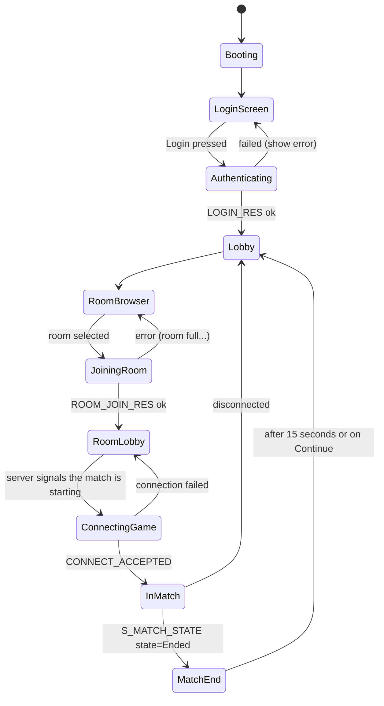

# Dev A — Phase 03: Match lifecycle and UI

**Weeks 11–13** · Milestone **M3** · Estimate **2.0 person-weeks** *(down from 3.5 — load 117% → 67%)*

> Goal in one sentence: **from launching the game to the end of a match, no step requires editing a
> config file by hand.**

> **Restructured — 1.5 weeks of UI were front-loaded into phase-02.** Entering this phase you
> **already have**: the login screen, room list, health/ammo HUD, scoreboard, killfeed, ticket bar
> and the F3 debug overlay — all running on fake data.
>
> **What's left in this phase is wiring in the real sources**, not building the UI from scratch. See
> [plan.md § 4.1](../plan.md).

---

## 1. Objectives

| # | Objective |
|---|---|
| 1 | The login screen, wired to D's master server |
| 2 | Lobby: room list, create room, join room, chat |
| 3 | Going from the lobby into a match (receive the joinTicket, connect over UDP) |
| 4 | In-match HUD: health, ammo, minimap, capture points |
| 5 | Scoreboard (Tab key), killfeed |
| 6 | Match end: final scoreboard, return to lobby |

---

## 2. UI priority — cut from the bottom up if time runs short

> **After front-loading, the pressure to cut has dropped sharply** (load 117% → 67%). This list is
> kept for the bad case. Items 1–7 already have their shells built in phase-02; here they're just
> connected to real data.

| # | Screen / component | Level | Cuttable? |
|---|---|---|---|
| 1 | Login (username + password) | **Required** | No |
| 2 | Room list + Join button | **Required** | No |
| 3 | HUD: health, ammo | **Required** | No |
| 4 | Spawn point + loadout selection screen | **Required** | No (`LoadoutUi` already exists) |
| 5 | Scoreboard (Tab) | High | No |
| 6 | Killfeed | High | Reduce to plain text |
| 7 | Capture points + match progress | High | No |
| 8 | End-of-match scoreboard | Medium | Replace with plain text |
| 9 | Room creation with options (map, bot count, password) | Medium | Cut: join existing rooms only |
| 10 | Lobby chat | Medium | Cuttable |
| 11 | In-match chat | Low | **Cut** |
| 12 | Minimap | Low (`MinimapUi` already exists) | Keep the original as-is, don't modify |
| 13 | In-game account registration | Low | **Cut** — D creates accounts with a CLI |
| 14 | Network settings screen (manual IP entry) | Low | Keep — useful for debugging |

---

## 3. Detailed tasks

### Task 1 — The game-flow state machine (2 days)

Before touching the UI, define the states clearly. This is the thing people rush and then have to
repeatedly fix.



```csharp
// Assets/Scripts/Net/Client/GameFlowState.cs
public enum GameFlowState
{
    Booting, LoginScreen, Authenticating, Lobby, RoomBrowser,
    JoiningRoom, RoomLobby, ConnectingGame, InMatch, MatchEnd
}

public sealed class GameFlowController : MonoBehaviour
{
    public GameFlowState State { get; private set; }
    public event Action<GameFlowState, GameFlowState> OnStateChanged;

    private static readonly Dictionary<GameFlowState, GameFlowState[]> Allowed = new()
    {
        [GameFlowState.LoginScreen]    = new[]{ GameFlowState.Authenticating },
        [GameFlowState.Authenticating] = new[]{ GameFlowState.Lobby, GameFlowState.LoginScreen },
        // ... declare them all
    };

    public void Transition(GameFlowState next)
    {
        if (!Allowed[State].Contains(next))
            throw new InvalidOperationException($"Invalid state transition: {State} → {next}");
        var prev = State; State = next;
        OnStateChanged?.Invoke(prev, next);
    }
}
```

> Block invalid transitions with an exception from day one. Bugs of the "we're in the lobby but the
> match HUD is still showing" variety are very hard to find without an explicit state machine.

### Task 2 — Wire up the master server (3 days)

D provides `IMasterClient`. You consume it.

```csharp
// Assets/Scripts/Net/Client/MasterConnection.cs
public sealed class MasterConnection : MonoBehaviour
{
    private IMasterClient _master;

    public async void Login(string user, string password)
    {
        _flow.Transition(GameFlowState.Authenticating);
        string hash = PasswordHasher.Hash(password);   // hash client-side, NEVER send plaintext
        var res = await _master.LoginAsync(user, hash);
        if (!res.Ok)
        {
            ShowError(ErrorCodes.Describe(res.ErrorCode));
            _flow.Transition(GameFlowState.LoginScreen);
            return;
        }
        _session = res.SessionToken;
        _flow.Transition(GameFlowState.Lobby);
    }

    public async void JoinRoom(int roomId, string password)
    {
        _flow.Transition(GameFlowState.JoiningRoom);
        var res = await _master.JoinRoomAsync(roomId, password);
        if (!res.Ok) { ShowError(...); _flow.Transition(GameFlowState.RoomBrowser); return; }

        // Hand over to UDP — the junction between the two protocols
        _pendingJoin = new PendingJoin {
            Ip = res.GameServerIp, Port = res.GameServerPort, Ticket = res.JoinTicket
        };
        _flow.Transition(GameFlowState.RoomLobby);
    }
}
```

**Trap 1 — `async void` and Unity.** `await` in Unity resumes on the thread pool, but `Transition()`
and every Unity API may only be called from the main thread. Either D must provide an
`IMasterClient` that already marshals its callbacks to the main thread, or you do it yourself:

```csharp
// A thread-safe queue, drained in Update()
private readonly ConcurrentQueue<Action> _mainThreadQueue = new();
private void Update() { while (_mainThreadQueue.TryDequeue(out var a)) a(); }
```

**Settle this with D in week 11:** are callbacks on the main thread or not? This is the source of
the very annoying `UnityException: can only be called from the main thread` class of bug.

**Trap 2 — passwords.** Hash on the client before sending (`SHA256(password + username)` as the
salt). The master server hashes it again with bcrypt/argon2 before storing it in the DB. Never send
plaintext, even before TLS is in place.

### Task 3 — Going from lobby into a match (2 days)

The TCP → UDP junction.

```csharp
private void EnterMatch(PendingJoin join)
{
    _flow.Transition(GameFlowState.ConnectingGame);
    ShowLoadingScreen("Connecting to the game server...");

    _transport.OnConnected += OnGameServerConnected;
    _transport.OnDisconnected += OnGameServerFailed;
    _transport.Connect(join.Ip, join.Port, join.Ticket);

    _connectTimeout = 10f;   // the joinTicket expires after 60s, but we time out sooner
}

private void OnGameServerConnected(ConnectResult r)
{
    SceneManager.LoadSceneAsync(r.MapSceneIndex).completed += _ =>
    {
        _flow.Transition(GameFlowState.InMatch);
        HideLoadingScreen();
    };
}
```

**Trap 3 — scene loading takes time while snapshots keep arriving.** During the 2–5 seconds of scene
loading, the server has already started sending snapshots. Processing them before the scene is ready
gives you a flood of `NullReferenceException`s. Solution: **a holding queue** — buffer messages until
the scene finishes loading, then process the newest message and discard the stale snapshots.

```csharp
private bool _sceneReady;
private void HandleMessage(ReadOnlyMemory<byte> data)
{
    if (!_sceneReady) { _preloadQueue.Enqueue(data); return; }
    // ...
}
```

### Task 4 — In-match HUD (3 days)

Reuse the existing `IngameUi.cs`, `ScoreUi.cs` and `MinimapUi.cs`. Only the **data source** changes,
from `ActorManager.instance.player` to the network snapshot.

| Component | Original file | What changes |
|---|---|---|
| Health | `IngameUi` | Read from `_localActorState.Health` (snapshot) instead of `actor.health` |
| Ammo | `IngameUi` | Read from the snapshot, but the **client predicts** the decrement on firing (see phase 02) |
| Minimap | `MinimapUi` | Draw blips from the networked actor list instead of `ActorManager.actors` |
| Capture points | `ScoreUi` | Read from `S_CAPTURE_POINT` + `S_MATCH_STATE` |
| Crosshair | `IngameUi` | Unchanged |

**Trap 4 — flicker between prediction and snapshot.** Predicted ammo = 29, snapshot says 30 → the
HUD flips 30, 29, 30. Solution: only take the ammo count from the snapshot when it **differs by more
than 2**, or on a reload event; otherwise trust the client.

### Task 5 — Scoreboard and killfeed (2 days)

```csharp
// Scoreboard: fed by S_PLAYER_LIST (0x4B), updated every 2 seconds or whenever someone dies
public struct PlayerScoreRow
{
    public uint   PlayerId;
    public string DisplayName;
    public byte   Team;
    public ushort Kills, Deaths, Score;
    public ushort PingMs;
    public bool   IsBot;
}
```

Display: two columns by team, sorted by Score descending, with your own row highlighted.
Bots show their names in a different color (grey) to distinguish them from real players.

### Task 6 — Match end (2 days)

```csharp
private void HandleMatchState(ReadOnlySpan<byte> span)
{
    var m = MatchStateMessage.Parse(span);
    switch (m.State)
    {
        case MatchState.Warmup:   ShowWarmupCountdown(m.SecondsRemaining); break;
        case MatchState.Playing:  UpdateTicketBar(m.Team0Tickets, m.Team1Tickets); break;
        case MatchState.Ended:
            _flow.Transition(GameFlowState.MatchEnd);
            ShowFinalScoreboard(m.WinningTeam);
            StartCoroutine(ReturnToLobbyAfter(15f));
            break;
    }
}
```

**Don't forget the cleanup:** on leaving a match you must destroy every actor, clear the
interpolators, reset `GameFlowController`, and close the UDP connection while **keeping** the TCP
connection to the master. A leak here causes the "everything is doubled in the second match" bug.

### Task 7 — Debug overlay (1 day)

Small, but hugely useful for the whole team and for the capstone defense.

Toggled with `F3`, showing an overlay:
```
RTT: 87ms (smoothed)      Jitter: 12ms
Packet loss: 2.3% (sent) / 1.8% (received)
Bandwidth: ↓ 6.4 KB/s  ↑ 0.9 KB/s
Server tick: 12847        Client tick: 12849
Interp delay: 100ms       Extrapolating: no
Actors: 41 (14 players, 27 bots)   Snapshot size: 512 B
Reconciles/min: 18        Avg replay: 3.2 ticks
```

This overlay is **visual proof** at the capstone defense that the netcode genuinely works. Worth the
one-day investment.

---

## 4. Acceptance criteria (M3)

| # | Criterion | How to verify |
|---|---|---|
| 1 | The full flow works with no manual file editing | Video: launch → login → pick a room → play → match end → back to lobby |
| 2 | 16 real players at once | Recruit the team + friends, or use D's load-test bots |
| 3 | Point capture works and scores update correctly on every client | Video with 2+ clients side by side |
| 4 | Win/lose conditions fire correctly | Play a match to the end |
| 5 | A second match starts without errors (no leaks) | Play 3 matches back to back, check the actor count doesn't grow abnormally |
| 6 | Disconnecting mid-match → returns to the lobby with a message | Unplug the network and observe |
| 7 | Wrong password → a clear error message | Try a wrong one |
| 8 | The F3 debug overlay shows every metric | Screenshot |
| 9 | Invalid state transitions throw | Unit tests for `GameFlowController` |

---

## 5. Risks

| Risk | Handling |
|---|---|
| `async` callbacks not on the main thread | Settle it with D in week 11. Have the `ConcurrentQueue` marshaller ready |
| Snapshots arriving before the scene is loaded | Holding queue, see trap 3 |
| Actor leaks between matches | Write a `CleanupMatch()` called on every exit path. Test by playing 3 matches back to back |
| Week 13 arrives unfinished | Cut UI from the bottom of the § 2 table, and record it clearly in the report |
| D is late and the master server isn't ready | Use "manual IP entry" mode (item 14 in the UI table) so matches can still be demoed |

---

## 6. Handoff

- Run the login → join flow with D 10 times in a row without an error
- Send D the list of error codes the client needs to display, cross-checked against the table in
  [`protocol-spec.md § 13`](../../00-shared/protocol-spec.md#13-shared-error-codes)
