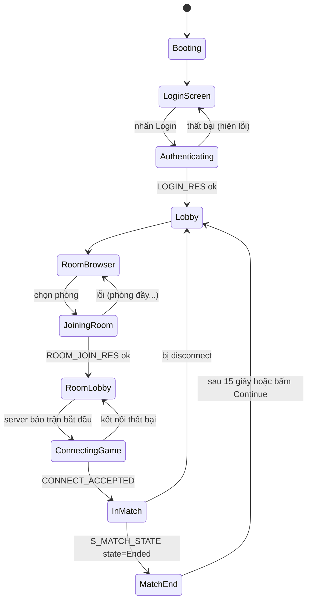

# Dev A — Phase 03: Vòng đời trận đấu và UI

**Tuần 11–13** · Mốc **M3** · Ước lượng **2.0 người-tuần** *(giảm từ 3.5 — tải 117% → 67%)*

> Mục tiêu một câu: **từ mở game đến kết thúc trận, không có bước nào phải sửa file cấu hình
> bằng tay.**

> **Đã tái cấu trúc — 1.5 tuần UI đã được front-load sang phase-02.** Khi vào phase này bạn
> **đã có sẵn**: màn login, danh sách phòng, HUD máu/đạn, scoreboard, killfeed, thanh ticket,
> màn debug F3 — tất cả chạy bằng dữ liệu giả.
>
> **Việc còn lại của phase này là nối dây thật**, không phải dựng UI từ đầu. Xem
> [plan.md § 4.1](../plan.md).

---

## 1. Mục tiêu

| # | Mục tiêu |
|---|---|
| 1 | Màn hình đăng nhập, nối master server của D |
| 2 | Lobby: danh sách phòng, tạo phòng, vào phòng, chat |
| 3 | Chuyển từ lobby vào trận (nhận joinTicket, kết nối UDP) |
| 4 | HUD trong trận: máu, đạn, minimap, điểm chiếm |
| 5 | Scoreboard (phím Tab), killfeed |
| 6 | Kết thúc trận: bảng điểm cuối, quay về lobby |

---

## 2. Ưu tiên UI — cắt từ dưới lên nếu thiếu thời gian

> **Sau khi front-load, áp lực cắt đã giảm mạnh** (tải 117% → 67%). Danh sách này vẫn giữ để
> dùng khi tình huống xấu. Mục 1–7 đã được dựng khung ở phase-02, ở đây chỉ nối dữ liệu thật.

| # | Màn hình / thành phần | Mức | Cắt được? |
|---|---|---|---|
| 1 | Đăng nhập (username + password) | **Bắt buộc** | Không |
| 2 | Danh sách phòng + nút Join | **Bắt buộc** | Không |
| 3 | HUD: máu, đạn | **Bắt buộc** | Không |
| 4 | Màn hình chọn spawn point + loadout | **Bắt buộc** | Không (đã có sẵn `LoadoutUi`) |
| 5 | Scoreboard (Tab) | Cao | Không |
| 6 | Killfeed | Cao | Rút gọn còn text thuần |
| 7 | Điểm chiếm + tiến độ trận | Cao | Không |
| 8 | Bảng điểm cuối trận | Trung bình | Thay bằng text đơn giản |
| 9 | Tạo phòng có tùy chọn (map, số bot, mật khẩu) | Trung bình | Cắt: chỉ vào phòng có sẵn |
| 10 | Chat lobby | Trung bình | Cắt được |
| 11 | Chat trong trận | Thấp | **Cắt** |
| 12 | Minimap | Thấp (đã có `MinimapUi`) | Giữ nguyên bản gốc, không sửa |
| 13 | Đăng ký tài khoản trong game | Thấp | **Cắt** — D tạo tài khoản sẵn bằng CLI |
| 14 | Màn hình cài đặt mạng (nhập IP thủ công) | Thấp | Giữ — hữu ích để debug |

---

## 3. Task chi tiết

### Task 1 — Máy trạng thái game flow (2 ngày)

Trước khi làm UI, định nghĩa rõ các trạng thái. Đây là thứ hay bị làm ẩu rồi phải sửa nhiều.



```csharp
// Assets/Scripts/Net/Client/GameFlowState.cs
public enum GameFlowState
{
    Booting, LoginScreen, Authenticating, Lobby, RoomBrowser,
    JoiningRoom, RoomLobby, ConnectingGame, InMatch, MatchEnd
}

public sealed class GameFlowController : MonoBehaviour
{
    public GameFlowState State { get; private set; }
    public event Action<GameFlowState, GameFlowState> OnStateChanged;

    private static readonly Dictionary<GameFlowState, GameFlowState[]> Allowed = new()
    {
        [GameFlowState.LoginScreen]    = new[]{ GameFlowState.Authenticating },
        [GameFlowState.Authenticating] = new[]{ GameFlowState.Lobby, GameFlowState.LoginScreen },
        // ... khai báo hết
    };

    public void Transition(GameFlowState next)
    {
        if (!Allowed[State].Contains(next))
            throw new InvalidOperationException($"Chuyển trạng thái không hợp lệ: {State} → {next}");
        var prev = State; State = next;
        OnStateChanged?.Invoke(prev, next);
    }
}
```

> Chặn chuyển trạng thái không hợp lệ bằng exception ngay từ đầu. Bug loại "đang ở lobby mà UI
> trận đấu vẫn hiện" rất khó tìm nếu không có máy trạng thái tường minh.

### Task 2 — Nối master server (3 ngày)

D cung cấp `IMasterClient`. Bạn tiêu thụ nó.

```csharp
// Assets/Scripts/Net/Client/MasterConnection.cs
public sealed class MasterConnection : MonoBehaviour
{
    private IMasterClient _master;

    public async void Login(string user, string password)
    {
        _flow.Transition(GameFlowState.Authenticating);
        string hash = PasswordHasher.Hash(password);   // hash phía client, KHÔNG gửi plaintext
        var res = await _master.LoginAsync(user, hash);
        if (!res.Ok)
        {
            ShowError(ErrorCodes.Describe(res.ErrorCode));
            _flow.Transition(GameFlowState.LoginScreen);
            return;
        }
        _session = res.SessionToken;
        _flow.Transition(GameFlowState.Lobby);
    }

    public async void JoinRoom(int roomId, string password)
    {
        _flow.Transition(GameFlowState.JoiningRoom);
        var res = await _master.JoinRoomAsync(roomId, password);
        if (!res.Ok) { ShowError(...); _flow.Transition(GameFlowState.RoomBrowser); return; }

        // Chuyển sang UDP — điểm giao giữa hai protocol
        _pendingJoin = new PendingJoin {
            Ip = res.GameServerIp, Port = res.GameServerPort, Ticket = res.JoinTicket
        };
        _flow.Transition(GameFlowState.RoomLobby);
    }
}
```

**Cạm bẫy 1 — `async void` và Unity.** `await` trong Unity chạy trên thread pool, nhưng
`Transition()` và mọi API Unity chỉ được gọi từ main thread. Bắt buộc D cung cấp `IMasterClient`
đã marshal callback về main thread, hoặc bạn tự làm:

```csharp
// Hàng đợi thread-safe, drain trong Update()
private readonly ConcurrentQueue<Action> _mainThreadQueue = new();
private void Update() { while (_mainThreadQueue.TryDequeue(out var a)) a(); }
```

**Chốt với D ở tuần 11:** callback ở main thread hay không. Đây là loại bug gây
`UnityException: can only be called from the main thread` rất khó chịu.

**Cạm bẫy 2 — mật khẩu.** Hash phía client trước khi gửi (`SHA256(password + username)` làm
salt). Master server hash lại lần nữa bằng bcrypt/argon2 trước khi lưu DB. Không bao giờ gửi
plaintext, kể cả khi chưa có TLS.

### Task 3 — Chuyển từ lobby vào trận (2 ngày)

Điểm nối TCP → UDP.

```csharp
private void EnterMatch(PendingJoin join)
{
    _flow.Transition(GameFlowState.ConnectingGame);
    ShowLoadingScreen("Đang kết nối tới máy chủ trận đấu...");

    _transport.OnConnected += OnGameServerConnected;
    _transport.OnDisconnected += OnGameServerFailed;
    _transport.Connect(join.Ip, join.Port, join.Ticket);

    _connectTimeout = 10f;   // joinTicket hết hạn sau 60s, nhưng ta timeout sớm hơn
}

private void OnGameServerConnected(ConnectResult r)
{
    SceneManager.LoadSceneAsync(r.MapSceneIndex).completed += _ =>
    {
        _flow.Transition(GameFlowState.InMatch);
        HideLoadingScreen();
    };
}
```

**Cạm bẫy 3 — load scene mất thời gian, snapshot vẫn về.** Trong lúc load scene (2–5 giây),
server đã bắt đầu gửi snapshot. Nếu bạn xử lý chúng khi scene chưa sẵn sàng sẽ
`NullReferenceException` hàng loạt. Giải pháp: **hàng đợi tạm** — buffer message tới khi scene
load xong, rồi xử lý message mới nhất và bỏ các message snapshot cũ.

```csharp
private bool _sceneReady;
private void HandleMessage(ReadOnlyMemory<byte> data)
{
    if (!_sceneReady) { _preloadQueue.Enqueue(data); return; }
    // ...
}
```

### Task 4 — HUD trong trận (3 ngày)

Tận dụng `IngameUi.cs`, `ScoreUi.cs`, `MinimapUi.cs` có sẵn. Chỉ đổi **nguồn dữ liệu** từ
`ActorManager.instance.player` sang snapshot mạng.

| Thành phần | File gốc | Đổi gì |
|---|---|---|
| Máu | `IngameUi` | Đọc từ `_localActorState.Health` (snapshot) thay vì `actor.health` |
| Đạn | `IngameUi` | Đọc từ snapshot, nhưng **client dự đoán** trừ đạn khi bắn (xem phase 02) |
| Minimap | `MinimapUi` | Vẽ blip từ danh sách actor mạng thay vì `ActorManager.actors` |
| Điểm chiếm | `ScoreUi` | Đọc từ `S_CAPTURE_POINT` + `S_MATCH_STATE` |
| Crosshair | `IngameUi` | Không đổi |

**Cạm bẫy 4 — nhấp nháy do dự đoán vs snapshot.** Đạn dự đoán = 29, snapshot về = 30 → HUD nhảy
30 rồi 29 rồi 30. Giải pháp: chỉ nhận số đạn từ snapshot khi **lệch > 2** hoặc khi có sự kiện
reload; ngoài ra tin client.

### Task 5 — Scoreboard và killfeed (2 ngày)

```csharp
// Scoreboard: nhận từ S_PLAYER_LIST (0x4B), cập nhật mỗi 2 giây hoặc khi có người chết
public struct PlayerScoreRow
{
    public uint   PlayerId;
    public string DisplayName;
    public byte   Team;
    public ushort Kills, Deaths, Score;
    public ushort PingMs;
    public bool   IsBot;
}
```

Hiển thị: 2 cột theo team, sắp xếp theo Score giảm dần, tô sáng dòng của mình.
Bot hiển thị tên khác màu (xám) để phân biệt với người thật.

### Task 6 — Kết thúc trận (2 ngày)

```csharp
private void HandleMatchState(ReadOnlySpan<byte> span)
{
    var m = MatchStateMessage.Parse(span);
    switch (m.State)
    {
        case MatchState.Warmup:   ShowWarmupCountdown(m.SecondsRemaining); break;
        case MatchState.Playing:  UpdateTicketBar(m.Team0Tickets, m.Team1Tickets); break;
        case MatchState.Ended:
            _flow.Transition(GameFlowState.MatchEnd);
            ShowFinalScoreboard(m.WinningTeam);
            StartCoroutine(ReturnToLobbyAfter(15f));
            break;
    }
}
```

**Đừng quên dọn dẹp:** khi rời trận phải destroy mọi actor, clear interpolator, reset
`GameFlowController`, ngắt UDP nhưng **giữ** kết nối TCP tới master. Rò rỉ ở đây gây lỗi
"vào trận thứ hai thì mọi thứ nhân đôi".

### Task 7 — Màn hình debug (1 ngày)

Nhỏ nhưng cực kỳ hữu ích cho cả nhóm và cho buổi bảo vệ đồ án.

Bật bằng phím `F3`, hiển thị overlay:
```
RTT: 87ms (smoothed)      Jitter: 12ms
Packet loss: 2.3% (gửi) / 1.8% (nhận)
Bandwidth: ↓ 6.4 KB/s  ↑ 0.9 KB/s
Server tick: 12847        Client tick: 12849
Interp delay: 100ms       Extrapolating: no
Actors: 41 (14 người, 27 bot)   Snapshot size: 512 B
Reconciles/min: 18        Avg replay: 3.2 tick
```

Màn hình này là **bằng chứng trực quan** khi bảo vệ đồ án rằng netcode thật sự hoạt động.
Đáng đầu tư 1 ngày.

---

## 4. Tiêu chí nghiệm thu (M3)

| # | Tiêu chí | Cách kiểm chứng |
|---|---|---|
| 1 | Luồng đầy đủ không sửa file tay | Video: mở game → login → chọn phòng → chơi → hết trận → về lobby |
| 2 | 16 người thật cùng lúc | Nhờ cả nhóm + bạn bè, hoặc dùng load-test bot của D |
| 3 | Chiếm điểm hoạt động, điểm số cập nhật đúng ở mọi client | Video 2+ client cạnh nhau |
| 4 | Điều kiện thắng thua kích hoạt đúng | Chơi tới hết trận |
| 5 | Vào trận thứ hai không lỗi (không rò rỉ) | Chơi liên tiếp 3 trận, kiểm tra số actor không tăng bất thường |
| 6 | Mất kết nối giữa trận → về lobby có thông báo | Rút mạng, quan sát |
| 7 | Sai mật khẩu → thông báo lỗi rõ ràng | Thử sai |
| 8 | Màn hình debug F3 hiển thị đủ chỉ số | Ảnh chụp |
| 9 | Chuyển trạng thái sai ném exception | Unit test cho `GameFlowController` |

---

## 5. Rủi ro

| Rủi ro | Xử lý |
|---|---|
| `async` callback không ở main thread | Chốt với D ở tuần 11. Có sẵn `ConcurrentQueue` marshal |
| Snapshot tới khi scene chưa load | Hàng đợi tạm, xem cạm bẫy 3 |
| Rò rỉ actor giữa các trận | Viết hàm `CleanupMatch()` gọi ở mọi đường thoát. Test bằng cách chơi 3 trận liên tiếp |
| Không kịp tuần 13 | Cắt UI từ dưới lên theo bảng § 2, ghi rõ vào report |
| D chậm, master server chưa xong | Dùng chế độ "nhập IP thủ công" (mục 14 trong bảng UI) để vẫn demo được trận đấu |

---

## 6. Bàn giao

- Cùng D chạy thử luồng login → join đủ 10 lần liên tiếp, không lỗi
- Gửi D danh sách mã lỗi client cần hiển thị, đối chiếu với bảng ở
  [`protocol-spec.md § 13`](../../00-shared/protocol-spec.md#13-bảng-mã-lỗi-chung)
