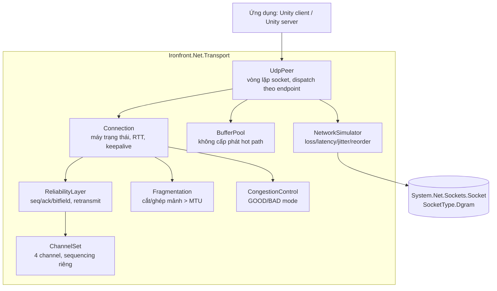

# Kế hoạch — Dev B · Transport Layer (UDP tự viết)

> Đọc trước: [`../00-shared/protocol-spec.md`](../00-shared/protocol-spec.md) (thuộc lòng phần A) ·
> [`../00-shared/architecture.md`](../00-shared/architecture.md) ·
> [`../00-shared/conventions.md`](../00-shared/conventions.md)

---

## 1. Vai trò

Bạn viết **tầng vận chuyển tin cậy trên nền UDP, từ con số 0**. Không dùng Mirror, LiteNetLib,
ENet, Photon, hay bất kỳ thư viện netcode nào. Chỉ có `System.Net.Sockets.Socket` với
`SocketType.Dgram`.

Đây là **phần lõi của đồ án môn Lập trình mạng**. Nếu mọi thứ khác đổ vỡ, phần này một mình
vẫn đủ để bảo vệ: nó chứa toàn bộ nội dung học thuật (reliability, congestion, flow control,
fragmentation, RTT estimation) và có thể đo đạc, chứng minh bằng số liệu.

**Bạn KHÔNG làm:** logic game, serialize dữ liệu game (C làm), master server (D làm). Tầng của
bạn chỉ biết `byte[]` — nó không quan tâm bên trong là snapshot hay chat.

> **Ranh giới sạch:** nếu một file trong `Ironfront.Net.Transport` cần `using UnityEngine`
> hoặc biết về khái niệm "actor", đó là dấu hiệu thiết kế sai.

---

## 2. Vùng sở hữu

| Đường dẫn | Quyền |
|---|---|
| `Ironfront.Net.Transport/**` | **Sở hữu toàn quyền** |
| `Ironfront.Net.Transport.Tests/**` | Sở hữu |
| `Ironfront.Net.Replication/Serialization/**` | **Sở hữu** (`BitWriter`, `BitReader`, `Quantize`) — mới nhận |
| `Ironfront.Net.Replication.Tests/Conformance/**` | **Chỉ đọc** — Dev C sở hữu, đây là trọng tài kiểm định code của bạn |
| `Ironfront.Net.Protocol/**` | PR + 2 approve (chung) |
| Mọi thứ khác | Chỉ đọc |

### 2.1. Bạn cài đặt, Dev C kiểm định

Cặp seam quan trọng nhất dự án:

| | Ai làm | Ở đâu |
|---|---|---|
| Cài đặt bit-packing + quantization | **Bạn** | `Ironfront.Net.Replication/Serialization/` |
| Test conformance với hex cứng viết tay | **Dev C** | `Ironfront.Net.Replication.Tests/Conformance/` |

Lý do tách: nếu cùng một người vừa viết vừa test, test chỉ chứng minh code nhất quán với chính
nó, không chứng minh nó khớp spec. Tách ra thì test của C thành **trọng tài thật** khi có tranh
cãi về format.

**Hệ quả thực tế cho bạn:** test của C có thể đỏ trên code bạn vừa viết. Đó là tính năng, không
phải xung đột. Khi đỏ, hai người cùng mở `protocol-spec.md` § 4.4 và xem ai lệch spec.

**Không mở Unity Editor.** Bạn làm việc bằng Rider/VS/VSCode + `dotnet build` + `dotnet test`.

---

## 3. Kiến trúc thư viện



`NetworkSimulator` nằm **giữa** `UdpPeer` và socket thật: khi bật, nó giữ gói lại, làm trễ, làm
mất, đảo thứ tự trước khi thực sự gửi/nhận. Khi tắt, nó là passthrough chi phí gần bằng 0.

---

## 4. API công khai — chốt ở tuần 1, không đổi sau đó

A và C code dựa trên interface này. Đóng băng sớm.

```csharp
namespace Ironfront.Net.Transport;

public enum ConnectionState { Disconnected, Connecting, Challenged, Connected }

public enum DisconnectReason
{
    LocalRequest, RemoteRequest, Timeout, ProtocolMismatch,
    ServerFull, InvalidTicket, Banned, TransportError
}

public interface ITransportClient : IDisposable
{
    ConnectionState State         { get; }
    float           SmoothedRttMs { get; }
    float           PacketLossPercent { get; }
    TransportStats  Stats         { get; }

    void Connect(string host, int port, ReadOnlySpan<byte> joinTicket);
    void Disconnect();
    void Send(byte channelId, ReadOnlySpan<byte> payload, bool reliable);
    void Poll();                       // gọi mỗi frame; xử lý socket + timer

    event Action<ReadOnlyMemory<byte>> OnMessage;
    event Action<ConnectResult>        OnConnected;
    event Action<DisconnectReason>     OnDisconnected;
}

public interface ITransportServer : IDisposable
{
    int  ConnectionCount { get; }
    void Start(int port, int maxConnections);
    void Stop();
    void Send(ushort connectionId, byte channelId, ReadOnlySpan<byte> payload, bool reliable);
    void Broadcast(byte channelId, ReadOnlySpan<byte> payload, bool reliable);
    void Disconnect(ushort connectionId, DisconnectReason reason);
    ConnectionInfo GetInfo(ushort connectionId);
    void Poll();

    event Action<ushort, ReadOnlyMemory<byte>> OnMessage;      // (connectionId, payload)
    event Func<ReadOnlyMemory<byte>, bool>     OnValidateTicket; // trả false → từ chối
    event Action<ushort, ConnectionInfo>       OnClientConnected;
    event Action<ushort, DisconnectReason>     OnClientDisconnected;
}

public struct TransportStats
{
    public long   BytesSent, BytesReceived;
    public long   PacketsSent, PacketsReceived, PacketsLost, PacketsResent;
    public float  SmoothedRttMs, JitterMs;
    public int    PendingReliableCount;
}
```

**Điểm cần chú ý về ownership bộ nhớ:** `OnMessage` truyền `ReadOnlyMemory<byte>` trỏ vào buffer
được pool. Buffer **được trả về pool ngay sau khi handler trả về**. Người nhận muốn giữ dữ liệu
phải tự copy. Ghi rõ điều này trong XML doc, nếu không A hoặc C sẽ giữ tham chiếu và đọc phải
dữ liệu rác. **Đây là loại bug rất khó tìm.**

---

## 5. Lộ trình 5 phase

| Phase | Tuần | Mốc | Kết quả |
|---|---|---|---|
| [phase-00](phases/phase-00-nen-mong.md) | 1–2 | M0 | Ôn socket · project setup · `UdpPeer` gửi/nhận thô · **`NetworkSimulator`** · echo test · **`BitWriter`/`BitReader`/`Quantize`** |
| [phase-01](phases/phase-01-reliability.md) | 3–6 | M1 | Handshake · seq/ack/bitfield · retransmit · 4 channel · fragmentation · RTT · ≥40 unit test |
| [phase-02](phases/phase-02-chiu-tai.md) | 7–10 | M2 | Congestion control · flow control · chống DoS · 16 kết nối đồng thời · benchmark |
| [phase-03](phases/phase-03-van-hanh.md) | 11–13 | M3 | Đo đạc thực tế trên VPS · công cụ chẩn đoán · packet logger/replay · hỗ trợ tích hợp |
| [phase-04](phases/phase-04-bao-cao.md) | 14 | M4 | Báo cáo đo đạc so sánh với TCP · tài liệu · bảo vệ |

---

## 6. Ước lượng

| Hạng mục | Người-tuần |
|---|---|
| Socket layer + connection lifecycle | 2.0 |
| Reliability: seq/ack/bitfield/retransmit | 2.5 |
| Channel + fragmentation + reassembly | 2.0 |
| Network simulator | 1.5 |
| Congestion control (bỏ flow control nâng cao) | 1.0 |
| **Bit-packing serializer** (`BitWriter`/`BitReader`/`Quantize`) — **mới nhận** | 2.0 |
| Test suite + benchmark + báo cáo | 1.5 |
| Hỗ trợ tích hợp | 0.5 |
| **Tổng** | **13.0 / 14** |

> **Đã tái cấu trúc — hai thay đổi, tổng ngân sách không đổi:**
>
> 1. **Nhận thêm bit-packing serializer từ Dev C** (+2.0). Đây là việc byte-level, cô lập hoàn
>    toàn, test bằng xUnit — đúng sở trường của bạn và giữ bạn ở trạng thái **zero phụ thuộc**.
>    **Dev C viết test conformance kiểm định code của bạn** (xem § 4.1) — bạn cài đặt, C là
>    trọng tài.
> 2. **Trả lại gánh nặng "hỗ trợ tích hợp"** (−1.0) và **flow control nâng cao** (−0.5) cho
>    Dev C, người sở hữu integration harness. Bạn chỉ giữ 0.5 tuần để trả lời câu hỏi.
>
> Kết quả: **bạn không phụ thuộc ai sau tuần 2, và không ai chặn bạn tới hết dự án.**
> Xem [dependency-map.md](../00-shared/dependency-map.md).

---

## 7. Rủi ro riêng

| # | Rủi ro | Chặn |
|---|---|---|
| B1 | Bug reliability ẩn, biểu hiện gián tiếp, ăn nhiều tuần (rủi ro R1 toàn dự án) | `NetworkSimulator` xong **tuần 2**, trước mọi tính năng. ≥40 unit test. Packet logger từ phase 03 |
| B2 | So sánh sequence bị wrap sau 36 phút | Dùng `SequenceMath.IsNewer` từ `Ironfront.Net.Protocol`, có unit test biên. Cấm viết `if (a > b)` |
| B3 | Cấp phát heap trong hot path → GC spike → game giật đều | `BufferPool` từ phase 00. Test bằng benchmark đếm alloc |
| B4 | Race condition giữa thread socket và thread game | **Quyết định: một thread duy nhất.** Socket non-blocking, poll từ main thread. Không dùng thread riêng ở v1 |
| B5 | Fragmentation bị lợi dụng làm cạn RAM server | Giới hạn 8 nhóm/connection + timeout 2s, từ phase 01 |
| B6 | A và C chờ API của bạn | API đóng băng tuần 1. Cung cấp `LoopbackTransport` (in-memory, không qua socket) để họ test sớm |

---

## 8. Quyết định kiến trúc riêng

| # | Quyết định | Lý do | Đánh đổi |
|---|---|---|---|
| B-AD-1 | **Một thread duy nhất**, socket non-blocking, poll mỗi frame | Loại bỏ hoàn toàn race condition, dễ debug gấp nhiều lần. 16 kết nối × 30 gói/s = 480 gói/s, một thread thừa sức | Không tận dụng đa lõi. Không cần ở quy mô này |
| B-AD-2 | `BufferPool` cố định, không `new byte[]` trong hot path | Chặn GC spike | Phải cẩn thận ownership, dễ dùng sai |
| B-AD-3 | Không mã hóa payload ở v1 | Ngoài scope, thêm phức tạp | Ai bắt được gói sẽ đọc được. Chấp nhận |
| B-AD-4 | Không dùng `SocketAsyncEventArgs` / `async` | Phức tạp, khó debug, không cần ở quy mô này | Ít hiệu năng hơn ở quy mô rất lớn |
| B-AD-5 | Reliability theo channel, không theo connection | Snapshot không bị chặn bởi event mất gói. Đây là lợi thế cốt lõi so với TCP | Phức tạp hơn |

---

## 9. Chuẩn bị kiến thức (làm trong phase 00)

Nếu chưa từng viết socket, dành 2 ngày đầu cho phần này. Không phải phí thời gian.

| Chủ đề | Vì sao cần | Cách học |
|---|---|---|
| UDP vs TCP ở tầng OS | Hiểu vì sao UDP không đảm bảo gì | Viết echo server cả hai, so sánh |
| MTU và IP fragmentation | Vì sao chọn 1200 byte | Gửi gói 2000 byte, quan sát bằng Wireshark |
| `Socket` non-blocking, `Poll`, `Available` | Cách đọc socket không chặn | Thử nghiệm |
| RTT estimation, EWMA | Đo ping đúng cách | Đọc RFC 6298 (TCP RTO) — ta dùng ý tưởng, không dùng nguyên |
| Sliding window | Nền tảng của reliability | Bài giảng LTM |
| Wireshark cơ bản | Kiểm chứng gói tin thật | Bắt gói echo server của mình |

**Bài tập khởi động bắt buộc (2 ngày, phase 00):**
1. Echo server UDP + client, gửi 1000 gói, đếm mất bao nhiêu (LAN thường 0%)
2. Echo server TCP tương đương, đo độ trễ khi có 1 gói bị mất (dùng `tc netem` hoặc simulator)
3. So sánh, viết 1 trang nhận xét → đây là chương đầu của báo cáo đồ án

---

## 10. Báo cáo đồ án — thu thập dữ liệu từ đầu

Phần của bạn là trọng tâm học thuật. Từ phase 00, mọi thứ đo được đều ghi lại vào
`reports/measurements.csv`. Cuối kỳ sẽ cần:

| Nội dung báo cáo | Dữ liệu cần | Thu thập từ phase |
|---|---|---|
| So sánh UDP thuần vs TCP về độ trễ khi mất gói | Đo cả hai với cùng điều kiện | 00, 04 |
| Hiệu quả của ack bitfield vs ack đơn | Số byte ack / gói, tỉ lệ retransmit thừa | 01 |
| Ảnh hưởng của packet loss tới trải nghiệm | Bandwidth, retransmit rate ở 0/5/15/30% loss | 02 |
| Congestion control có tác dụng không | Bandwidth và RTT khi bật/tắt | 02 |
| Head-of-line blocking: có channel vs không | Độ trễ snapshot khi event bị mất | 02 |
| Chi phí fragmentation | Tỉ lệ mất nhóm mảnh theo kích thước | 01 |
