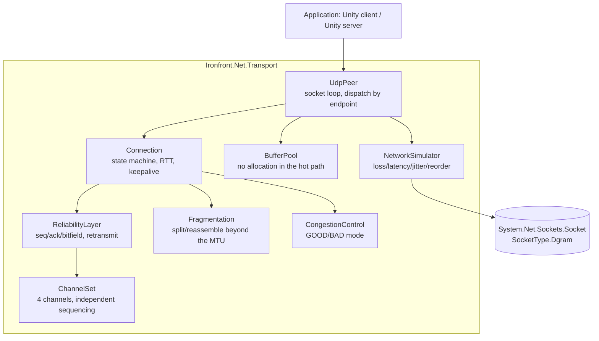

# Plan — Dev B · Transport Layer (hand-written UDP)

> Read first: [`../00-shared/protocol-spec.md`](../00-shared/protocol-spec.md) (know Part A by
> heart) · [`../00-shared/architecture.md`](../00-shared/architecture.md) ·
> [`../00-shared/conventions.md`](../00-shared/conventions.md)

---

## 1. Role

You write **a reliable transport layer on top of UDP, from zero**. No Mirror, LiteNetLib, ENet,
Photon, or any other netcode library. Just `System.Net.Sockets.Socket` with `SocketType.Dgram`.

This is **the academic core of a Network Programming capstone**. If everything else falls apart,
this part alone is enough to defend: it contains all the coursework substance (reliability,
congestion, flow control, fragmentation, RTT estimation) and it can be measured and proven with
numbers.

**What you do NOT do:** game logic, serializing game data (C's job), the master server (D's job).
Your layer only knows `byte[]` — it doesn't care whether the contents are a snapshot or a chat
message.

> **A clean boundary:** if a file in `Ironfront.Net.Transport` needs `using UnityEngine` or knows
> what an "actor" is, that's a sign of a design error.

---

## 2. Ownership

| Path | Rights |
|---|---|
| `Ironfront.Net.Transport/**` | **Full ownership** |
| `Ironfront.Net.Transport.Tests/**` | Owner |
| `Ironfront.Net.Replication/Serialization/**` | **Owner** (`BitWriter`, `BitReader`) — newly assigned |
| `Ironfront.Net.Protocol.Tests/Conformance/**` | **Read-only** — Dev C owns it; it's the referee that verifies your code |
| `Ironfront.Net.Protocol/**` | PR + 2 approvals (shared) |
| Everything else | Read-only |

> **Changed at the week-1 protocol freeze.** `Quantize` is **no longer yours** — it moved to
> `Ironfront.Net.Protocol` and is already implemented. This table used to list it alongside
> `BitWriter`/`BitReader`, which contradicted
> [protocol-spec.md § 4.4](../00-shared/protocol-spec.md#44-quantization--mandatory-shared-constants):
> the spec declares the quantization constants shared and forbids re-hardcoding them anywhere else.
> Two owners for one SSOT is the exact drift the freeze exists to prevent. You keep `BitWriter` and
> `BitReader`, which are genuinely yours. See
> [conventions.md § 7](../00-shared/conventions.md#7-file-ownership-boundaries).

### 2.1. You implement, Dev C verifies

The most important seam in the project:

| | Who does it | Where |
|---|---|---|
| Implementing bit-packing | **You** | `Ironfront.Net.Replication/Serialization/` |
| Conformance tests with hand-written hex | **Dev C** | `Ironfront.Net.Protocol.Tests/Conformance/` |

Why they're split: if the same person writes and tests it, the tests only prove the code is
consistent with itself, not that it matches the spec. Split, C's tests become a **genuine referee**
whenever there's a dispute about the format.

**What this means for you in practice:** C's tests may go red against code you just wrote. That's a
feature, not a conflict. When it happens, the two of you open `protocol-spec.md` § 4.4 together and
work out who diverged from the spec.

**Don't open the Unity Editor.** You work in Rider/VS/VSCode with `dotnet build` and `dotnet test`.

---

## 3. Library architecture



`NetworkSimulator` sits **between** `UdpPeer` and the real socket: when enabled it holds packets
back, delays them, drops them and reorders them before actually sending/receiving. When disabled
it's a near-zero-cost passthrough.

---

## 4. Public API — frozen in week 1, unchanged thereafter

A and C write code against this interface. Freeze it early.

```csharp
namespace Ironfront.Net.Transport;

public enum ConnectionState { Disconnected, Connecting, Challenged, Connected }

public enum DisconnectReason
{
    LocalRequest, RemoteRequest, Timeout, ProtocolMismatch,
    ServerFull, InvalidTicket, Banned, TransportError
}

public interface ITransportClient : IDisposable
{
    ConnectionState State         { get; }
    float           SmoothedRttMs { get; }
    float           PacketLossPercent { get; }
    TransportStats  Stats         { get; }

    void Connect(string host, int port, ReadOnlySpan<byte> joinTicket);
    void Disconnect();
    void Send(byte channelId, ReadOnlySpan<byte> payload, bool reliable);
    void Poll();                       // call every frame; services the socket + timers

    event Action<ReadOnlyMemory<byte>> OnMessage;
    event Action<ConnectResult>        OnConnected;
    event Action<DisconnectReason>     OnDisconnected;
}

public interface ITransportServer : IDisposable
{
    int  ConnectionCount { get; }
    void Start(int port, int maxConnections);
    void Stop();
    void Send(ushort connectionId, byte channelId, ReadOnlySpan<byte> payload, bool reliable);
    void Broadcast(byte channelId, ReadOnlySpan<byte> payload, bool reliable);
    void Disconnect(ushort connectionId, DisconnectReason reason);
    ConnectionInfo GetInfo(ushort connectionId);
    void Poll();

    event Action<ushort, ReadOnlyMemory<byte>> OnMessage;      // (connectionId, payload)
    event Func<ReadOnlyMemory<byte>, bool>     OnValidateTicket; // return false → reject
    event Action<ushort, ConnectionInfo>       OnClientConnected;
    event Action<ushort, DisconnectReason>     OnClientDisconnected;
}

public struct TransportStats
{
    public long   BytesSent, BytesReceived;
    public long   PacketsSent, PacketsReceived, PacketsLost, PacketsResent;
    public float  SmoothedRttMs, JitterMs;
    public int    PendingReliableCount;
}
```

**A memory-ownership note to be aware of:** `OnMessage` passes a `ReadOnlyMemory<byte>` pointing into
a pooled buffer. The buffer is **returned to the pool as soon as the handler returns**. A receiver
that wants to keep the data must copy it. Say this explicitly in the XML docs, or A or C will hold a
reference and end up reading garbage. **This is a very hard bug to track down.**

---

## 5. The 5-phase roadmap

| Phase | Weeks | Milestone | Outcome |
|---|---|---|---|
| [phase-00](phases/phase-00-foundation.md) | 1–2 | M0 | Socket refresher · project setup · raw send/receive in `UdpPeer` · **`NetworkSimulator`** · echo test · **`BitWriter`/`BitReader`** (`PacketHeader` and `Quantize` already shipped — see § 2) |
| [phase-01](phases/phase-01-reliability.md) | 3–6 | M1 | Handshake · seq/ack/bitfield · retransmit · 4 channels · fragmentation · RTT · ≥40 unit tests |
| [phase-02](phases/phase-02-load.md) | 7–10 | M2 | Congestion control · flow control · DoS defenses · 16 simultaneous connections · benchmarks |
| [phase-03](phases/phase-03-operations.md) | 11–13 | M3 | Real measurements on a VPS · diagnostic tooling · packet logger/replay · integration support |
| [phase-04](phases/phase-04-report.md) | 14 | M4 | Measurement report comparing against TCP · documentation · defense |

---

## 6. Estimate

| Item | Person-weeks |
|---|---|
| Socket layer + connection lifecycle | 2.0 |
| Reliability: seq/ack/bitfield/retransmit | 2.5 |
| Channels + fragmentation + reassembly | 2.0 |
| Network simulator | 1.5 |
| Congestion control (advanced flow control dropped) | 1.0 |
| **Bit-packing serializer** (`BitWriter`/`BitReader`/`Quantize`) — **newly assigned** | 2.0 |
| Test suite + benchmarks + report | 1.5 |
| Integration support | 0.5 |
| **Total** | **13.0 / 14** |

> **Restructured — two changes, same total budget:**
>
> 1. **Took the bit-packing serializer from Dev C** (+2.0). It's byte-level work, fully isolated,
>    testable with xUnit — squarely in your wheelhouse, and it keeps you at **zero dependencies**.
>    **Dev C writes the conformance tests that verify your code** (see § 4.1) — you implement, C
>    referees.
> 2. **Handed back the "integration support" burden** (−1.0) and **advanced flow control** (−0.5) to
>    Dev C, who owns the integration harness. You keep only 0.5 weeks for answering questions.
>
> Result: **you depend on nobody after week 2, and nobody blocks you for the rest of the project.**
> See [dependency-map.md](../00-shared/dependency-map.md).

---

## 7. Your own risks

| # | Risk | Mitigation |
|---|---|---|
| B1 | A hidden reliability bug presenting indirectly and eating weeks (project-wide risk R1) | `NetworkSimulator` done in **week 2**, before any feature. ≥40 unit tests. Packet logger from phase 03 |
| B2 | Sequence comparison wrapping after 36 minutes | Use `SequenceMath.IsNewer` from `Ironfront.Net.Protocol`, with boundary unit tests. Writing `if (a > b)` is banned |
| B3 | Heap allocation in the hot path → GC spikes → regular in-game stutter | `BufferPool` from phase 00. Verify with an allocation-counting benchmark |
| B4 | A race between the socket thread and the game thread | **Decision: a single thread.** Non-blocking socket, polled from the main thread. No dedicated thread in v1 |
| B5 | Fragmentation exploited to exhaust server RAM | Limit of 8 groups/connection + a 2 s timeout, from phase 01 |
| B6 | A and C waiting on your API | Freeze the API in week 1. Provide a `LoopbackTransport` (in-memory, bypassing the socket) so they can test early |

---

## 8. Your own architectural decisions

| # | Decision | Reason | Trade-off |
|---|---|---|---|
| B-AD-1 | **A single thread**, non-blocking socket, polled every frame | Eliminates race conditions entirely and is far easier to debug. 16 connections × 30 packets/s = 480 packets/s, trivial for one thread | Doesn't use multiple cores. Not needed at this scale |
| B-AD-2 | A fixed `BufferPool`, no `new byte[]` in the hot path | Prevents GC spikes | Ownership requires care and is easy to get wrong |
| B-AD-3 | No payload encryption in v1 | Out of scope, adds complexity | Anyone capturing packets can read them. Accepted |
| B-AD-4 | No `SocketAsyncEventArgs` / `async` | Complex, hard to debug, unnecessary at this scale | Lower performance at very large scale |
| B-AD-5 | Reliability per channel, not per connection | Snapshots aren't stalled by a lost event. This is the core advantage over TCP | More complex |

---

## 9. Background preparation (during phase 00)

If you've never written a socket, spend the first 2 days on this. It isn't wasted time.

| Topic | Why it's needed | How to learn it |
|---|---|---|
| UDP vs TCP at the OS level | Understand why UDP guarantees nothing | Write an echo server for both and compare |
| MTU and IP fragmentation | Why we chose 1200 bytes | Send a 2000-byte packet and watch it in Wireshark |
| Non-blocking `Socket`, `Poll`, `Available` | How to read a socket without blocking | Experiment |
| RTT estimation, EWMA | How to measure ping properly | Read RFC 6298 (TCP RTO) — we borrow the idea, not the whole thing |
| Sliding windows | The foundation of reliability | Network Programming lectures |
| Wireshark basics | Verifying real packets | Capture your own echo server's traffic |

**Mandatory warm-up exercise (2 days, phase 00):**
1. A UDP echo server + client, send 1000 packets, count how many are lost (usually 0% on LAN)
2. The equivalent TCP echo server, measure the latency when one packet is lost (using `tc netem` or
   the simulator)
3. Compare and write a one-page commentary → this becomes the first chapter of the capstone report

---

## 10. The capstone report — gather data from day one

Your part is the academic centerpiece. From phase 00 onward, record everything measurable into
`reports/measurements.csv`. By the end of the semester you'll need:

| Report section | Data needed | Collected in phase |
|---|---|---|
| Raw UDP vs TCP latency under packet loss | Measure both under identical conditions | 00, 04 |
| The effectiveness of ack bitfields vs single acks | Ack bytes per packet, rate of redundant retransmits | 01 |
| The impact of packet loss on the experience | Bandwidth, retransmit rate at 0/5/15/30% loss | 02 |
| Whether congestion control actually helps | Bandwidth and RTT with it on vs. off | 02 |
| Head-of-line blocking: with channels vs without | Snapshot latency when an event is lost | 02 |
| The cost of fragmentation | Fragment-group loss rate by size | 01 |
