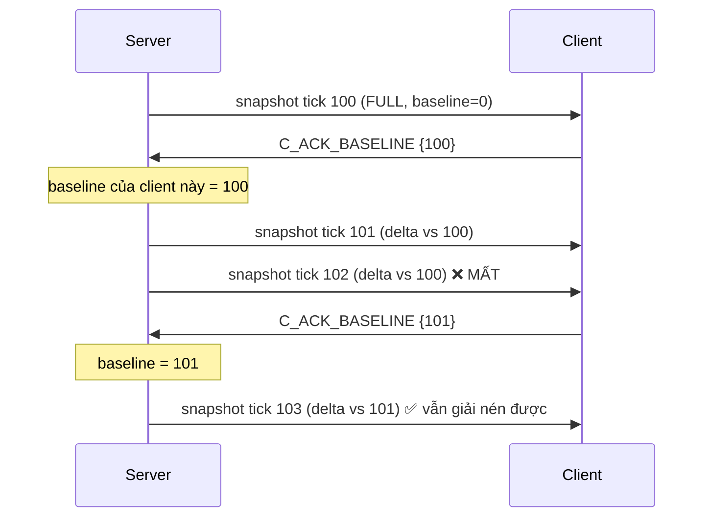

# Dev C — Phase 01: Snapshot, delta, và vòng lặp server

**Tuần 3–6** · Mốc **M1 (mốc sinh tử)** · Ước lượng **4.0 người-tuần**

> Mục tiêu một câu: **server là nguồn sự thật duy nhất, và client biết được sự thật đó với chi
> phí băng thông thấp nhất có thể.**

---

## 1. Mục tiêu

| # | Mục tiêu |
|---|---|
| 1 | `ServerTickLoop` chạy 30Hz ổn định trên headless |
| 2 | Áp input từ client một cách authoritative (kẹp tốc độ, chống speed hack) |
| 3 | Snapshot full: server → client, client dựng lại thế giới |
| 4 | Delta encoding với baseline được ack |
| 5 | Tích hợp với transport của B, gameplay của A → 2 client đồng bộ |

---

## 2. Task chi tiết

### Task 1 — `ServerTickLoop` (3 ngày)

```csharp
// Assets/Scripts/Net/Server/ServerTickLoop.cs
public sealed class ServerTickLoop : MonoBehaviour
{
    private ITransportServer _transport;
    private readonly Dictionary<ushort, ClientSession> _sessions = new();
    private uint _serverTick;
    private float _snapshotAccumulator;

    private void Awake()
    {
        NetContext.SetRole(NetContext.Role.Server);
        Time.fixedDeltaTime = 1f / ProtocolConstants.SIM_TICK_RATE;   // 1/30
        Application.targetFrameRate = ProtocolConstants.SIM_TICK_RATE;
        QualitySettings.vSyncCount = 0;
    }

    private void FixedUpdate()
    {
        double nowMs = Time.realtimeSinceStartupAsDouble * 1000.0;

        // 1. Nhận và giải mã input
        _transport.Poll();                       // phát event OnMessage → điền vào session

        // 2. Áp input cho từng người chơi
        foreach (var s in _sessions.Values) ApplyInput(s);

        // 3. Unity tự chạy physics + AI ở FixedUpdate này (Actor, AiActorController)
        //    → không cần làm gì, chỉ đảm bảo thứ tự script

        // 4. Lưu lịch sử hitbox cho lag compensation (phase 02)
        _hitboxHistory.Capture(_serverTick);

        // 5. Sinh và gửi snapshot ở 20Hz (mỗi 1.5 tick)
        _snapshotAccumulator += Time.fixedDeltaTime;
        if (_snapshotAccumulator >= 1f / ProtocolConstants.SNAPSHOT_RATE)
        {
            _snapshotAccumulator -= 1f / ProtocolConstants.SNAPSHOT_RATE;
            BuildAndSendSnapshots();
        }

        NetContext.CurrentTick = ++_serverTick;
        RecordTickTime(nowMs);
    }
}
```

**Cạm bẫy 1 — thứ tự Script Execution Order.** Bắt buộc:

| Thứ tự | Script | Vì sao |
|---|---|---|
| -1000 | `NetServerBootstrap` | Set role trước mọi Awake |
| -200 | `ServerTickLoop` (phần nhận input) | Input phải áp trước khi Actor chạy |
| 0 (mặc định) | `Actor`, `AiActorController` | Mô phỏng |
| +200 | `ServerTickLoop` (phần snapshot) | Snapshot phải chụp sau khi sim xong |

Unity không cho một script có 2 mức thứ tự. Giải pháp: tách làm 2 MonoBehaviour
(`ServerInputStage` ở -200 và `ServerSnapshotStage` ở +200), `ServerTickLoop` điều phối.

**Cạm bẫy 2 — `FixedUpdate` không chạy đúng 30 lần/giây khi server quá tải.** Nếu một tick tốn
40ms, Unity sẽ chạy bù nhiều `FixedUpdate` liên tiếp (spiral of death). Chặn bằng
`Time.maximumDeltaTime = 0.1f` và giám sát: nếu tick time > 30ms liên tục 5 giây, log cảnh báo
và giảm số bot.

### Task 2 — Áp input authoritative (3 ngày)

```csharp
// Assets/Scripts/Net/Server/ServerAuthority.cs
private void ApplyInput(ClientSession s)
{
    // Lấy frame mới nhất chưa xử lý từ buffer (client gửi redundancy 3)
    while (s.InputBuffer.TryDequeue(out var frame))
    {
        if (frame.Tick <= s.LastProcessedInputTick) continue;    // bản lặp, bỏ

        // === KIỂM TRA AUTHORITATIVE ===
        // 1. Không nhảy cóc quá xa về tick (chống tua nhanh)
        if (frame.Tick > s.LastProcessedInputTick + MAX_TICK_JUMP)   // 60 = 2 giây
        { NetLog.Warn($"conn {s.Id} nhảy tick bất thường"); s.LastProcessedInputTick = frame.Tick - 1; }

        // 2. Chuẩn hóa vector di chuyển (client có thể gửi moveX=moveZ=127 để đi nhanh √2 lần)
        float mx = frame.MoveX / 127f, mz = frame.MoveZ / 127f;
        float mag = MathF.Sqrt(mx * mx + mz * mz);
        if (mag > 1f) { mx /= mag; mz /= mag; }

        // 3. Áp
        var netFrame = new NetInputFrame {
            MoveX = mx, MoveZ = mz,
            Yaw = Quantize.UnpackYaw(frame.Yaw), Pitch = Quantize.UnpackPitch(frame.Pitch),
            Buttons = frame.Buttons
        };
        MovementSimulation.Step(s.Actor, in netFrame, Time.fixedDeltaTime);

        // 4. Hậu kiểm: tốc độ thực tế không vượt ngưỡng
        float moved = Vector3.Distance(s.Actor.transform.position, s.PrevPosition);
        float maxMove = MovementSimulation.SPRINT_SPEED * 1.3f * Time.fixedDeltaTime;  // +30% dung sai
        if (moved > maxMove)
        {
            s.Actor.transform.position = s.PrevPosition
                + (s.Actor.transform.position - s.PrevPosition).normalized * maxMove;
            s.SpeedViolations++;
            if (s.SpeedViolations > 100) NetLog.Warn($"conn {s.Id} nghi speed hack");
        }
        s.PrevPosition = s.Actor.transform.position;
        s.LastProcessedInputTick = frame.Tick;
    }
}
```

**Vì sao chuẩn hóa vector là bắt buộc:** đây là cheat kinh điển. Client gửi `moveX = 127`,
`moveZ = 127`, độ dài vector = √2 ≈ 1.41 → đi nhanh hơn 41%. Không chuẩn hóa là để lỗ hổng.

**Vì sao dung sai 30%:** nổ hất tung, trượt dốc, nhảy có thể làm di chuyển vượt tốc độ chạy
danh nghĩa. Quá chặt sẽ làm người chơi bình thường bị kẹt.

**Cạm bẫy 3 — hụt input.** Nếu gói input mất và không có frame nào cho tick này, đừng để nhân
vật khựng. Lặp lại frame cuối (giả định người chơi vẫn giữ nguyên phím). Chỉ dừng sau 3 tick
không có input.

```csharp
if (s.InputBuffer.IsEmpty && s.MissedInputTicks < 3)
{ MovementSimulation.Step(s.Actor, in s.LastFrame, dt); s.MissedInputTicks++; }
```

### Task 3 — Snapshot full (3 ngày)

```csharp
// Ironfront.Net.Replication/SnapshotBuilder.cs
public int WriteFull(Span<byte> dst, in SnapshotRaw snap)
{
    var w = new BitWriter(dst);
    w.WriteByte(MsgType.S_SNAPSHOT);
    w.WriteUInt32(snap.ServerTick);
    w.WriteUInt32(snap.LastProcessedInputTick);
    w.WriteUInt32(0);                                  // baselineTick = 0 → full
    w.WriteByte((byte)snap.ActorCount);

    for (int i = 0; i < snap.ActorCount; i++)
    {
        ref readonly var a = ref snap.Actors[i];
        w.WriteUInt16(a.ActorId);
        w.WriteByte(0xFF & ~ChangeMask.Seat);          // full: mọi trường trừ seat
        WritePosition(ref w, a.Position);
        WriteRotation(ref w, a.Yaw, a.Pitch);
        WriteVelocity(ref w, a.Velocity);
        w.WriteByte(a.StateFlags);
        w.WriteBits(a.Health, 7);                      // 0..100 vừa 7 bit
        w.WriteBits(a.WeaponId, 5);                    // tối đa 32 vũ khí
        w.WriteBits(a.AmmoInClip, 8);
        w.WriteBits(a.Team, 2);                        // 0..3
    }
    return w.BytesWritten;
}
```

**Bit-packing tiết kiệm bao nhiêu:** health+weapon+ammo+team byte-align = 4 byte; bit-packed =
7+5+8+2 = 22 bit = 2.75 byte. Tiết kiệm 1.25 B/actor × 48 × 20Hz = **1.2 KB/s**. Nhân với 16
client = 19 KB/s ở server. Đáng làm.

### Task 4 — Delta encoding với baseline (4 ngày) — PHẦN KHÓ NHẤT

**Vấn đề:** nếu delta so với snapshot ngay trước đó, mất 1 gói làm hỏng toàn bộ chuỗi sau (client
không có baseline để giải nén).

**Giải pháp (C-AD-1):** delta so với snapshot **client đã xác nhận nhận được**.



```csharp
// Ironfront.Net.Replication/DeltaEncoder.cs
public sealed class DeltaEncoder
{
    private const int BASELINE_HISTORY = 32;              // ~1.6 giây ở 20Hz

    // Server lưu lịch sử snapshot cho MỖI client
    private readonly SnapshotRaw[] _history = new SnapshotRaw[BASELINE_HISTORY];
    private uint _ackedBaselineTick;

    public void OnClientAck(uint tick)
    {
        if (SequenceMath.IsNewer32(tick, _ackedBaselineTick)) _ackedBaselineTick = tick;
    }

    public int Write(Span<byte> dst, in SnapshotRaw current)
    {
        bool hasBaseline = _ackedBaselineTick != 0
            && current.ServerTick - _ackedBaselineTick < BASELINE_HISTORY;

        if (!hasBaseline) return WriteFull(dst, in current);   // baseline quá cũ → gửi full

        ref readonly var baseline = ref _history[_ackedBaselineTick % BASELINE_HISTORY];

        var w = new BitWriter(dst);
        w.WriteByte(MsgType.S_SNAPSHOT);
        w.WriteUInt32(current.ServerTick);
        w.WriteUInt32(current.LastProcessedInputTick);
        w.WriteUInt32(_ackedBaselineTick);
        w.WriteByte((byte)current.ActorCount);

        for (int i = 0; i < current.ActorCount; i++)
        {
            ref readonly var cur = ref current.Actors[i];
            w.WriteUInt16(cur.ActorId);

            if (!TryFindInBaseline(in baseline, cur.ActorId, out var old))
            { w.WriteByte(0xFF); WriteAllFields(ref w, in cur); continue; }  // actor mới → full

            byte mask = ComputeChangeMask(in old, in cur);
            w.WriteByte(mask);
            if ((mask & ChangeMask.Position) != 0) WritePosition(ref w, cur.Position);
            if ((mask & ChangeMask.Rotation) != 0) WriteRotation(ref w, cur.Yaw, cur.Pitch);
            // ... từng trường
        }
        return w.BytesWritten;
    }

    private static byte ComputeChangeMask(in ActorStateRaw old, in ActorStateRaw cur)
    {
        byte m = 0;
        // So sánh Ở MỨC ĐÃ QUANTIZE, không so float thô — xem cạm bẫy 4
        if (Quantize.PackPos(old.Position.X) != Quantize.PackPos(cur.Position.X) ||
            Quantize.PackPos(old.Position.Y) != Quantize.PackPos(cur.Position.Y) ||
            Quantize.PackPos(old.Position.Z) != Quantize.PackPos(cur.Position.Z))
            m |= ChangeMask.Position;
        if (Quantize.PackYaw(old.Yaw) != Quantize.PackYaw(cur.Yaw) ||
            Quantize.PackPitch(old.Pitch) != Quantize.PackPitch(cur.Pitch))
            m |= ChangeMask.Rotation;
        if (old.Health != cur.Health)         m |= ChangeMask.Health;
        if (old.StateFlags != cur.StateFlags) m |= ChangeMask.State;
        // ...
        return m;
    }
}
```

> **Cạm bẫy 4 — so sánh float thô thay vì giá trị đã quantize.**
> Một actor đứng yên vẫn có `position.x` dao động ±0.0001 do physics. Nếu so sánh float thô,
> `changeMask` luôn có bit Position → delta vô dụng, băng thông không giảm chút nào.
> **Bắt buộc so sánh sau khi quantize.** Đây là lỗi khiến delta encoding "chạy nhưng không tiết
> kiệm gì" — rất dễ bỏ sót vì không có triệu chứng rõ ràng, chỉ là băng thông cao hơn dự kiến.

> **Cạm bẫy 5 — client cũng phải áp dụng đúng logic.** Khi client nhận delta với
> `mask & Position == 0`, nó phải **giữ nguyên** vị trí từ baseline, không phải đặt về 0. Nghe
> hiển nhiên nhưng dễ sai khi copy struct.

**Test bắt buộc cho delta (chặn rủi ro C6):**

```csharp
[Fact]
public void Delta_Voi20PhanTramMatGoi_TrangThaiCuoiVanKhop()
{
    var rng = new Random(42);
    var encoder = new DeltaEncoder();
    var decoder = new DeltaDecoder();
    var world = GenerateRandomWorld(actorCount: 48);

    for (uint tick = 1; tick <= 1000; tick++)
    {
        MutateWorld(world, rng);                        // di chuyển ngẫu nhiên
        Span<byte> buf = stackalloc byte[4096];
        int n = encoder.Write(buf, in world);

        if (rng.NextDouble() > 0.20)                    // 80% gói tới
        {
            decoder.Read(buf[..n], ref clientWorld);
            encoder.OnClientAck(tick);                  // client ack
        }
        // 20% mất: client không ack, server tiếp tục delta vs baseline cũ
    }

    AssertWorldsEqual(world, clientWorld, tolerance: 0.07f);   // sai số quantization
}
```

Test này là thứ bắt được gần hết bug delta. Chạy với nhiều seed khác nhau.

### Task 5 — Tích hợp (2 ngày)

Thứ tự tích hợp, mỗi bước commit riêng:
1. Server + `LoopbackTransport` (của B) + 1 client giả → snapshot đi được
2. Server + transport UDP thật + 1 client Unity của A
3. 2 client Unity → **M1**

---

## 3. Tiêu chí nghiệm thu (M1)

| # | Tiêu chí | Cách kiểm chứng |
|---|---|---|
| 1 | Server tick 30Hz ổn định, 48 actor | Log tick time, p99 < 33ms |
| 2 | Snapshot full round-trip đúng bit-by-bit | Test |
| 3 | Delta với 20% mất gói, trạng thái cuối khớp | Test ở Task 4 |
| 4 | Delta tiết kiệm ≥ 35% so với full | Đo trên dữ liệu thật, không phải giả |
| 5 | Speed hack bị chặn (client gửi moveX=moveZ=127) | Test: viết client giả gửi input độc |
| 6 | Hụt input 3 tick → nhân vật vẫn mượt | Test với simulator drop input |
| 7 | 2 client Unity thấy nhau đồng bộ | Cùng A, video |
| 8 | Băng thông đo được ≤ 12 KB/s/client (chưa có interest mgmt) | Log |
| 9 | 0 alloc/tick trên server | Unity Profiler |
| 10 | Tổng test ≥ 45 xanh | `dotnet test` |

---

## 4. Rủi ro

| Rủi ro | Dấu hiệu | Xử lý |
|---|---|---|
| Baseline drift (C1) | Thế giới client lệch dần khỏi server, càng lâu càng lệch | Test Task 4. Log baselineTick ở cả hai bên, so sánh |
| Delta không tiết kiệm gì | Băng thông bằng full | Cạm bẫy 4: so sánh sau quantize |
| Tick time vượt 33ms | Server không giữ nổi 30Hz | Đo phân rã từng giai đoạn. Thường là AI hoặc physics, không phải snapshot. Giảm bot |
| `MovementSimulation` chưa có từ A | Không áp được input | Tự viết bản tạm theo hằng số ở phase-02 của A, đổi sau |
| Thứ tự Script Execution sai | Snapshot chụp trạng thái của tick trước | Log tick number ở mỗi giai đoạn, kiểm chứng thứ tự |
| Trễ tuần 6 | | Contingency: bỏ delta, chỉ gửi full snapshot. Băng thông ~20 KB/s, LAN vẫn chịu được |

---

## 5. Số liệu bắt buộc

| Chỉ số | Điều kiện | Ghi |
|---|---|---|
| Kích thước full snapshot | 48 actor | |
| Kích thước delta trung bình | 48 actor, đang chơi | |
| Tỉ lệ tiết kiệm của delta | | |
| Băng thông/client | 48 actor, 20Hz | |
| Tick time p50 / p99 | 48 actor | |
| Phân rã tick time | input / sim / snapshot | |
