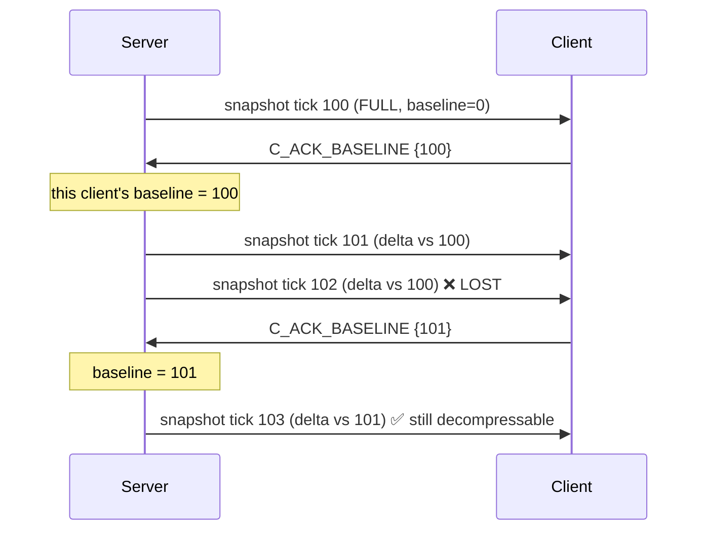

# Dev C — Phase 01: Snapshots, deltas, and the server loop

**Weeks 3–6** · Milestone **M1 (the make-or-break milestone)** · Estimate **4.0 person-weeks**

> Goal in one sentence: **the server is the single source of truth, and clients learn that truth at
> the lowest possible bandwidth cost.**

---

## 1. Objectives

| # | Objective |
|---|---|
| 1 | `ServerTickLoop` running steadily at 30 Hz on headless |
| 2 | Applying client input authoritatively (speed clamping, anti speed-hack) |
| 3 | Full snapshots: server → client, with the client rebuilding the world |
| 4 | Delta encoding against an acked baseline |
| 5 | Integration with B's transport and A's gameplay → 2 clients in sync |

---

## 2. Detailed tasks

### Task 1 — `ServerTickLoop` (3 days)

```csharp
// Assets/Scripts/Net/Server/ServerTickLoop.cs
public sealed class ServerTickLoop : MonoBehaviour
{
    private ITransportServer _transport;
    private readonly Dictionary<ushort, ClientSession> _sessions = new();
    private uint _serverTick;
    private float _snapshotAccumulator;

    private void Awake()
    {
        NetContext.SetRole(NetContext.Role.Server);
        Time.fixedDeltaTime = 1f / ProtocolConstants.SIM_TICK_RATE;   // 1/30
        Application.targetFrameRate = ProtocolConstants.SIM_TICK_RATE;
        QualitySettings.vSyncCount = 0;
    }

    private void FixedUpdate()
    {
        double nowMs = Time.realtimeSinceStartupAsDouble * 1000.0;

        // 1. Receive and decode input
        _transport.Poll();                       // raises OnMessage → fills the session

        // 2. Apply each player's input
        foreach (var s in _sessions.Values) ApplyInput(s);

        // 3. Unity runs physics + AI in this same FixedUpdate (Actor, AiActorController)
        //    → nothing to do here, just make sure the script order is right

        // 4. Store hitbox history for lag compensation (phase 02)
        _hitboxHistory.Capture(_serverTick);

        // 5. Build and send snapshots at 20Hz (every 1.5 ticks)
        _snapshotAccumulator += Time.fixedDeltaTime;
        if (_snapshotAccumulator >= 1f / ProtocolConstants.SNAPSHOT_RATE)
        {
            _snapshotAccumulator -= 1f / ProtocolConstants.SNAPSHOT_RATE;
            BuildAndSendSnapshots();
        }

        NetContext.CurrentTick = ++_serverTick;
        RecordTickTime(nowMs);
    }
}
```

**Trap 1 — Script Execution Order.** Mandatory:

| Order | Script | Why |
|---|---|---|
| -1000 | `NetServerBootstrap` | Sets the role before any Awake |
| -200 | `ServerTickLoop` (the input stage) | Input must be applied before Actor runs |
| 0 (default) | `Actor`, `AiActorController` | Simulation |
| +200 | `ServerTickLoop` (the snapshot stage) | Snapshots must be captured after the sim finishes |

Unity doesn't allow one script to have two order values. The fix: split it into 2 MonoBehaviours
(`ServerInputStage` at -200 and `ServerSnapshotStage` at +200), with `ServerTickLoop` coordinating.

**Trap 2 — `FixedUpdate` doesn't run exactly 30 times/second when the server is overloaded.** If a
tick takes 40 ms, Unity runs several `FixedUpdate`s back to back to catch up (the spiral of death).
Prevent it with `Time.maximumDeltaTime = 0.1f` and monitoring: if tick time exceeds 30 ms
continuously for 5 seconds, log a warning and reduce the bot count.

### Task 2 — Applying input authoritatively (3 days)

```csharp
// Assets/Scripts/Net/Server/ServerAuthority.cs
private void ApplyInput(ClientSession s)
{
    // Take the newest unprocessed frames from the buffer (the client sends 3× redundancy)
    while (s.InputBuffer.TryDequeue(out var frame))
    {
        if (frame.Tick <= s.LastProcessedInputTick) continue;    // duplicate copy, skip

        // === AUTHORITATIVE CHECKS ===
        // 1. No large forward jumps in tick (prevents fast-forwarding)
        if (frame.Tick > s.LastProcessedInputTick + MAX_TICK_JUMP)   // 60 = 2 seconds
        { NetLog.Warn($"conn {s.Id} made an abnormal tick jump"); s.LastProcessedInputTick = frame.Tick - 1; }

        // 2. Normalize the movement vector (a client could send moveX=moveZ=127 to move √2 faster)
        float mx = frame.MoveX / 127f, mz = frame.MoveZ / 127f;
        float mag = MathF.Sqrt(mx * mx + mz * mz);
        if (mag > 1f) { mx /= mag; mz /= mag; }

        // 3. Apply
        var netFrame = new NetInputFrame {
            MoveX = mx, MoveZ = mz,
            Yaw = Quantize.UnpackYaw(frame.Yaw), Pitch = Quantize.UnpackPitch(frame.Pitch),
            Buttons = frame.Buttons
        };
        MovementSimulation.Step(s.Actor, in netFrame, Time.fixedDeltaTime);

        // 4. Post-check: the actual speed didn't exceed the limit
        float moved = Vector3.Distance(s.Actor.transform.position, s.PrevPosition);
        float maxMove = MovementSimulation.SPRINT_SPEED * 1.3f * Time.fixedDeltaTime;  // 30% tolerance
        if (moved > maxMove)
        {
            s.Actor.transform.position = s.PrevPosition
                + (s.Actor.transform.position - s.PrevPosition).normalized * maxMove;
            s.SpeedViolations++;
            if (s.SpeedViolations > 100) NetLog.Warn($"conn {s.Id} suspected of speed hacking");
        }
        s.PrevPosition = s.Actor.transform.position;
        s.LastProcessedInputTick = frame.Tick;
    }
}
```

**Why normalizing the vector is mandatory:** this is the classic cheat. The client sends
`moveX = 127`, `moveZ = 127`, giving a vector length of √2 ≈ 1.41 → 41% faster movement. Not
normalizing leaves the hole open.

**Why a 30% tolerance:** explosions, sliding down slopes and jumping can all move a player faster
than the nominal run speed. Too tight and normal players get stuck.

**Trap 3 — missing input.** If an input packet is lost and there's no frame for this tick, don't let
the character freeze. Repeat the last frame (assuming the player is still holding the same keys).
Only stop after 3 ticks with no input.

```csharp
if (s.InputBuffer.IsEmpty && s.MissedInputTicks < 3)
{ MovementSimulation.Step(s.Actor, in s.LastFrame, dt); s.MissedInputTicks++; }
```

### Task 3 — Full snapshots (3 days)

```csharp
// Ironfront.Net.Replication/SnapshotBuilder.cs
public int WriteFull(Span<byte> dst, in SnapshotRaw snap)
{
    var w = new BitWriter(dst);
    w.WriteByte(MsgType.S_SNAPSHOT);
    w.WriteUInt32(snap.ServerTick);
    w.WriteUInt32(snap.LastProcessedInputTick);
    w.WriteUInt32(0);                                  // baselineTick = 0 → full
    w.WriteByte((byte)snap.ActorCount);

    for (int i = 0; i < snap.ActorCount; i++)
    {
        ref readonly var a = ref snap.Actors[i];
        w.WriteUInt16(a.ActorId);
        w.WriteByte(0xFF & ~ChangeMask.Seat);          // full: every field except seat
        WritePosition(ref w, a.Position);
        WriteRotation(ref w, a.Yaw, a.Pitch);
        WriteVelocity(ref w, a.Velocity);
        w.WriteByte(a.StateFlags);
        w.WriteBits(a.Health, 7);                      // 0..100 fits in 7 bits
        w.WriteBits(a.WeaponId, 5);                    // up to 32 weapons
        w.WriteBits(a.AmmoInClip, 8);
        w.WriteBits(a.Team, 2);                        // 0..3
    }
    return w.BytesWritten;
}
```

**How much bit-packing saves:** health+weapon+ammo+team byte-aligned = 4 bytes; bit-packed =
7+5+8+2 = 22 bits = 2.75 bytes. That saves 1.25 B/actor × 48 × 20 Hz = **1.2 KB/s**. Times 16
clients = 19 KB/s at the server. Worth doing.

### Task 4 — Delta encoding with baselines (4 days) — THE HARDEST PART

**The problem:** if you delta against the immediately preceding snapshot, one lost packet corrupts
the entire chain that follows (the client has no baseline to decompress against).

**The solution (C-AD-1):** delta against a snapshot **the client has confirmed receiving**.



```csharp
// Ironfront.Net.Replication/DeltaEncoder.cs
public sealed class DeltaEncoder
{
    private const int BASELINE_HISTORY = 32;              // ~1.6 seconds at 20Hz

    // The server keeps snapshot history for EACH client
    private readonly SnapshotRaw[] _history = new SnapshotRaw[BASELINE_HISTORY];
    private uint _ackedBaselineTick;

    public void OnClientAck(uint tick)
    {
        if (SequenceMath.IsNewer32(tick, _ackedBaselineTick)) _ackedBaselineTick = tick;
    }

    public int Write(Span<byte> dst, in SnapshotRaw current)
    {
        bool hasBaseline = _ackedBaselineTick != 0
            && current.ServerTick - _ackedBaselineTick < BASELINE_HISTORY;

        if (!hasBaseline) return WriteFull(dst, in current);   // baseline too old → send full

        ref readonly var baseline = ref _history[_ackedBaselineTick % BASELINE_HISTORY];

        var w = new BitWriter(dst);
        w.WriteByte(MsgType.S_SNAPSHOT);
        w.WriteUInt32(current.ServerTick);
        w.WriteUInt32(current.LastProcessedInputTick);
        w.WriteUInt32(_ackedBaselineTick);
        w.WriteByte((byte)current.ActorCount);

        for (int i = 0; i < current.ActorCount; i++)
        {
            ref readonly var cur = ref current.Actors[i];
            w.WriteUInt16(cur.ActorId);

            if (!TryFindInBaseline(in baseline, cur.ActorId, out var old))
            { w.WriteByte(0xFF); WriteAllFields(ref w, in cur); continue; }  // new actor → full

            byte mask = ComputeChangeMask(in old, in cur);
            w.WriteByte(mask);
            if ((mask & ChangeMask.Position) != 0) WritePosition(ref w, cur.Position);
            if ((mask & ChangeMask.Rotation) != 0) WriteRotation(ref w, cur.Yaw, cur.Pitch);
            // ... field by field
        }
        return w.BytesWritten;
    }

    private static byte ComputeChangeMask(in ActorStateRaw old, in ActorStateRaw cur)
    {
        byte m = 0;
        // Compare AT THE QUANTIZED LEVEL, not raw floats — see trap 4
        if (Quantize.PackPos(old.Position.X) != Quantize.PackPos(cur.Position.X) ||
            Quantize.PackPos(old.Position.Y) != Quantize.PackPos(cur.Position.Y) ||
            Quantize.PackPos(old.Position.Z) != Quantize.PackPos(cur.Position.Z))
            m |= ChangeMask.Position;
        if (Quantize.PackYaw(old.Yaw) != Quantize.PackYaw(cur.Yaw) ||
            Quantize.PackPitch(old.Pitch) != Quantize.PackPitch(cur.Pitch))
            m |= ChangeMask.Rotation;
        if (old.Health != cur.Health)         m |= ChangeMask.Health;
        if (old.StateFlags != cur.StateFlags) m |= ChangeMask.State;
        // ...
        return m;
    }
}
```

> **Trap 4 — comparing raw floats instead of quantized values.**
> A stationary actor still has `position.x` jittering by ±0.0001 from physics. Comparing raw floats
> means `changeMask` always has the Position bit set → the delta is useless and bandwidth doesn't
> drop at all.
> **You must compare after quantizing.** This is the mistake that makes delta encoding "work but
> save nothing" — very easy to miss because there's no clear symptom, just higher-than-expected
> bandwidth.

> **Trap 5 — the client has to apply the same logic.** When the client receives a delta with
> `mask & Position == 0`, it must **keep** the position from the baseline, not zero it. It sounds
> obvious but it's easy to get wrong when copying structs.

**A mandatory delta test (mitigating risk C6):**

```csharp
[Fact]
public void Delta_With20PercentPacketLoss_FinalStateStillMatches()
{
    var rng = new Random(42);
    var encoder = new DeltaEncoder();
    var decoder = new DeltaDecoder();
    var world = GenerateRandomWorld(actorCount: 48);

    for (uint tick = 1; tick <= 1000; tick++)
    {
        MutateWorld(world, rng);                        // random movement
        Span<byte> buf = stackalloc byte[4096];
        int n = encoder.Write(buf, in world);

        if (rng.NextDouble() > 0.20)                    // 80% of packets arrive
        {
            decoder.Read(buf[..n], ref clientWorld);
            encoder.OnClientAck(tick);                  // the client acks
        }
        // 20% lost: no ack, so the server keeps deltaing against the old baseline
    }

    AssertWorldsEqual(world, clientWorld, tolerance: 0.07f);   // quantization error
}
```

This test catches almost every delta bug. Run it with several different seeds.

### Task 5 — Integration (2 days)

Integration order, committing each step separately:
1. Server + `LoopbackTransport` (B's) + 1 fake client → snapshots flow
2. Server + real UDP transport + 1 of A's Unity clients
3. 2 Unity clients → **M1**

---

## 3. Acceptance criteria (M1)

| # | Criterion | How to verify | State |
|---|---|---|---|
| 1 | The server holds a steady 30 Hz tick with 48 actors | Log tick times, p99 < 33 ms | ✅ pacing / ⏳ under real load — `ServerTickScheduler` holds 30 Hz and clamps a 2 s stall to 3 ticks; measuring against Unity physics + AI needs a headless build |
| 2 | Full snapshots round-trip bit-for-bit | Test | ✅ `FullSnapshotRoundTripsEveryField` |
| 3 | Deltas with 20% packet loss end in a matching state | The Task 4 test | ✅ 1000 ticks × **4 seeds**, exact equality (not a tolerance) |
| 4 | Deltas save ≥ 35% versus full snapshots | Measured on real data, not synthetic | ✅ **44.7%** over 595 snapshots at 48 actors |
| 5 | Speed hacks are blocked (client sending moveX=moveZ=127) | Test: write a fake client sending malicious input | ✅ `ASpeedHackingClientIsClampedByTheServer` |
| 6 | 3 ticks of missing input → the character still moves smoothly | Test with the simulator dropping input | ✅ coasts exactly 3 ticks, then stops |
| 7 | 2 Unity clients see each other in sync | With A, on video | ⏳ **needs Editor.** Offline equivalent passes: server + `LoopbackTransport` + fake client converges at lan/typical/bad |
| 8 | Measured bandwidth ≤ 12 KB/s/client (before interest management) | Logs | ✅ **10.94 KB/s** incl. GSP header + framing |
| 9 | 0 allocations per tick on the server | Unity Profiler | ✅ by construction / ⏳ profiled — fixed rings, pre-allocated buffers, no LINQ |
| 10 | ≥ 45 tests total, all green | `dotnet test` | ✅ **283** |

> **6 of 10 met, 2 met in the engine-free layer awaiting Unity confirmation, 2 blocked on the
> Editor.** Full write-up, measurements and decisions:
> [`reports/2026-08-12-phase-01-snapshot.md`](../reports/2026-08-12-phase-01-snapshot.md).
>
> **Deviation from Task 3's sketch:** snapshots stay **byte-aligned** per the frozen spec § 4.3
> rather than bit-packing health/weapon/ammo/team. The sketch predates the v1.0.0 freeze, and
> shipping it would be an unannounced wire-format change for a saving of 1.25 B/actor.
> `BitWriter` still shipped, as a general utility with its own conformance suite.
>
> **Traps 4 and 5 are closed structurally, not by discipline.** `WorldSnapshot` stores
> already-quantized entries, so change detection *cannot* compare raw floats; `DeltaDecoder`
> seeds each entry from its baseline, so an omitted field is inherited rather than zeroed.

---

## 4. Risks

| Risk | Sign | Handling |
|---|---|---|
| Baseline drift (C1) | The client's world drifts further from the server's over time | The Task 4 test. Log `baselineTick` on both sides and compare |
| Deltas save nothing | Bandwidth equals full snapshots | Trap 4: compare after quantizing |
| Tick time exceeds 33 ms | The server can't hold 30 Hz | Break down the time per stage. It's usually AI or physics, not snapshots. Reduce bots |
| `MovementSimulation` not yet available from A | Input can't be applied | Write a temporary version from the constants in A's phase-02 and swap it later |
| Wrong Script Execution Order | Snapshots capture the previous tick's state | Log the tick number at each stage and verify the ordering |
| Week 6 arrives unfinished | | Contingency: drop deltas and send full snapshots only. Bandwidth ~20 KB/s, still fine on LAN |

---

## 5. Required measurements

Reproduce with:

```
dotnet test Ironfront.Net.Replication.Tests --filter FullyQualifiedName~MeasurementReport \
    --logger "console;verbosity=detailed"
```

| Metric | Conditions | Value |
|---|---|---|
| Full snapshot size | 48 actors | **973 B** |
| Full snapshot size | 64 actors (join) | **1293 B** — over the 1184 B payload limit, fragments as the spec predicts |
| Mean delta size | 48 actors, mid-game | **537.9 B** |
| Smallest / largest delta | | 529 B / 543 B |
| Delta saving ratio | | **44.7%** |
| Bandwidth per client | 48 actors, 20 Hz, incl. GSP + framing | **10.94 KB/s** |
| Full vs delta snapshots sent | 600 snapshots | 1 full, 599 delta |
| Tick time p50 / p99 | 48 actors | ⏳ needs a headless build with Unity physics + AI |
| Tick time breakdown | input / sim / snapshot | ⏳ same |

Per-actor cost, matching the spec § 4.3 estimate exactly: full **20 B**, position+rotation delta
**12 B**, unchanged actor **3 B**.
