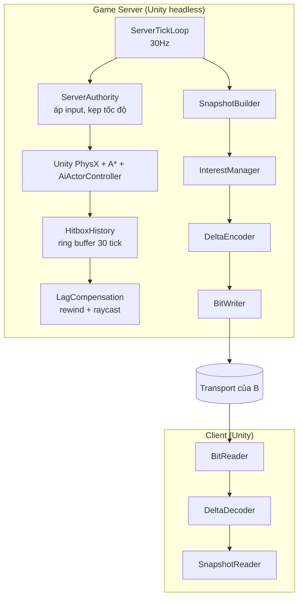

# Kế hoạch — Dev C · Replication & Server Simulation

> Đọc trước: [`../00-shared/protocol-spec.md`](../00-shared/protocol-spec.md) (thuộc lòng § 4, § 7) ·
> [`../00-shared/architecture.md`](../00-shared/architecture.md) ·
> [`../00-shared/conventions.md`](../00-shared/conventions.md)

---

## 1. Vai trò

> **Đây là vai nặng nhất nhóm.** Chấm trên 7 trục: **C = 47/70**, B = 37/70, D = 23/70.
> Kế hoạch đã được tái cấu trúc để dồn mọi phụ thuộc chéo và rủi ro cao về vai này, đổi lại
> Dev B và Dev D có **zero phụ thuộc** sau tuần 2.
> Xem [dependency-map.md](../00-shared/dependency-map.md).

Bạn đứng giữa: **nhận byte từ B, biến thành trạng thái game cho A**, và ngược lại. Đồng thời
bạn sở hữu **vòng lặp mô phỏng authoritative trên server** và **định nghĩa thế nào là chuyển
động đúng** cho cả hai phía.

Năm nhiệm vụ:

1. **Nén trạng thái thế giới xuống mức gửi được** — delta encoding, interest management.
   48 actor phải vừa trong ~7 KB/s.
2. **Vòng lặp server** — áp input, chạy sim, sinh snapshot, chống cheat, đảm bảo mọi client
   thấy cùng một sự thật.
3. **Lag compensation** — tua ngược hitbox để người ping cao vẫn bắn trúng. Mảnh khó nhất dự án.
4. **`MovementSimulation` — sự thật chung của client và server.** *(mới nhận từ Dev A)*
   Bạn trích logic di chuyển khỏi `Actor.cs` và sở hữu file đó. Nếu nó lệch giữa hai phía,
   prediction của A giật liên tục — và bạn là người chịu hậu quả, nên bạn là người sở hữu.
5. **Trọng tài protocol + chủ integration harness.** Test conformance của bạn quyết định ai
   đúng khi B và A tranh cãi về format. Khi tích hợp vỡ, bạn là người chạy và sửa.

**Bạn KHÔNG làm:** socket và bit-packing serializer (B), UI (A), master server (D),
AI bot (đã có sẵn, bạn chỉ chạy nó — xem [AD-10](../00-shared/algorithm-decisions.md)).

### 1.1. Vì sao vai này khó — để bạn biết mình đang nhận gì

| Trục | Điểm | Cụ thể |
|---|---|---|
| Độ khó thuật toán | 8/10 | Lag compensation, delta + baseline ack, interest LOD |
| **Độ khó tích hợp** | **10/10** | Ngồi giữa cả 3 người, phụ thuộc 2, chặn 1 |
| Độ khó debug | 8/10 | Bug delta chỉ lộ khi mất gói; bug hitbox chỉ lộ sau vài phút |
| Số phụ thuộc | 3 | A (headless build, Actor API), B (transport, serializer) |
| Rủi ro chặn nhóm | 9/10 | A không có dữ liệu thật nếu bạn trễ |
| Phải mở Unity | Có | Người duy nhất trong 3 backend dev phải làm việc này |
| Phạm vi kiến thức | Rộng nhất | Phải hiểu **cả** Unity gameplay **lẫn** byte-level |

---

## 2. Vùng sở hữu

| Đường dẫn | Quyền |
|---|---|
| `Ironfront.Net.Replication/**` | **Sở hữu toàn quyền** — C# thuần, không Unity |
| `Ironfront.Net.Replication/Serialization/**` | **Chỉ đọc** — Dev B sở hữu (`BitWriter`, `BitReader`, `Quantize`) |
| `Ironfront.Net.Replication.Tests/**` | Sở hữu |
| `Ironfront.Net.Replication.Tests/Conformance/**` | **Sở hữu — bạn là trọng tài kiểm định code của B** |
| `Ironfront_Reborn/Assets/Scripts/Net/Server/**` | Sở hữu (code Unity phía server) |
| `Ironfront_Reborn/Assets/Scripts/Net/Shared/**` | Sở hữu, A đọc |
| `Ironfront_Reborn/Assets/Scripts/Net/Shared/MovementSimulation.cs` | **Sở hữu — mới nhận từ Dev A.** Không ai khác được sửa |
| `tools/run-integration.ps1` + kịch bản integration | **Sở hữu — mới nhận từ Dev B** |
| `Ironfront.Net.Protocol/**` | PR + 2 approve (chung) |
| `Ironfront_Reborn/Assets/Scripts/Assembly-CSharp/**` | **Chỉ đọc.** Cần sửa → nhờ A |

### 2.1. Bạn kiểm định, Dev B cài đặt

| | Ai làm |
|---|---|
| Cài đặt bit-packing + quantization | **Dev B** |
| Test conformance với hex cứng viết tay theo spec | **Bạn** |

Nếu cùng một người vừa viết vừa test, test chỉ chứng minh code nhất quán với chính nó, không
chứng minh nó khớp spec. Tách ra thì test của bạn thành **trọng tài thật**.

Hệ quả: test của bạn sẽ đỏ trên code B vừa viết. Đó là tính năng. Khi đỏ, hai người cùng mở
`protocol-spec.md` § 4.4 và xem ai lệch spec — **không phải xem ai sai**.

### 2.2. Ngoại lệ Unity của bạn

B và D không mở Unity Editor. Bạn **được phép**, vì cần test server tick loop và trích
`MovementSimulation`. Quy tắc kèm theo:

- Chỉ sửa file `.cs` trong `Net/Server/` và `Net/Shared/`
- **Không** sửa scene, prefab, hay bất kỳ file `.meta` nào
- Unity tự sinh `.meta` mới → **đừng commit**, để Dev A xử lý
- Cần sửa `Actor.cs` hay bất kỳ file nào trong `Assembly-CSharp/` → nhờ A, đừng tự sửa

**Bạn có ngoại lệ so với B và D:** bạn cần mở Unity Editor để test server tick loop. Quy tắc:
mở được, nhưng **không sửa scene, prefab, hay bất kỳ file `.meta` nào**. Chỉ sửa file `.cs`
trong `Assets/Scripts/Net/Server/` và `Net/Shared/`. Nếu Unity tự sinh `.meta` mới, đừng commit
nó — để A xử lý.

---

## 3. Kiến trúc



**Ranh giới sạch:** `Ironfront.Net.Replication` là .NET lib thuần, **không** `using UnityEngine`.
Nó thao tác trên struct dữ liệu thuần (`ActorStateRaw` với `float x,y,z` chứ không phải
`Vector3`). Chuyển đổi sang kiểu Unity xảy ra ở lớp mỏng trong `Assets/Scripts/Net/`.

Lợi ích: bạn unit-test toàn bộ logic nén bằng xUnit trong vài giây, không cần mở Unity.

---

## 4. API công khai — chốt tuần 1

```csharp
namespace Ironfront.Net.Replication;

// ===== Kiểu dữ liệu thuần, KHÔNG phụ thuộc Unity =====
public struct Vec3 { public float X, Y, Z; }

public struct ActorStateRaw
{
    public ushort ActorId;
    public Vec3   Position;
    public float  Yaw, Pitch;
    public Vec3   Velocity;
    public byte   StateFlags, Health, WeaponId, AmmoInClip, Team;
    public ushort VehicleId; public byte SeatIndex;
}

public struct SnapshotRaw
{
    public uint ServerTick, LastProcessedInputTick, BaselineTick;
    public ActorStateRaw[] Actors;
    public int ActorCount;                 // dùng thay Length để tránh cấp phát mảng mới
}

public struct InputFrameRaw
{
    public uint   Tick;
    public sbyte  MoveX, MoveZ;
    public ushort Yaw; public short Pitch;
    public ushort Buttons;
}

// ===== Ghi (server) =====
public interface ISnapshotWriter
{
    /// <summary>Ghi snapshot cho MỘT client (đã lọc interest, đã delta theo baseline của họ).</summary>
    int Write(Span<byte> dst, in SnapshotRaw snapshot, uint baselineTick, ushort forConnectionId);
}

// ===== Đọc (client) =====
public interface ISnapshotReader
{
    bool TryRead(ReadOnlySpan<byte> src, ref SnapshotRaw outSnapshot);
    void AckBaseline(uint tick);
}

// ===== Input =====
public static class InputSerializer
{
    public static int  Write(Span<byte> dst, ReadOnlySpan<InputFrameRaw> frames, uint startTick);
    public static bool TryRead(ReadOnlySpan<byte> src, Span<InputFrameRaw> dst, out int count);
}
```

---

## 5. Lộ trình 5 phase

| Phase | Tuần | Mốc | Kết quả |
|---|---|---|---|
| [phase-00](phases/phase-00-nen-mong.md) | 1–2 | M0 | Chủ trì đóng băng protocol · `ProtocolConstants` · **bộ test conformance** (trọng tài) · **bắt đầu trích `MovementSimulation`** · `InputSerializer` |
| [phase-01](phases/phase-01-snapshot.md) | 3–6 | M1 | Snapshot full + delta · `ServerTickLoop` · áp input authoritative · 2 client đồng bộ |
| [phase-02](phases/phase-02-lag-comp.md) | 7–10 | M2 | Interest management · hitbox history · lag compensation · bắn server-authoritative · bot replication |
| [phase-03](phases/phase-03-tran-dau.md) | 11–13 | M3 | Vòng đời trận · điểm chiếm · điểm số · tối ưu băng thông · nối master server |
| [phase-04](phases/phase-04-bao-cao.md) | 14 | M4 | Benchmark · báo cáo nén dữ liệu · tài liệu |

---

## 6. Ước lượng

| Hạng mục | Người-tuần | Thay đổi |
|---|---|---|
| ~~Bit-packing serializer~~ → Dev B | ~~2.0~~ **0** | **−2.0** |
| Conformance test (trọng tài, kiểm định code B) | 1.0 | giữ, tách khỏi mục trên |
| **`MovementSimulation` — trích khỏi `Actor.cs`** | **1.5** | **+1.5 nhận từ Dev A** |
| Snapshot + delta + baseline | 2.5 | |
| Interest management | 1.5 | |
| Server tick loop + authority + chống cheat | 2.0 | |
| Reconciliation (phía server) | 1.0 | |
| Lag compensation + hitbox history | 2.0 | |
| **Integration harness + benchmark** | **1.5** | **+0.5 nhận từ Dev B** |
| **Tổng** | **13.0 / 14** | không đổi |

**Ba thay đổi so với kế hoạch gốc:**

| # | Chuyển gì | Hướng | Lý do |
|---|---|---|---|
| 1 | Trích `MovementSimulation` khỏi `Actor.cs` | Dev A → **bạn** | Blocker tệ nhất kế hoạch cũ (tuần 7, giữa dự án, đúng mảnh khó nhất). File phải giống hệt client/server; bạn là người chịu hậu quả khi nó lệch |
| 2 | Bit-packing serializer | **bạn** → Dev B | Việc byte-level cô lập, đúng sở trường B, giữ B zero-dependency. Bạn giữ lại vai trọng tài (conformance test) |
| 3 | Integration harness | Dev B → **bạn** | Bạn ngồi giữa, bạn nên là người chạy và sửa khi tích hợp vỡ |

Tổng ngân sách không đổi (13.0), nhưng **trọng tâm rủi ro đã dịch về bạn** — đúng như bạn yêu
cầu, và tốt cho dự án vì rủi ro tập trung dễ quản lý hơn rủi ro rải đều.

---

## 7. Rủi ro riêng

| # | Rủi ro | Chặn |
|---|---|---|
| C1 | Baseline drift: client và server bất đồng về baseline nào đang dùng → delta giải nén sai, thế giới lệch dần | Client ack baseline tường minh (`C_ACK_BASELINE`). Server chỉ delta so với baseline đã được ack. Có test tái hiện mất ack |
| C2 | Quantization không khớp giữa hai bên | Hằng số trong `Ironfront.Net.Protocol`, test conformance của **bạn** với giá trị hex cứng kiểm định code của B |
| C3 | Tải CPU server vượt ngân sách (rủi ro R6) | Benchmark 48 actor từ phase 01, không đợi tới cuối. LOD tick cho bot xa |
| C4 | Lag compensation làm người ping thấp ức chế ("chết sau khi đã nấp") | Kẹp 200ms. Đo và tinh chỉnh cùng A ở phase 02 |
| C5 | Bạn phụ thuộc cả B (transport) và A (headless build, Actor API) | `LoopbackTransport` của B từ tuần 2. Nếu A trễ headless build: dùng Unity Editor Play Mode, chậm hơn nhưng chạy được |
| C6 | Delta encoding có bug tinh vi, chỉ lộ khi mất gói | Test bắt buộc: sinh chuỗi 1000 snapshot, drop ngẫu nhiên 20%, kiểm tra trạng thái cuối khớp |
| **C7** | **Trích `MovementSimulation` phá gameplay gốc** — bạn đang mổ 1188 dòng `Actor.cs` mà bạn không viết | **Không xóa code cũ.** Chạy `MovementSimulation` **song song** với code gốc, log vị trí cả hai, so sánh 1–2 ngày. Chỉ chuyển sang dùng khi khớp. Chi tiết ở phase-00 Task 5 |
| **C8** | **Bạn là người duy nhất trong 3 backend dev phải hiểu Unity gameplay** — chi phí học `Actor.cs` bị đánh giá thấp | Dành trọn 2 ngày phase-00 để đọc `Actor.cs` + `FpsActorController.cs` trước khi viết dòng nào. Nhờ A giải thích, đừng tự đoán |
| **C9** | **Tích hợp vỡ và bạn bị nghi đầu tiên** (bạn ngồi giữa) | Bạn sở hữu integration harness → bạn có công cụ chứng minh. Dùng packet log của B (`--analyze`) + log tick của bạn để chỉ ra tầng nào lệch. **Đừng nhận lỗi khi chưa có bằng chứng** |

---

## 8. Quyết định kiến trúc riêng

| # | Quyết định | Lý do | Đánh đổi |
|---|---|---|---|
| C-AD-1 | Delta so với **baseline đã được client ack**, không phải snapshot trước đó | Mất 1 gói không làm hỏng chuỗi delta vô hạn | Server phải lưu nhiều baseline/client (~16 tick × 48 actor × 20 B = 15 KB/client, chấp nhận) |
| C-AD-2 | Bit-packing thay vì byte-align | Tiết kiệm ~25% băng thông (changeMask, flags nhỏ) | Khó debug hơn. Bù bằng công cụ dump hex |
| C-AD-3 | Interest management theo khoảng cách + LOD tick, không dùng PVS/octree | 48 actor, vòng lặp O(n²) = 2304 phép so sánh mỗi tick, không đáng kể | Không scale tới hàng nghìn actor. Không cần |
| C-AD-4 | `MovementSimulation` dùng chung client/server, **cùng một file** | Điều kiện tiên quyết để prediction hoạt động | A phải trích logic ra khỏi `Actor.cs` |
| C-AD-5 | Bot chạy `AiActorController` gốc trên server, không viết lại | Tiết kiệm 2000+ LOC | Phải chấp nhận hành vi AI như bản gốc |
| C-AD-6 | Lag compensation chỉ cho hitscan, không cho projectile | Projectile (lựu đạn, rocket) bay chậm, người chơi đã quen dẫn trước | Đơn giản hơn nhiều |

---

## 9. Giao diện với người khác

**Bạn cung cấp cho A:**

| Thứ | Hạn | Ghi chú |
|---|---|---|
| `ISnapshotReader`, `ActorStateRaw` — chữ ký | Tuần 1 | Để A code theo interface |
| `InputSerializer` | Tuần 2 | |
| Implementation giả (`FakeSnapshotReader`) | Tuần 2 | Để A không phải chờ bạn |
| **`MovementSimulation.cs` hoàn chỉnh** | **Đầu tuần 7** | A chỉ *gọi* nó, không viết. Đây là cam kết quan trọng nhất của bạn với A |
| Hằng số `MovementSimulation` (WALK_SPEED, GRAVITY...) công bố sớm | Tuần 3 | Để A viết bản tạm nếu bạn trễ |

**Bạn tiêu thụ từ B:** `ITransportClient` / `ITransportServer`, `LoopbackTransport`,
và **`BitWriter`/`BitReader`/`Quantize`** (mới — B cài đặt, bạn dùng và kiểm định).

**Bạn tiêu thụ từ D:** không có gì ở M1–M2. Từ M3: `GS_REGISTER`, `GS_HEARTBEAT`,
`GS_MATCH_ENDED`, và verify joinTicket.

**Bạn cần từ A — gửi yêu cầu NGAY tuần 1, hạn tuần 2:**

```csharp
// Trên Actor.cs — A expose, bạn dùng trong MovementSimulation và snapshot
public Vector3  NetVelocity { get; set; }
public bool     IsGrounded  { get; }
public void     CharacterMove(Vector3 delta);
public byte     PackStateFlags();
public void     ApplyStateFlags(byte flags);
public Hitbox[] GetHitboxes();                    // cho lag compensation
```

Cộng thêm: build headless chạy được (tuần 2), và bounding box thực tế của map lớn nhất (để xác
nhận `POS_MIN`/`POS_MAX` = ±2048 đủ).

> **Đã đổi so với kế hoạch gốc:** trước đây bạn *chờ A trích* `MovementSimulation` (tuần 7).
> Giờ **bạn tự trích**, và chỉ cần A expose 6 hàm nhỏ ở trên. Đổi một phụ thuộc lớn giữa dự án
> lấy một phụ thuộc nhỏ ở tuần 2. Xem [dependency-map.md § 4](../00-shared/dependency-map.md).

---

## 10. Ngân sách băng thông — kim chỉ nam suốt dự án

Mục tiêu: **≤ 8 KB/s downstream mỗi client** ở 16 người + 32 bot.

| Thành phần | Ngân sách |
|---|---|
| Snapshot (sau interest management, ~20 actor × 12 B) | 240 B × 20 Hz = 4.8 KB/s |
| Header GSP + framing | 20 B × 20 Hz = 0.4 KB/s |
| Event (spawn, death, fire, capture) | ~1.5 KB/s trung bình |
| Keep-alive, ack | ~0.1 KB/s |
| **Tổng** | **~6.8 KB/s** |

Upstream mỗi client: input 29 B × 30 Hz = **0.87 KB/s**.
Server tổng: 16 × 6.8 = **109 KB/s xuống**, 16 × 0.87 = **14 KB/s lên**. VPS rẻ nhất cũng dư.

Đo con số thực mỗi phase, ghi vào report. Nếu vượt ngân sách, xử lý theo thứ tự:
1. Siết interest management (giảm bán kính, giảm tần suất Mid/Far)
2. Bỏ trường velocity khỏi delta (client tự ước lượng từ 2 vị trí)
3. Giảm snapshot rate xuống 15 Hz
4. Giảm độ chính xác vị trí (i16 → 12 bit cho tọa độ Y)
