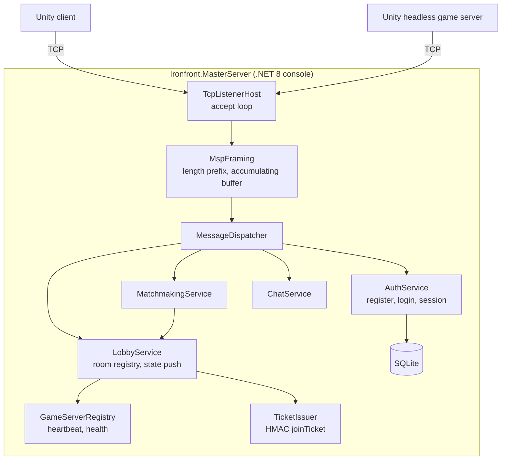

# Plan — Dev D · Master Server & Services

> Read first: [`../00-shared/protocol-spec.md`](../00-shared/protocol-spec.md) (know Part B by
> heart) · [`../00-shared/architecture.md`](../00-shared/architecture.md) ·
> [`../00-shared/conventions.md`](../00-shared/conventions.md)

---

## 1. Role

You write **a pure TCP master server in .NET, with no Unity, no ASP.NET Core, and no WebSocket**.
Just `System.Net.Sockets.TcpListener` and `Socket`.

This is **the other half of a Network Programming capstone**: if B proves an understanding of UDP,
you prove an understanding of TCP — particularly the **framing-over-a-byte-stream** problem that 90%
of newcomers get wrong.

You also own the **infrastructure and measurement tooling** for the whole team: CI, build scripts,
the VPS, the load-test harness. The other three depend on all of it.

**What you do NOT do:** UDP (B), game logic (A, C), Unity gameplay.

---

## 2. Ownership

| Path | Rights |
|---|---|
| `Ironfront.MasterServer/**` | **Full ownership** |
| `Ironfront.MasterServer.Tests/**` | Owner |
| `Ironfront.MasterClient/**` | Owner (the library A and C use) |
| `Ironfront.Tools.LoadTest/**` | Owner |
| `tools/**` (CI, build scripts) | Owner |
| `.github/workflows/**` | Owner |
| `Ironfront.Net.Protocol/**` | PR + 2 approvals (shared) |

**Don't open the Unity Editor.**

---

## 3. Architecture



---

## 4. Why TCP is the right choice here

This is an argument you must be able to defend. Put it in the report.

| Property of lobby data | Consequence |
|---|---|
| Very low frequency (a few messages per minute per client) | TCP overhead is negligible |
| Packet loss is **not** acceptable (losing a `LOGIN_RES` leaves the user staring at a frozen screen) | Reliability is required — TCP provides it |
| Irregular sizes (`ROOM_LIST_RES` can be several KB) | TCP handles fragmentation itself |
| Latency-insensitive (100 ms slower and nobody notices) | Head-of-line blocking is harmless |
| Ordering is needed (login first, then join) | TCP provides it |

**Hand-writing reliability over UDP for this part would be reimplementing what TCP already does
well.** That's precisely why the architecture splits across two protocols — and it's a strength at
the defense: you chose the tool to fit the problem rather than "using UDP because it's cooler".

---

## 5. Public API — `Ironfront.MasterClient`, frozen in week 1

A and C consume it. Freeze it early.

```csharp
namespace Ironfront.MasterClient;

public interface IMasterClient : IDisposable
{
    MasterConnectionState State { get; }

    Task<LoginResult>  LoginAsync(string username, string passwordHash, CancellationToken ct = default);
    Task<RegisterResult> RegisterAsync(string username, string passwordHash, string displayName, CancellationToken ct = default);
    Task<RoomInfo[]>   GetRoomsAsync(CancellationToken ct = default);
    Task<CreateRoomResult> CreateRoomAsync(CreateRoomRequest req, CancellationToken ct = default);
    Task<JoinResult>   JoinRoomAsync(int roomId, string password, CancellationToken ct = default);
    Task               LeaveRoomAsync(CancellationToken ct = default);
    Task               SetReadyAsync(bool ready, CancellationToken ct = default);
    Task               SendChatAsync(byte channel, string text, CancellationToken ct = default);

    event Action<RoomState>    OnRoomStatePush;
    event Action<ChatMessage>  OnChat;
    event Action<int, string>  OnError;              // (errorCode, message)
    event Action               OnDisconnected;
}

public struct JoinResult
{
    public bool   Ok;
    public int    ErrorCode;
    public string GameServerIp;
    public int    GameServerPort;
    public byte[] JoinTicket;      // 64 bytes, passed straight to ITransportClient.Connect
}
```

> **Something to settle with A in week 1 (important):** which **thread** are all the `event`s and
> `Task` continuations invoked on? Unity only allows its API to be called from the main thread.
>
> **Decision: `IMasterClient` exposes `Poll()`** — it accumulates events in an internal queue, and A
> calls `Poll()` every frame to raise them on the main thread. Returned `Task`s also complete inside
> `Poll()`. This eliminates the entire threading bug class, at the cost of at most one frame of
> latency — irrelevant for a lobby.

```csharp
public interface IMasterClient
{
    /// <summary>Call every frame from the main thread. All events and Task continuations fire here.</summary>
    void Poll();
}
```

---

## 6. The 5-phase roadmap

| Phase | Weeks | Milestone | Outcome |
|---|---|---|---|
| [phase-00](phases/phase-00-foundation.md) | 1–2 | M0 | TCP refresher · **`MspFraming`** (the central problem) · accept loop · CI · build scripts |
| [phase-01](phases/phase-01-auth-lobby.md) | 3–6 | M1 | Auth + SQLite · sessions · room registry · `IMasterClient` · **the `LoadTest` harness** |
| [phase-02](phases/phase-02-matchmaking.md) | 7–10 | M2 | Matchmaking · HMAC joinTickets · game server registry + heartbeat · chat |
| [phase-03](phases/phase-03-operations.md) | 11–13 | M3 | VPS deployment · monitoring · a 16-client load test · durability |
| [phase-04](phases/phase-04-report.md) | 14 | M4 | The TCP report · operations documentation |

---

## 7. Estimate

| Item | Person-weeks |
|---|---|
| TCP framing + connection manager | 1.5 |
| Auth + accounts + SQLite | 2.0 |
| Lobby + room registry + state push | 2.5 |
| Matchmaking + join tickets | 2.0 |
| Game server registry + heartbeat | 1.5 |
| Chat | 1.0 |
| Load-test harness + monitoring | 2.0 |
| **Total** | **12.5 / 14** |

You have **1.5 weeks spare** — the only person on the team with meaningful buffer. Use it to:
1. Help B when the transport layer hits a hard bug (you're B's backup)
2. Keep CI healthy for the whole team
3. Run load tests early for C

---

## 8. Your own risks

| # | Risk | Mitigation |
|---|---|---|
| D1 | **Wrong TCP framing** — messages glued together or cut in half | This is TCP's number-one problem. Mandatory tests: send 3 messages in one `Send()`, and send 1 message across 5 `Send()` calls |
| D2 | Callbacks off the main thread → Unity throws | The `Poll()` model, settled in § 5 |
| D3 | Storing passwords incorrectly | bcrypt/argon2 server-side, hashed client-side before sending. Never store plaintext |
| D4 | SQL injection | Use parameterized queries. Never concatenate SQL. No exceptions |
| D5 | A race when 2 people join the last slot simultaneously | A `lock` around room operations. The master server is single-threaded for logic, like B-AD-1 |
| D6 | You're the last dependency everyone needs (CI, VPS, load test) | Do CI and the load test **early** (phases 00, 01), don't leave them to M3 |
| D7 | Half-open TCP connections going undetected | A 15 s heartbeat + timeout. The OS's TCP keepalive is far too slow (2 hours by default) |

---

## 9. Your own architectural decisions

| # | Decision | Reason | Trade-off |
|---|---|---|---|
| D-AD-1 | One thread for logic, the thread pool only for I/O | Eliminates races in room/session state. A few dozen clients is trivially handled | Doesn't scale to thousands. Not needed |
| D-AD-2 | SQLite, not PostgreSQL/MySQL | No installation, one file, sufficient at this scale | Poor under high concurrent writes. Not needed |
| D-AD-3 | JSON message bodies, not binary | Frequency is low so the overhead doesn't matter; easy to debug in logs and Wireshark; easy to extend | More bandwidth — irrelevant here |
| D-AD-4 | Stateless HMAC joinTickets, no callback to the master | The game server verifies independently, with no extra round-trip and no dependency on the master being alive | Tickets can't be revoked early. The 60 s expiry makes that acceptable |
| D-AD-5 | No ASP.NET Core / SignalR / gRPC | Project requirement: raw TCP. Also the academic goal | We have to write framing, dispatch and serialization ourselves |
| D-AD-6 | No TLS at M1–M2, added at M3 | Avoids early complexity; but passwords are transmitted, so it's mandatory before going onto a public VPS | |

---

## 10. You own the infrastructure for the whole team

The other three depend on these three things. Do them early; don't make people wait.

### 10.1. CI — due week 2

`tools/ci.ps1` and `.github/workflows/ci.yml`, running in under 5 minutes:
1. `dotnet build` all 5 projects → 0 warnings (`TreatWarningsAsErrors` is on)
2. `dotnet test` across the board → 0 failures
3. Verify `ProtocolConstants.cs` matches `protocol-spec.md`
4. Unity batch-mode compile check (if the runner has Unity; otherwise run it on A's machine)

### 10.2. Build scripts — due week 2

| Script | What it does |
|---|---|
| `tools/build-libs.ps1` | Builds the 3 .NET libraries and copies the DLLs + dependencies into `Assets/Plugins/` |
| `tools/build-client.ps1` | Unity client build |
| `tools/build-server.ps1` | Unity headless server build |
| `tools/run-integration.ps1` | Starts 1 server + N clients and runs a smoke test |

`build-libs.ps1` is what B and C need most — it's what gets their code into Unity for A to use.

### 10.3. Load-test harness — due week 6

`Ironfront.Tools.LoadTest`: a simulated client with no Unity dependency, using
`Ironfront.Net.Transport` + `Ironfront.Net.Replication` directly.

```
dotnet run --project Ironfront.Tools.LoadTest -- \
    --master 127.0.0.1:27000 --clients 16 --duration 600 \
    --behavior random-walk --report loadtest-report.json
```

The value: C can't round up 16 real players every time; this tool makes that testable on demand. B
uses it for the overnight soak test. **This may be your most valuable contribution to the team.**

---

## 11. Security — the mandatory checklist

| Threat | Defense | Phase |
|---|---|---|
| Plaintext passwords in transit | The client hashes SHA256(pass+user) before sending | 01 |
| Plaintext passwords in the DB | The server re-hashes with bcrypt (cost 11) | 01 |
| SQL injection | Parameterized queries, no exceptions | 01 |
| Login brute force | Rate limit 5/minute/IP, lock the account for 15 minutes after 10 failures | 01 |
| Session hijacking | A cryptographically random 32-byte session token, 24 h expiry, bound to the IP | 01 |
| Game server impersonation | `GS_REGISTER` requires a `serverSecret` from an environment variable | 02 |
| Forged joinTickets | HMAC-SHA256, compared with `FixedTimeEquals` | 02 |
| Replayed joinTickets | A 60-second expiry + binding to a single serverId | 02 |
| Oversized messages exhausting RAM | Cap `length` at ≤ 64 KB, close the connection above that | 00 |
| Slowloris (connect then go silent) | A 30-second timeout before login | 00 |
| Too many connections from one IP | A limit of 5 connections/IP | 00 |
| Eavesdropping on the Internet | TLS before going onto a public VPS | 03 |
| Secrets in git | `.env` in gitignore, `.env.example` with variable names only | 00 |
