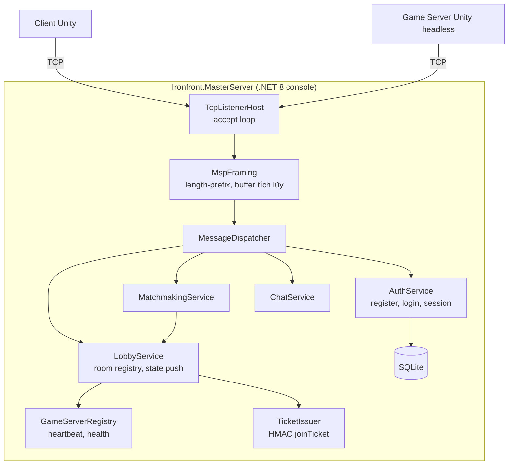

# Kế hoạch — Dev D · Master Server & Services

> Đọc trước: [`../00-shared/protocol-spec.md`](../00-shared/protocol-spec.md) (thuộc lòng phần B) ·
> [`../00-shared/architecture.md`](../00-shared/architecture.md) ·
> [`../00-shared/conventions.md`](../00-shared/conventions.md)

---

## 1. Vai trò

Bạn viết **master server TCP thuần bằng .NET, không dùng Unity, không dùng ASP.NET Core, không
dùng WebSocket**. Chỉ `System.Net.Sockets.TcpListener` và `Socket`.

Đây là **nửa còn lại của đồ án môn Lập trình mạng**: nếu B chứng minh hiểu UDP, bạn chứng minh
hiểu TCP — đặc biệt là bài toán **framing trên byte stream**, thứ mà 90% người mới làm sai.

Bạn cũng sở hữu **hạ tầng và công cụ đo** cho cả nhóm: CI, script build, VPS, load test harness.
Ba người kia phụ thuộc vào những thứ này.

**Bạn KHÔNG làm:** UDP (B), logic game (A, C), gameplay Unity.

---

## 2. Vùng sở hữu

| Đường dẫn | Quyền |
|---|---|
| `Ironfront.MasterServer/**` | **Sở hữu toàn quyền** |
| `Ironfront.MasterServer.Tests/**` | Sở hữu |
| `Ironfront.MasterClient/**` | Sở hữu (thư viện A và C dùng) |
| `Ironfront.Tools.LoadTest/**` | Sở hữu |
| `tools/**` (CI, build script) | Sở hữu |
| `.github/workflows/**` | Sở hữu |
| `Ironfront.Net.Protocol/**` | PR + 2 approve (chung) |

**Không mở Unity Editor.**

---

## 3. Kiến trúc



---

## 4. Vì sao TCP ở đây là lựa chọn đúng

Đây là luận điểm bạn phải bảo vệ được. Ghi vào báo cáo.

| Đặc điểm dữ liệu lobby | Hệ quả |
|---|---|
| Tần suất rất thấp (vài message/phút/client) | Overhead TCP không đáng kể |
| Mất gói **không** chấp nhận được (mất `LOGIN_RES` = người dùng treo màn hình) | Cần tin cậy — TCP cho sẵn |
| Kích thước không đều (`ROOM_LIST_RES` có thể vài KB) | TCP tự lo fragmentation |
| Không nhạy cảm với độ trễ (chậm 100ms không ai thấy) | Head-of-line blocking vô hại |
| Cần thứ tự (login trước, join sau) | TCP cho sẵn |

**Tự viết reliability trên UDP cho phần này sẽ là làm lại thứ TCP đã làm tốt.** Đây chính là lý
do kiến trúc chia hai protocol — và là điểm mạnh khi bảo vệ: bạn chọn công cụ theo bài toán, chứ
không phải "dùng UDP cho ngầu".

---

## 5. API công khai — `Ironfront.MasterClient`, chốt tuần 1

A và C tiêu thụ. Đóng băng sớm.

```csharp
namespace Ironfront.MasterClient;

public interface IMasterClient : IDisposable
{
    MasterConnectionState State { get; }

    Task<LoginResult>  LoginAsync(string username, string passwordHash, CancellationToken ct = default);
    Task<RegisterResult> RegisterAsync(string username, string passwordHash, string displayName, CancellationToken ct = default);
    Task<RoomInfo[]>   GetRoomsAsync(CancellationToken ct = default);
    Task<CreateRoomResult> CreateRoomAsync(CreateRoomRequest req, CancellationToken ct = default);
    Task<JoinResult>   JoinRoomAsync(int roomId, string password, CancellationToken ct = default);
    Task               LeaveRoomAsync(CancellationToken ct = default);
    Task               SetReadyAsync(bool ready, CancellationToken ct = default);
    Task               SendChatAsync(byte channel, string text, CancellationToken ct = default);

    event Action<RoomState>    OnRoomStatePush;
    event Action<ChatMessage>  OnChat;
    event Action<int, string>  OnError;              // (errorCode, message)
    event Action               OnDisconnected;
}

public struct JoinResult
{
    public bool   Ok;
    public int    ErrorCode;
    public string GameServerIp;
    public int    GameServerPort;
    public byte[] JoinTicket;      // 64 byte, chuyển thẳng cho ITransportClient.Connect
}
```

> **Điểm phải chốt với A ở tuần 1 (quan trọng):** mọi `event` và mọi callback của `Task` được
> gọi trên **thread nào**? Unity chỉ cho gọi API của nó từ main thread.
>
> **Quyết định: `IMasterClient` cung cấp `Poll()`** — nó tích lũy event vào hàng đợi nội bộ, A
> gọi `Poll()` mỗi frame để phát event trên main thread. `Task` trả về được hoàn tất cũng trong
> `Poll()`. Cách này loại bỏ hoàn toàn lớp bug threading, đổi lại độ trễ tối đa 1 frame — không
> đáng kể cho lobby.

```csharp
public interface IMasterClient
{
    /// <summary>Gọi mỗi frame từ main thread. Mọi event và Task continuation phát ra ở đây.</summary>
    void Poll();
}
```

---

## 6. Lộ trình 5 phase

| Phase | Tuần | Mốc | Kết quả |
|---|---|---|---|
| [phase-00](phases/phase-00-nen-mong.md) | 1–2 | M0 | Ôn TCP · **`MspFraming`** (bài toán trung tâm) · accept loop · CI · script build |
| [phase-01](phases/phase-01-auth-lobby.md) | 3–6 | M1 | Auth + SQLite · session · room registry · `IMasterClient` · **`LoadTest` harness** |
| [phase-02](phases/phase-02-matchmaking.md) | 7–10 | M2 | Matchmaking · joinTicket HMAC · game server registry + heartbeat · chat |
| [phase-03](phases/phase-03-van-hanh.md) | 11–13 | M3 | Triển khai VPS · monitoring · load test 16 client · độ bền |
| [phase-04](phases/phase-04-bao-cao.md) | 14 | M4 | Báo cáo TCP · tài liệu vận hành |

---

## 7. Ước lượng

| Hạng mục | Người-tuần |
|---|---|
| TCP framing + connection manager | 1.5 |
| Auth + account + SQLite | 2.0 |
| Lobby + room registry + state push | 2.5 |
| Matchmaking + join ticket | 2.0 |
| Game server registry + heartbeat | 1.5 |
| Chat | 1.0 |
| Load test harness + monitoring | 2.0 |
| **Tổng** | **12.5 / 14** |

Bạn có **1.5 tuần dư** — người duy nhất trong nhóm có buffer đáng kể. Dùng nó để:
1. Hỗ trợ B khi tầng transport gặp bug khó (bạn là backup của B)
2. Duy trì CI cho cả nhóm
3. Chạy load test sớm cho C

---

## 8. Rủi ro riêng

| # | Rủi ro | Chặn |
|---|---|---|
| D1 | **TCP framing sai** — message dính nhau hoặc bị cắt đôi | Đây là bài toán số 1 của TCP. Test bắt buộc: gửi 3 message trong 1 `Send()`, và gửi 1 message qua 5 lần `Send()` |
| D2 | Callback không ở main thread → Unity ném exception | `Poll()` model, chốt ở § 5 |
| D3 | Lưu mật khẩu sai cách | bcrypt/argon2 phía server, hash phía client trước khi gửi. Không bao giờ lưu plaintext |
| D4 | SQL injection | Dùng parameterized query. Không nối chuỗi SQL. Không có ngoại lệ |
| D5 | Race condition khi 2 người join phòng cuối cùng cùng lúc | Khóa (`lock`) quanh thao tác room. Master server một thread cho logic, giống B-AD-1 |
| D6 | Bạn là người cuối cùng ai cũng cần (CI, VPS, load test) | Làm CI và load test **sớm** (phase 00, 01), không để tới M3 |
| D7 | Kết nối TCP nửa chết (half-open) không phát hiện được | Heartbeat 15s + timeout. TCP keepalive của OS quá chậm (2 giờ mặc định) |

---

## 9. Quyết định kiến trúc riêng

| # | Quyết định | Lý do | Đánh đổi |
|---|---|---|---|
| D-AD-1 | Một thread cho logic, thread pool chỉ cho I/O | Loại bỏ race condition trong room/session state. Vài chục client là quá đủ | Không scale tới hàng nghìn. Không cần |
| D-AD-2 | SQLite, không PostgreSQL/MySQL | Không cần cài đặt, một file, đủ cho quy mô này | Không chịu được ghi đồng thời cao. Không cần |
| D-AD-3 | Body message dạng JSON, không binary | Tần suất thấp nên overhead không đáng kể; dễ debug bằng log và Wireshark; dễ mở rộng | Tốn băng thông hơn — không quan trọng ở đây |
| D-AD-4 | joinTicket HMAC stateless, không hỏi lại master | Game server verify được độc lập, không thêm round-trip, không phụ thuộc master còn sống | Không thu hồi được ticket trước hạn. Hạn 60s nên chấp nhận |
| D-AD-5 | Không dùng ASP.NET Core / SignalR / gRPC | Yêu cầu dự án: TCP thuần. Cũng là mục tiêu học thuật | Phải tự viết framing, dispatch, serialization |
| D-AD-6 | Không TLS ở M1–M2, thêm ở M3 | Tránh phức tạp sớm; nhưng có truyền mật khẩu nên bắt buộc phải có trước khi lên VPS công khai | |

---

## 10. Bạn sở hữu hạ tầng cho cả nhóm

Ba thứ này ba người kia phụ thuộc. Làm sớm, đừng để họ chờ.

### 10.1. CI — hạn tuần 2

`tools/ci.ps1` và `.github/workflows/ci.yml`, chạy dưới 5 phút:
1. `dotnet build` cả 5 project → 0 warning (đã bật `TreatWarningsAsErrors`)
2. `dotnet test` toàn bộ → 0 fail
3. Kiểm tra `ProtocolConstants.cs` khớp `protocol-spec.md`
4. Unity batch-mode compile check (nếu runner có Unity; nếu không, chạy trên máy A)

### 10.2. Script build — hạn tuần 2

| Script | Làm gì |
|---|---|
| `tools/build-libs.ps1` | Build 3 .NET lib, copy DLL + phụ thuộc vào `Assets/Plugins/` |
| `tools/build-client.ps1` | Unity build client |
| `tools/build-server.ps1` | Unity build headless server |
| `tools/run-integration.ps1` | Khởi động 1 server + N client, chạy smoke test |

`build-libs.ps1` là thứ B và C cần nhất — nó đưa code của họ vào Unity cho A dùng.

### 10.3. Load test harness — hạn tuần 6

`Ironfront.Tools.LoadTest`: client giả lập, không cần Unity, dùng thẳng
`Ironfront.Net.Transport` + `Ironfront.Net.Replication`.

```
dotnet run --project Ironfront.Tools.LoadTest -- \
    --master 127.0.0.1:27000 --clients 16 --duration 600 \
    --behavior random-walk --report loadtest-report.json
```

Giá trị: C không thể test 16 người thật mỗi lần; công cụ này cho phép test bất cứ lúc nào.
B dùng nó cho soak test qua đêm. **Đây có thể là đóng góp giá trị nhất của bạn cho nhóm.**

---

## 11. Bảo mật — danh sách bắt buộc

| Mối nguy | Chặn | Phase |
|---|---|---|
| Mật khẩu plaintext trên đường truyền | Client hash SHA256(pass+user) trước khi gửi | 01 |
| Mật khẩu plaintext trong DB | Server hash lại bằng bcrypt (cost 11) | 01 |
| SQL injection | Parameterized query, không ngoại lệ | 01 |
| Brute force login | Rate limit 5 lần/phút/IP, khóa tài khoản 15 phút sau 10 lần sai | 01 |
| Session hijack | Session token 32 byte ngẫu nhiên mã hóa, hạn 24h, gắn với IP | 01 |
| Giả mạo game server | `GS_REGISTER` yêu cầu `serverSecret` từ biến môi trường | 02 |
| joinTicket giả | HMAC-SHA256, so sánh `FixedTimeEquals` | 02 |
| joinTicket dùng lại | Hạn 60 giây + gắn với 1 serverId | 02 |
| Message quá lớn làm cạn RAM | Giới hạn `length` ≤ 64 KB, vượt thì đóng kết nối | 00 |
| Slowloris (kết nối rồi im lặng) | Timeout 30 giây nếu chưa login | 00 |
| Quá nhiều kết nối từ 1 IP | Giới hạn 5 kết nối/IP | 00 |
| Nghe lén trên Internet | TLS trước khi lên VPS công khai | 03 |
| Secret trong git | `.env` gitignore, `.env.example` chỉ có tên biến | 00 |
