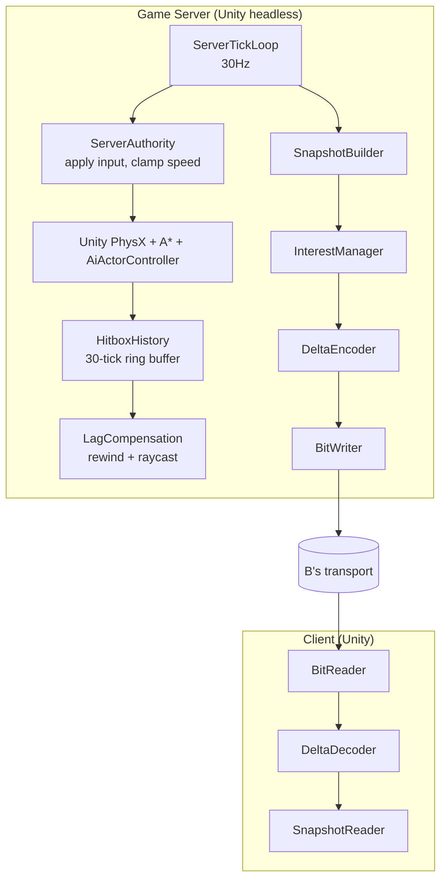

# Plan — the replication track · Replication & Server Simulation

> Read first: [`../00-shared/protocol-spec.md`](../00-shared/protocol-spec.md) (know § 4 and § 7 by
> heart) · [`../00-shared/architecture.md`](../00-shared/architecture.md) ·
> [`../00-shared/conventions.md`](../00-shared/conventions.md)

---

## 1. Role

> **This is the heaviest role on the team.** Scored on 7 axes: **C = 47/70**, B = 37/70, D = 23/70.
> The plan was restructured to concentrate every cross-dependency and high risk on this role, in
> exchange for the transport track and the master-server track having **zero dependencies** after week 2.
> See [dependency-map.md](../00-shared/dependency-map.md).

You sit in the middle: **you take bytes from B and turn them into game state for A**, and vice
versa. You also own **the authoritative simulation loop on the server** and **the definition of what
correct movement is** for both sides.

Five jobs:

1. **Compress world state down to something sendable** — delta encoding, interest management.
   48 actors have to fit in ~7 KB/s.
2. **The server loop** — apply input, run the sim, produce snapshots, prevent cheating, ensure every
   client sees the same truth.
3. **Lag compensation** — rewind hitboxes so high-ping players can still land shots. The hardest
   piece in the project.
4. **`MovementSimulation` — the shared truth of client and server.** *(newly taken from the client track)*
   You extract the movement logic out of `Actor.cs` and own that file. If it diverges between the
   two sides, A's prediction stutters constantly — and you're the one who suffers, so you're the one
   who owns it.
5. **Protocol referee + owner of the integration harness.** Your conformance tests decide who is
   right when B and A disagree about the format. When integration breaks, you're the one who runs it
   and fixes it.

**What you do NOT do:** sockets and the bit-packing serializer (B), UI (A), the master server (D),
bot AI (it already exists; you just run it — see [AD-10](../00-shared/algorithm-decisions.md)).

### 1.1. Why this role is hard — so you know what you're taking on

| Axis | Score | Specifics |
|---|---|---|
| Algorithmic difficulty | 8/10 | Lag compensation, delta + baseline acking, interest LOD |
| **Integration difficulty** | **10/10** | Sitting between all 3 others, depending on 2, blocking 1 |
| Debugging difficulty | 8/10 | Delta bugs only surface under packet loss; hitbox bugs only after minutes |
| Number of dependencies | 3 | A (headless build, Actor API), B (transport, serializer) |
| Risk of blocking the team | 9/10 | A has no real data if you slip |
| Must open Unity | Yes | The only one of the 3 backend devs who has to |
| Breadth of knowledge | The widest | Must understand **both** Unity gameplay **and** the byte level |

---

## 2. Ownership

| Path | Rights |
|---|---|
| `Ironfront.Net.Replication/**` | **Full ownership** — pure C#, no Unity |
| `Ironfront.Net.Replication/Serialization/**` | **Read-only** — the transport track owns it (`BitWriter`, `BitReader`, `Quantize`) |
| `Ironfront.Net.Replication.Tests/**` | Owner |
| `Ironfront.Net.Protocol.Tests/Conformance/**` | **Owner — you are the referee verifying B's code** |
| `Ironfront_Reborn/Assets/Scripts/Net/Server/**` | Owner (server-side Unity code) |
| `Ironfront_Reborn/Assets/Scripts/Net/Shared/**` | Owner, read by A |
| `Ironfront_Reborn/Assets/Scripts/Net/Shared/MovementSimulation.cs` | **Owner — newly taken from the client track.** Nobody else may edit it |
| `tools/run-integration.ps1` + integration scenarios | **Owner — newly taken from the transport track** |
| `Ironfront.Net.Protocol/**` | PR clearing `protocol-spec.md` § 15's wire gate |
| `Ironfront_Reborn/Assets/Scripts/Assembly-CSharp/**` | **Read-only.** Need a change → ask A |

### 2.1. You verify, the transport track implements

| | Who does it |
|---|---|
| Implementing bit-packing + quantization | **The transport track** |
| Conformance tests with hand-written hex from the spec | **You** |

If the same person writes and tests it, the tests only prove the code is consistent with itself, not
that it matches the spec. Split, your tests become a **genuine referee**.

The consequence: your tests will go red against code B just wrote. That's a feature. When it
happens, the two of you open `protocol-spec.md` § 4.4 and see who diverged from the spec — **not who
is at fault**.

### 2.2. Your Unity exemption

B and D never open the Unity Editor. You **may**, because you need to test the server tick loop and
extract `MovementSimulation`. The accompanying rules:

- Only edit `.cs` files under `Net/Server/` and `Net/Shared/`
- **Never** edit scenes, prefabs, or any `.meta` file
- If Unity generates new `.meta` files → **don't commit them**, leave it to the client track
- Need to change `Actor.cs` or anything in `Assembly-CSharp/` → ask A, don't do it yourself

**You have an exemption B and D don't:** you need the Unity Editor to test the server tick loop. The
rule: you may open it, but **never edit a scene, a prefab, or any `.meta` file**. Only `.cs` files
under `Assets/Scripts/Net/Server/` and `Net/Shared/`. If Unity generates new `.meta` files, don't
commit them — leave them to A.

---

## 3. Architecture



**A clean boundary:** `Ironfront.Net.Replication` is a pure .NET library with **no**
`using UnityEngine`. It works on plain data structs (`ActorStateRaw` with `float x,y,z` rather than
`Vector3`). Conversion to Unity types happens in a thin layer under `Assets/Scripts/Net/`.

The benefit: you unit-test all the compression logic with xUnit in seconds, without opening Unity.

---

## 4. Public API — frozen in week 1

```csharp
namespace Ironfront.Net.Replication;

// ===== Plain data types, NO Unity dependency =====
public struct Vec3 { public float X, Y, Z; }

public struct ActorStateRaw
{
    public ushort ActorId;
    public Vec3   Position;
    public float  Yaw, Pitch;
    public Vec3   Velocity;
    public byte   StateFlags, Health, WeaponId, AmmoInClip, Team;
    public ushort VehicleId; public byte SeatIndex;
}

public struct SnapshotRaw
{
    public uint ServerTick, LastProcessedInputTick, BaselineTick;
    public ActorStateRaw[] Actors;
    public int ActorCount;                 // used instead of Length to avoid reallocating the array
}

public struct InputFrameRaw
{
    public uint   Tick;
    public sbyte  MoveX, MoveZ;
    public ushort Yaw; public short Pitch;
    public ushort Buttons;
}

// ===== Writing (server) =====
public interface ISnapshotWriter
{
    /// <summary>Writes the snapshot for ONE client (interest-filtered, delta'd against their baseline).</summary>
    int Write(Span<byte> dst, in SnapshotRaw snapshot, uint baselineTick, ushort forConnectionId);
}

// ===== Reading (client) =====
public interface ISnapshotReader
{
    bool TryRead(ReadOnlySpan<byte> src, ref SnapshotRaw outSnapshot);
    void AckBaseline(uint tick);
}

// ===== Input =====
public static class InputSerializer
{
    public static int  Write(Span<byte> dst, ReadOnlySpan<InputFrameRaw> frames, uint startTick);
    public static bool TryRead(ReadOnlySpan<byte> src, Span<InputFrameRaw> dst, out int count);
}
```

---

## 5. The 5-phase roadmap

| Phase | Weeks | Milestone | Outcome |
|---|---|---|---|
| `phase-00` | 1–2 | M0 | Chair the protocol freeze · `ProtocolConstants` · **the conformance test suite** (the referee) · **start extracting `MovementSimulation`** · `InputSerializer` |
| `phase-01` | 3–6 | M1 | Full + delta snapshots · `ServerTickLoop` · authoritative input application · 2 clients in sync |
| `phase-02` | 7–10 | M2 | Interest management · hitbox history · lag compensation · server-authoritative shooting · bot replication |
| [phase-03](phases/phase-03-match.md) | 11–13 | M3 | Match lifecycle · capture points · scoring · bandwidth optimization · wiring up the master server |
| `phase-04` | 14 | M4 | Benchmarks · the data-compression report · documentation |

---

## 6. Estimate

| Item | Person-weeks | Change |
|---|---|---|
| ~~Bit-packing serializer~~ → the transport track | ~~2.0~~ **0** | **−2.0** |
| Conformance tests (referee, verifying B's code) | 1.0 | kept, split out of the item above |
| **`MovementSimulation` — extracting it from `Actor.cs`** | **1.5** | **+1.5 taken from the client track** |
| Snapshot + delta + baseline | 2.5 | |
| Interest management | 1.5 | |
| Server tick loop + authority + anti-cheat | 2.0 | |
| Reconciliation (server side) | 1.0 | |
| Lag compensation + hitbox history | 2.0 | |
| **Integration harness + benchmarks** | **1.5** | **+0.5 taken from the transport track** |
| **Total** | **13.0 / 14** | unchanged |

**Three changes from the original plan:**

| # | What moved | Direction | Reason |
|---|---|---|---|
| 1 | Extracting `MovementSimulation` from `Actor.cs` | the client track → **you** | The worst blocker in the old plan (week 7, mid-project, on the hardest piece). The file must be identical on client and server; you're the one who suffers when it diverges |
| 2 | The bit-packing serializer | **you** → the transport track | Isolated byte-level work, squarely B's strength, and it keeps B dependency-free. You keep the referee role (conformance tests) |
| 3 | The integration harness | the transport track → **you** | You sit in the middle, so you should be the one running and fixing integration when it breaks |

The total budget is unchanged (13.0), but **the risk has shifted onto you** — exactly as you asked,
and good for the project, since concentrated risk is easier to manage than risk spread thin.

---

## 7. Your own risks

| # | Risk | Mitigation |
|---|---|---|
| C1 | Baseline drift: client and server disagree about which baseline is in use → deltas decompress wrong and the world drifts apart | The client acks baselines explicitly (`C_ACK_BASELINE`). The server only deltas against an acked baseline. Have a test that reproduces a lost ack |
| C2 | Quantization mismatched between the two sides | Constants live in `Ironfront.Net.Protocol`; **your** conformance tests with hard-coded hex verify B's code |
| C3 | Server CPU load exceeds budget (risk R6) | Benchmark 48 actors from phase 01 onward, not at the end. LOD ticking for distant bots |
| C4 | Lag compensation frustrating low-ping players ("I died after taking cover") | Clamp at 200 ms. Measure and tune with A in phase 02 |
| C5 | You depend on both B (transport) and A (headless build, Actor API) | B's `LoopbackTransport` from week 2. If A is late with the headless build: use Unity Editor Play Mode — slower, but it works |
| C6 | Subtle delta-encoding bugs that only surface under packet loss | A mandatory test: generate a sequence of 1000 snapshots, drop 20% at random, verify the final state matches |
| **C7** | **Extracting `MovementSimulation` breaks the original gameplay** — you're operating on 1188 lines of `Actor.cs` that you didn't write | **Don't delete the old code.** Run `MovementSimulation` **in parallel** with the original, log both positions, compare for 1–2 days. Only switch over once they match. Details in phase-00 Task 5 |
| **C8** | **You're the only one of the 3 backend devs who has to understand Unity gameplay** — the cost of learning `Actor.cs` gets underestimated | Spend a full 2 days in phase-00 reading `Actor.cs` + `FpsActorController.cs` before writing a line. Ask A to explain it; don't guess |
| **C9** | **When integration breaks, you're the first suspect** (you're in the middle) | You own the integration harness → you have the tools to prove it. Use B's packet log (`--analyze`) plus your own tick logs to point at the layer that diverged. **Don't accept blame without evidence** |

---

## 8. Your own architectural decisions

| # | Decision | Reason | Trade-off |
|---|---|---|---|
| C-AD-1 | Delta against a **client-acked baseline**, not the previous snapshot | One lost packet doesn't corrupt an unbounded delta chain | The server has to keep several baselines per client (~16 ticks × 48 actors × 20 B = 15 KB/client, acceptable) |
| C-AD-2 | Bit-packing rather than byte alignment | Saves ~25% bandwidth (changeMask, small flags) | Harder to debug. Compensated with a hex-dump tool |
| C-AD-3 | Interest management by distance + LOD ticking, no PVS/octree | With 48 actors, the O(n²) loop is 2304 comparisons per tick — negligible | Doesn't scale to thousands of actors. Not needed |
| C-AD-4 | `MovementSimulation` shared by client and server, **the same file** | The precondition for prediction to work at all | A has to extract the logic out of `Actor.cs` |
| C-AD-5 | Bots run the original `AiActorController` on the server, no rewrite | Saves 2000+ LOC | We accept the AI behaving exactly as in the original |
| C-AD-6 | Lag compensation for hitscan only, not projectiles | Projectiles (grenades, rockets) travel slowly and players are used to leading them | Far simpler |

---

## 9. Interfaces with the others

**What you provide to A:**

| Item | Due | Notes |
|---|---|---|
| `ISnapshotReader`, `ActorStateRaw` — the signatures | Week 1 | So A can code against the interface |
| `InputSerializer` | Week 2 | |
| A fake implementation (`FakeSnapshotReader`) | Week 2 | So A never has to wait on you |
| **A finished `MovementSimulation.cs`** | **Start of week 7** | A only *calls* it, never writes it. This is your most important commitment to A |
| The `MovementSimulation` constants (WALK_SPEED, GRAVITY...) published early | Week 3 | So A can write a temporary version if you slip |

**What you consume from B:** `ITransportClient` / `ITransportServer`, `LoopbackTransport`, and
**`BitWriter`/`BitReader`/`Quantize`** (new — B implements, you use and verify).

**What you consume from D:** nothing at M1–M2. From M3: `GS_REGISTER`, `GS_HEARTBEAT`,
`GS_MATCH_ENDED`, and joinTicket verification.

**What you need from A — request it in week 1, due week 2:**

```csharp
// On Actor.cs — A exposes these; you use them in MovementSimulation and the snapshot
public Vector3  NetVelocity { get; set; }
public bool     IsGrounded  { get; }
public void     CharacterMove(Vector3 delta);
public byte     PackStateFlags();
public void     ApplyStateFlags(byte flags);
public Hitbox[] GetHitboxes();                    // for lag compensation
```

Plus: a working headless build (week 2), and the actual bounding box of the largest map (to confirm
`POS_MIN`/`POS_MAX` = ±2048 is enough).

> **Changed from the original plan:** you used to *wait for A to extract* `MovementSimulation`
> (week 7). Now **you extract it yourself**, and all you need is the 6 small methods A exposes above.
> That trades one large mid-project dependency for one small week-2 dependency. See
> [dependency-map.md § 4](../00-shared/dependency-map.md).

---

## 10. Bandwidth budget — your compass for the whole project

Target: **≤ 8 KB/s downstream per client** at 16 players + 32 bots.

| Component | Budget |
|---|---|
| Snapshots (post interest management, ~20 actors × 12 B) | 240 B × 20 Hz = 4.8 KB/s |
| GSP header + framing | 20 B × 20 Hz = 0.4 KB/s |
| Events (spawn, death, fire, capture) | ~1.5 KB/s on average |
| Keep-alive, acks | ~0.1 KB/s |
| **Total** | **~6.8 KB/s** |

Upstream per client: input at 29 B × 30 Hz = **0.87 KB/s**.
Server totals: 16 × 6.8 = **109 KB/s down**, 16 × 0.87 = **14 KB/s up**. Even the cheapest VPS has
room to spare.

Measure the real numbers every phase and record them in the report. If you exceed the budget, act in
this order:
1. Tighten interest management (smaller radii, lower Mid/Far rates)
2. Drop the velocity field from deltas (the client estimates it from 2 positions)
3. Lower the snapshot rate to 15 Hz
4. Reduce position precision (i16 → 12 bits for the Y coordinate)
